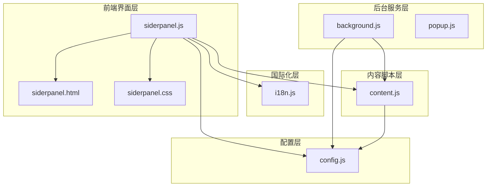
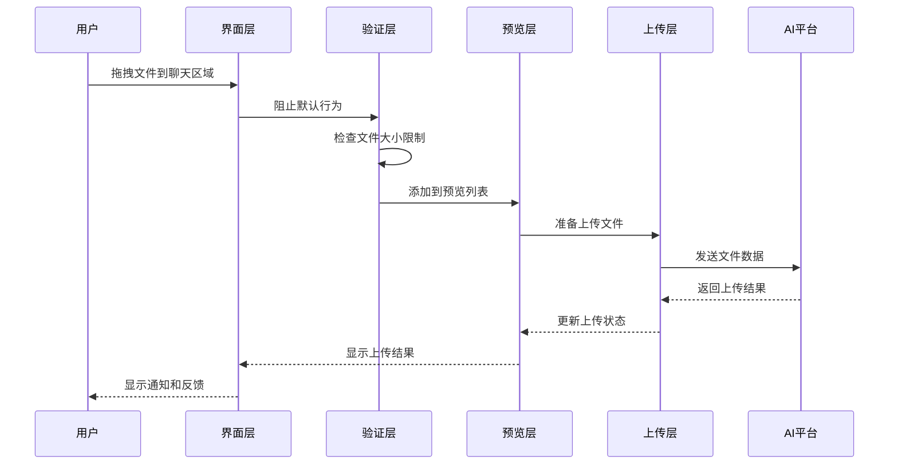
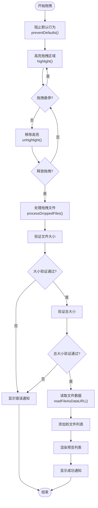
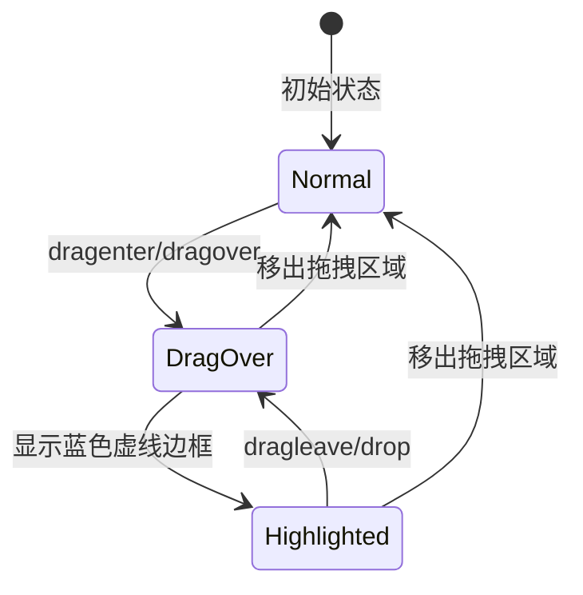
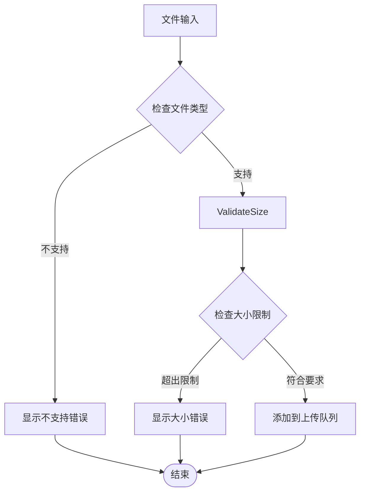
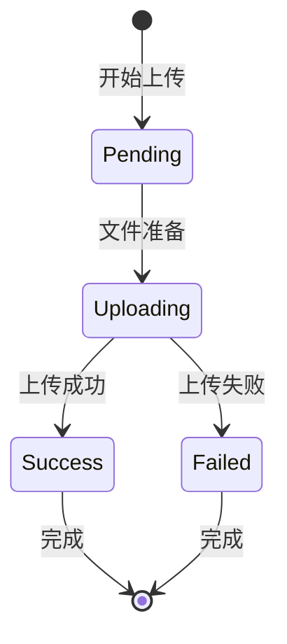
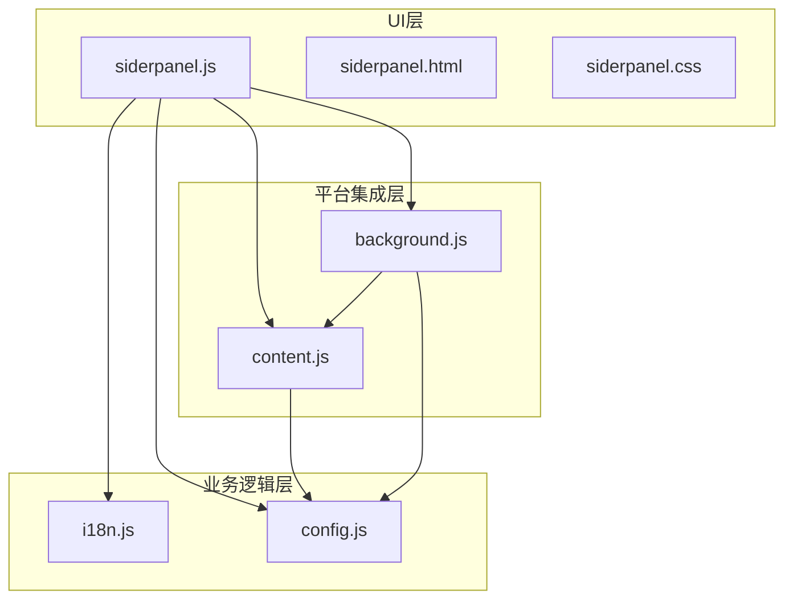

# 文件上传系统

<cite>
**本文档引用的文件**
- [DRAG_DROP_IMPLEMENTATION.md](file://DRAG_DROP_IMPLEMENTATION.md)
- [manifest.json](file://manifest.json)
- [src/sidepanel/sidepanel.js](file://src/sidepanel/sidepanel.js)
- [src/sidepanel/sidepanel.html](file://src/sidepanel/sidepanel.html)
- [src/sidepanel/sidepanel.css](file://src/sidepanel/sidepanel.css)
- [src/i18n.js](file://src/i18n.js)
- [src/config.js](file://src/config.js)
- [src/content/content.js](file://src/content/content.js)
- [src/background.js](file://src/background.js)
- [src/popup/popup.js](file://src/popup/popup.js)
- [tmp_dataURLtoFile.js](file://tmp_dataURLtoFile.js)
</cite>

## 目录
1. [简介](#简介)
2. [项目结构](#项目结构)
3. [核心组件](#核心组件)
4. [架构概览](#架构概览)
5. [详细组件分析](#详细组件分析)
6. [依赖关系分析](#依赖关系分析)
7. [性能考虑](#性能考虑)
8. [故障排除指南](#故障排除指南)
9. [结论](#结论)

## 简介

AI Multiverse 文件上传系统是一个完整的拖拽上传解决方案，支持多种AI平台的文件上传功能。该系统提供了直观的拖拽界面、文件类型验证、大小限制检查、文件预览和上传管理等功能。系统支持7个主要AI平台（Gemini、Grok、Kimi、DeepSeek、ChatGPT、通义千问、腾讯元宝），每个平台都有特定的文件上传策略和限制。

## 项目结构

文件上传系统主要分布在以下关键文件中：

**图表来源**
- [src/sidepanel/sidepanel.js](file://src/sidepanel/sidepanel.js#L1-L800)
- [src/sidepanel/sidepanel.html](file://src/sidepanel/sidepanel.html#L1-L400)
- [src/i18n.js](file://src/i18n.js#L1-L504)
- [src/config.js](file://src/config.js#L1-L204)

**章节来源**
- [src/sidepanel/sidepanel.js](file://src/sidepanel/sidepanel.js#L1-L800)
- [src/sidepanel/sidepanel.html](file://src/sidepanel/sidepanel.html#L1-L400)
- [src/i18n.js](file://src/i18n.js#L1-L504)

## 核心组件

### 拖拽上传核心功能

系统实现了完整的拖拽上传功能，包括：

1. **拖拽事件监听**：监听 dragenter、dragover、dragleave、drop 事件
2. **视觉反馈**：动态显示拖拽覆盖层和高亮效果
3. **文件验证**：实时检查文件大小和总大小限制
4. **文件预览**：生成文件预览列表
5. **通知系统**：提供用户友好的反馈信息

### 文件类型支持

系统支持多种文件类型，根据不同的AI平台有不同的限制：

| 平台 | 支持的文件类型 | 大小限制 |
|------|----------------|----------|
| Gemini | image/*, .pdf, .txt, .doc, .docx | 单文件: 10MB, 总计: 50MB |
| Grok | image/*, .pdf, .txt | 单文件: 10MB, 总计: 50MB |
| Kimi | image/*, .pdf, .txt, .doc, .docx, .md, .json, .csv | 单文件: 10MB, 总计: 50MB |
| DeepSeek | image/* | 单文件: 10MB, 总计: 50MB |
| ChatGPT | image/*, .pdf, .txt, .md, .json, .csv, .py, .js | 单文件: 10MB, 总计: 50MB |
| 通义千问 | .pdf, .doc, .docx, .txt, .md, .json, .csv, image/* | 单文件: 10MB, 总计: 50MB |
| 腾讯元宝 | image/*, .pdf, .doc, .docx, .txt, .md | 单文件: 10MB, 总计: 50MB |

**章节来源**
- [src/config.js](file://src/config.js#L1-L204)
- [src/sidepanel/sidepanel.js](file://src/sidepanel/sidepanel.js#L53-L54)

## 架构概览

文件上传系统采用分层架构设计，确保各组件职责明确且相互独立：

**图表来源**
- [src/sidepanel/sidepanel.js](file://src/sidepanel/sidepanel.js#L414-L495)
- [src/content/content.js](file://src/content/content.js#L616-L672)

## 详细组件分析

### 拖拽上传实现

#### 事件监听机制

系统通过监听多个拖拽事件来实现完整的拖拽功能：

**图表来源**
- [src/sidepanel/sidepanel.js](file://src/sidepanel/sidepanel.js#L421-L495)

#### 拖拽覆盖层显示逻辑

拖拽覆盖层的显示和隐藏逻辑通过CSS类名控制：

**图表来源**
- [src/sidepanel/sidepanel.js](file://src/sidepanel/sidepanel.js#L442-L451)
- [src/sidepanel/sidepanel.css](file://src/sidepanel/sidepanel.css#L21-L39)

**章节来源**
- [src/sidepanel/sidepanel.js](file://src/sidepanel/sidepanel.js#L414-L495)
- [src/sidepanel/sidepanel.css](file://src/sidepanel/sidepanel.css#L21-L39)

### 文件验证机制

#### 大小限制检查

系统实现了双重大小限制检查：

1. **单文件大小限制**：默认10MB
2. **总大小限制**：默认50MB

验证过程包括：
- 实时检查单个文件大小
- 计算当前总大小加上新文件的大小
- 确保不超过总大小限制

#### 文件类型验证

系统根据目标AI平台的支持情况验证文件类型：

**图表来源**
- [src/content/content.js](file://src/content/content.js#L677-L710)

**章节来源**
- [src/sidepanel/sidepanel.js](file://src/sidepanel/sidepanel.js#L465-L495)
- [src/content/content.js](file://src/content/content.js#L677-L710)

### 文件预览管理

#### 预览列表渲染

文件预览列表通过以下步骤管理：

1. **文件数据存储**：使用Data URL格式存储文件数据
2. **预览项生成**：为每个文件创建预览项
3. **交互功能**：支持移除单个文件和清空所有文件
4. **状态跟踪**：实时更新文件总数和总大小

#### 预览UI组件

预览组件包含以下功能：
- 文件类型图标显示
- 文件名称和大小显示
- 移除按钮
- 清空所有按钮

**章节来源**
- [src/sidepanel/sidepanel.js](file://src/sidepanel/sidepanel.js#L497-L506)
- [src/sidepanel/sidepanel.html](file://src/sidepanel/sidepanel.html#L320-L324)

### 上传进度管理

#### 上传状态跟踪

系统实现了完整的上传状态跟踪机制：

#### 重试机制

对于支持异步UI的平台，系统实现了智能重试机制：
- 最大重试次数：2次
- 递增延迟：每次重试增加延迟时间
- 超时控制：单个上传操作最长30秒

**章节来源**
- [src/content/content.js](file://src/content/content.js#L647-L671)

### 取消上传功能

系统提供了灵活的取消上传机制：

1. **单文件取消**：用户可以移除单个待上传文件
2. **批量取消**：支持清空所有待上传文件
3. **上传中取消**：在上传过程中可以取消特定文件

**章节来源**
- [src/sidepanel/sidepanel.js](file://src/sidepanel/sidepanel.js#L411-L412)

## 依赖关系分析

### 组件间依赖关系

**图表来源**
- [src/sidepanel/sidepanel.js](file://src/sidepanel/sidepanel.js#L1-L800)
- [src/config.js](file://src/config.js#L1-L204)
- [src/content/content.js](file://src/content/content.js#L1-L941)

### 外部依赖

系统依赖以下外部资源：
- **marked.js**：Markdown渲染
- **highlight.js**：代码语法高亮
- **DOMPurify**：HTML安全清理
- **Chrome Extensions API**：浏览器扩展功能

**章节来源**
- [manifest.json](file://manifest.json#L1-L79)

## 性能考虑

### 内存管理

1. **文件数据存储**：使用Data URL格式，便于跨平台传输但占用内存较大
2. **预览缓存**：只缓存必要的文件元数据
3. **垃圾回收**：及时清理不再使用的文件对象

### 上传优化

1. **并发控制**：按顺序上传文件，避免平台限制
2. **重试策略**：智能重试减少失败率
3. **超时处理**：防止长时间阻塞

### UI响应性

1. **异步操作**：所有文件操作都是异步的
2. **进度反馈**：实时显示上传进度
3. **错误处理**：优雅处理各种异常情况

## 故障排除指南

### 常见问题及解决方案

#### 文件上传失败

**问题**：文件无法上传到某些AI平台
**原因**：
- 文件类型不受支持
- 文件大小超出限制
- 平台UI结构变化

**解决方案**：
1. 检查文件类型是否在支持列表中
2. 确认文件大小不超过限制
3. 查看平台配置中的选择器是否正确

#### 拖拽功能异常

**问题**：拖拽上传功能不工作
**原因**：
- 事件监听器未正确绑定
- CSS样式冲突
- 浏览器兼容性问题

**解决方案**：
1. 检查拖拽事件监听器
2. 验证CSS类名和样式
3. 测试不同浏览器的兼容性

#### 文件预览显示问题

**问题**：文件预览不显示或显示异常
**原因**：
- Data URL格式错误
- 文件读取失败
- DOM更新时机问题

**解决方案**：
1. 验证Data URL格式
2. 检查文件读取操作
3. 确保DOM更新在异步操作完成后进行

**章节来源**
- [src/sidepanel/sidepanel.js](file://src/sidepanel/sidepanel.js#L497-L506)
- [src/content/content.js](file://src/content/content.js#L616-L672)

## 结论

AI Multiverse 文件上传系统是一个功能完整、架构清晰的拖拽上传解决方案。系统具有以下特点：

1. **用户体验优秀**：直观的拖拽界面和实时反馈
2. **平台兼容性强**：支持7个主流AI平台
3. **功能完整性**：从文件选择到上传完成的全流程支持
4. **错误处理完善**：提供详细的错误信息和恢复机制
5. **可扩展性好**：模块化设计便于功能扩展

系统的核心优势在于其对不同AI平台的深度适配和对用户交互的精心设计。通过合理的架构设计和完善的错误处理机制，为用户提供了稳定可靠的文件上传体验。

未来可以考虑的功能增强包括：
- 支持文件夹拖拽
- 实现真正的文件上传进度条
- 添加文件上传队列管理
- 支持更多文件类型
- 实现断点续传功能