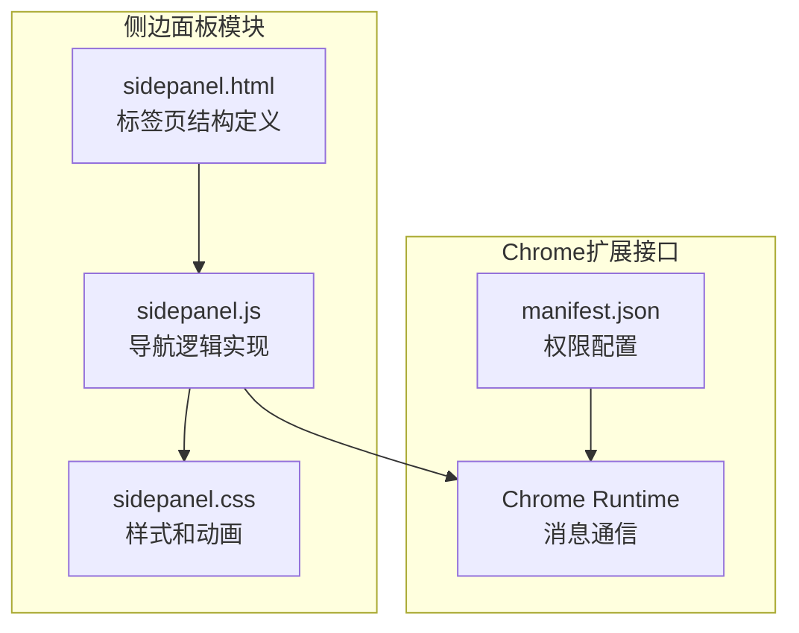
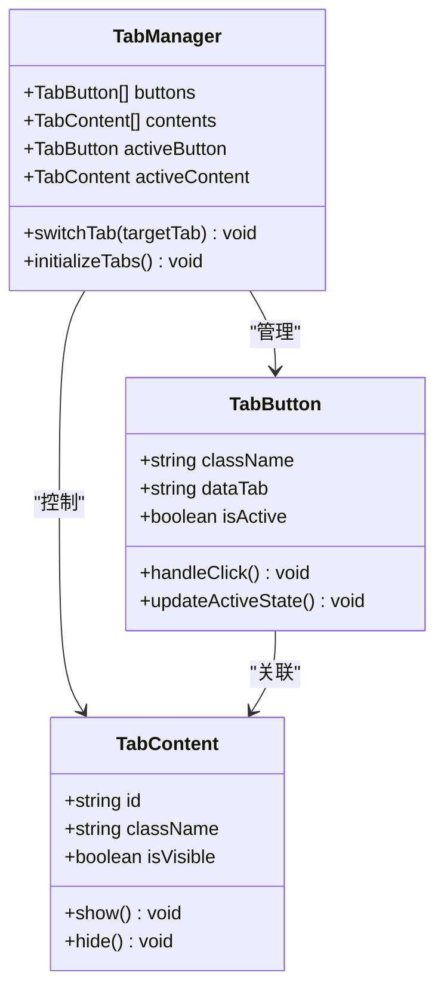
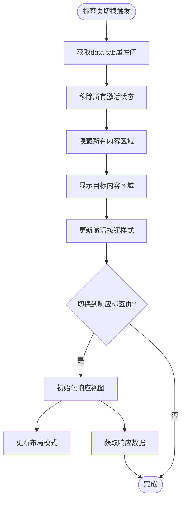
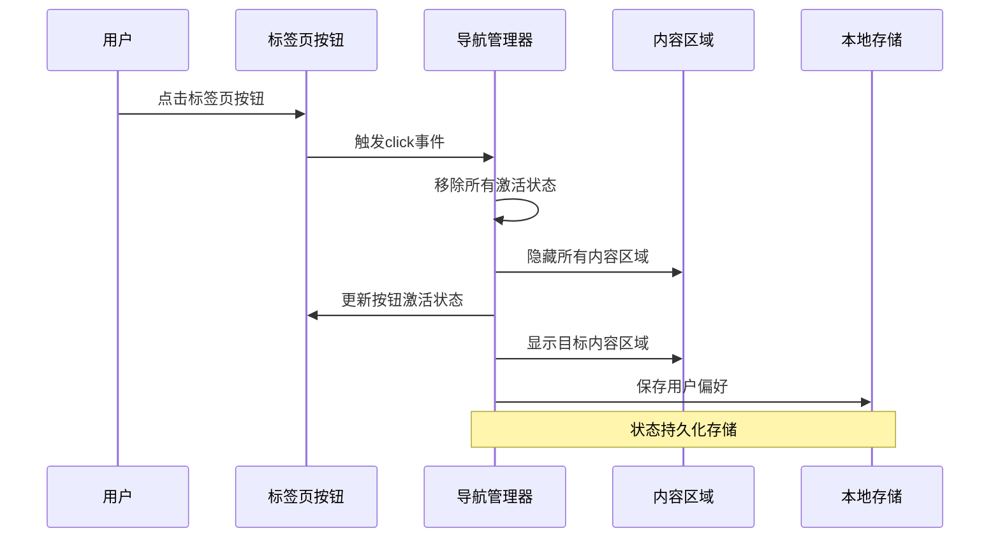
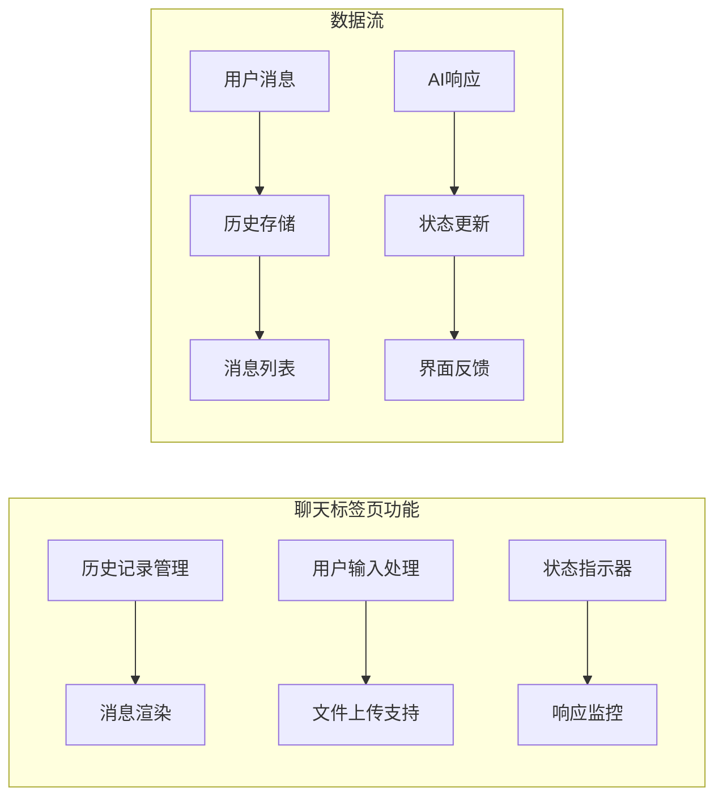
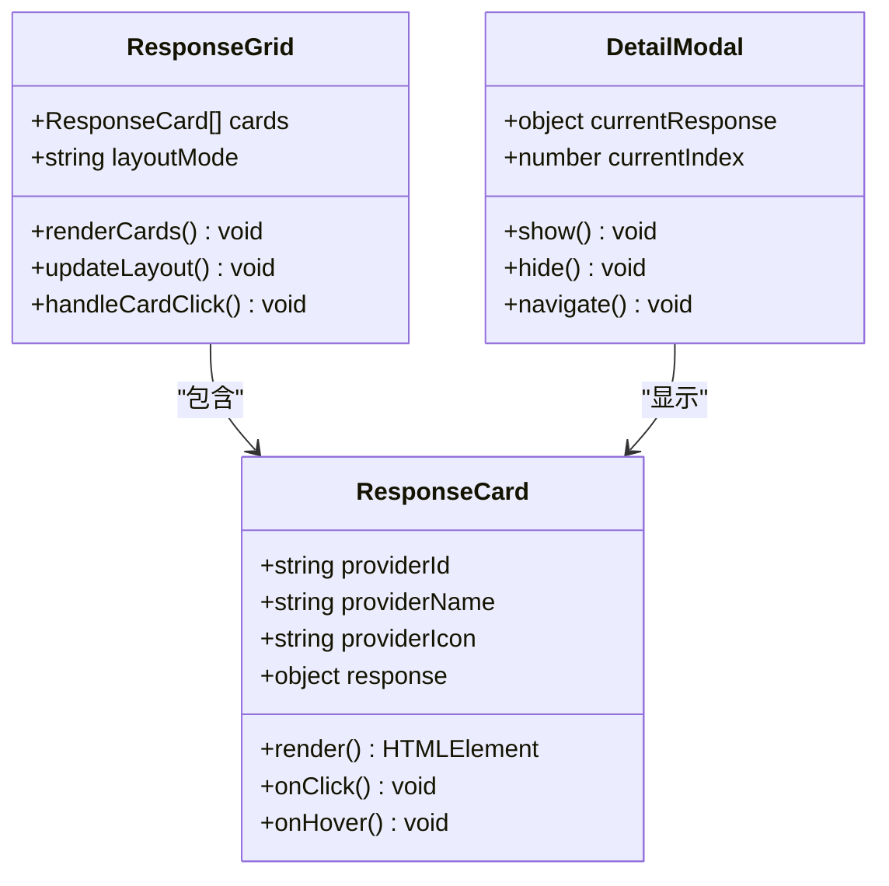
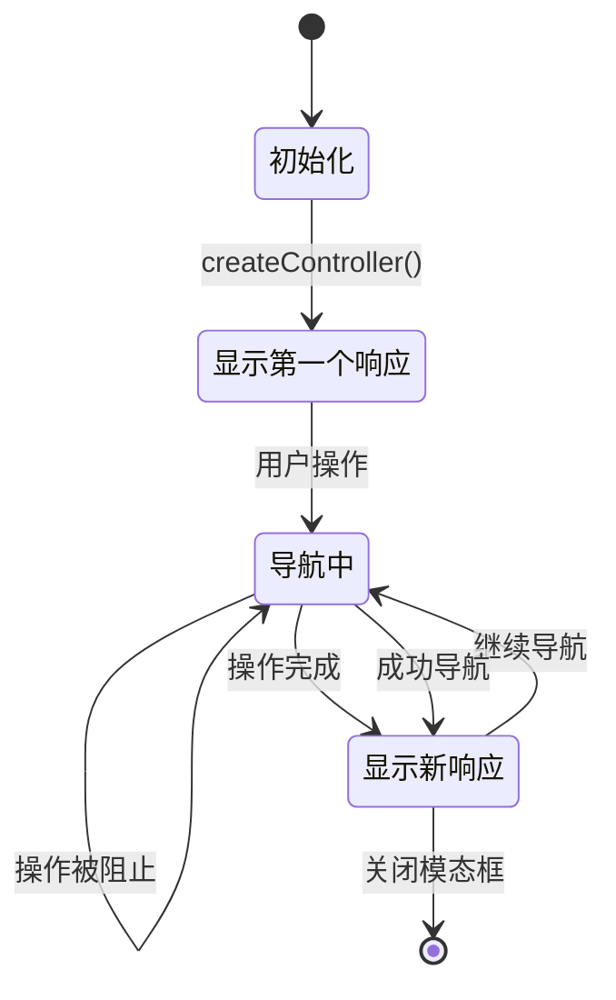
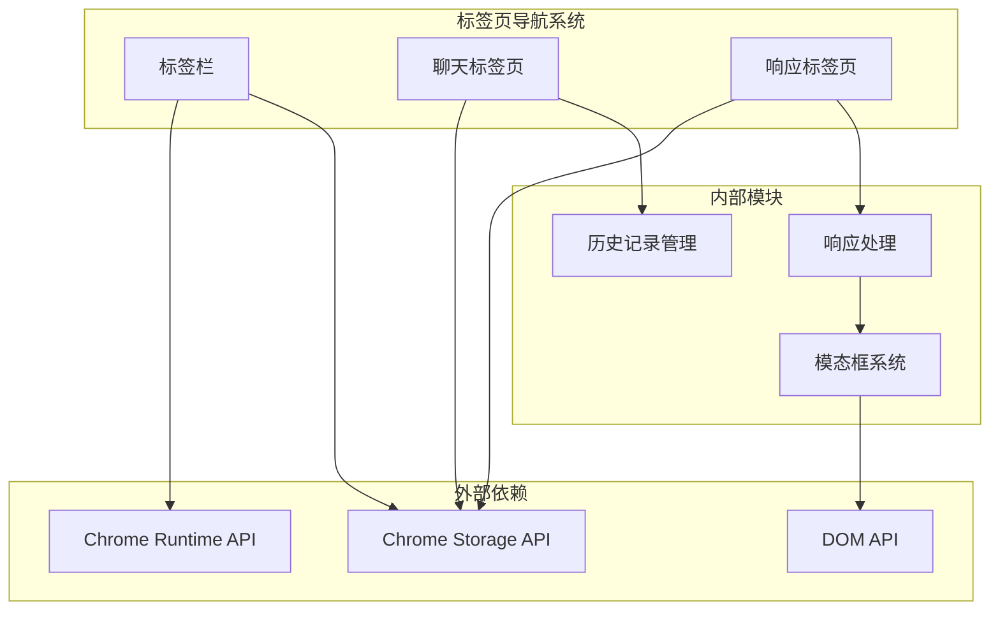
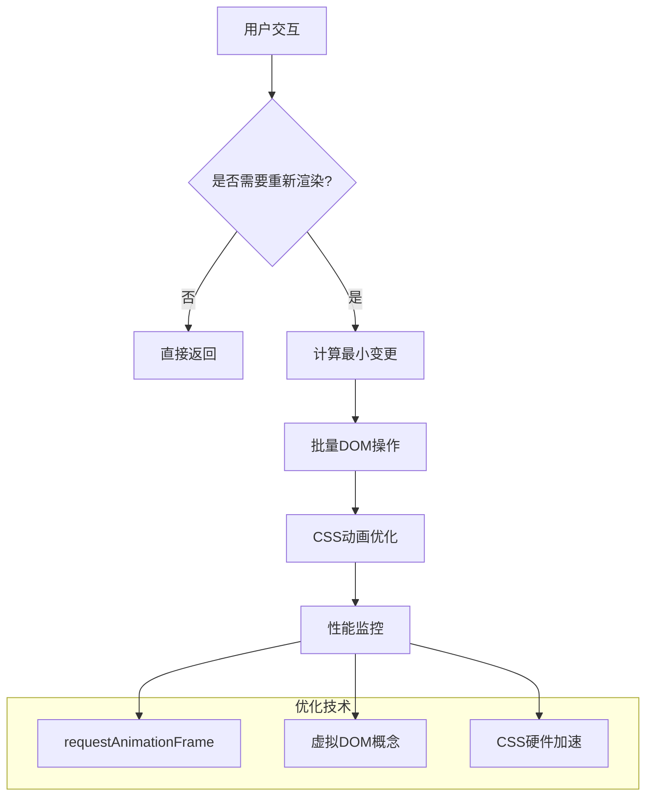
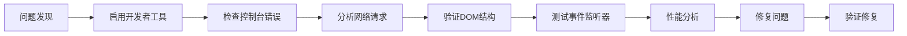

# 标签页导航系统

<cite>
**本文档引用的文件**
- [sidepanel.html](file://src/sidepanel/sidepanel.html)
- [sidepanel.js](file://src/sidepanel/sidepanel.js)
- [sidepanel.css](file://src/sidepanel/sidepanel.css)
- [manifest.json](file://manifest.json)
</cite>

## 目录
1. [简介](#简介)
2. [项目结构](#项目结构)
3. [核心组件](#核心组件)
4. [架构概览](#架构概览)
5. [详细组件分析](#详细组件分析)
6. [依赖关系分析](#依赖关系分析)
7. [性能考虑](#性能考虑)
8. [故障排除指南](#故障排除指南)
9. [结论](#结论)

## 简介

标签页导航系统是AI Multiverse项目中的核心交互组件，负责在聊天界面和响应界面之间进行无缝切换。该系统采用现代化的前端架构，结合HTML5语义化标记、CSS3动画效果和JavaScript事件驱动机制，为用户提供流畅的多AI对话体验。

系统主要包含两个核心标签页：
- **聊天标签页（Chat）**：用于与多个AI模型进行实时对话，支持历史记录管理和消息交互
- **响应标签页（Responses）**：用于查看和比较来自不同AI模型的响应结果，支持详细查看和批量操作

## 项目结构

标签页导航系统位于侧边面板模块中，采用模块化的文件组织方式：

**图表来源**
- [sidepanel.html](file://src/sidepanel/sidepanel.html#L69-L86)
- [sidepanel.js](file://src/sidepanel/sidepanel.js#L365-L389)
- [sidepanel.css](file://src/sidepanel/sidepanel.css#L284-L329)

**章节来源**
- [sidepanel.html](file://src/sidepanel/sidepanel.html#L1-L50)
- [sidepanel.js](file://src/sidepanel/sidepanel.js#L1-L50)
- [sidepanel.css](file://src/sidepanel/sidepanel.css#L1-L50)

## 核心组件

### 标签页按钮系统

标签页按钮采用语义化设计，通过`data-tab`属性实现内容切换：

**图表来源**
- [sidepanel.html](file://src/sidepanel/sidepanel.html#L70-L86)
- [sidepanel.js](file://src/sidepanel/sidepanel.js#L365-L389)

### 内容区域管理系统

内容区域采用Flexbox布局，支持响应式设计和动画过渡：

**图表来源**
- [sidepanel.js](file://src/sidepanel/sidepanel.js#L365-L389)
- [sidepanel.js](file://src/sidepanel/sidepanel.js#L350-L363)

**章节来源**
- [sidepanel.html](file://src/sidepanel/sidepanel.html#L69-L86)
- [sidepanel.js](file://src/sidepanel/sidepanel.js#L365-L389)
- [sidepanel.css](file://src/sidepanel/sidepanel.css#L284-L329)

## 架构概览

标签页导航系统采用事件驱动架构，通过DOM事件监听器实现响应式交互：

**图表来源**
- [sidepanel.js](file://src/sidepanel/sidepanel.js#L365-L389)
- [sidepanel.js](file://src/sidepanel/sidepanel.js#L1321-L1335)

系统架构特点：
- **事件驱动**：基于DOM事件的响应式设计
- **模块化**：独立的功能模块便于维护和扩展
- **状态管理**：完整的状态跟踪和持久化机制
- **性能优化**：懒加载和条件渲染减少资源消耗

## 详细组件分析

### 聊天标签页（Chat）

聊天标签页负责处理用户与AI模型的实时对话：

#### 核心功能实现

**图表来源**
- [sidepanel.js](file://src/sidepanel/sidepanel.js#L1343-L1407)
- [sidepanel.js](file://src/sidepanel/sidepanel.js#L1423-L1567)

#### 状态保持机制

聊天标签页实现了完善的状态保持功能：

| 状态类型 | 存储位置 | 持久化方式 | 生命周期 |
|---------|----------|------------|----------|
| 当前激活标签页 | DOM属性 | 自动保持 | 页面会话 |
| 用户偏好设置 | Chrome Storage | 永久存储 | 浏览器会话 |
| 历史记录 | 本地存储 | 持久化 | 用户数据 |
| 文件附件 | 内存缓存 | 临时存储 | 会话期间 |

**章节来源**
- [sidepanel.js](file://src/sidepanel/sidepanel.js#L1343-L1407)
- [sidepanel.js](file://src/sidepanel/sidepanel.js#L1423-L1567)

### 响应标签页（Responses）

响应标签页专注于展示和比较来自不同AI模型的响应结果：

#### 响应卡片系统

**图表来源**
- [sidepanel.js](file://src/sidepanel/sidepanel.js#L1764-L1805)
- [sidepanel.js](file://src/sidepanel/sidepanel.js#L1723-L1762)

#### 布局适配系统

响应标签页支持多种布局模式以适应不同的屏幕尺寸：

| 布局模式 | 触发条件 | 特点 | 适用场景 |
|---------|----------|------|----------|
| 默认布局 | 窗口宽度 < 900px | 垂直堆叠 | 移动设备、小屏幕 |
| 宽屏布局 | 窗口宽度 ≥ 900px | 并排显示 | 桌面设备、大屏幕 |
| 卡片布局 | 响应式调整 | 流式网格 | 所有设备 |

**章节来源**
- [sidepanel.js](file://src/sidepanel/sidepanel.js#L350-L363)
- [sidepanel.css](file://src/sidepanel/sidepanel.css#L813-L862)

### 导航控制器（NavigationController）

系统实现了专门的导航控制器类来管理响应详情的导航：

**图表来源**
- [sidepanel.js](file://src/sidepanel/sidepanel.js#L712-L815)
- [sidepanel.js](file://src/sidepanel/sidepanel.js#L925-L954)

导航控制器的核心特性：
- **循环导航**：支持首尾相接的无限循环
- **状态锁定**：防止并发导航操作
- **索引管理**：精确的当前位置跟踪
- **响应式更新**：自动更新UI状态

**章节来源**
- [sidepanel.js](file://src/sidepanel/sidepanel.js#L712-L815)
- [sidepanel.js](file://src/sidepanel/sidepanel.js#L925-L954)

## 依赖关系分析

标签页导航系统与其他组件的依赖关系如下：

**图表来源**
- [sidepanel.js](file://src/sidepanel/sidepanel.js#L1321-L1335)
- [sidepanel.js](file://src/sidepanel/sidepanel.js#L1700-L1721)

**章节来源**
- [manifest.json](file://manifest.json#L12-L18)
- [sidepanel.js](file://src/sidepanel/sidepanel.js#L1321-L1335)

## 性能考虑

### 事件处理优化

系统采用了高效的事件处理策略：

- **事件委托**：使用单个事件监听器管理多个标签页按钮
- **防抖处理**：避免重复点击导致的状态冲突
- **内存管理**：及时清理事件监听器和DOM引用

### 渲染性能优化

### 内存管理策略

系统实现了完善的内存管理机制：

- **对象池**：复用DOM元素和事件处理器
- **垃圾回收**：及时释放不再使用的对象引用
- **监听器清理**：在组件销毁时移除所有事件监听器

## 故障排除指南

### 常见问题及解决方案

| 问题类型 | 症状描述 | 可能原因 | 解决方案 |
|---------|----------|----------|----------|
| 标签页不切换 | 点击按钮无反应 | 事件监听器未绑定 | 检查DOM加载完成状态 |
| 样式异常 | 激活状态不正确 | CSS类名冲突 | 验证CSS优先级 |
| 数据丢失 | 页面刷新后状态重置 | 存储机制故障 | 检查Chrome Storage权限 |
| 性能问题 | 切换卡顿 | 大量DOM操作 | 实施虚拟滚动 |

### 调试工具和方法

### 错误处理机制

系统具备完善的错误处理能力：

- **异步错误捕获**：Promise链中的错误处理
- **网络异常处理**：响应获取失败的降级策略
- **用户友好提示**：错误信息的本地化显示
- **日志记录**：详细的调试信息收集

**章节来源**
- [sidepanel.js](file://src/sidepanel/sidepanel.js#L1821-L1831)
- [sidepanel.js](file://src/sidepanel/sidepanel.js#L1864-L1885)

## 结论

标签页导航系统展现了现代Web应用的最佳实践，通过精心设计的架构和实现，为用户提供了流畅、直观的多AI对话体验。系统的关键优势包括：

### 技术亮点

- **优雅的用户体验**：平滑的切换动画和直观的交互设计
- **强大的状态管理**：完整的状态保持和持久化机制
- **高性能实现**：优化的事件处理和渲染策略
- **可扩展架构**：模块化的代码结构便于功能扩展

### 设计哲学

系统遵循了"简单即美"的设计原则，通过最少的代码实现最大的功能价值。每个组件都有明确的职责分工，相互之间的耦合度保持在合理范围内。

### 未来发展方向

随着AI技术的不断发展，标签页导航系统将继续演进，重点方向包括：

- **增强的AI集成**：更深度的AI模型交互能力
- **个性化定制**：更多样化的界面主题和布局选项
- **协作功能**：支持多用户协作和分享
- **移动端优化**：更好的移动设备适配和触摸交互

通过持续的优化和改进，标签页导航系统将成为AI Multiverse项目中最稳定、最可靠的用户界面组件之一。