# 模态对话框系统

<cite>
**本文档引用的文件**
- [sidepanel.js](file://src/sidepanel/sidepanel.js)
- [sidepanel.html](file://src/sidepanel/sidepanel.html)
- [sidepanel.css](file://src/sidepanel/sidepanel.css)
- [config.js](file://src/config.js)
- [background.js](file://src/background.js)
- [manifest.json](file://manifest.json)
</cite>

## 目录
1. [简介](#简介)
2. [项目结构](#项目结构)
3. [核心组件](#核心组件)
4. [架构概览](#架构概览)
5. [详细组件分析](#详细组件分析)
6. [依赖关系分析](#依赖关系分析)
7. [性能考虑](#性能考虑)
8. [故障排除指南](#故障排除指南)
9. [结论](#结论)

## 简介

AI Multiverse 模态对话框系统是一个功能完整的弹窗管理系统，支持三种主要类型的模态对话框：AI模型选择对话框、智能总结设置对话框和响应详情对话框。该系统采用现代化的前端架构，实现了完整的遮罩层管理、焦点控制和响应式设计。

系统的核心特性包括：
- 多层次遮罩层管理（z-index控制）
- 完整的键盘导航支持
- 触摸手势支持（滑动导航）
- 响应式布局适配
- 状态持久化和恢复
- 平滑的动画过渡效果

## 项目结构

模态对话框系统主要分布在侧边栏界面中，采用模块化设计：

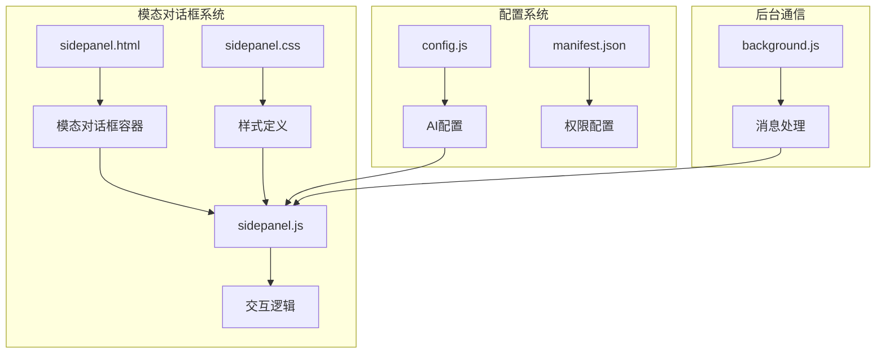

**图表来源**
- [sidepanel.html](file://src/sidepanel/sidepanel.html#L141-L305)
- [sidepanel.css](file://src/sidepanel/sidepanel.css#L1398-L1599)
- [sidepanel.js](file://src/sidepanel/sidepanel.js#L391-L528)

**节来源**
- [sidepanel.html](file://src/sidepanel/sidepanel.html#L1-L400)
- [sidepanel.css](file://src/sidepanel/sidepanel.css#L1-L800)
- [sidepanel.js](file://src/sidepanel/sidepanel.js#L1-L200)

## 核心组件

### 模态对话框类型

系统包含三种主要的模态对话框组件：

1. **AI模型选择对话框** - 用于选择要发送消息的AI模型
2. **智能总结设置对话框** - 用于配置总结参数和提示词
3. **响应详情对话框** - 用于查看和导航AI响应详情

### 遮罩层管理系统

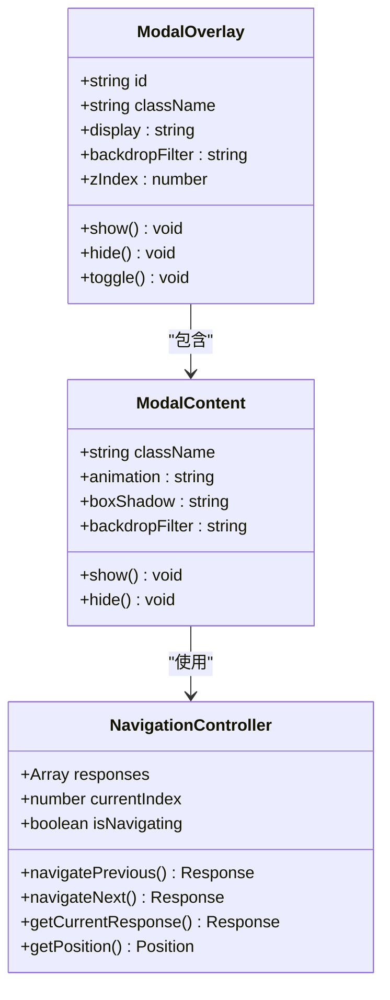

**图表来源**
- [sidepanel.js](file://src/sidepanel/sidepanel.js#L654-L711)
- [sidepanel.css](file://src/sidepanel/sidepanel.css#L1398-L1457)

### 状态管理机制

系统采用集中式状态管理模式：

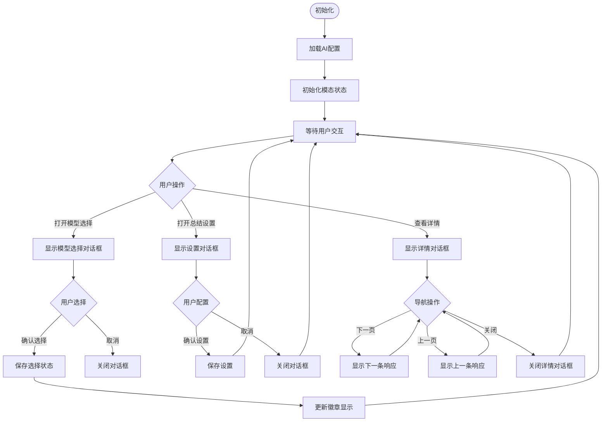

**图表来源**
- [sidepanel.js](file://src/sidepanel/sidepanel.js#L391-L403)
- [sidepanel.js](file://src/sidepanel/sidepanel.js#L508-L528)
- [sidepanel.js](file://src/sidepanel/sidepanel.js#L530-L641)

**节来源**
- [sidepanel.js](file://src/sidepanel/sidepanel.js#L391-L641)
- [sidepanel.css](file://src/sidepanel/sidepanel.css#L1398-L1599)

## 架构概览

### 系统架构图

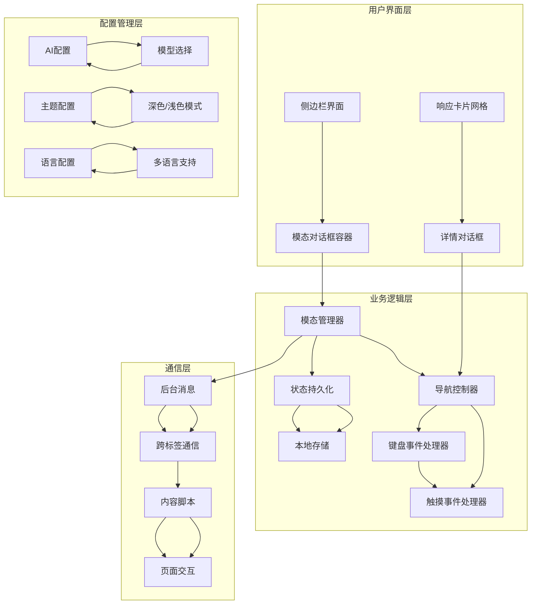

**图表来源**
- [sidepanel.js](file://src/sidepanel/sidepanel.js#L41-L80)
- [config.js](file://src/config.js#L5-L204)
- [background.js](file://src/background.js#L138-L197)

### 数据流架构

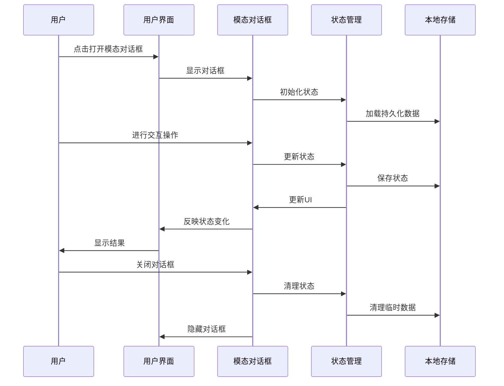

**图表来源**
- [sidepanel.js](file://src/sidepanel/sidepanel.js#L391-L403)
- [sidepanel.js](file://src/sidepanel/sidepanel.js#L654-L711)

**节来源**
- [sidepanel.js](file://src/sidepanel/sidepanel.js#L1-L200)
- [config.js](file://src/config.js#L1-L204)
- [background.js](file://src/background.js#L1-L100)

## 详细组件分析

### AI模型选择对话框

#### 触发条件和显示逻辑

AI模型选择对话框通过点击"选择AI模型"按钮触发：

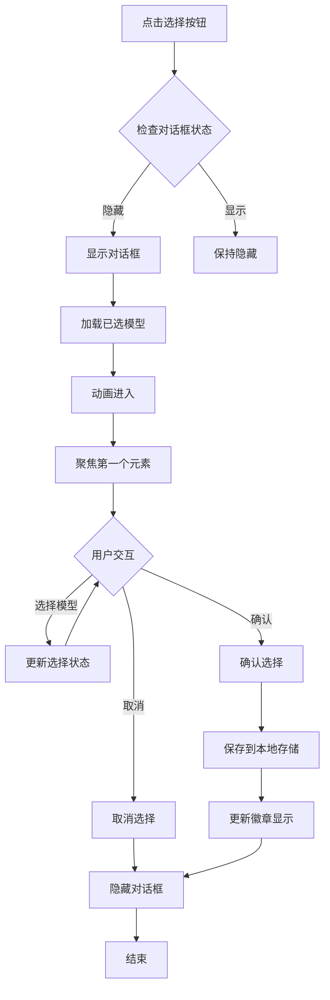

**图表来源**
- [sidepanel.js](file://src/sidepanel/sidepanel.js#L391-L403)
- [sidepanel.html](file://src/sidepanel/sidepanel.html#L183-L246)

#### 复选框交互机制

模型选择对话框使用复选框进行多选交互：

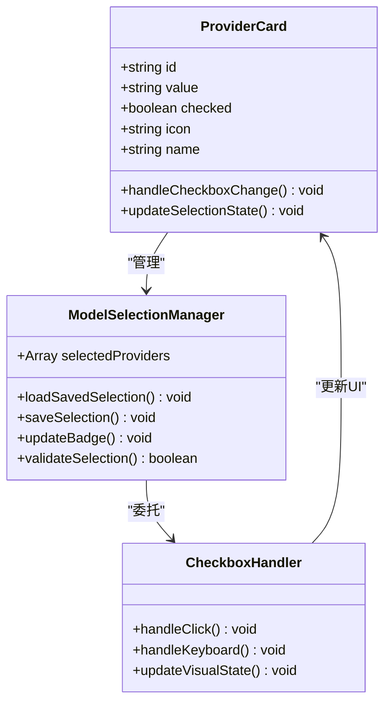

**图表来源**
- [sidepanel.js](file://src/sidepanel/sidepanel.js#L20-L25)
- [sidepanel.html](file://src/sidepanel/sidepanel.html#L193-L242)

#### 状态管理

模型选择对话框的状态管理包括：

- **已选模型列表**：存储用户选择的AI模型
- **徽章显示**：实时反映已选模型数量
- **持久化存储**：使用Chrome存储API保存用户偏好

**节来源**
- [sidepanel.js](file://src/sidepanel/sidepanel.js#L16-L25)
- [sidepanel.html](file://src/sidepanel/sidepanel.html#L193-L242)

### 智能总结设置对话框

#### 触发条件和显示逻辑

智能总结设置对话框通过点击"智能总结设置"按钮触发：

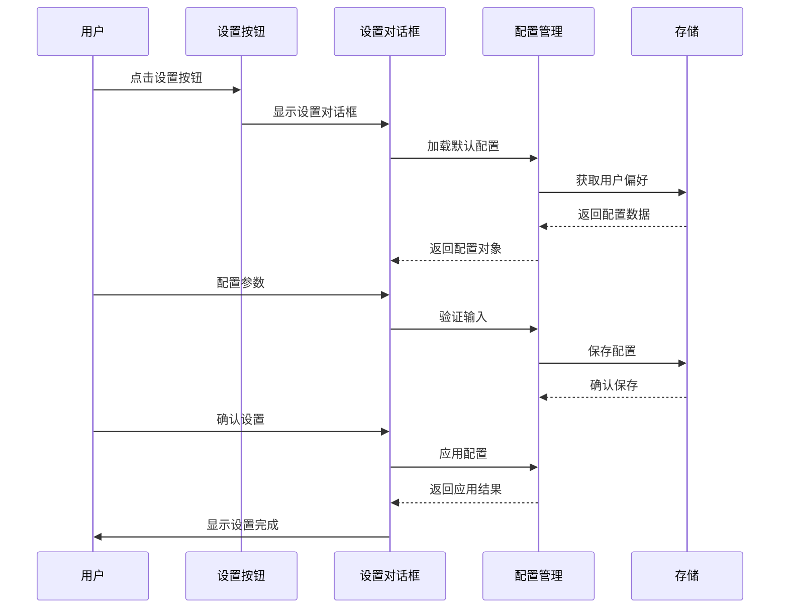

**图表来源**
- [sidepanel.js](file://src/sidepanel/sidepanel.js#L242-L256)
- [sidepanel.html](file://src/sidepanel/sidepanel.html#L268-L305)

#### 表单验证机制

智能总结设置对话框包含完整的表单验证：

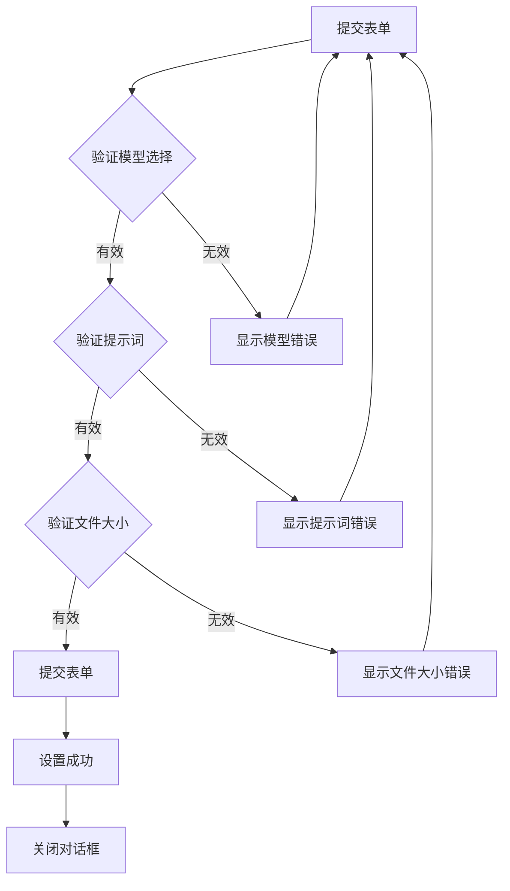

**图表来源**
- [sidepanel.js](file://src/sidepanel/sidepanel.js#L252-L256)
- [sidepanel.js](file://src/sidepanel/sidepanel.js#L258-L335)

#### 默认提示词系统

系统内置强大的默认提示词模板：

- **英文默认提示词**：包含详细的总结指导原则
- **中文默认提示词**：提供本地化的总结要求
- **可定制性**：支持用户自定义提示词

**节来源**
- [sidepanel.js](file://src/sidepanel/sidepanel.js#L258-L335)
- [sidepanel.html](file://src/sidepanel/sidepanel.html#L268-L305)

### 响应详情对话框

#### 触发条件和显示逻辑

响应详情对话框通过点击响应卡片触发：

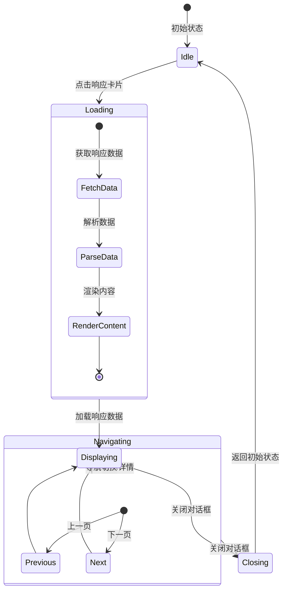

**图表来源**
- [sidepanel.js](file://src/sidepanel/sidepanel.js#L530-L641)
- [sidepanel.js](file://src/sidepanel/sidepanel.js#L712-L809)

#### 导航控制系统

响应详情对话框采用复杂的导航控制系统：

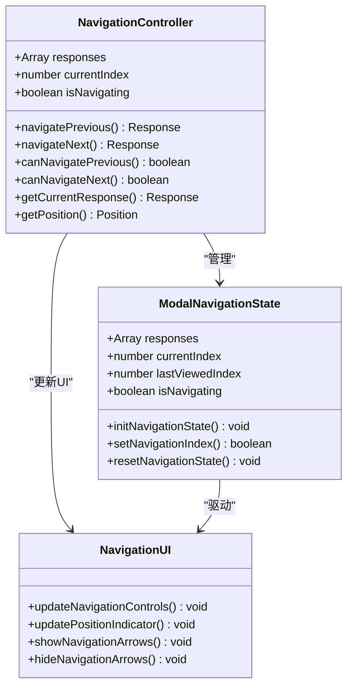

**图表来源**
- [sidepanel.js](file://src/sidepanel/sidepanel.js#L654-L711)
- [sidepanel.js](file://src/sidepanel/sidepanel.js#L712-L809)
- [sidepanel.js](file://src/sidepanel/sidepanel.js#L812-L886)

#### 多媒体内容支持

响应详情对话框支持多种内容格式：

- **纯文本内容**：直接显示
- **Markdown内容**：实时渲染
- **HTML内容**：安全渲染
- **代码块**：语法高亮显示

**节来源**
- [sidepanel.js](file://src/sidepanel/sidepanel.js#L530-L641)
- [sidepanel.css](file://src/sidepanel/sidepanel.css#L920-L1187)

### 确认对话框

#### 关闭所有窗口确认对话框

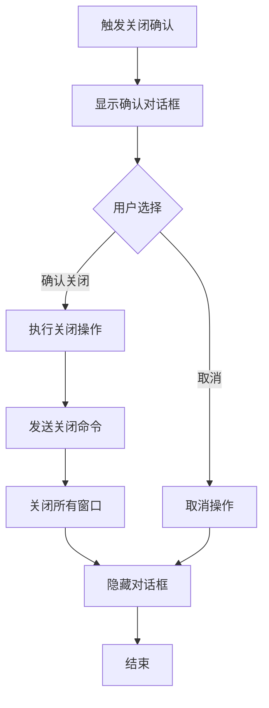

**图表来源**
- [sidepanel.js](file://src/sidepanel/sidepanel.js#L508-L528)
- [sidepanel.html](file://src/sidepanel/sidepanel.html#L248-L266)

**节来源**
- [sidepanel.js](file://src/sidepanel/sidepanel.js#L508-L528)
- [sidepanel.html](file://src/sidepanel/sidepanel.html#L248-L266)

## 依赖关系分析

### 组件耦合度分析

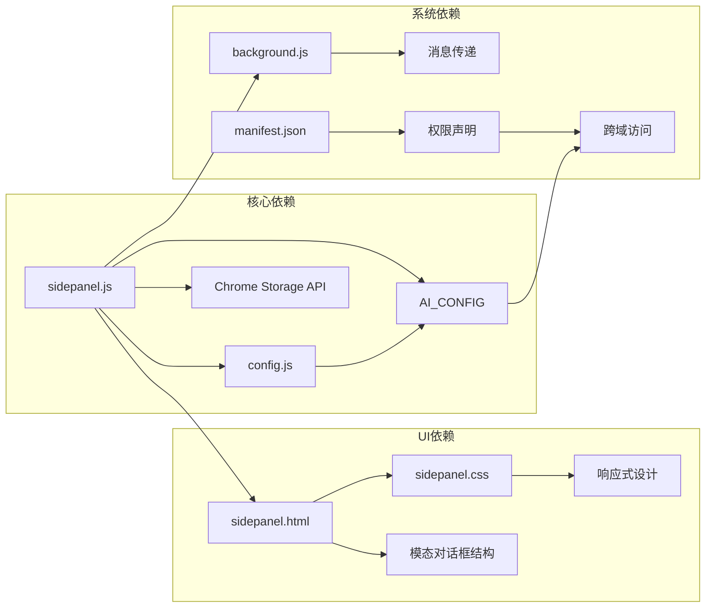

**图表来源**
- [sidepanel.js](file://src/sidepanel/sidepanel.js#L41-L80)
- [config.js](file://src/config.js#L5-L204)
- [manifest.json](file://manifest.json#L12-L32)

### 外部依赖管理

系统对外部依赖的管理策略：

1. **Chrome扩展API**：使用Chrome Storage API进行数据持久化
2. **第三方库**：仅使用必要的Markdown渲染库
3. **浏览器兼容性**：确保在主流浏览器中的兼容性

**节来源**
- [sidepanel.js](file://src/sidepanel/sidepanel.js#L1-L100)
- [manifest.json](file://manifest.json#L1-L79)

## 性能考虑

### 内存管理

模态对话框系统采用高效的内存管理策略：

- **延迟加载**：模态对话框按需加载，减少初始内存占用
- **状态清理**：关闭对话框时自动清理相关状态和事件监听器
- **垃圾回收**：及时释放不再使用的DOM元素和JavaScript对象

### 动画性能

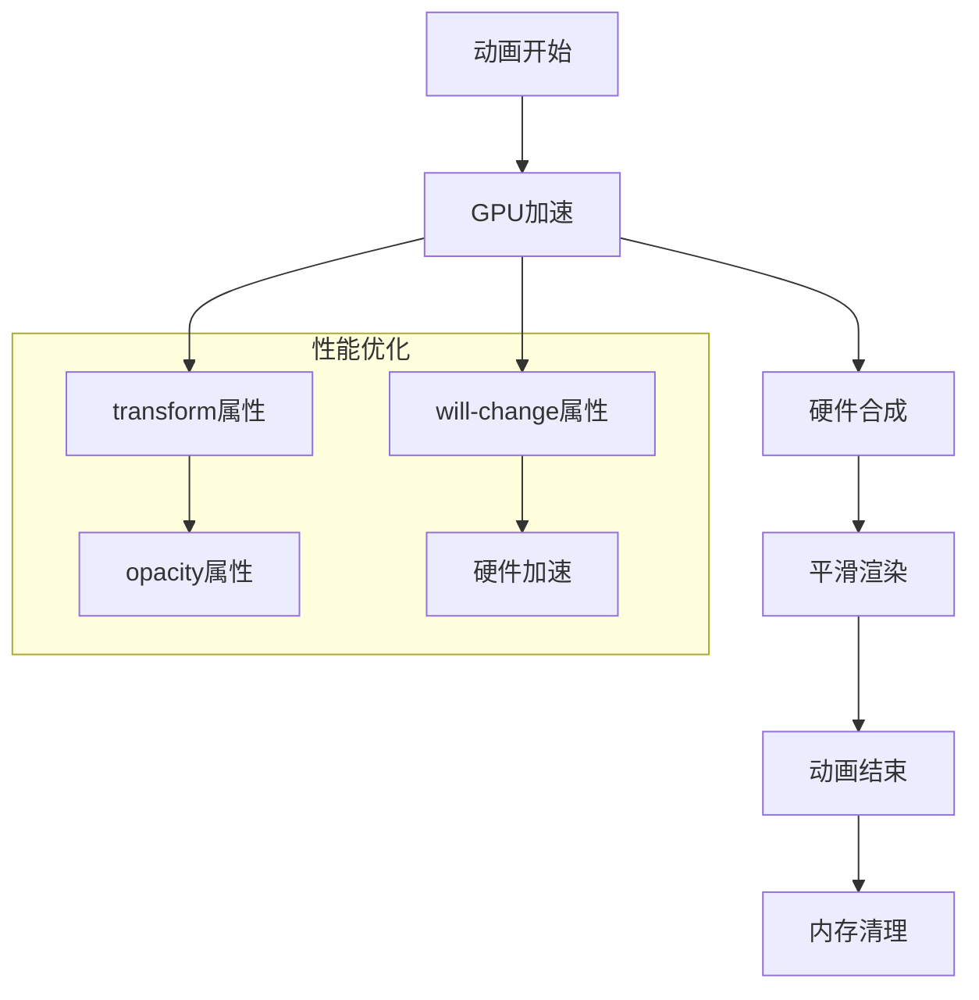

**图表来源**
- [sidepanel.css](file://src/sidepanel/sidepanel.css#L1400-L1457)
- [sidepanel.css](file://src/sidepanel/sidepanel.css#L2780-L2824)

### 响应式性能

系统针对不同设备的性能优化：

- **移动设备**：简化动画效果，减少重绘次数
- **桌面设备**：提供丰富的视觉效果和流畅的动画
- **低性能设备**：自动降级动画质量

## 故障排除指南

### 常见问题诊断

#### 模态对话框无法显示

**可能原因**：
1. CSS样式冲突
2. JavaScript执行错误
3. DOM元素未正确加载

**解决方案**：
1. 检查控制台错误日志
2. 验证CSS类名是否正确
3. 确认DOM元素是否存在

#### 导航功能异常

**可能原因**：
1. 事件监听器未正确绑定
2. 状态管理错误
3. DOM结构变更

**解决方案**：
1. 重新初始化导航控制器
2. 检查事件绑定状态
3. 验证DOM结构完整性

#### 数据持久化失败

**可能原因**：
1. Chrome存储API权限问题
2. 存储空间不足
3. 数据格式错误

**解决方案**：
1. 检查扩展权限设置
2. 清理不必要的存储数据
3. 验证数据格式和类型

**节来源**
- [sidepanel.js](file://src/sidepanel/sidepanel.js#L391-L641)
- [sidepanel.css](file://src/sidepanel/sidepanel.css#L1398-L1599)

## 结论

AI Multiverse 模态对话框系统展现了现代前端开发的最佳实践，通过精心设计的架构和完善的用户体验，提供了功能丰富且易于维护的模态对话框解决方案。

### 主要优势

1. **模块化设计**：清晰的组件分离和职责划分
2. **状态管理**：完善的生命周期管理和状态持久化
3. **用户体验**：流畅的动画效果和直观的交互设计
4. **性能优化**：高效的内存管理和动画性能
5. **可扩展性**：灵活的架构支持未来功能扩展

### 技术亮点

- **响应式设计**：完美适配不同屏幕尺寸
- **无障碍支持**：完整的键盘导航和屏幕阅读器支持
- **跨浏览器兼容**：确保在主流浏览器中的稳定性
- **安全性**：严格的输入验证和内容安全策略

该系统为类似的应用程序提供了优秀的参考模板，展示了如何构建高质量的模态对话框系统。