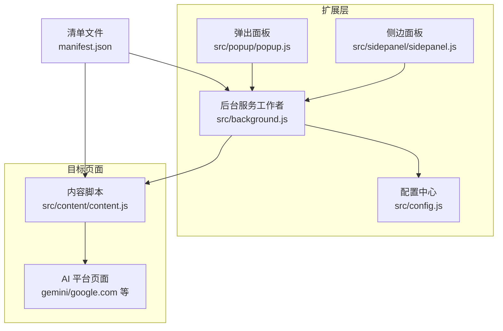
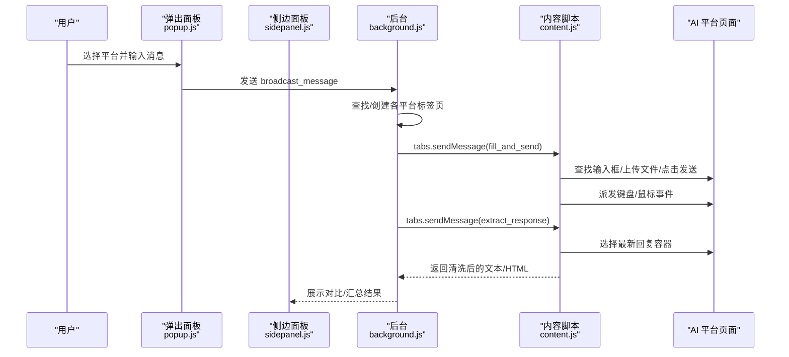
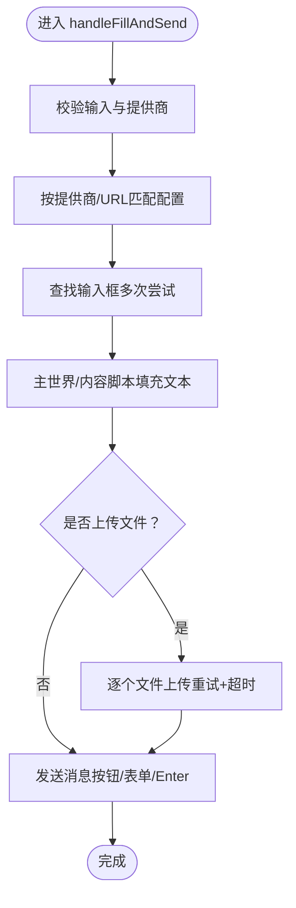
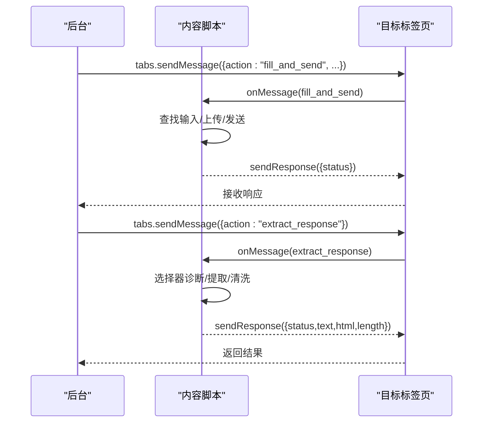
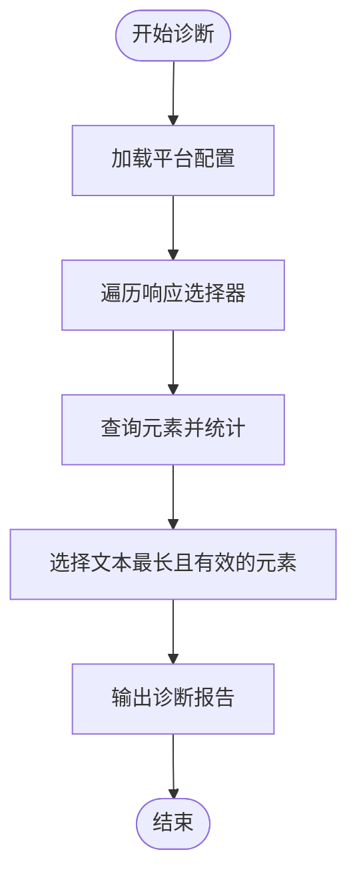
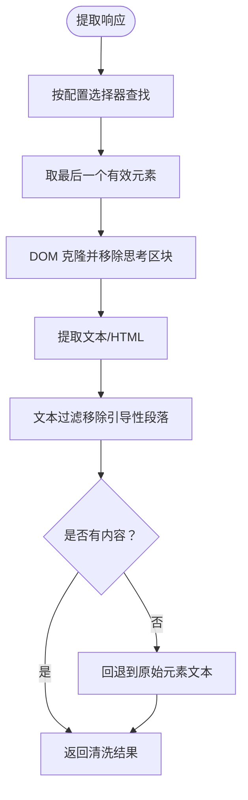
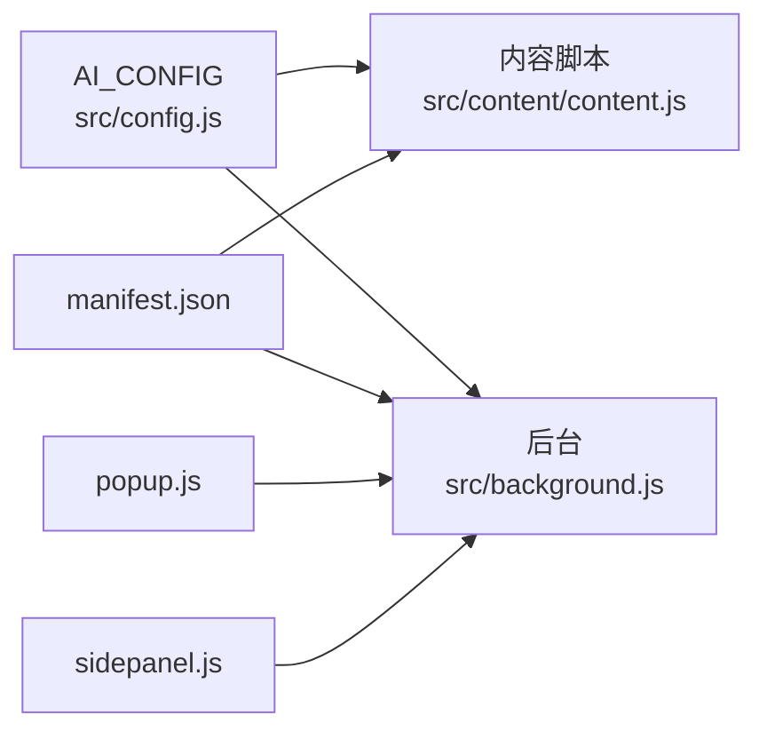

# 内容脚本系统

<cite>
**本文档引用的文件**
- [manifest.json](file://manifest.json)
- [content.js](file://src/content/content.js)
- [background.js](file://src/background.js)
- [config.js](file://src/config.js)
- [popup.js](file://src/popup/popup.js)
- [sidepanel.js](file://src/sidepanel/sidepanel.js)
- [popup.html](file://src/popup/popup.html)
- [sidepanel.html](file://src/sidepanel/sidepanel.html)
</cite>

## 目录
1. [简介](#简介)
2. [项目结构](#项目结构)
3. [核心组件](#核心组件)
4. [架构总览](#架构总览)
5. [详细组件分析](#详细组件分析)
6. [依赖关系分析](#依赖关系分析)
7. [性能考量](#性能考量)
8. [故障排除指南](#故障排除指南)
9. [结论](#结论)

## 简介
本技术文档深入解析 AI 多重宇宙对话扩展的内容脚本系统，重点说明内容脚本（content script）如何在目标网站页面中安全地执行 JavaScript，实现跨平台的 AI 平台自动化交互。文档涵盖 DOM 操作策略（选择器诊断工具、元素查找与事件模拟）、消息传递机制（content script 与 background script 的通信协议）、AI 平台特定的自动化操作（输入框填充、按钮点击、表单提交）、安全防护措施（CSP 绕过与跨域通信安全）、响应提取功能以及调试技巧与常见问题解决方案。

## 项目结构
该扩展采用 Manifest V3 架构，包含以下关键模块：
- manifest.json：声明权限、主机权限、后台服务工作者、内容脚本注入规则与快捷键
- src/content/content.js：内容脚本，负责在目标站点内执行自动化操作与响应提取
- src/background.js：后台服务工作者，协调多标签页、广播消息、窗口管理与主世界注入
- src/config.js：统一配置中心，定义各 AI 平台的选择器、提交方式、文件上传支持等
- src/popup/popup.js 与 src/sidepanel/sidepanel.js：前端交互层，负责用户输入、状态展示与汇总
- HTML/CSS 资源：popup.html 与 sidepanel.html 提供界面骨架

**图表来源**
- [manifest.json](file://manifest.json#L45-L69)
- [content.js](file://src/content/content.js#L1-L50)
- [background.js](file://src/background.js#L1-L50)
- [config.js](file://src/config.js#L1-L30)
- [popup.js](file://src/popup/popup.js#L1-L30)
- [sidepanel.js](file://src/sidepanel/sidepanel.js#L1-L40)

**章节来源**
- [manifest.json](file://manifest.json#L1-L79)
- [content.js](file://src/content/content.js#L1-L50)
- [background.js](file://src/background.js#L1-L50)
- [config.js](file://src/config.js#L1-L30)
- [popup.js](file://src/popup/popup.js#L1-L30)
- [sidepanel.js](file://src/sidepanel/sidepanel.js#L1-L40)

## 核心组件
- 内容脚本（content script）
  - 负责在目标站点内执行自动化：输入框填充、文件上传、按钮点击、键盘事件派发、响应提取与清洗
  - 提供诊断工具：选择器诊断，辅助定位最有效的响应容器
- 后台服务工作者（background service worker）
  - 协调多标签页：发现/创建/布局/关闭 AI 平台窗口
  - 广播消息：向多个内容脚本并发发送“填充并发送”指令
  - 主世界注入：在需要时通过 executeScript 在 MAIN 世界执行填充逻辑
  - 响应抓取：统一从各平台拉取最新回复
- 配置中心（AI_CONFIG）
  - 定义各平台的选择器、提交方式、文件上传支持、基础 URL、图标等
  - 为内容脚本与后台脚本提供一致的平台元数据
- 前端交互层（popup/sidepanel）
  - 用户输入与偏好管理
  - 响应展示、对比与复制
  - 汇总与总结流程控制

**章节来源**
- [content.js](file://src/content/content.js#L199-L216)
- [background.js](file://src/background.js#L138-L197)
- [config.js](file://src/config.js#L5-L200)
- [popup.js](file://src/popup/popup.js#L16-L45)
- [sidepanel.js](file://src/sidepanel/sidepanel.js#L1343-L1407)

## 架构总览
内容脚本系统遵循“后台调度 + 内容脚本执行 + 配置驱动”的分层设计。后台负责全局协调与注入，内容脚本负责具体页面自动化，配置中心提供平台差异化参数。

**图表来源**
- [popup.js](file://src/popup/popup.js#L30-L45)
- [background.js](file://src/background.js#L718-L786)
- [content.js](file://src/content/content.js#L323-L418)
- [sidepanel.js](file://src/sidepanel/sidepanel.js#L1700-L1721)

## 详细组件分析

### 内容脚本：DOM 操作与自动化
- 输入框填充策略
  - 优先通过主世界注入（MAIN world）执行属性赋值与事件派发，确保与 React/Vue 等框架兼容
  - 若平台不支持主世界注入或存在冲突，回退到内容脚本内的 contenteditable 填充逻辑
  - 针对 Kimi 等平台，采用“聚焦 → 点击 → 清空全选 → 直接写入 textContent”的稳健策略
- 文件上传机制
  - 基于配置过滤支持的文件类型，逐个上传并带重试与超时保护
  - 不同平台采用“直接 FileList 注入”或“点击上传按钮后注入”的两种路径
- 按钮点击与表单提交
  - 通过选择器定位发送按钮，检测禁用状态，必要时回退到 Enter 键提交
  - 异步 UI（如 DeepSeek/Qwen）在按钮未激活时进行快速 Enter 回退，避免卡死
- 响应提取与清洗
  - 优先使用配置中的响应选择器，取“最后出现”的元素作为最新回复
  - 针对“思考/推理”区块，提供 DOM 克隆与文本过滤双重清理策略
  - 支持 SVG 图标场景与回退选择器，增强鲁棒性

**图表来源**
- [content.js](file://src/content/content.js#L323-L418)
- [content.js](file://src/content/content.js#L466-L565)
- [content.js](file://src/content/content.js#L616-L672)

**章节来源**
- [content.js](file://src/content/content.js#L323-L418)
- [content.js](file://src/content/content.js#L466-L565)
- [content.js](file://src/content/content.js#L616-L672)

### 消息传递机制：content script ↔ background script
- 通信通道
  - content script 监听来自后台的消息：ping、fill_and_send、extract_response、diagnose_selectors
  - 后台监听来自 UI 的消息：broadcast_message、fetch_all_responses、tile_windows、launch_only_providers、close_all_windows、perform_main_world_fill
- 请求-响应语义
  - 后台通过 tabs.sendMessage 向内容脚本发送动作指令
  - 内容脚本处理完成后返回状态或提取结果
- 主世界注入
  - 当需要绕过 CSP 或与复杂前端框架交互时，后台通过 executeScript 在 MAIN 世界注入填充逻辑

**图表来源**
- [content.js](file://src/content/content.js#L199-L216)
- [background.js](file://src/background.js#L138-L197)
- [background.js](file://src/background.js#L378-L526)

**章节来源**
- [content.js](file://src/content/content.js#L199-L216)
- [background.js](file://src/background.js#L138-L197)
- [background.js](file://src/background.js#L378-L526)

### 选择器诊断工具
- 功能概述
  - 遍历配置中的响应选择器，统计命中数量、文本长度与有效性
  - 自动推荐“最佳选择器”（文本最长且有效）
- 使用场景
  - 新平台接入时快速验证选择器有效性
  - 运行时辅助定位响应容器

**图表来源**
- [content.js](file://src/content/content.js#L127-L197)

**章节来源**
- [content.js](file://src/content/content.js#L127-L197)

### 响应提取与清洗
- DOM 克隆与删除
  - 对包含“思考/推理”类名或特定数据属性的元素进行移除
  - 针对特定平台（如 Yuanbao）移除深度搜索组件中的“思考”部分
- 文本过滤
  - 移除“Thinking/Reasoning/思考”等引导性段落
  - 去除多余空行，保持整洁输出
- 回退策略
  - 若无有效选择器，尝试通用 Markdown 容器选择器
  - 最终回退到原始元素文本，保留 HTML 以便渲染

**图表来源**
- [content.js](file://src/content/content.js#L219-L320)

**章节来源**
- [content.js](file://src/content/content.js#L219-L320)

### 安全防护与 CSP 绕过
- 主世界注入（MAIN world）
  - 在需要与复杂前端框架交互或绕过严格 CSP 时，通过后台 executeScript 注入填充逻辑
  - 仅在必要时启用，避免不必要的风险暴露
- 内容脚本内填充
  - 优先使用内容脚本内的事件派发与属性设置，减少跨世界交互
- 事件模拟
  - 使用原生 KeyboardEvent/MouseEvent，确保事件冒泡与取消默认行为符合预期
- XSS 防护
  - 前端渲染时使用 DOMPurify 进行 HTML 洗净，避免注入
  - 文本转义与 Markdown 渲染前的白名单控制

**章节来源**
- [background.js](file://src/background.js#L378-L526)
- [content.js](file://src/content/content.js#L420-L463)
- [sidepanel.js](file://src/sidepanel/sidepanel.js#L64-L124)

### 跨域通信与窗口管理
- 窗口发现与布局
  - 通过 host_permissions 与 tabs.query 定位已有标签页，或创建新窗口
  - 支持“平铺布局”与“关闭全部”等批量操作
- 语言与主题同步
  - 后台监听语言变化并向 UI 与内容脚本广播
- 状态反馈
  - 通过 runtime.sendMessage 将状态更新推送到 UI

**章节来源**
- [background.js](file://src/background.js#L528-L643)
- [background.js](file://src/background.js#L656-L716)
- [sidepanel.js](file://src/sidepanel/sidepanel.js#L1864-L1885)

## 依赖关系分析
- 配置驱动
  - 所有平台差异通过 AI_CONFIG 统一管理，内容脚本与后台脚本共享
- 权限与主机权限
  - manifest.json 声明了对多个 AI 平台的访问权限与脚本注入能力
- 消息协议
  - content script 与 background script 之间通过标准化 action 字段进行解耦

**图表来源**
- [config.js](file://src/config.js#L5-L200)
- [content.js](file://src/content/content.js#L1-L30)
- [background.js](file://src/background.js#L1-L50)
- [manifest.json](file://manifest.json#L12-L32)
- [popup.js](file://src/popup/popup.js#L1-L30)
- [sidepanel.js](file://src/sidepanel/sidepanel.js#L1-L40)

**章节来源**
- [config.js](file://src/config.js#L5-L200)
- [content.js](file://src/content/content.js#L1-L30)
- [background.js](file://src/background.js#L1-L50)
- [manifest.json](file://manifest.json#L12-L32)
- [popup.js](file://src/popup/popup.js#L1-L30)
- [sidepanel.js](file://src/sidepanel/sidepanel.js#L1-L40)

## 性能考量
- 重试与超时
  - 输入框查找、按钮等待、文件上传均设置最大尝试次数与超时，避免长时间阻塞
- 并发与批处理
  - 后台对多个平台并发发送消息，显著缩短整体等待时间
- 事件派发优化
  - 仅在必要时触发 input/change/blur 等事件，减少不必要的渲染
- 选择器缓存
  - 响应提取阶段优先使用“最后元素”，减少重复扫描

[本节为通用指导，无需列出具体文件来源]

## 故障排除指南
- 无法找到输入框
  - 使用选择器诊断工具检查配置中的 input 选择器是否正确
  - 检查页面是否处于异步加载状态，适当增加等待时间
- 发送按钮不可点击
  - 检查禁用状态类名与 aria-disabled 属性，必要时回退到 Enter 提交
- 文件上传失败
  - 确认文件类型在 supportedFileTypes 中，检查上传按钮与隐藏 input 的存在
- 响应提取为空
  - 切换到回退选择器，或检查平台是否返回 SVG 图标而非文本
- CSP 报错
  - 后台将自动尝试主世界注入；若仍失败，检查 manifest 权限与 host_permissions

**章节来源**
- [content.js](file://src/content/content.js#L127-L197)
- [content.js](file://src/content/content.js#L466-L565)
- [content.js](file://src/content/content.js#L616-L672)
- [content.js](file://src/content/content.js#L219-L320)
- [background.js](file://src/background.js#L378-L526)
- [manifest.json](file://manifest.json#L19-L32)

## 结论
该内容脚本系统通过“配置驱动 + 主/内容脚本协同 + 统一消息协议”的架构，在多个复杂的 AI 平台实现了稳定的自动化交互。其选择器诊断、事件模拟、响应提取与安全防护机制共同保障了在严格 CSP 与多样化前端框架下的可靠性。配合后台的窗口管理与汇总能力，用户可在同一界面下高效比较多家 AI 的回复并进行智能总结。