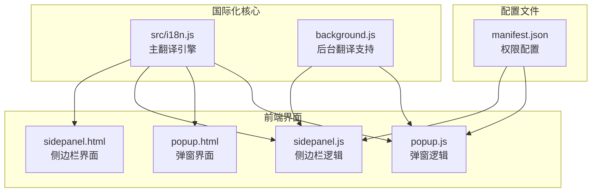
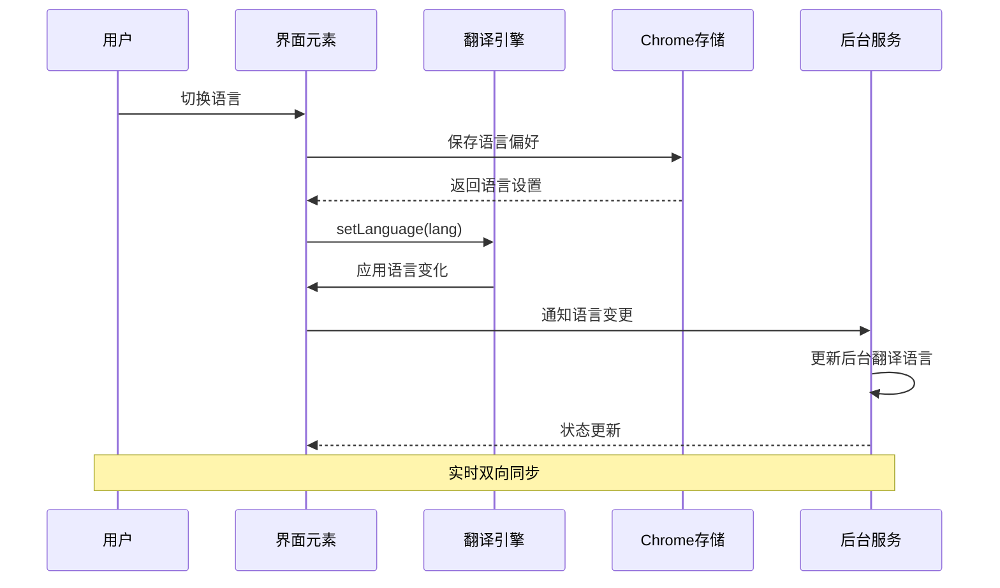
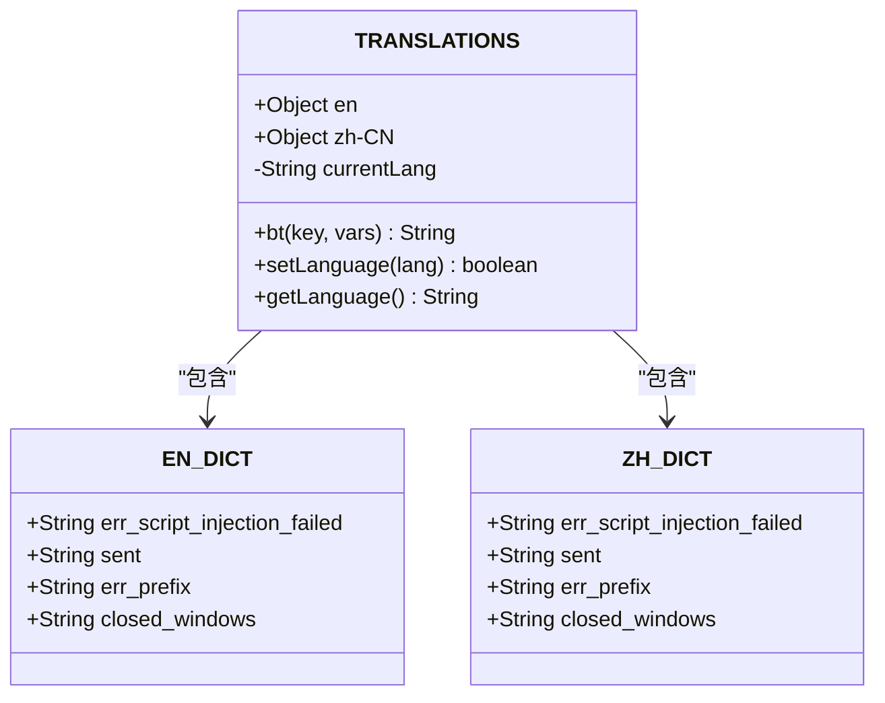
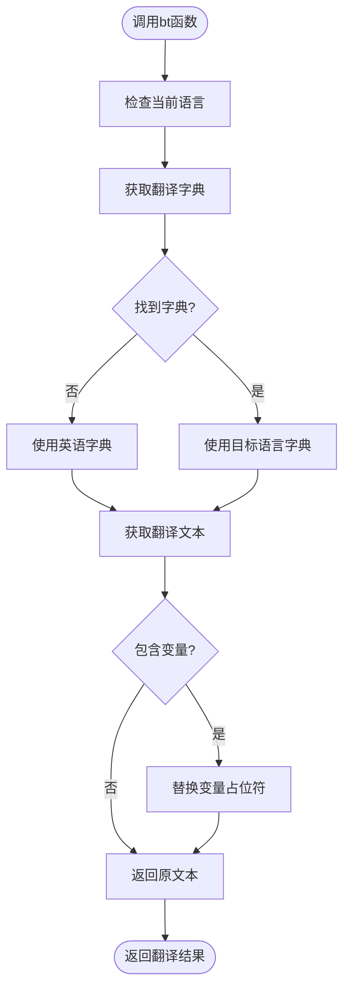
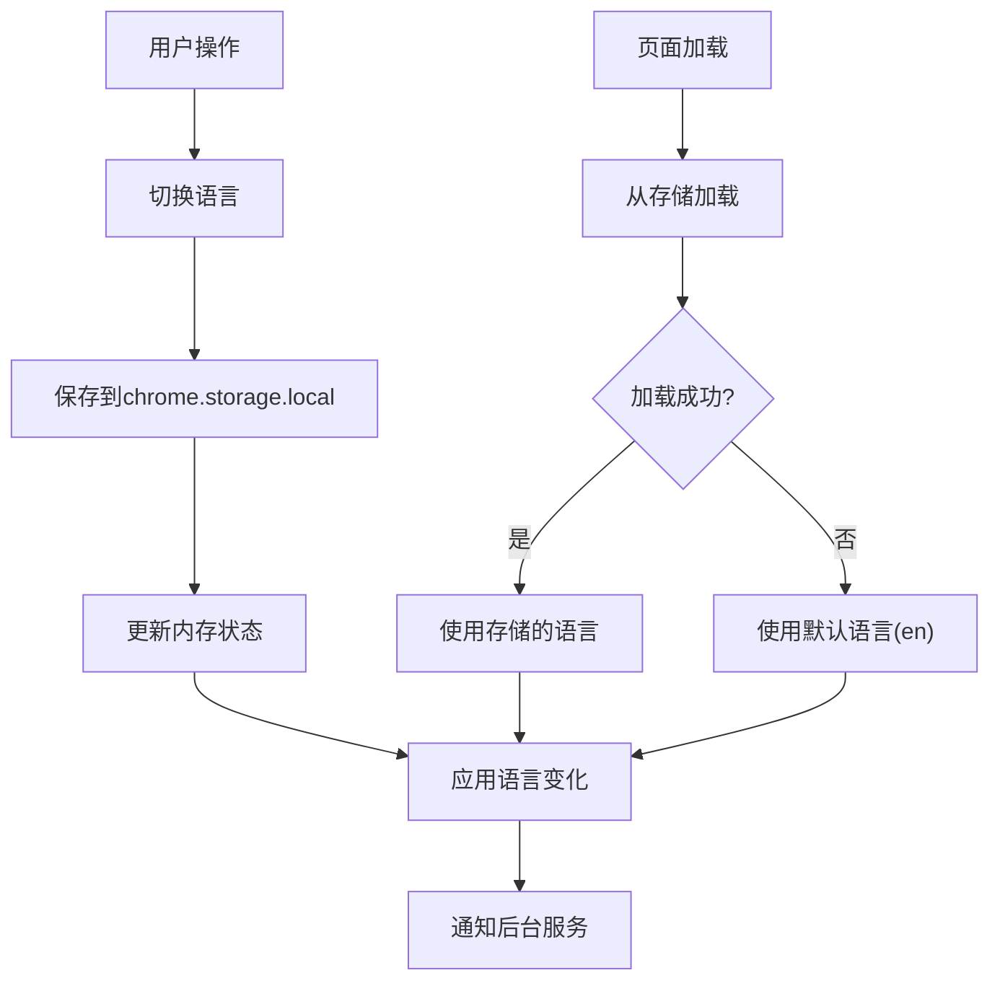
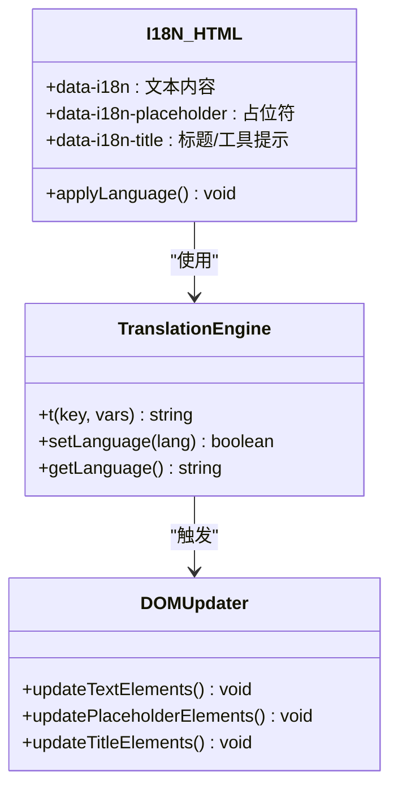
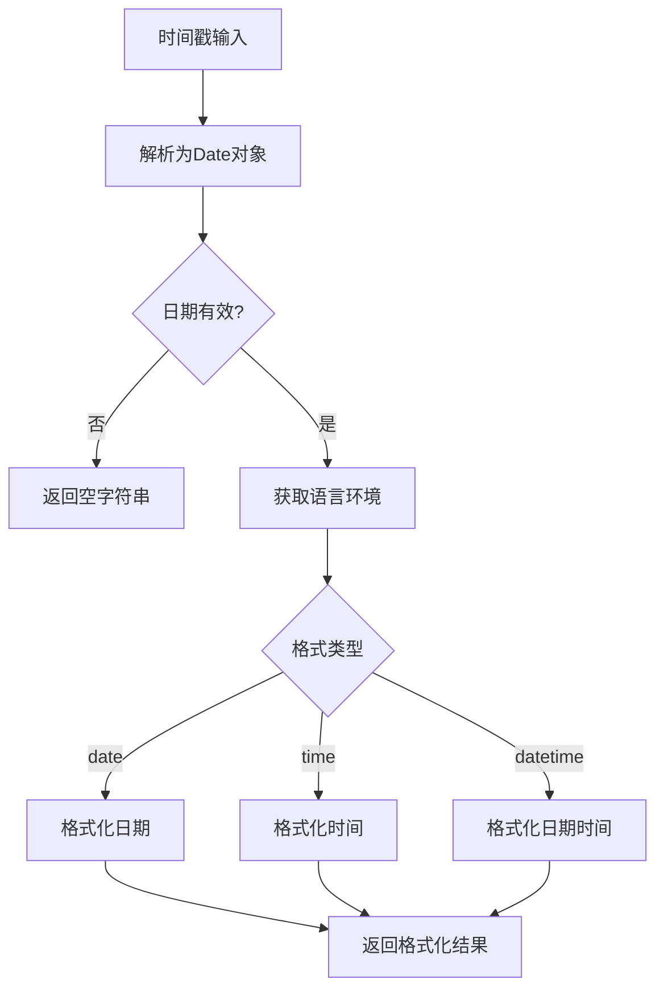
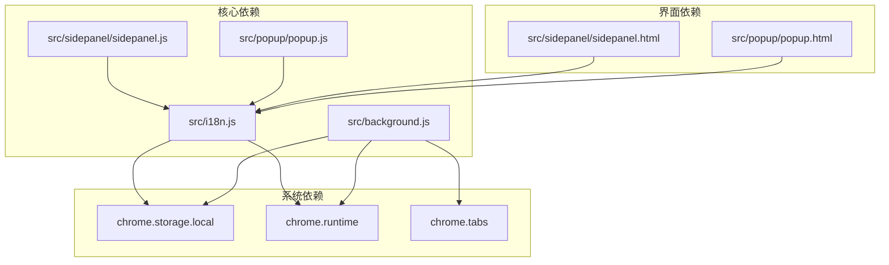

# 国际化系统

<cite>
**本文档引用的文件**
- [src/i18n.js](file://src/i18n.js)
- [src/background.js](file://src/background.js)
- [src/sidepanel/sidepanel.html](file://src/sidepanel/sidepanel.html)
- [src/sidepanel/sidepanel.js](file://src/sidepanel/sidepanel.js)
- [src/popup/popup.html](file://src/popup/popup.html)
- [src/popup/popup.js](file://src/popup/popup.js)
- [manifest.json](file://manifest.json)
</cite>

## 目录
1. [简介](#简介)
2. [项目结构](#项目结构)
3. [核心组件](#核心组件)
4. [架构概览](#架构概览)
5. [详细组件分析](#详细组件分析)
6. [依赖关系分析](#依赖关系分析)
7. [性能考虑](#性能考虑)
8. [故障排除指南](#故障排除指南)
9. [结论](#结论)
10. [附录](#附录)

## 简介
AI多重宇宙对话扩展实现了完整的国际化系统，支持英语（en）和简体中文（zh-CN）双语界面。该系统采用模块化的翻译架构，通过统一的翻译键值管理和动态语言切换机制，为用户提供流畅的多语言体验。

## 项目结构
国际化系统主要分布在以下文件中：

**图表来源**
- [src/i18n.js](file://src/i18n.js#L1-L504)
- [src/background.js](file://src/background.js#L1-L1028)
- [src/sidepanel/sidepanel.html](file://src/sidepanel/sidepanel.html#L1-L400)
- [src/sidepanel/sidepanel.js](file://src/sidepanel/sidepanel.js#L1-L2813)

**章节来源**
- [src/i18n.js](file://src/i18n.js#L1-L504)
- [src/background.js](file://src/background.js#L1-L1028)
- [src/sidepanel/sidepanel.html](file://src/sidepanel/sidepanel.html#L1-L400)
- [src/sidepanel/sidepanel.js](file://src/sidepanel/sidepanel.js#L1-L2813)

## 核心组件
国际化系统包含以下核心组件：

### 主翻译引擎 (I18N)
- 支持两种语言：英语(en)和简体中文(zh-CN)
- 提供翻译键值管理、语言检测和动态切换功能
- 实现日期时间格式化和相对时间显示

### 后台翻译支持 (TRANSLATIONS)
- 为后台服务工作线程提供翻译字典
- 支持变量替换和错误处理
- 与前台翻译系统保持同步

### 界面元素国际化
- HTML中的data-i18n属性系统
- 动态语言切换和状态持久化
- 统一的翻译键值管理

**章节来源**
- [src/i18n.js](file://src/i18n.js#L6-L346)
- [src/background.js](file://src/background.js#L76-L112)
- [src/sidepanel/sidepanel.html](file://src/sidepanel/sidepanel.html#L20-L396)

## 架构概览
国际化系统采用分层架构设计，确保前后端协调一致：

**图表来源**
- [src/sidepanel/sidepanel.js](file://src/sidepanel/sidepanel.js#L1864-L1885)
- [src/background.js](file://src/background.js#L1021-L1025)

## 详细组件分析

### TRANSLATIONS对象设计
TRANSLATIONS对象采用层次化的数据结构设计：

**图表来源**
- [src/background.js](file://src/background.js#L76-L112)

TRANSLATIONS对象的结构特点：
- **双语言支持**：同时维护英语和中文翻译字典
- **变量替换**：支持动态参数替换（如{count}、{max}）
- **错误处理**：缺失翻译时返回原始键值
- **后台专用**：专门为后台服务工作线程提供翻译功能

**章节来源**
- [src/background.js](file://src/background.js#L76-L112)

### 翻译函数bt()工作原理
bt()函数实现了高效的翻译检索和变量替换机制：

**图表来源**
- [src/background.js](file://src/background.js#L103-L112)

bt()函数的关键特性：
- **语言优先级**：优先使用当前语言，不存在时回退到英语
- **变量替换**：支持正则表达式匹配和替换
- **错误保护**：缺失翻译时返回原始键值
- **性能优化**：直接返回替换后的字符串

**章节来源**
- [src/background.js](file://src/background.js#L100-L112)

### 翻译键值管理系统
翻译键值采用层级化命名规范，确保组织性和可维护性：

| 键值前缀 | 用途 | 示例 |
|---------|------|------|
| header.* | 顶部导航区域 | logo, switch_language, toggle_theme |
| tab.* | 标签页标题 | tab_chat, tab_responses |
| history.* | 历史记录功能 | history_title, clear_all, resend_message |
| response.* | 响应处理 | fetch_responses, copy_all, summarize |
| button.* | 按钮文本 | send, open, tile, close |
| modal.* | 弹窗内容 | close_all_title, models_title, confirm |
| file.* | 文件上传 | file_select, file_uploading, file_too_large |
| error.* | 错误信息 | err_input_not_found, err_file_read_failed |

**章节来源**
- [src/i18n.js](file://src/i18n.js#L6-L346)

### 语言偏好存储机制
系统使用Chrome存储API实现语言偏好的持久化：

**图表来源**
- [src/sidepanel/sidepanel.js](file://src/sidepanel/sidepanel.js#L1866-L1885)
- [src/background.js](file://src/background.js#L94-L97)

存储机制的特点：
- **异步操作**：使用回调函数处理存储操作
- **错误处理**：网络异常时降级到默认语言
- **实时同步**：前台和后台语言状态保持一致
- **持久化存储**：重启后语言偏好仍然有效

**章节来源**
- [src/sidepanel/sidepanel.js](file://src/sidepanel/sidepanel.js#L1866-L1885)
- [src/background.js](file://src/background.js#L94-L97)

### 界面元素国际化处理
系统采用HTML属性驱动的国际化方案：

**图表来源**
- [src/sidepanel/sidepanel.js](file://src/sidepanel/sidepanel.js#L1887-L1921)

界面国际化处理流程：
1. **HTML标记**：使用data-i18n系列属性标识需要翻译的元素
2. **动态应用**：加载语言时自动遍历并更新所有标记元素
3. **批量更新**：支持文本内容、占位符和标题的批量翻译
4. **特殊处理**：按钮标签等需要特殊DOM结构的元素单独处理

**章节来源**
- [src/sidepanel/sidepanel.html](file://src/sidepanel/sidepanel.html#L20-L396)
- [src/sidepanel/sidepanel.js](file://src/sidepanel/sidepanel.js#L1887-L2022)

### 日期时间格式化系统
系统提供了灵活的日期时间格式化功能：

**图表来源**
- [src/i18n.js](file://src/i18n.js#L425-L458)

格式化系统特性：
- **多格式支持**：支持日期、时间、日期时间三种格式
- **本地化适配**：根据语言选择合适的本地化格式
- **相对时间**：提供人性化的时间显示（如"5分钟前"）
- **错误处理**：无效日期时优雅降级

**章节来源**
- [src/i18n.js](file://src/i18n.js#L419-L488)

## 依赖关系分析

**图表来源**
- [src/i18n.js](file://src/i18n.js#L494-L503)
- [src/background.js](file://src/background.js#L1-L1028)
- [src/sidepanel/sidepanel.js](file://src/sidepanel/sidepanel.js#L1-L2813)

**章节来源**
- [src/i18n.js](file://src/i18n.js#L494-L503)
- [src/background.js](file://src/background.js#L1-L1028)
- [manifest.json](file://manifest.json#L12-L18)

## 性能考虑
国际化系统在设计时充分考虑了性能优化：

### 内存优化
- **延迟初始化**：翻译函数仅在需要时执行
- **缓存策略**：语言切换后复用已解析的DOM节点
- **最小化依赖**：避免不必要的全局变量

### 执行效率
- **快速查找**：使用对象属性访问而非数组遍历
- **批量更新**：DOM更新采用批量操作减少重排
- **异步处理**：存储操作使用异步API避免阻塞

### 资源管理
- **按需加载**：翻译资源只在需要时加载
- **内存回收**：及时清理事件监听器和定时器
- **缓存利用**：重复使用的翻译结果进行缓存

## 故障排除指南

### 常见问题及解决方案

**问题1：翻译键值缺失**
- **症状**：界面显示原始键值而非翻译文本
- **原因**：翻译键值不存在或拼写错误
- **解决**：检查键值是否存在于TRANSLATIONS对象中

**问题2：语言切换无效**
- **症状**：点击语言切换按钮无效果
- **原因**：存储API访问失败或事件监听器未注册
- **解决**：检查chrome.storage权限和事件绑定

**问题3：变量替换失败**
- **症状**：翻译文本中包含未替换的占位符
- **原因**：变量对象缺少对应键值或传入参数错误
- **解决**：验证变量对象结构和键值匹配

**问题4：后台翻译不同步**
- **症状**：前台显示中文后台仍显示英文
- **原因**：语言变更消息未正确传递
- **解决**：检查runtime消息传递和监听器注册

**章节来源**
- [src/sidepanel/sidepanel.js](file://src/sidepanel/sidepanel.js#L1864-L1885)
- [src/background.js](file://src/background.js#L1021-L1025)

## 结论
AI多重宇宙对话扩展的国际化系统展现了优秀的工程实践：

### 设计优势
- **模块化架构**：清晰的职责分离和接口定义
- **双向同步**：前后端语言状态保持一致
- **扩展性强**：易于添加新语言和新翻译键值
- **用户体验**：无缝的语言切换和持久化存储

### 技术亮点
- **灵活的数据结构**：支持嵌套对象和复杂翻译场景
- **完善的错误处理**：优雅的降级机制和调试信息
- **高性能实现**：优化的查找算法和DOM操作
- **标准化接口**：统一的API设计和使用方式

### 改进建议
- **翻译质量保证**：建立翻译审核和质量控制流程
- **性能监控**：添加翻译性能指标和监控
- **测试覆盖**：完善单元测试和集成测试
- **文档完善**：补充详细的开发和维护文档

## 附录

### 翻译示例
以下是一些常用的翻译键值示例：

| 键值 | 英文原文 | 中文翻译 |
|------|----------|----------|
| logo | AI Multiverse | AI 多重宇宙 |
| switch_language | Switch Language | 切换语言 |
| send | Send | 发送 |
| clear_all | Clear All | 清空全部 |
| file_too_large | File too large: {max}MB max | 文件过大：最大 {max}MB |
| summary_failed | Summary failed | 总结失败 |
| close_all_title | Close All Windows? | 关闭所有窗口？ |

### 新增语言步骤
1. **扩展TRANSLATIONS对象**：在src/i18n.js中添加新的语言代码和翻译字典
2. **更新HTML标记**：为新语言添加相应的data-i18n属性
3. **测试验证**：确保所有翻译键值都有对应翻译
4. **样式调整**：检查新语言下的界面布局和字体显示

### 最佳实践
- **键值命名**：使用语义化的层级命名（如history.clear_all）
- **变量使用**：统一使用大括号语法{variable_name}
- **占位符处理**：确保所有动态内容都有对应的翻译键值
- **测试覆盖**：为新翻译添加单元测试和集成测试
- **性能监控**：定期检查翻译性能和内存使用情况