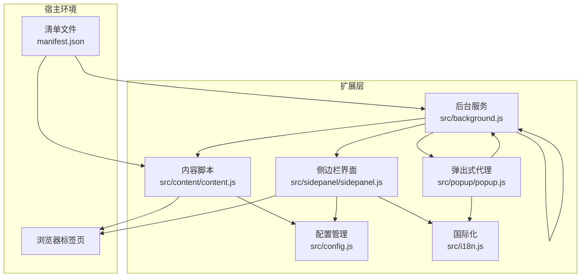
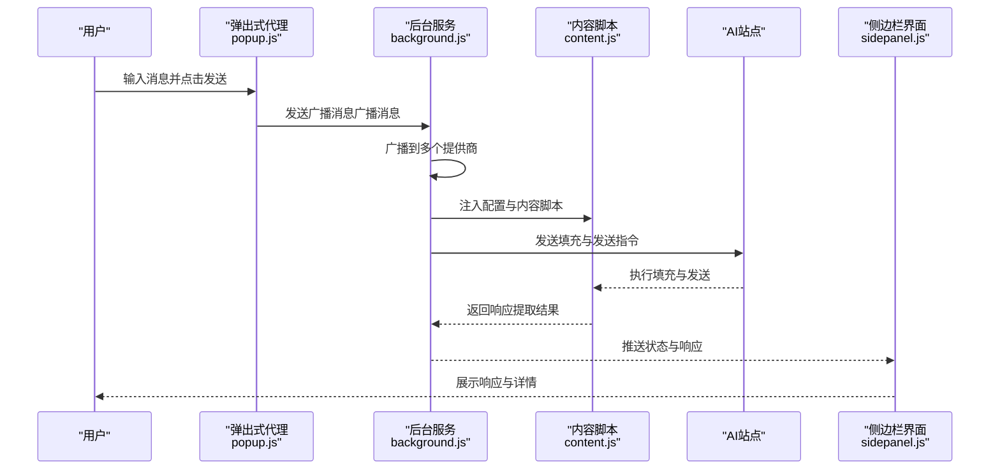
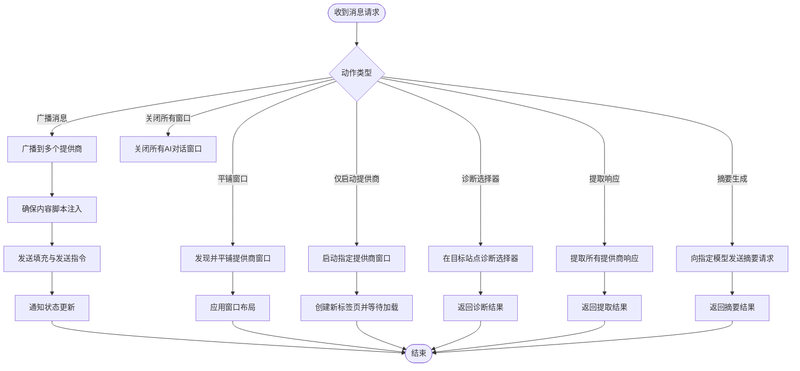
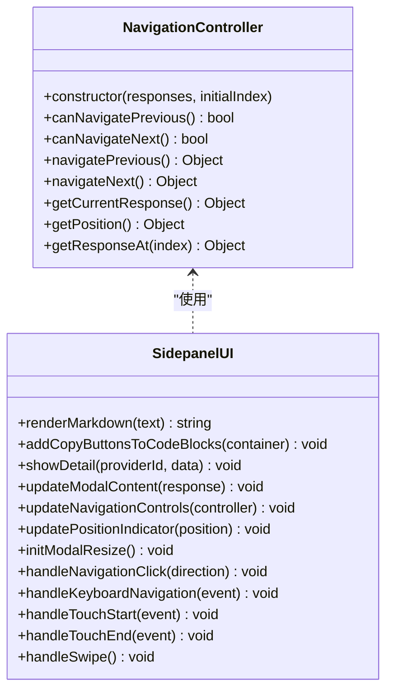
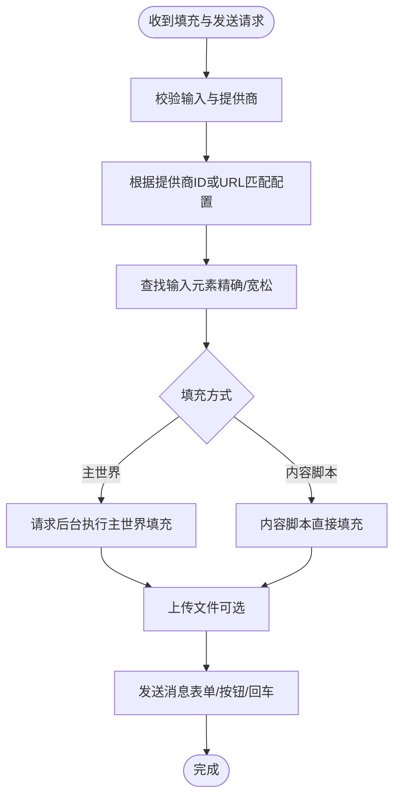
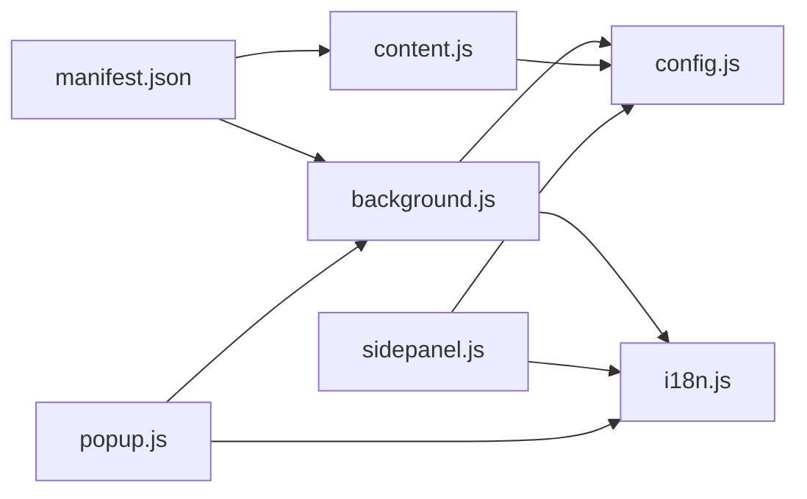

# 核心模块详解

<cite>
**本文档引用的文件**
- [src/background.js](file://src/background.js)
- [src/popup/popup.js](file://src/popup/popup.js)
- [src/sidepanel/sidepanel.js](file://src/sidepanel/sidepanel.js)
- [src/content/content.js](file://src/content/content.js)
- [src/config.js](file://src/config.js)
- [src/i18n.js](file://src/i18n.js)
- [manifest.json](file://manifest.json)
- [src/sidepanel/sidepanel.html](file://src/sidepanel/sidepanel.html)
- [src/popup/popup.html](file://src/popup/popup.html)
</cite>

## 目录
1. [简介](#简介)
2. [项目结构](#项目结构)
3. [核心组件](#核心组件)
4. [架构总览](#架构总览)
5. [详细组件分析](#详细组件分析)
6. [依赖关系分析](#依赖关系分析)
7. [性能考量](#性能考量)
8. [故障排查指南](#故障排查指南)
9. [结论](#结论)
10. [附录](#附录)

## 简介
本项目是一个多AI平台并发对话扩展，支持同时向多个AI网页端（如Gemini、Grok、Kimi、DeepSeek、ChatGPT、Qwen、Yuanbao）发送消息，并提供统一的侧边栏界面进行响应查看、文件上传、主题切换与国际化支持。核心模块包括：
- 后台服务（Background）：窗口管理、消息路由、状态持久化、跨平台选择器诊断与摘要生成
- 侧边栏界面（Sidepanel）：响应展示、文件上传处理、主题切换、导航与详情弹窗
- 内容脚本（Content）：DOM操作策略、选择器诊断、安全防护与文件上传
- 配置管理（Config）：AI平台配置结构、选择器映射、发送方法抽象
- 国际化系统（i18n）：多语言支持与日期时间本地化

## 项目结构
项目采用Chrome扩展Manifest V3架构，包含后台服务、内容脚本、侧边栏界面与弹出式代理界面等模块。核心文件组织如下：
- src/background.js：后台服务脚本，负责窗口生命周期、消息分发与跨页面通信
- src/content/content.js：内容脚本，注入到各AI站点，负责填充输入、发送消息与提取响应
- src/sidepanel/sidepanel.js：侧边栏界面逻辑，负责渲染、交互与状态持久化
- src/popup/popup.js：弹出式代理界面，用于快速广播消息
- src/config.js：全局AI平台配置，包含选择器映射与发送方法
- src/i18n.js：国际化翻译与本地化工具
- manifest.json：扩展清单，声明权限、匹配规则与入口

图表来源
- [src/background.js](file://src/background.js#L1-L120)
- [src/content/content.js](file://src/content/content.js#L1-L60)
- [src/sidepanel/sidepanel.js](file://src/sidepanel/sidepanel.js#L1-L60)
- [src/popup/popup.js](file://src/popup/popup.js#L1-L30)
- [src/config.js](file://src/config.js#L1-L40)
- [src/i18n.js](file://src/i18n.js#L1-L40)
- [manifest.json](file://manifest.json#L1-L40)

章节来源
- [manifest.json](file://manifest.json#L1-L79)

## 核心组件
本节概览四大核心模块及其职责：
- 后台服务（Background）：窗口管理、消息路由、状态持久化、跨平台选择器诊断与摘要生成
- 侧边栏界面（Sidepanel）：响应展示、文件上传处理、主题切换、导航与详情弹窗
- 内容脚本（Content）：DOM操作策略、选择器诊断、安全防护与文件上传
- 配置管理（Config）：AI平台配置结构、选择器映射、发送方法抽象
- 国际化系统（i18n）：多语言支持与日期时间本地化

章节来源
- [src/background.js](file://src/background.js#L1-L120)
- [src/sidepanel/sidepanel.js](file://src/sidepanel/sidepanel.js#L1-L120)
- [src/content/content.js](file://src/content/content.js#L1-L60)
- [src/config.js](file://src/config.js#L1-L60)
- [src/i18n.js](file://src/i18n.js#L1-L60)

## 架构总览
整体架构围绕Chrome扩展的后台服务与内容脚本协作展开。后台服务负责跨页面通信与窗口管理，内容脚本负责注入到目标站点执行DOM操作与消息提取，侧边栏界面提供统一的用户交互与状态持久化。

图表来源
- [src/popup/popup.js](file://src/popup/popup.js#L16-L45)
- [src/background.js](file://src/background.js#L139-L197)
- [src/content/content.js](file://src/content/content.js#L200-L216)
- [src/sidepanel/sidepanel.js](file://src/sidepanel/sidepanel.js#L1397-L1407)

## 详细组件分析

### 后台服务（Background）模块
- 窗口管理：支持弹出式侧边栏窗口的创建、聚焦与最小化；提供窗口平铺布局与关闭所有窗口功能
- 消息路由：监听来自弹出式代理与侧边栏的消息，分发到对应提供商；支持选择器诊断、响应提取与摘要生成
- 状态持久化：跟踪提供商窗口映射、上次显示的布局显示器、文件上传状态等
- 跨平台选择器诊断：在目标站点执行选择器诊断，返回命中数量与最后元素长度
- 摘要生成：根据指定模型与提示词，向目标提供商发送摘要请求

图表来源
- [src/background.js](file://src/background.js#L139-L197)
- [src/background.js](file://src/background.js#L270-L296)
- [src/background.js](file://src/background.js#L199-L268)
- [src/background.js](file://src/background.js#L298-L376)

章节来源
- [src/background.js](file://src/background.js#L1-L120)
- [src/background.js](file://src/background.js#L139-L197)
- [src/background.js](file://src/background.js#L270-L296)
- [src/background.js](file://src/background.js#L199-L268)
- [src/background.js](file://src/background.js#L298-L376)

### 侧边栏界面（Sidepanel）模块
- 响应展示：支持响应网格布局、响应卡片点击进入详情弹窗、导航控制器实现左右切换与键盘/触摸手势
- 文件上传处理：支持拖拽与选择文件，限制单文件大小与总大小，预览与清除
- 主题切换：支持明暗主题切换与状态指示
- 导航与详情弹窗：详情弹窗支持内容渲染、复制按钮、位置指示器与可调整宽度
- 历史管理：支持历史列表渲染、重发、编辑、删除与摘要结果展示

图表来源
- [src/sidepanel/sidepanel.js](file://src/sidepanel/sidepanel.js#L712-L815)
- [src/sidepanel/sidepanel.js](file://src/sidepanel/sidepanel.js#L817-L954)
- [src/sidepanel/sidepanel.js](file://src/sidepanel/sidepanel.js#L1057-L1196)

章节来源
- [src/sidepanel/sidepanel.js](file://src/sidepanel/sidepanel.js#L1-L120)
- [src/sidepanel/sidepanel.js](file://src/sidepanel/sidepanel.js#L817-L954)
- [src/sidepanel/sidepanel.js](file://src/sidepanel/sidepanel.js#L1057-L1196)

### 内容脚本（Content）模块
- DOM操作策略：针对不同平台采用主世界注入或内容脚本直接填充；处理React与contenteditable场景
- 选择器诊断：在目标站点执行选择器诊断，返回命中数量与最后元素长度
- 安全防护：文本清理、HTML净化、思维块过滤与文本过滤
- 文件上传：按平台策略上传文件，支持重试与超时控制

图表来源
- [src/content/content.js](file://src/content/content.js#L200-L216)
- [src/content/content.js](file://src/content/content.js#L322-L418)
- [src/content/content.js](file://src/content/content.js#L465-L565)

章节来源
- [src/content/content.js](file://src/content/content.js#L1-L120)
- [src/content/content.js](file://src/content/content.js#L126-L197)
- [src/content/content.js](file://src/content/content.js#L218-L320)
- [src/content/content.js](file://src/content/content.js#L593-L742)

### 配置管理（Config）模块
- AI平台配置结构：包含名称、图标、URL模式、基础URL、选择器映射、填充方式、发送方式、文件上传支持与支持的文件类型
- 选择器映射：输入框、发送按钮、响应容器、文件上传按钮与输入
- 发送方法抽象：表单提交、按钮点击、回车键三种发送方式
- 文件上传支持：按平台定义支持的文件类型与上传策略

章节来源
- [src/config.js](file://src/config.js#L1-L204)

### 国际化系统（i18n）模块
- 多语言支持：英文与简体中文，提供翻译函数与变量替换
- 日期时间格式化：根据当前语言格式化日期与相对时间
- 全局暴露：将翻译与格式化函数暴露到全局作用域供界面使用

章节来源
- [src/i18n.js](file://src/i18n.js#L1-L120)
- [src/i18n.js](file://src/i18n.js#L355-L414)
- [src/i18n.js](file://src/i18n.js#L415-L488)
- [src/i18n.js](file://src/i18n.js#L494-L504)

## 依赖关系分析
- Manifest声明权限与主机权限，确保后台服务与内容脚本在目标站点注入
- 后台服务依赖配置管理与国际化；内容脚本依赖配置管理；侧边栏界面依赖配置管理与国际化
- 侧边栏界面与弹出式代理通过后台服务进行消息路由

图表来源
- [manifest.json](file://manifest.json#L12-L32)
- [src/background.js](file://src/background.js#L69-L74)
- [src/content/content.js](file://src/content/content.js#L1-L20)
- [src/sidepanel/sidepanel.js](file://src/sidepanel/sidepanel.js#L1-L60)
- [src/popup/popup.js](file://src/popup/popup.js#L1-L30)

章节来源
- [manifest.json](file://manifest.json#L1-L79)

## 性能考量
- 注入与等待：内容脚本注入与页面加载需要等待，后台服务提供超时与重试机制
- 选择器诊断：在目标站点执行诊断，避免频繁DOM查询
- 文件上传：按平台策略上传，支持重试与超时控制
- 响应提取：优先使用最新响应，必要时回退到通用选择器
- UI渲染：侧边栏界面采用懒加载与局部更新，减少不必要的重绘

## 故障排查指南
- 脚本注入失败：检查后台服务中的注入逻辑与错误提示
- 选择器失效：使用选择器诊断工具定位问题
- 响应提取失败：检查响应选择器配置与思维块过滤
- 文件上传失败：检查文件类型与上传策略，确认重试与超时设置
- 窗口平铺失败：检查显示器信息与窗口状态

章节来源
- [src/background.js](file://src/background.js#L656-L716)
- [src/background.js](file://src/background.js#L270-L296)
- [src/content/content.js](file://src/content/content.js#L218-L320)
- [src/content/content.js](file://src/content/content.js#L616-L672)

## 结论
本项目通过后台服务与内容脚本的协同，实现了多AI平台的并发对话与统一界面管理。配置管理与国际化系统提供了良好的扩展性与用户体验。侧边栏界面在响应展示、文件上传与主题切换方面提供了丰富的功能。建议在未来版本中进一步优化选择器稳定性与UI交互体验。

## 附录
- 代码示例路径：详见各模块章节来源中的具体文件路径
- API接口说明：见后台服务消息监听与内容脚本消息处理部分
- 最佳实践：保持选择器映射与发送方法的抽象化，确保跨平台兼容性；合理设置超时与重试策略；加强安全防护与输入验证