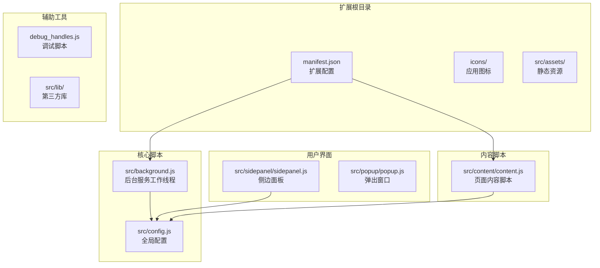
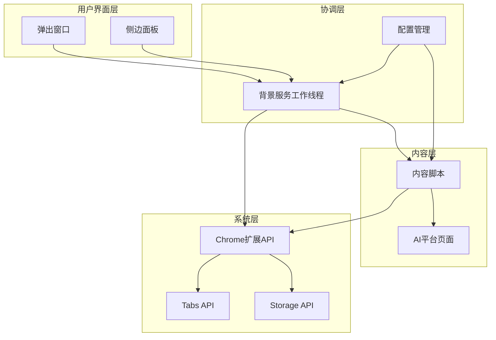
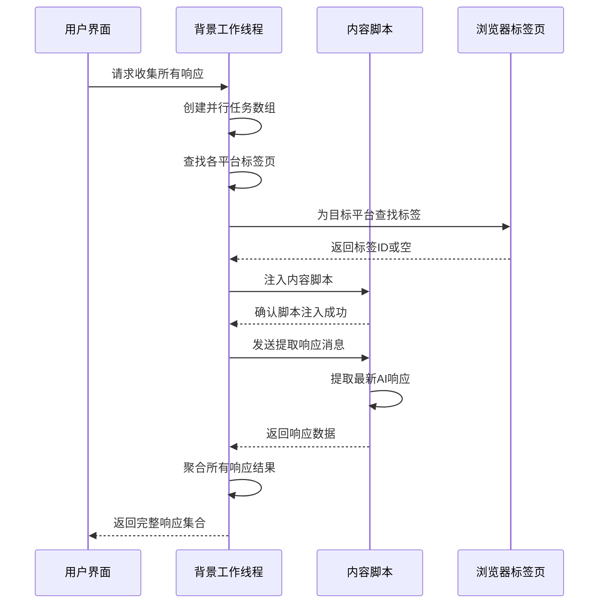
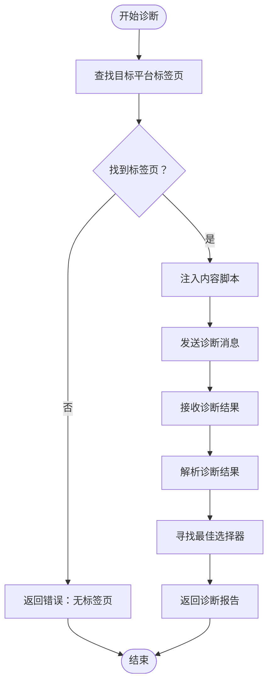
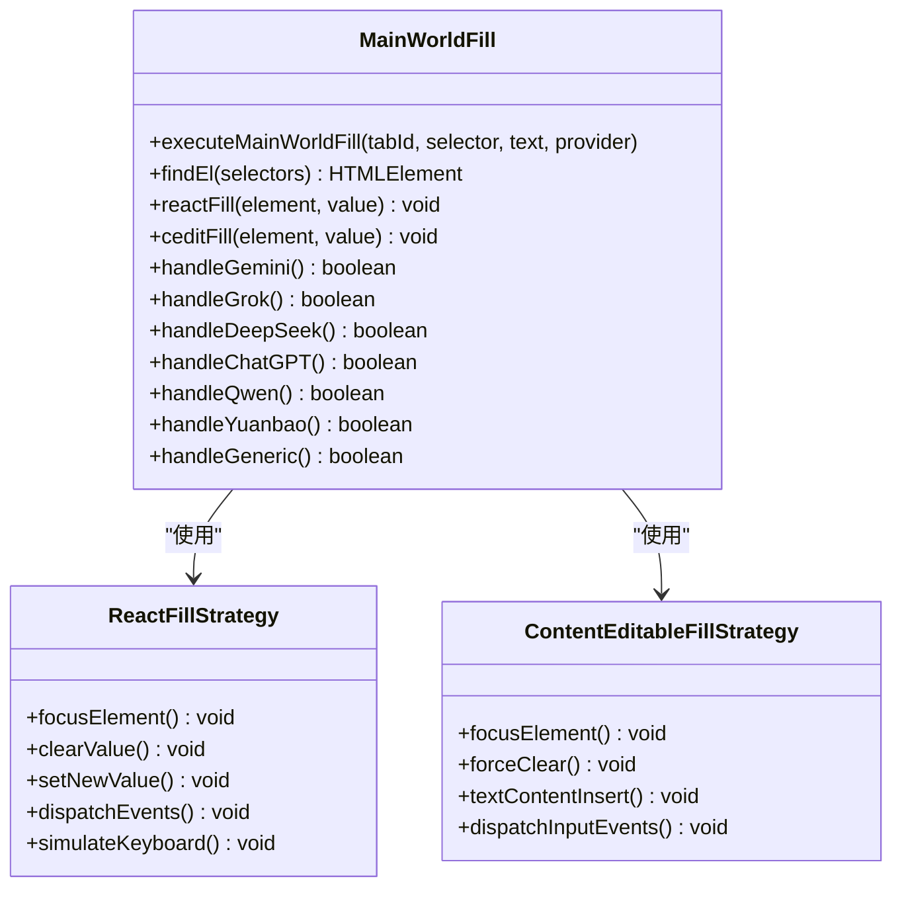
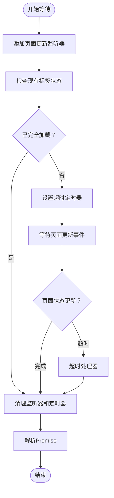
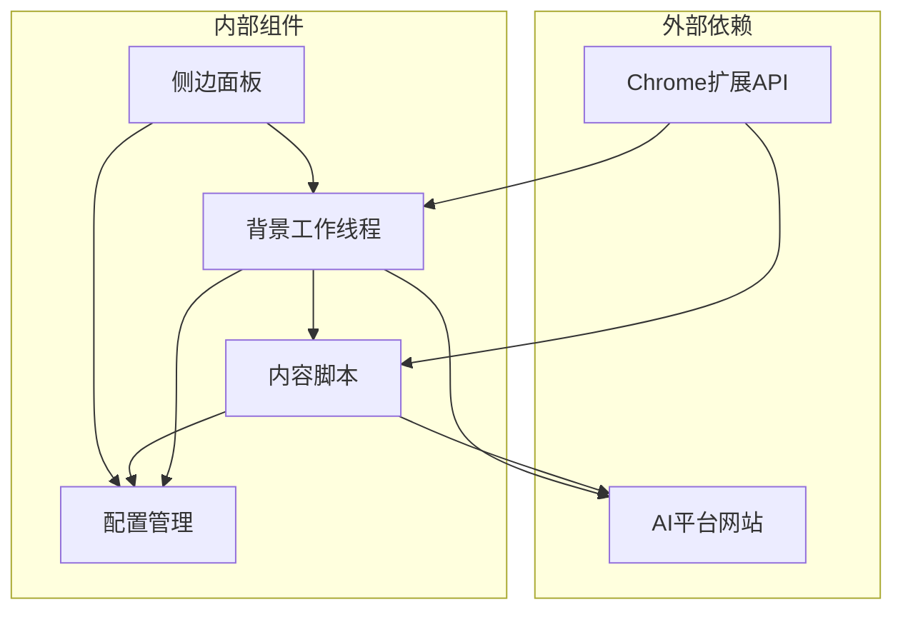
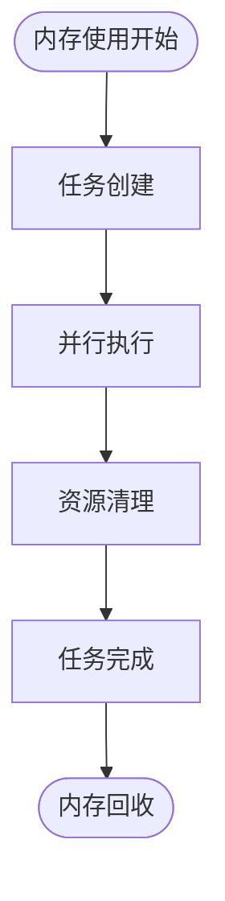

# AI平台通信机制

<cite>
**本文档引用的文件**
- [src/background.js](file://src/background.js)
- [src/content/content.js](file://src/content/content.js)
- [src/config.js](file://src/config.js)
- [src/sidepanel/sidepanel.js](file://src/sidepanel/sidepanel.js)
- [src/popup/popup.js](file://src/popup/popup.js)
- [manifest.json](file://manifest.json)
- [debug_handles.js](file://debug_handles.js)
</cite>

## 目录
1. [简介](#简介)
2. [项目结构](#项目结构)
3. [核心组件](#核心组件)
4. [架构概览](#架构概览)
5. [详细组件分析](#详细组件分析)
6. [依赖关系分析](#依赖关系分析)
7. [性能考虑](#性能考虑)
8. [故障排除指南](#故障排除指南)
9. [结论](#结论)

## 简介

AI平台通信机制是一个跨平台的AI聊天界面自动化系统，支持同时与多个AI平台（Gemini、Grok、Kimi、DeepSeek、ChatGPT、Qwen、腾讯元宝）进行交互。该系统通过浏览器扩展的形式，在后台服务工作线程中协调多个AI平台的通信，实现消息广播、响应收集、文件上传和智能摘要等功能。

系统采用分层架构设计，包含背景服务工作线程、内容脚本、侧边面板和弹出窗口等组件，通过Chrome扩展API实现跨域通信和页面注入。

## 项目结构

该项目采用模块化组织方式，主要文件结构如下：

**图表来源**
- [manifest.json](file://manifest.json#L1-L79)
- [src/background.js](file://src/background.js#L1-L100)
- [src/content/content.js](file://src/content/content.js#L1-L50)

**章节来源**
- [manifest.json](file://manifest.json#L1-L79)

## 核心组件

### 背景服务工作线程 (Background Service Worker)

背景服务工作线程是整个系统的协调中心，负责管理所有AI平台的连接状态、处理消息路由和执行跨平台操作。

**主要职责：**
- 窗口管理和调度
- 消息广播和路由
- 并行任务执行
- 错误处理和恢复
- 状态跟踪和持久化

### 内容脚本 (Content Script)

内容脚本注入到各个AI平台页面中，负责直接与页面交互，执行DOM操作和事件触发。

**核心功能：**
- 页面元素检测和选择
- 输入框填充和表单提交
- 响应内容提取
- 文件上传处理
- 事件监听和响应

### 配置管理系统

统一的配置管理确保所有组件使用一致的平台适配规则和选择器。

**配置内容：**
- 平台URL模式匹配
- DOM选择器映射
- 发送方法配置
- 文件上传支持
- 平台特定参数

**章节来源**
- [src/background.js](file://src/background.js#L1-L100)
- [src/content/content.js](file://src/content/content.js#L1-L100)
- [src/config.js](file://src/config.js#L1-L204)

## 架构概览

系统采用分层架构，通过Chrome扩展API实现组件间的松耦合通信：

**图表来源**
- [src/background.js](file://src/background.js#L138-L197)
- [src/content/content.js](file://src/content/content.js#L199-L216)
- [manifest.json](file://manifest.json#L42-L68)

## 详细组件分析

### fetchAllResponses 函数响应收集流程

fetchAllResponses函数实现了高效的并行响应收集机制，通过Promise.allSettled确保即使部分平台失败也不会影响整体流程。

**图表来源**
- [src/background.js](file://src/background.js#L199-L268)
- [src/content/content.js](file://src/content/content.js#L218-L320)

**处理流程详解：**

1. **并行任务创建**：为每个AI平台创建独立的任务，使用Promise.map实现并行执行
2. **标签页发现**：通过URL模式匹配和窗口ID验证找到对应平台的活跃标签页
3. **内容脚本注入**：确保目标页面已注入内容脚本，支持动态注入和错误恢复
4. **响应提取**：向内容脚本发送消息请求，使用extractLatestResponse函数提取最新响应
5. **结果聚合**：使用Promise.allSettled确保所有任务完成后返回结果

**错误处理机制：**
- 单个平台失败不影响其他平台
- 自动重试和超时处理
- 详细的错误信息记录和返回

**章节来源**
- [src/background.js](file://src/background.js#L199-L268)

### handleDiagnoseSelectors 函数选择器诊断功能

handleDiagnoseSelectors函数提供了强大的选择器诊断能力，帮助开发者快速定位和验证DOM选择器的有效性。

**图表来源**
- [src/background.js](file://src/background.js#L270-L296)
- [src/content/content.js](file://src/content/content.js#L126-L197)

**诊断功能特性：**

1. **多选择器验证**：支持同时测试多个候选选择器
2. **实时预览**：显示每个选择器匹配到的元素数量和内容长度
3. **最佳选择器推荐**：自动选择最有效的响应容器
4. **错误详细信息**：提供选择器语法错误的具体信息

**诊断结果包含：**
- 选择器有效性状态
- 匹配元素数量统计
- 最后元素内容预览
- 有效内容长度测量

**章节来源**
- [src/background.js](file://src/background.js#L270-L296)
- [src/content/content.js](file://src/content/content.js#L126-L197)

### executeMainWorldFill 函数主世界脚本注入技术

executeMainWorldFill函数实现了高级的主世界脚本注入技术，针对不同AI平台采用专门的DOM操作策略。

**图表来源**
- [src/background.js](file://src/background.js#L378-L526)

**平台特定策略：**

1. **Gemini (gemini.google.com)**
   - 使用Quill编辑器选择器
   - 专用的contenteditable填充策略
   - 支持长文本输入和复杂格式

2. **Grok (grok.com)**
   - ProseMirror/Tiptap编辑器支持
   - 特殊的"最后可见编辑器"选择逻辑
   - 全选-删除-粘贴的稳健填充方法

3. **DeepSeek (chat.deepseek.com)**
   - React组件输入框处理
   - 直接属性设置避免事件循环
   - 键盘事件模拟确保状态同步

4. **ChatGPT (chatgpt.com)**
   - 动态输入框类型检测
   - React和contenteditable混合处理
   - 智能策略选择

5. **Qwen (通义千问)**
   - 多种编辑器选择器支持
   - 内容可编辑和输入框的差异化处理
   - 通用fallback策略

6. **Yuanbao (腾讯元宝)**
   - 专用编辑器处理
   - contenteditable填充优化
   - 事件触发增强

**技术实现细节：**

1. **事件驱动的填充**：通过dispatchEvent触发input、change、blur等事件
2. **键盘事件模拟**：使用KeyboardEvent模拟真实用户输入
3. **状态同步**：确保React组件的内部状态与DOM值保持一致
4. **错误恢复**：多层填充策略确保在各种情况下都能成功

**章节来源**
- [src/background.js](file://src/background.js#L378-L526)

### waitForTabLoad 函数页面加载等待逻辑

waitForTabLoad函数实现了智能的页面加载等待机制，通过事件监听和超时控制确保页面完全加载后再进行操作。

**图表来源**
- [src/background.js](file://src/background.js#L680-L716)

**等待逻辑特性：**

1. **事件驱动监听**：使用chrome.tabs.onUpdated监听页面状态变化
2. **即时状态检查**：避免不必要的等待时间
3. **超时保护机制**：防止无限等待阻塞系统
4. **资源清理**：确保监听器和定时器正确释放
5. **幂等性保证**：多次调用不会产生副作用

**超时处理策略：**
- 默认30秒超时时间
- 立即解析避免永久阻塞
- 清理所有注册的监听器

**章节来源**
- [src/background.js](file://src/background.js#L680-L716)

## 依赖关系分析

系统组件间存在明确的依赖关系和交互模式：

**图表来源**
- [manifest.json](file://manifest.json#L12-L32)
- [src/background.js](file://src/background.js#L69-L74)

**依赖关系特点：**

1. **单向依赖**：内容脚本依赖配置，侧边面板依赖背景工作线程
2. **API依赖**：所有组件都依赖Chrome扩展API
3. **平台依赖**：通过host_permissions声明访问权限
4. **配置共享**：配置对象在多个组件间共享使用

**章节来源**
- [manifest.json](file://manifest.json#L12-L32)
- [src/config.js](file://src/config.js#L1-L204)

## 性能考虑

### 并行处理优化

系统通过Promise.allSettled实现高效的并行处理，避免单点故障影响整体性能。

**优化策略：**
- 并行任务执行减少总等待时间
- Promise.allSettled确保任务完整性
- 智能超时控制防止资源浪费

### 内存管理

**内存优化措施：**
- 及时清理DOM引用和事件监听器
- 合理使用定时器和监听器
- 避免内存泄漏的闭包引用

### 网络效率

- 批量操作减少API调用次数
- 智能缓存策略避免重复查询
- 连接复用优化网络资源

## 故障排除指南

### 常见问题诊断

**问题1：内容脚本注入失败**
- 检查manifest.json中的content_scripts配置
- 验证目标页面URL模式匹配
- 确认chrome.scripting权限授权

**问题2：选择器失效**
- 使用handleDiagnoseSelectors功能验证选择器
- 检查页面DOM结构变化
- 更新AI_CONFIG中的选择器映射

**问题3：页面加载超时**
- 调整waitForTabLoad的超时时间
- 检查网络连接和页面响应
- 验证目标平台的可用性

### 调试工具使用

**调试脚本 (debug_handles.js)**
- 检查详情窗口调节手柄状态
- 验证CSS样式加载情况
- 分析元素层级和遮挡问题

**开发工具集成：**
- Chrome开发者工具断点调试
- 控制台日志输出分析
- 网络请求监控

**章节来源**
- [debug_handles.js](file://debug_handles.js#L1-L73)

## 结论

AI平台通信机制通过精心设计的架构和实现，成功解决了跨平台AI聊天界面的自动化挑战。系统的核心优势包括：

1. **高可靠性**：通过并行处理和错误恢复机制确保系统稳定性
2. **强适应性**：针对不同AI平台的特定需求提供定制化解决方案
3. **易维护性**：模块化设计和统一配置管理便于功能扩展
4. **用户体验**：直观的用户界面和流畅的操作流程

该系统为AI平台间的协同工作提供了坚实的技术基础，为未来的功能扩展和平台适配奠定了良好的架构基础。