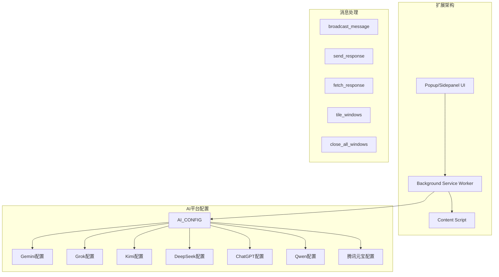
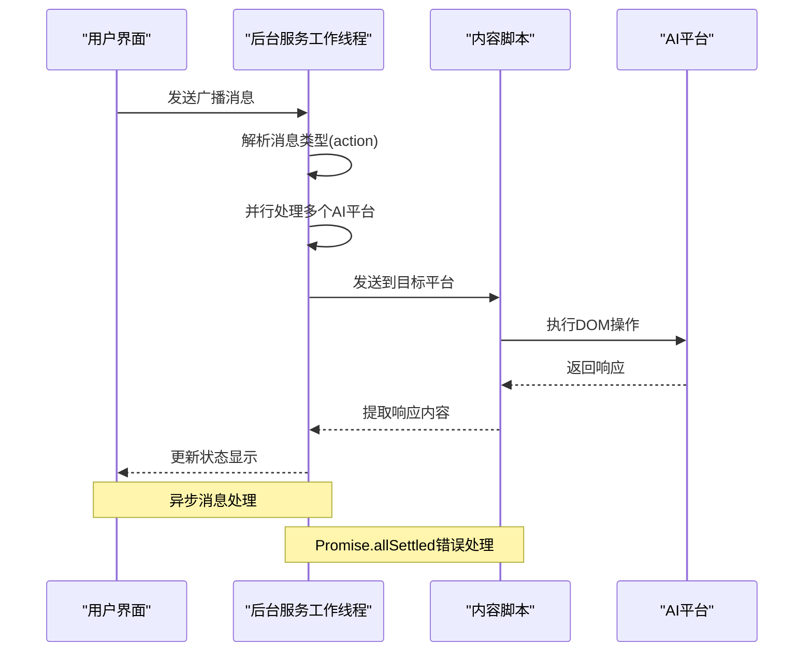
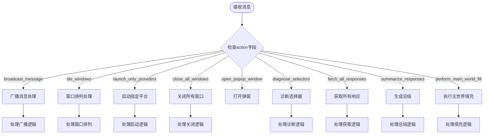
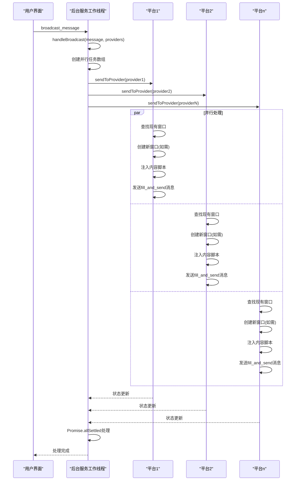
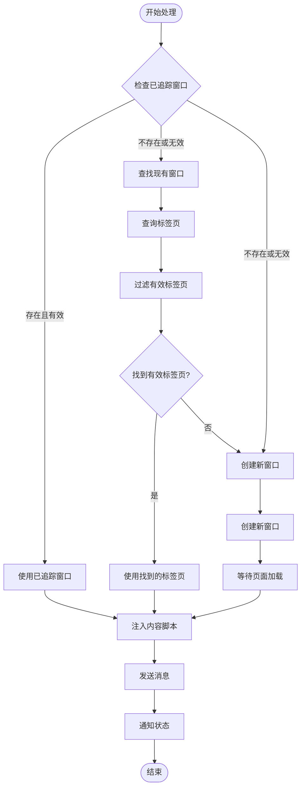
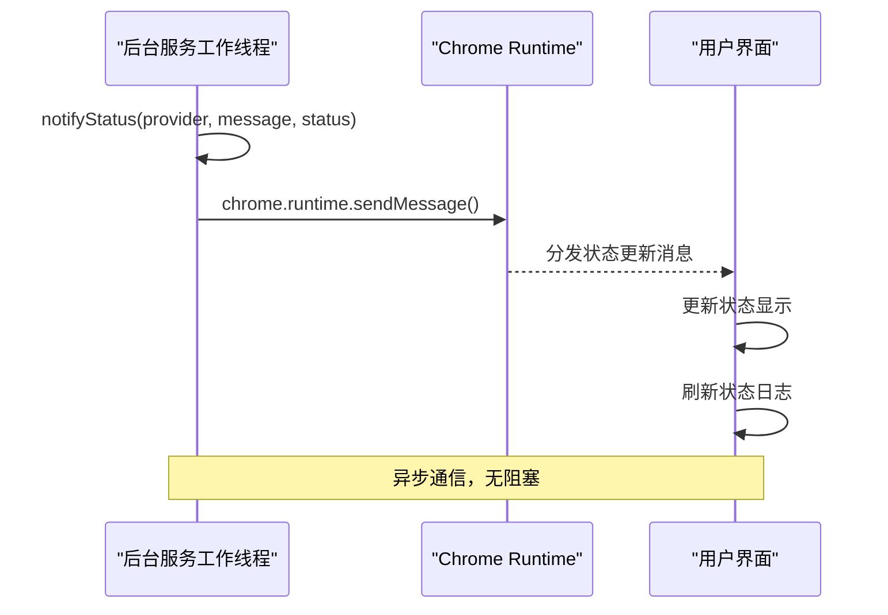
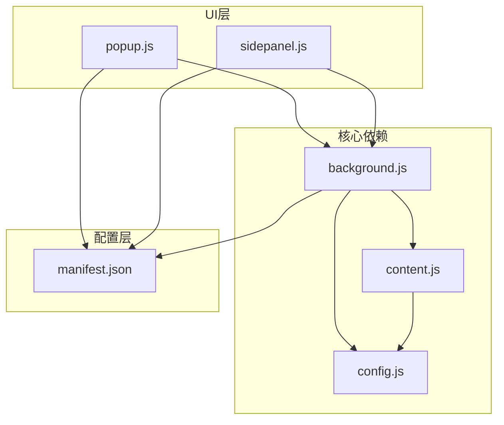

# 消息路由系统

<cite>
**本文档引用的文件**
- [src/background.js](file://src/background.js)
- [src/content/content.js](file://src/content/content.js)
- [src/config.js](file://src/config.js)
- [manifest.json](file://manifest.json)
- [src/popup/popup.js](file://src/popup/popup.js)
- [src/sidepanel/sidepanel.js](file://src/sidepanel/sidepanel.js)
</cite>

## 目录
1. [简介](#简介)
2. [项目结构](#项目结构)
3. [核心组件](#核心组件)
4. [架构概览](#架构概览)
5. [详细组件分析](#详细组件分析)
6. [依赖关系分析](#依赖关系分析)
7. [性能考虑](#性能考虑)
8. [故障排除指南](#故障排除指南)
9. [结论](#结论)

## 简介

AI Multiverse 消息路由系统是一个跨平台的AI聊天消息分发和处理框架。该系统通过Chrome扩展的消息传递机制，实现了对多个AI平台（Gemini、Grok、Kimi、DeepSeek、ChatGPT、Qwen、腾讯元宝）的统一消息路由和并行处理。

系统的核心功能包括：
- **消息类型识别**：通过action字段区分不同的消息类型
- **广播消息处理**：并行向多个AI平台发送相同消息
- **单平台路由**：针对特定AI平台的精确消息路由
- **状态通知**：实时反馈消息处理状态
- **异步响应处理**：支持Promise.allSettled的错误处理策略

## 项目结构

该项目采用模块化设计，主要包含以下核心模块：

**图表来源**
- [src/background.js](file://src/background.js#L1-L1028)
- [src/config.js](file://src/config.js#L1-L204)

**章节来源**
- [src/background.js](file://src/background.js#L1-L100)
- [src/config.js](file://src/config.js#L1-L50)
- [manifest.json](file://manifest.json#L1-L79)

## 核心组件

### 1. 后台服务工作线程 (Background Service Worker)

后台服务工作线程是整个消息路由系统的核心控制器，负责：
- 监听和处理来自UI的消息请求
- 管理AI平台的窗口和标签页生命周期
- 实现广播消息的并行处理
- 提供状态通知和错误处理

### 2. 内容脚本 (Content Script)

内容脚本运行在各个AI平台页面中，负责：
- 接收和处理来自后台的消息
- 执行平台特定的DOM操作
- 提取AI响应内容
- 实现文件上传功能

### 3. 配置管理系统

统一的AI平台配置管理，包含：
- 平台URL模式匹配规则
- DOM选择器配置
- 发送方法和填充策略
- 文件上传支持

### 4. 用户界面层

提供多种用户交互方式：
- Popup弹窗界面
- Sidepanel侧边面板
- 实时状态显示
- 历史记录管理

**章节来源**
- [src/background.js](file://src/background.js#L138-L197)
- [src/content/content.js](file://src/content/content.js#L199-L216)
- [src/config.js](file://src/config.js#L5-L199)

## 架构概览

消息路由系统采用分层架构设计，确保了良好的可维护性和扩展性：

**图表来源**
- [src/background.js](file://src/background.js#L138-L197)
- [src/content/content.js](file://src/content/content.js#L199-L216)

系统的关键特性包括：

1. **异步消息处理**：所有消息处理都是异步的，避免阻塞UI线程
2. **并行处理**：使用Promise.allSettled实现多平台并行消息发送
3. **错误隔离**：单个平台的错误不会影响其他平台的消息处理
4. **状态跟踪**：实时跟踪消息处理进度和状态

## 详细组件分析

### chrome.runtime.onMessage监听器实现机制

#### 消息类型识别

后台服务工作线程通过action字段识别不同类型的消息：

**图表来源**
- [src/background.js](file://src/background.js#L138-L197)

#### 异步响应处理策略

系统采用多种异步处理策略：

1. **Promise.allSettled**：用于并行处理多个AI平台的消息发送
2. **Promise.all**：用于需要所有操作都成功的场景
3. **Promise.race**：用于超时控制和竞态条件处理

**章节来源**
- [src/background.js](file://src/background.js#L138-L197)
- [src/content/content.js](file://src/content/content.js#L200-L216)

### handleBroadcast函数广播消息处理流程

#### 广播消息处理架构

**图表来源**
- [src/background.js](file://src/background.js#L718-L721)
- [src/background.js](file://src/background.js#L718-L786)

#### 并行消息发送和Promise.allSettled错误处理策略

handleBroadcast函数实现了高效的并行消息发送机制：

1. **并行任务创建**：为每个AI平台创建独立的任务
2. **Promise.allSettled使用**：确保即使部分平台失败，其他平台仍能继续处理
3. **错误隔离**：单个平台的错误不会影响整体处理流程
4. **状态聚合**：收集所有平台的处理状态

**章节来源**
- [src/background.js](file://src/background.js#L718-L721)
- [src/background.js](file://src/background.js#L788-L790)

### sendToProvider函数单平台消息路由逻辑

#### AI平台发现机制

sendToProvider函数实现了智能的AI平台发现和路由：

**图表来源**
- [src/background.js](file://src/background.js#L723-L786)

#### 内容脚本注入和消息传递机制

sendToProvider函数的完整处理流程：

1. **平台配置验证**：检查AI_CONFIG中是否存在对应平台配置
2. **窗口发现策略**：
   - 首先检查已追踪的窗口信息
   - 尝试通过URL模式匹配查找现有窗口
   - 如需创建新窗口并等待页面加载
3. **内容脚本管理**：
   - 确保目标页面已注入内容脚本
   - 处理脚本注入失败的情况
4. **消息发送和状态通知**：
   - 发送fill_and_send消息到目标平台
   - 更新UI状态显示

**章节来源**
- [src/background.js](file://src/background.js#L723-L786)
- [src/background.js](file://src/background.js#L656-L678)

### notifyStatus函数状态通知系统

#### 扩展间通信机制

notifyStatus函数实现了扩展组件间的实时通信：

**图表来源**
- [src/background.js](file://src/background.js#L788-L790)
- [src/popup/popup.js](file://src/popup/popup.js#L47-L59)

#### UI更新机制

状态通知系统提供了完整的UI更新机制：

1. **实时状态显示**：在弹窗界面显示每个AI平台的处理状态
2. **颜色编码**：成功状态显示绿色，错误状态显示红色
3. **自动滚动**：新状态自动滚动到底部
4. **持久化存储**：状态信息可以保存到本地存储

**章节来源**
- [src/background.js](file://src/background.js#L788-L790)
- [src/popup/popup.js](file://src/popup/popup.js#L47-L59)

## 依赖关系分析

### 组件耦合度分析

**图表来源**
- [src/background.js](file://src/background.js#L69-L74)
- [src/content/content.js](file://src/content/content.js#L1-L5)
- [src/config.js](file://src/config.js#L1-L5)

### 外部依赖和集成点

系统的主要外部依赖包括：

1. **Chrome扩展API**：
   - chrome.runtime：消息传递和扩展通信
   - chrome.tabs：标签页管理和内容脚本注入
   - chrome.windows：窗口管理
   - chrome.storage：本地数据存储

2. **第三方库**：
   - marked.js：Markdown渲染
   - highlight.js：语法高亮
   - DOMPurify：HTML安全清理

3. **AI平台API**：
   - 各AI平台的DOM结构和交互模式
   - 文件上传接口
   - 响应提取机制

**章节来源**
- [manifest.json](file://manifest.json#L12-L79)
- [src/background.js](file://src/background.js#L69-L74)

## 性能考虑

### 异步处理优化

系统采用了多种异步处理优化策略：

1. **并行处理**：使用Promise.allSettled实现多平台并行处理
2. **延迟加载**：内容脚本按需注入，避免不必要的资源消耗
3. **缓存机制**：窗口信息和配置信息的本地缓存
4. **超时控制**：为长时间操作设置合理的超时机制

### 内存管理

1. **对象URL清理**：及时释放文件上传时创建的Object URL
2. **事件监听器管理**：正确移除不需要的事件监听器
3. **定时器清理**：避免内存泄漏的定时器清理

### 网络优化

1. **批量请求**：合并相似的网络请求
2. **重试机制**：智能的重试策略避免过度请求
3. **连接复用**：合理利用浏览器的连接复用机制

## 故障排除指南

### 常见问题和解决方案

#### 消息处理失败

**问题**：广播消息发送失败
**原因**：
- 目标AI平台页面未加载完成
- 内容脚本注入失败
- 网络连接问题

**解决方案**：
1. 检查目标AI平台的URL模式配置
2. 验证内容脚本注入是否成功
3. 确认网络连接状态

#### 状态显示异常

**问题**：UI状态显示不正确
**原因**：
- 消息传递中断
- UI更新逻辑错误
- 语言切换问题

**解决方案**：
1. 检查chrome.runtime.sendMessage调用
2. 验证UI状态更新逻辑
3. 确认语言配置正确加载

#### 性能问题

**问题**：消息处理响应缓慢
**原因**：
- 并行任务过多
- 页面加载时间过长
- DOM操作频繁

**解决方案**：
1. 限制同时处理的AI平台数量
2. 优化页面加载等待逻辑
3. 减少不必要的DOM操作

**章节来源**
- [src/background.js](file://src/background.js#L788-L790)
- [src/content/content.js](file://src/content/content.js#L200-L216)

## 结论

AI Multiverse消息路由系统通过精心设计的架构和实现，成功实现了对多个AI平台的统一消息路由和高效处理。系统的主要优势包括：

1. **高可靠性**：通过Promise.allSettled实现错误隔离，确保单个平台失败不影响整体处理
2. **高性能**：并行处理机制显著提升了多平台消息发送的效率
3. **易扩展**：模块化的架构设计便于添加新的AI平台支持
4. **用户体验友好**：实时状态反馈和直观的UI设计

未来可以进一步优化的方向包括：
- 实现更智能的AI平台发现算法
- 增强错误恢复和重试机制
- 优化内存使用和性能监控
- 扩展更多AI平台的支持

该系统为构建复杂的跨平台消息路由应用提供了优秀的参考实现。