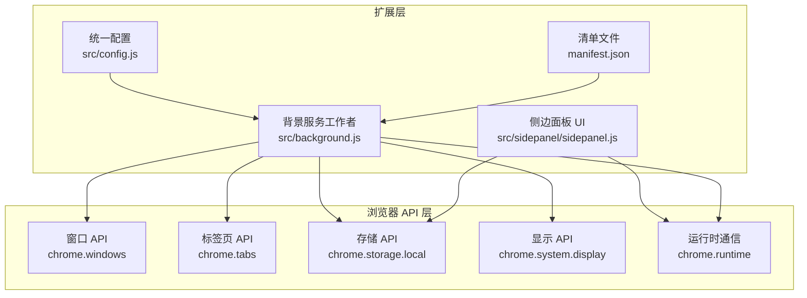
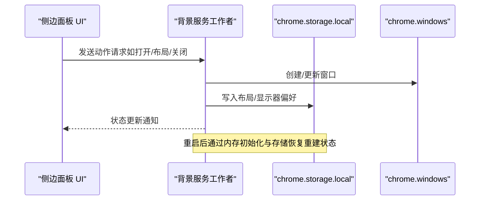
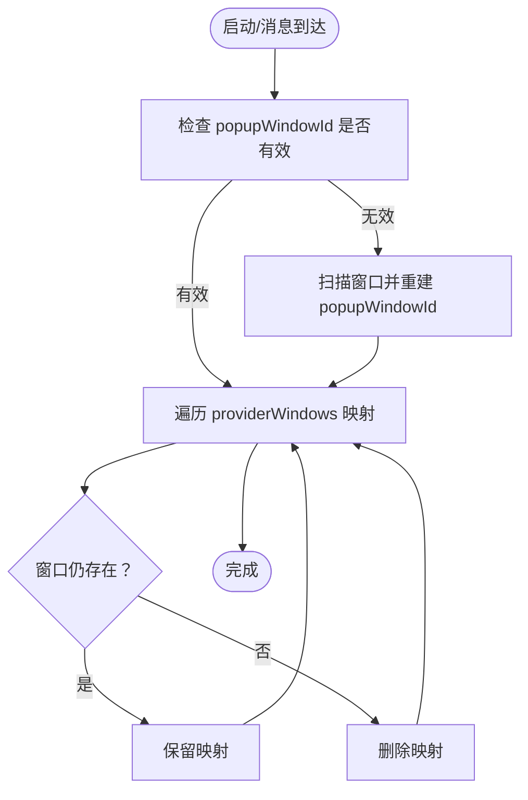
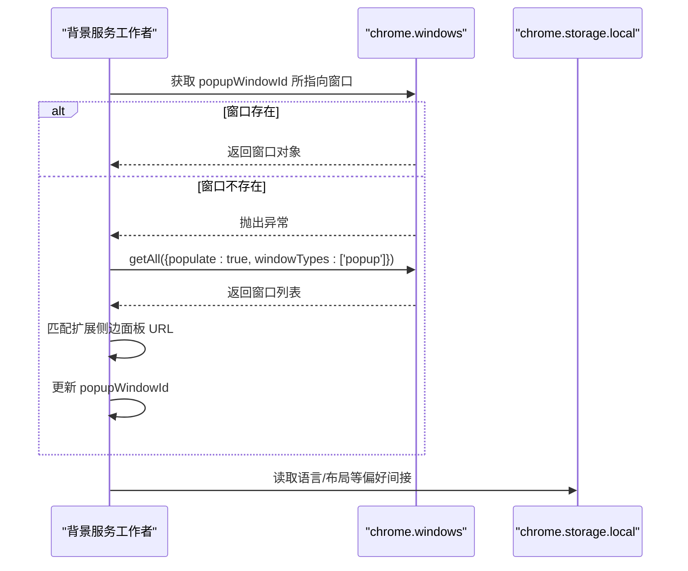
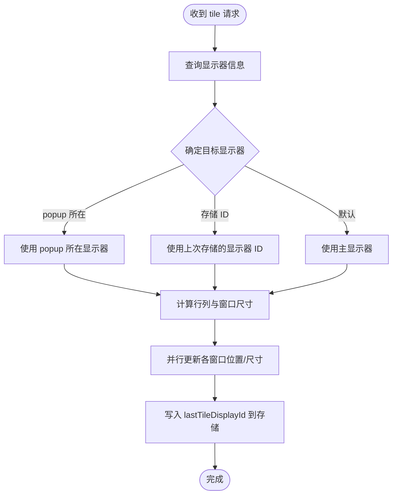
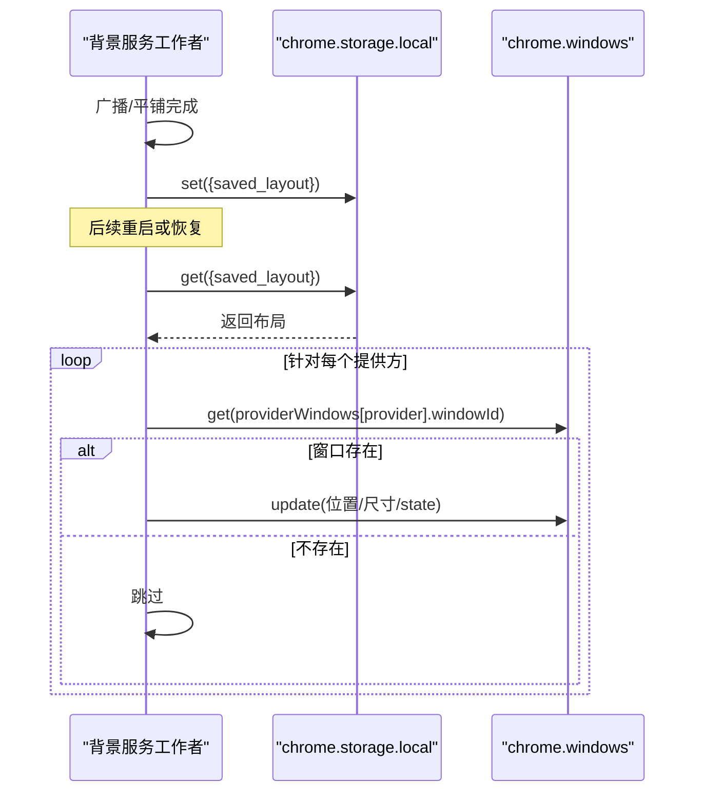
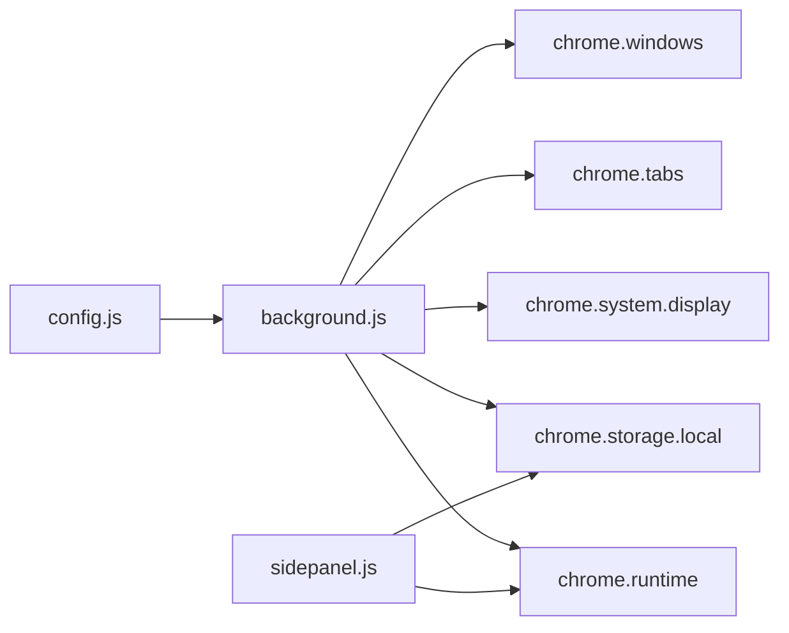

# 状态持久化

<cite>
**本文引用的文件**
- [src/background.js](file://src/background.js)
- [src/config.js](file://src/config.js)
- [src/sidepanel/sidepanel.js](file://src/sidepanel/sidepanel.js)
- [manifest.json](file://manifest.json)
</cite>

## 目录
1. [引言](#引言)
2. [项目结构](#项目结构)
3. [核心组件](#核心组件)
4. [架构总览](#架构总览)
5. [详细组件分析](#详细组件分析)
6. [依赖关系分析](#依赖关系分析)
7. [性能考量](#性能考量)
8. [故障排查指南](#故障排查指南)
9. [结论](#结论)
10. [附录](#附录)

## 引言
本文件系统性梳理扩展的状态持久化实现，重点覆盖以下方面：
- providerWindows 全局状态管理：窗口信息存储、状态恢复与内存清理策略
- popupWindowId 的持久化与服务工作者重启后的状态重建
- handleTileWindows 中显示器偏好设置的存储与多显示器布局记忆
- chrome.storage.local 的使用模式：数据序列化、版本兼容与迁移策略
- 状态管理架构图、数据存储方案与故障恢复机制

## 项目结构
该扩展采用 Manifest V3 架构，背景服务工作者负责窗口生命周期与状态持久化，侧边面板负责用户交互与本地偏好存储，配置模块集中管理各 AI 提供方的元数据。

图表来源
- [src/background.js](file://src/background.js#L1-L120)
- [src/sidepanel/sidepanel.js](file://src/sidepanel/sidepanel.js#L1860-L1890)
- [src/config.js](file://src/config.js#L1-L60)
- [manifest.json](file://manifest.json#L12-L18)

章节来源
- [src/background.js](file://src/background.js#L1-L120)
- [src/sidepanel/sidepanel.js](file://src/sidepanel/sidepanel.js#L1860-L1890)
- [src/config.js](file://src/config.js#L1-L60)
- [manifest.json](file://manifest.json#L12-L18)

## 核心组件
- providerWindows 全局映射：维护“提供方键”到“窗口/标签页”的映射，用于跨服务工作者重启的快速定位与恢复
- popupWindowId：扩展控制面板窗口 ID，作为“自身窗口”标识，避免对齐/布局等操作影响自身
- savedLayout：内存中的布局缓存，配合 chrome.storage.local 实现布局记忆
- chrome.storage.local：统一的本地存储入口，用于语言、主题、历史、布局、显示器偏好等

章节来源
- [src/background.js](file://src/background.js#L3-L8)
- [src/background.js](file://src/background.js#L915-L936)
- [src/sidepanel/sidepanel.js](file://src/sidepanel/sidepanel.js#L1866-L1885)

## 架构总览
状态持久化围绕“内存状态 + 浏览器存储”的双层设计展开：
- 内存层：providerWindows、popupWindowId、savedLayout，提供快速访问与低延迟操作
- 存储层：chrome.storage.local，提供跨重启的数据持久化
- 事件驱动：窗口创建/更新、布局变化、显示器偏好变更均触发写入存储

图表来源
- [src/background.js](file://src/background.js#L527-L643)
- [src/background.js](file://src/background.js#L915-L936)
- [src/background.js](file://src/background.js#L594-L608)

## 详细组件分析

### providerWindows 全局状态管理
- 作用：跟踪每个提供方对应的窗口与标签页，支持跨重启的快速发现与恢复
- 初始化与重建：
  - 启动时优先使用内存中的 ID 快速定位
  - 若无效则遍历所有窗口，按 URL 前缀匹配扩展侧边面板，确保 popupWindowId 正确
  - 对于 providerWindows，若映射的窗口不存在则删除该映射，避免悬挂引用
- 状态恢复流程：
  - 重启后先确保 popupWindowId，再对各提供方进行“URL 匹配 → 映射校验 → 重新创建”的三段式恢复
  - 恢复过程中严格排除扩展内部标签页与自身控制面板

图表来源
- [src/background.js](file://src/background.js#L10-L59)
- [src/background.js](file://src/background.js#L115-L131)
- [src/background.js](file://src/background.js#L209-L214)

章节来源
- [src/background.js](file://src/background.js#L10-L59)
- [src/background.js](file://src/background.js#L115-L131)
- [src/background.js](file://src/background.js#L209-L214)

### popupWindowId 的持久化与重启重建
- 持久化策略：
  - 通过内存变量保存最新 ID，并在每次创建/切换时更新
  - 当内存 ID 无效时，使用 chrome.windows.getAll + URL 前缀匹配的方式回溯查找
- 重启后的重建：
  - 优先尝试 chrome.windows.get(popupWindowId)，若失败则遍历所有 popup 类型窗口，匹配扩展侧边面板 URL
  - 成功后将 ID 写回内存，确保后续操作不误伤自身窗口

图表来源
- [src/background.js](file://src/background.js#L16-L33)
- [src/background.js](file://src/background.js#L24-L33)
- [src/background.js](file://src/background.js#L95-L97)

章节来源
- [src/background.js](file://src/background.js#L16-L33)
- [src/background.js](file://src/background.js#L24-L33)
- [src/background.js](file://src/background.js#L95-L97)

### handleTileWindows 的显示器偏好与布局记忆
- 显示器偏好决策链：
  - 优先：popup 控制面板所在显示器
  - 其次：上次选择的显示器 ID（存储于 chrome.storage.local）
  - 默认：主显示器
- 布局计算与应用：
  - 基于目标显示器的工作区域，按窗口数量计算行列数，均匀分割
  - 并行更新多个窗口位置与尺寸，避免串行阻塞
- 偏好持久化：
  - 将最终选择的显示器 ID 写入 chrome.storage.local，供下次使用

图表来源
- [src/background.js](file://src/background.js#L527-L643)
- [src/background.js](file://src/background.js#L594-L608)

章节来源
- [src/background.js](file://src/background.js#L527-L643)
- [src/background.js](file://src/background.js#L594-L608)

### chrome.storage.local 的使用模式
- 数据类型与键名：
  - 语言偏好：lang
  - 布局记忆：saved_layout（结构包含 left/top/width/height/state）
  - 显示器偏好：lastTileDisplayId
  - 侧边面板用户选择：selected_providers
  - 历史记录：chat_history
- 序列化与版本兼容：
  - 存储层天然支持 JSON 序列化，无需额外序列化
  - 版本兼容：读取时使用默认值兜底，新增字段不影响旧版读取
- 迁移策略建议：
  - 新增字段时保持向后兼容（读取时提供默认值）
  - 对于结构变更，提供一次性迁移函数，读取后转换并写回存储

章节来源
- [src/background.js](file://src/background.js#L95-L97)
- [src/background.js](file://src/background.js#L941-L947)
- [src/background.js](file://src/background.js#L594-L608)
- [src/sidepanel/sidepanel.js](file://src/sidepanel/sidepanel.js#L1321-L1335)
- [src/sidepanel/sidepanel.js](file://src/sidepanel/sidepanel.js#L1409-L1421)

### 布局记忆与恢复机制
- 保存时机：
  - 发送广播后延时保存（避免窗口尚未就绪）
  - 平铺完成后立即保存
  - 手动触发“重置布局”时应用存储的布局
- 恢复流程：
  - 启动后加载 saved_layout，逐个比对 providerWindows 中的窗口是否仍存在
  - 存在则更新其位置与尺寸；不存在则跳过

图表来源
- [src/background.js](file://src/background.js#L915-L936)
- [src/background.js](file://src/background.js#L941-L947)
- [src/background.js](file://src/background.js#L953-L974)
- [src/background.js](file://src/background.js#L984-L998)

章节来源
- [src/background.js](file://src/background.js#L915-L936)
- [src/background.js](file://src/background.js#L941-L947)
- [src/background.js](file://src/background.js#L953-L974)
- [src/background.js](file://src/background.js#L984-L998)

### 侧边面板偏好与历史记录
- 语言与主题：
  - 读取/写入 lang，切换后通知背景脚本更新翻译上下文
- 历史记录：
  - 限制长度（超过阈值丢弃最早项），写入时包含时间戳与文件摘要
- 选择的提供方：
  - 记录用户勾选的提供方集合，用于后续广播/平铺的目标集

章节来源
- [src/sidepanel/sidepanel.js](file://src/sidepanel/sidepanel.js#L1866-L1885)
- [src/sidepanel/sidepanel.js](file://src/sidepanel/sidepanel.js#L1409-L1421)
- [src/sidepanel/sidepanel.js](file://src/sidepanel/sidepanel.js#L1321-L1335)

## 依赖关系分析
- 背景服务工作者依赖：
  - chrome.windows：窗口创建、更新、枚举
  - chrome.tabs：标签页注入、消息传递
  - chrome.system.display：显示器信息与工作区域
  - chrome.storage.local：持久化存储
  - chrome.runtime：跨页面通信
- 侧边面板依赖：
  - chrome.storage.local：用户偏好与历史
  - chrome.runtime：向背景脚本发送动作请求

图表来源
- [src/background.js](file://src/background.js#L1-L120)
- [src/sidepanel/sidepanel.js](file://src/sidepanel/sidepanel.js#L1860-L1890)
- [src/config.js](file://src/config.js#L1-L60)
- [manifest.json](file://manifest.json#L12-L18)

章节来源
- [src/background.js](file://src/background.js#L1-L120)
- [src/sidepanel/sidepanel.js](file://src/sidepanel/sidepanel.js#L1860-L1890)
- [src/config.js](file://src/config.js#L1-L60)
- [manifest.json](file://manifest.json#L12-L18)

## 性能考量
- 并行更新：平铺阶段对多个窗口并行更新，显著降低总耗时
- 延迟保存：广播后延迟保存布局，确保窗口状态稳定后再持久化
- 超时与清理：标签页加载等待设置超时并清理监听器，避免内存泄漏
- 读取兜底：存储读取使用默认值，避免因字段缺失导致异常

章节来源
- [src/background.js](file://src/background.js#L624-L639)
- [src/background.js](file://src/background.js#L988-L990)
- [src/background.js](file://src/background.js#L680-L716)

## 故障排查指南
- 重启后窗口未恢复：
  - 检查 popupWindowId 是否被正确重建
  - 核对 providerWindows 映射是否被清理（对应窗口不存在时会删除映射）
- 平铺后布局未持久：
  - 确认保存时机（广播后延时与平铺后保存）
  - 检查存储写入是否成功
- 显示器偏好未生效：
  - 确认 lastTileDisplayId 是否被正确写入
  - 检查显示器枚举与坐标归属逻辑

章节来源
- [src/background.js](file://src/background.js#L16-L33)
- [src/background.js](file://src/background.js#L988-L998)
- [src/background.js](file://src/background.js#L594-L608)

## 结论
该扩展通过“内存快照 + 存储持久化”的双层设计，在服务工作者重启、窗口状态变化与显示器偏好调整等场景下实现了稳健的状态管理。providerWindows 与 popupWindowId 的协同确保了跨重启的可靠恢复；handleTileWindows 的三层显示器偏好策略与布局记忆机制满足了多显示器场景下的用户体验；chrome.storage.local 的统一使用模式为未来版本的兼容与迁移提供了良好基础。

## 附录
- 关键实现路径参考：
  - [togglePopup 与 popupWindowId 重建](file://src/background.js#L10-L59)
  - [ensurePopupWindowId](file://src/background.js#L115-L131)
  - [handleTileWindows 显示器与布局](file://src/background.js#L527-L643)
  - [saveLayout/loadLayout/applySavedLayout](file://src/background.js#L915-L974)
  - [侧边面板语言与历史](file://src/sidepanel/sidepanel.js#L1866-L1885)
  - [侧边面板历史写入](file://src/sidepanel/sidepanel.js#L1409-L1421)