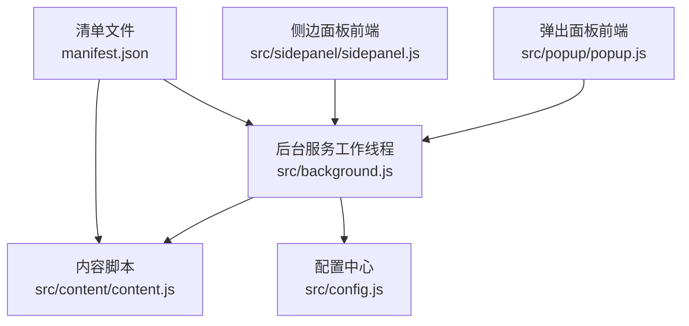
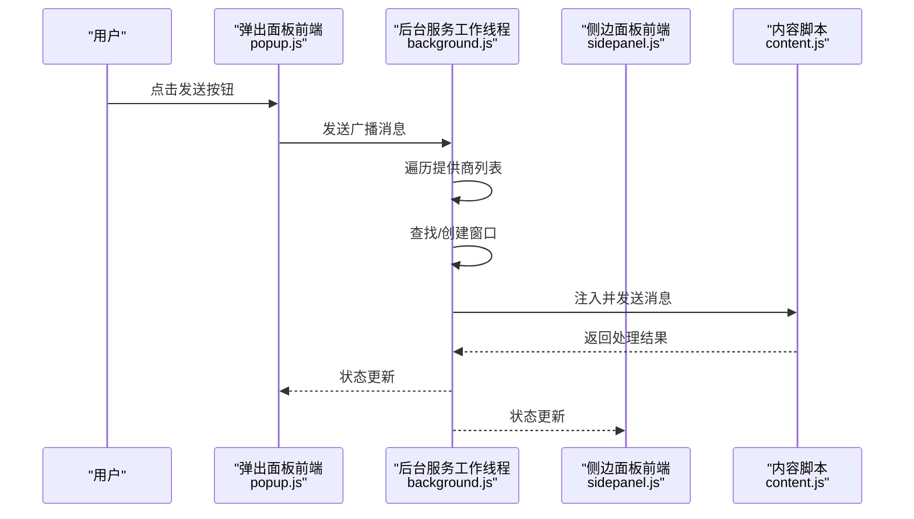
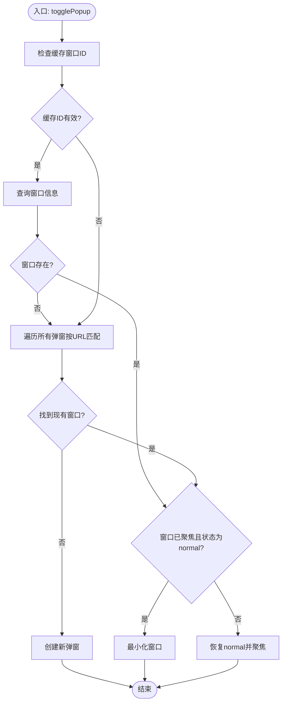
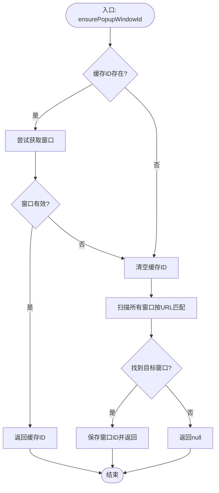
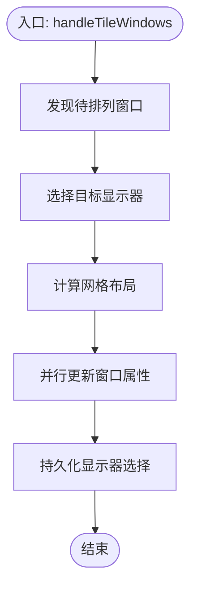
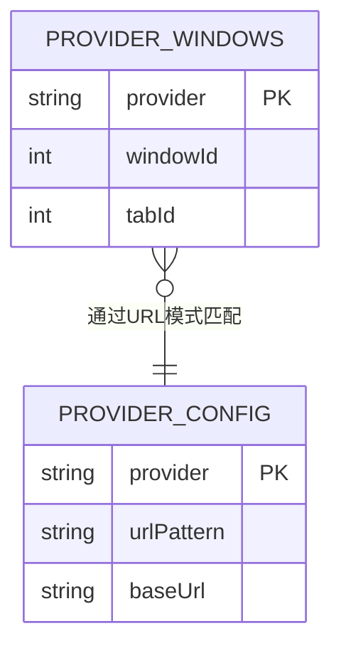
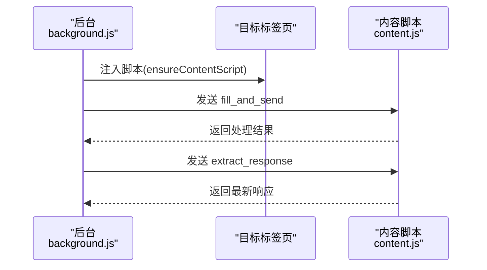
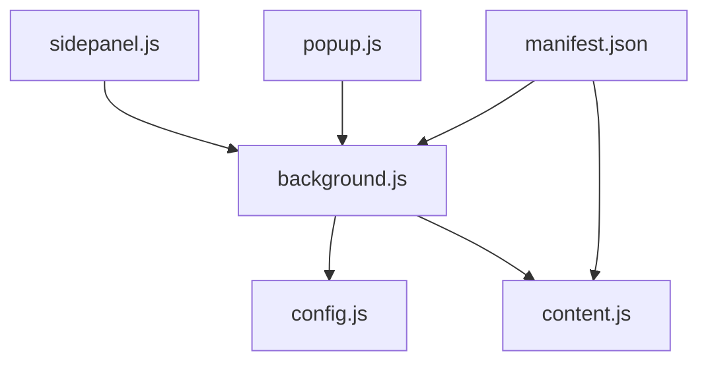

# 窗口管理机制

<cite>
**本文引用的文件列表**
- [src/background.js](file://src/background.js)
- [src/popup/popup.js](file://src/popup/popup.js)
- [src/sidepanel/sidepanel.js](file://src/sidepanel/sidepanel.js)
- [src/content/content.js](file://src/content/content.js)
- [src/config.js](file://src/config.js)
- [manifest.json](file://manifest.json)
</cite>

## 目录
1. [简介](#简介)
2. [项目结构](#项目结构)
3. [核心组件](#核心组件)
4. [架构总览](#架构总览)
5. [详细组件分析](#详细组件分析)
6. [依赖关系分析](#依赖关系分析)
7. [性能考量](#性能考量)
8. [故障排除指南](#故障排除指南)
9. [结论](#结论)

## 简介
本文件聚焦于浏览器扩展中的窗口管理机制，围绕以下关键能力进行深入技术解析：
- togglePopup 函数的弹窗生命周期管理：窗口查找、创建、最小化与聚焦控制。
- handleTileWindows 函数的多窗口布局算法：显示器检测、窗口排列策略与并行布局优化。
- providerWindows 全局状态管理：AI 平台窗口跟踪机制与窗口 ID 映射关系。
- ensurePopupWindowId 函数的窗口验证流程：服务工作者重启后的窗口恢复机制。
- 提供具体代码路径、状态转换图与故障排除建议，帮助开发者快速定位与解决问题。

## 项目结构
该扩展采用 Manifest V3 架构，包含后台服务工作线程、弹出面板、侧边面板、内容脚本与配置模块。关键文件职责如下：
- src/background.js：后台服务工作线程，负责窗口生命周期、消息分发、布局持久化与全局状态维护。
- src/popup/popup.js：弹出面板前端交互，负责广播消息与状态展示。
- src/sidepanel/sidepanel.js：侧边面板前端交互，负责响应详情导航、布局与 UI 逻辑。
- src/content/content.js：内容脚本，负责在目标站点内填充输入、发送消息与提取响应。
- src/config.js：统一配置中心，定义各 AI 平台的选择器、基地址与交互策略。
- manifest.json：声明权限、命令、后台脚本与内容脚本匹配规则。

图表来源
- [src/background.js](file://src/background.js#L1-L120)
- [src/popup/popup.js](file://src/popup/popup.js#L1-L61)
- [src/sidepanel/sidepanel.js](file://src/sidepanel/sidepanel.js#L1-L120)
- [src/content/content.js](file://src/content/content.js#L1-L60)
- [src/config.js](file://src/config.js#L1-L40)
- [manifest.json](file://manifest.json#L1-L40)

章节来源
- [src/background.js](file://src/background.js#L1-L120)
- [manifest.json](file://manifest.json#L1-L40)

## 核心组件
- 后台服务工作线程：负责窗口生命周期、消息路由、布局计算与持久化。
- 弹出面板前端：发起广播消息、接收状态反馈。
- 侧边面板前端：响应详情导航、布局与 UI 逻辑。
- 内容脚本：在目标站点内执行填充与发送操作。
- 配置中心：统一管理各 AI 平台的选择器、基地址与交互策略。

章节来源
- [src/background.js](file://src/background.js#L1-L120)
- [src/popup/popup.js](file://src/popup/popup.js#L1-L61)
- [src/sidepanel/sidepanel.js](file://src/sidepanel/sidepanel.js#L1-L120)
- [src/content/content.js](file://src/content/content.js#L1-L60)
- [src/config.js](file://src/config.js#L1-L40)

## 架构总览
扩展通过后台服务工作线程协调弹出面板与侧边面板的交互，同时管理多窗口布局与状态持久化。内容脚本在目标站点内执行填充与发送操作，后台通过消息通道与内容脚本通信。

图表来源
- [src/popup/popup.js](file://src/popup/popup.js#L16-L45)
- [src/background.js](file://src/background.js#L139-L197)
- [src/content/content.js](file://src/content/content.js#L199-L216)

章节来源
- [src/popup/popup.js](file://src/popup/popup.js#L16-L45)
- [src/background.js](file://src/background.js#L139-L197)
- [src/content/content.js](file://src/content/content.js#L199-L216)

## 详细组件分析

### togglePopup 弹窗生命周期管理
togglePopup 实现了弹窗的查找、最小化与聚焦控制，具备服务工作者重启后的恢复能力。

- 快速路径：优先使用已缓存的窗口 ID 查询窗口是否存在。
- 回退路径：遍历所有弹窗，按 URL 前缀匹配目标页面，恢复窗口 ID。
- 状态切换：
  - 若窗口已聚焦且状态为 normal，则最小化。
  - 否则设置为 normal 并聚焦，必要时请求系统关注。
- 未找到时创建新弹窗，尺寸与焦点策略由配置决定。

图表来源
- [src/background.js](file://src/background.js#L10-L59)

章节来源
- [src/background.js](file://src/background.js#L10-L59)

### ensurePopupWindowId 窗口验证与恢复
ensurePopupWindowId 在服务工作者重启后恢复弹窗 ID，确保后续消息处理能正确定位弹窗。

- 若缓存 ID 存在且有效，直接返回。
- 否则遍历所有窗口，按 URL 前缀匹配目标页面，更新缓存 ID。
- 未找到时返回空值，供调用方降级处理。

图表来源
- [src/background.js](file://src/background.js#L115-L131)

章节来源
- [src/background.js](file://src/background.js#L115-L131)

### handleTileWindows 多窗口布局算法
handleTileWindows 实现跨显示器的多窗口并排布局，支持显示器检测、布局策略与并行优化。

- 窗口发现阶段：
  - 优先使用 providerWindows 中已跟踪的窗口 ID。
  - 若未找到，按配置的 URL 模式匹配，过滤扩展自身标签页与内部页面。
- 显示器选择策略：
  - 优先使用弹窗所在显示器。
  - 其次使用本地存储的上次选择。
  - 最后回退到主显示器。
- 布局策略：
  - 根据窗口数量选择网格列数与行数（1/2/4/6+）。
  - 计算每格宽高，应用到每个窗口。
- 并行优化：
  - 使用 Promise.all 并行更新窗口位置与尺寸，提升性能。
  - 更新完成后不强制聚焦首个窗口，避免干扰用户选择。

图表来源
- [src/background.js](file://src/background.js#L528-L643)

章节来源
- [src/background.js](file://src/background.js#L528-L643)

### providerWindows 全局状态管理与窗口 ID 映射
providerWindows 是后台服务工作线程中的全局状态，用于跟踪各 AI 平台对应的窗口与标签页 ID。

- 结构：键为提供商标识（如 gemini、grok 等），值为 { windowId, tabId }。
- 用途：
  - 快速定位已有窗口，避免重复创建。
  - 在窗口被关闭或移动后，通过 try/catch 清理无效映射。
  - 与布局持久化结合，保存/恢复窗口位置与尺寸。
- 与配置中心的关系：PROVIDER_CONFIG 定义 URL 模式与基地址，providerWindows 通过 URL 匹配建立映射。

图表来源
- [src/background.js](file://src/background.js#L6-L7)
- [src/background.js](file://src/background.js#L134-L136)
- [src/config.js](file://src/config.js#L5-L20)

章节来源
- [src/background.js](file://src/background.js#L6-L7)
- [src/background.js](file://src/background.js#L134-L136)
- [src/config.js](file://src/config.js#L5-L20)

### 与内容脚本的交互与消息流
后台通过消息通道与内容脚本通信，实现填充输入、发送消息与提取响应等操作。

- 注入与校验：ensureContentScript 检测是否已注入，若未注入则执行脚本注入与延迟等待。
- 消息处理：content.js 监听 fill_and_send、extract_response 等动作，执行对应逻辑。
- 后台调用：background.js 的 sendToProvider、fetchAllResponses 等函数通过 chrome.tabs.sendMessage 与内容脚本交互。

图表来源
- [src/background.js](file://src/background.js#L657-L678)
- [src/content/content.js](file://src/content/content.js#L199-L216)

章节来源
- [src/background.js](file://src/background.js#L657-L678)
- [src/content/content.js](file://src/content/content.js#L199-L216)

## 依赖关系分析
- 权限与主机权限：manifest.json 声明 tabs、scripting、storage、system.display 权限与各 AI 平台的 host_permissions。
- 配置依赖：PROVIDER_CONFIG 与 AI_CONFIG 共同决定 URL 模式、基地址与选择器。
- 事件依赖：chrome.action.onClicked、chrome.commands.onCommand、chrome.runtime.onMessage 等驱动交互。

图表来源
- [manifest.json](file://manifest.json#L12-L32)
- [src/background.js](file://src/background.js#L69-L74)
- [src/config.js](file://src/config.js#L1-L40)

章节来源
- [manifest.json](file://manifest.json#L12-L32)
- [src/background.js](file://src/background.js#L69-L74)
- [src/config.js](file://src/config.js#L1-L40)

## 性能考量
- 并行查询与更新：handleTileWindows 使用 Promise.all 并行更新窗口属性，显著降低布局耗时。
- 延迟注入与等待：ensureContentScript 在注入后等待片刻，确保页面完全加载后再执行脚本，避免早期交互失败。
- 布局持久化：saveLayout/applySavedLayout 将窗口位置与尺寸持久化，减少重复布局计算。
- 选择器诊断：diagnoseSelectors 可辅助调试选择器有效性，避免因选择器失效导致的性能浪费。

章节来源
- [src/background.js](file://src/background.js#L624-L639)
- [src/background.js](file://src/background.js#L657-L678)
- [src/background.js](file://src/background.js#L915-L982)
- [src/content/content.js](file://src/content/content.js#L127-L197)

## 故障排除指南
- 弹窗无法聚焦或最小化：
  - 检查 togglePopup 的聚焦判断逻辑与窗口状态。
  - 使用 ensurePopupWindowId 确认弹窗 ID 是否有效。
- 服务工作者重启后弹窗丢失：
  - 确保调用 ensurePopupWindowId 恢复 ID。
  - 检查 URL 前缀匹配是否正确。
- 多窗口布局异常：
  - 检查显示器信息获取与目标显示器选择策略。
  - 确认 providerWindows 中的窗口 ID 是否仍有效。
- 内容脚本注入失败：
  - 使用 ensureContentScript 检测并重新注入。
  - 检查 manifest.json 的 permissions 与 content_scripts 配置。
- 选择器失效：
  - 使用 diagnoseSelectors 获取最佳选择器。
  - 根据站点变化更新 AI_CONFIG 中的选择器配置。

章节来源
- [src/background.js](file://src/background.js#L115-L131)
- [src/background.js](file://src/background.js#L528-L643)
- [src/background.js](file://src/background.js#L657-L678)
- [src/content/content.js](file://src/content/content.js#L127-L197)
- [src/config.js](file://src/config.js#L5-L20)

## 结论
该扩展通过后台服务工作线程实现了可靠的窗口生命周期管理与多窗口布局能力，配合全局状态 providerWindows 与配置中心，形成稳定的跨平台交互体系。togglePopup、ensurePopupWindowId 与 handleTileWindows 分别覆盖了弹窗控制、恢复与布局三大核心场景，整体设计兼顾健壮性与性能。建议在站点选择器频繁变更时，定期使用诊断工具更新配置，以维持最佳兼容性与稳定性。