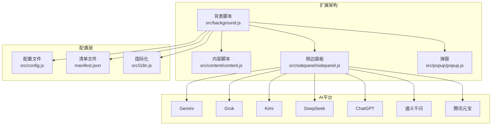
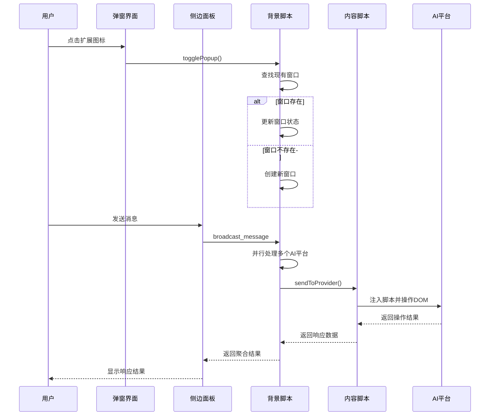
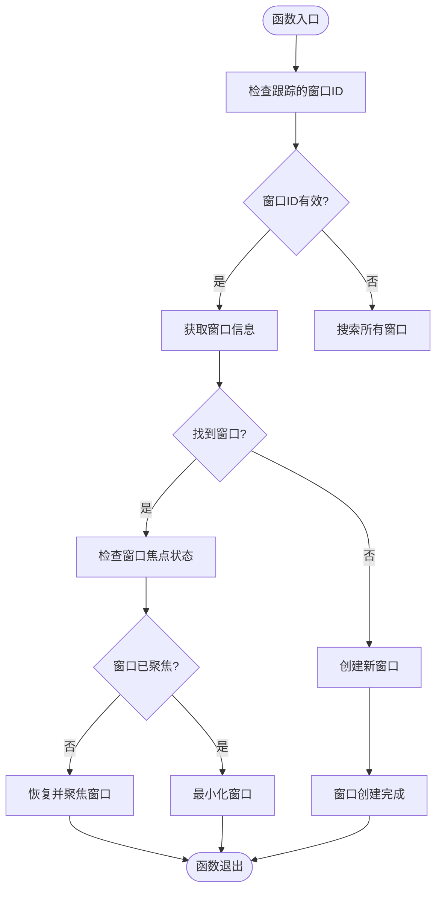
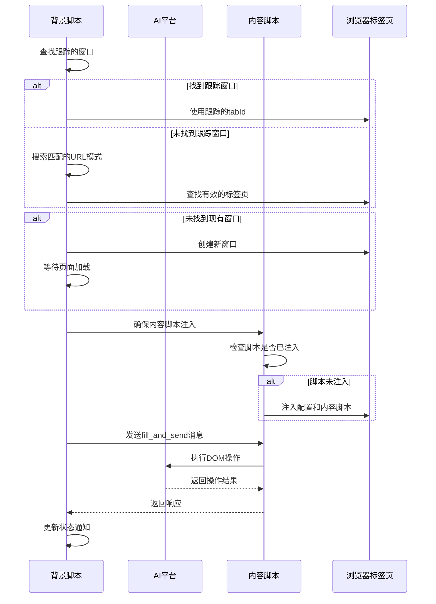
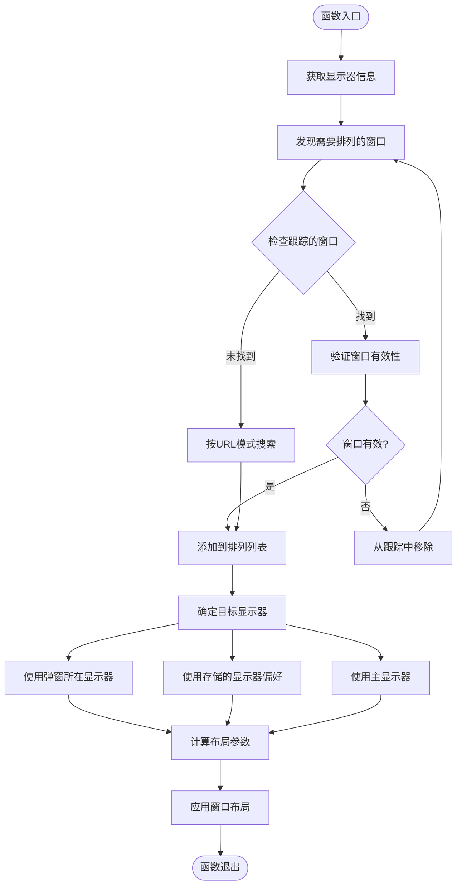
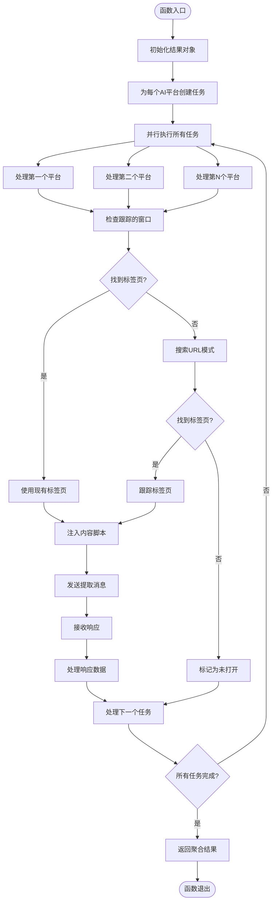
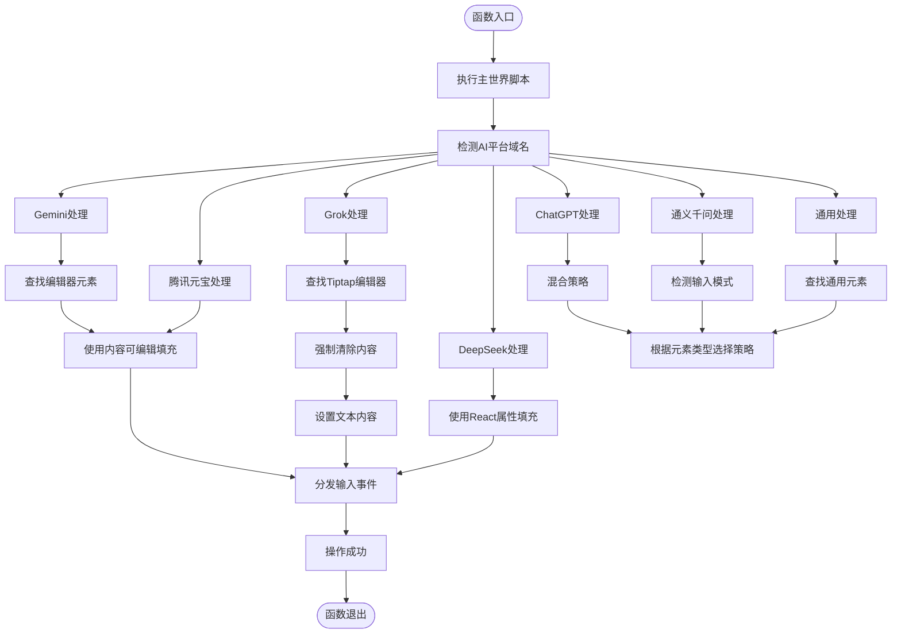
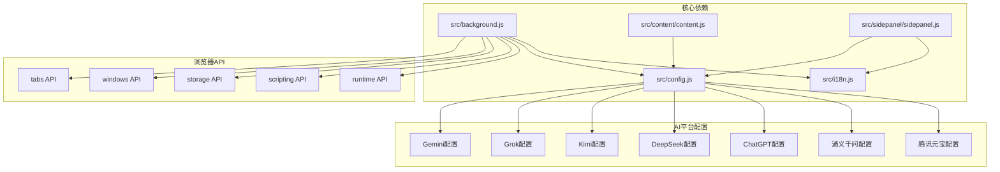

# 背景脚本系统

<cite>
**本文档引用的文件**
- [src/background.js](file://src/background.js)
- [src/content/content.js](file://src/content/content.js)
- [src/sidepanel/sidepanel.js](file://src/sidepanel/sidepanel.js)
- [src/popup/popup.js](file://src/popup/popup.js)
- [src/config.js](file://src/config.js)
- [manifest.json](file://manifest.json)
- [src/i18n.js](file://src/i18n.js)
</cite>

## 目录
1. [简介](#简介)
2. [项目结构](#项目结构)
3. [核心组件](#核心组件)
4. [架构概览](#架构概览)
5. [详细组件分析](#详细组件分析)
6. [依赖关系分析](#依赖关系分析)
7. [性能考虑](#性能考虑)
8. [故障排除指南](#故障排除指南)
9. [结论](#结论)

## 简介

AI多重宇宙对话扩展的背景脚本系统是一个复杂的多窗口管理、消息路由和状态持久化解决方案。该系统通过服务工作线程管理扩展弹窗生命周期，协调多个AI平台的并发通信，并提供智能的窗口布局管理功能。

系统的核心特性包括：
- **多窗口生命周期管理**：智能跟踪和控制扩展弹窗及AI平台窗口
- **消息路由系统**：统一的消息分发和处理机制
- **状态持久化**：窗口布局和用户偏好的持久存储
- **并行响应收集**：同时从多个AI平台获取回复
- **智能脚本注入**：针对不同AI平台的DOM操作策略

## 项目结构

**图表来源**
- [src/background.js](file://src/background.js#L1-L1028)
- [src/content/content.js](file://src/content/content.js#L1-L941)
- [src/sidepanel/sidepanel.js](file://src/sidepanel/sidepanel.js#L1-L2813)

**章节来源**
- [src/background.js](file://src/background.js#L1-L1028)
- [manifest.json](file://manifest.json#L1-L79)

## 核心组件

### 背景脚本服务工作线程

背景脚本作为系统的核心协调者，负责：

1. **窗口管理**：跟踪和控制所有相关窗口的状态
2. **消息路由**：处理来自不同组件的消息请求
3. **状态持久化**：管理窗口布局和用户偏好
4. **AI平台协调**：统一管理多个AI平台的交互

### 内容脚本注入系统

内容脚本负责与AI平台页面进行直接交互：

1. **DOM操作**：针对不同平台的特定DOM结构进行操作
2. **消息处理**：接收和处理来自背景脚本的指令
3. **响应提取**：从AI平台页面提取回复内容
4. **文件上传**：支持多平台的文件上传功能

### 侧边面板界面系统

侧边面板提供用户交互界面：

1. **多语言支持**：完整的中英文界面支持
2. **响应展示**：并行显示多个AI平台的回复
3. **智能总结**：提供AI平台的综合总结功能
4. **历史记录**：管理对话历史和响应记录

**章节来源**
- [src/background.js](file://src/background.js#L1-L1028)
- [src/content/content.js](file://src/content/content.js#L1-L941)
- [src/sidepanel/sidepanel.js](file://src/sidepanel/sidepanel.js#L1-L2813)

## 架构概览

**图表来源**
- [src/background.js](file://src/background.js#L10-L59)
- [src/sidepanel/sidepanel.js](file://src/sidepanel/sidepanel.js#L1343-L1407)
- [src/content/content.js](file://src/content/content.js#L200-L216)

## 详细组件分析

### togglePopup 函数实现原理

togglePopup函数实现了扩展弹窗的完整生命周期管理：

**图表来源**
- [src/background.js](file://src/background.js#L10-L59)

实现特点：
- **双重查找机制**：先检查跟踪的窗口ID，再搜索所有窗口
- **状态智能判断**：根据窗口焦点状态决定最小化或恢复
- **快速路径优化**：优先使用跟踪的窗口ID进行查找
- **健壮性保障**：在服务工作线程重启后仍能正确恢复

**章节来源**
- [src/background.js](file://src/background.js#L10-L59)

### sendToProvider 函数消息发送流程

sendToProvider函数实现了AI平台发现和消息发送的完整流程：

**图表来源**
- [src/background.js](file://src/background.js#L723-L786)
- [src/background.js](file://src/background.js#L657-L678)

关键特性：
- **智能平台发现**：通过URL模式自动发现AI平台
- **内容脚本注入**：确保内容脚本在目标页面正确加载
- **并发处理**：支持多个AI平台的并行消息发送
- **错误处理**：完善的异常捕获和错误通知机制

**章节来源**
- [src/background.js](file://src/background.js#L723-L786)
- [src/background.js](file://src/background.js#L657-L678)

### handleTileWindows 函数多窗口布局算法

handleTileWindows函数实现了智能的多窗口布局管理：

**图表来源**
- [src/background.js](file://src/background.js#L528-L643)

布局算法特点：
- **多优先级显示器选择**：弹窗位置 → 用户偏好 → 主显示器
- **动态布局计算**：根据窗口数量自动计算最优网格布局
- **并行窗口更新**：使用Promise.all并行更新多个窗口位置
- **智能显示器检测**：自动检测窗口所在的显示器

**章节来源**
- [src/background.js](file://src/background.js#L528-L643)

### fetchAllResponses 函数响应收集机制

fetchAllResponses函数实现了高效的并行响应收集：

**图表来源**
- [src/background.js](file://src/background.js#L200-L268)

并行处理优势：
- **Promise.allSettled**：确保即使部分任务失败也不影响整体执行
- **智能标签页发现**：通过多种方式定位AI平台标签页
- **内容脚本管理**：自动处理内容脚本的注入和更新
- **错误隔离**：每个平台的错误独立处理，不影响其他平台

**章节来源**
- [src/background.js](file://src/background.js#L200-L268)

### executeMainWorldFill 函数主世界脚本注入技术

executeMainWorldFill函数实现了高级的DOM操作注入：

**图表来源**
- [src/background.js](file://src/background.js#L379-L526)

技术特点：
- **平台特定策略**：针对不同AI平台采用专门的DOM操作方法
- **事件驱动**：正确分发各种DOM事件确保平台识别
- **兼容性处理**：处理React、ProseMirror等复杂编辑器框架
- **错误恢复**：提供多种回退策略确保操作成功率

**章节来源**
- [src/background.js](file://src/background.js#L379-L526)

## 依赖关系分析

**图表来源**
- [src/background.js](file://src/background.js#L69-L75)
- [src/config.js](file://src/config.js#L1-L204)
- [manifest.json](file://manifest.json#L12-L18)

**章节来源**
- [src/background.js](file://src/background.js#L69-L75)
- [src/config.js](file://src/config.js#L1-L204)
- [manifest.json](file://manifest.json#L12-L18)

## 性能考虑

### 并行处理优化

系统广泛采用并行处理策略来提升性能：

1. **Promise.allSettled**：确保部分任务失败不影响整体执行
2. **并行窗口更新**：多显示器布局时并行更新多个窗口位置
3. **智能缓存**：跟踪已知的窗口ID和标签页信息

### 内存管理

1. **窗口ID跟踪**：避免频繁查询整个窗口列表
2. **内容脚本注入**：仅在必要时注入，减少内存占用
3. **定时清理**：及时释放文件对象URL引用

### 网络优化

1. **延迟加载**：内容脚本在页面空闲时加载
2. **智能重试**：对临时网络错误进行指数退避重试
3. **超时控制**：防止长时间阻塞操作

## 故障排除指南

### 常见问题诊断

#### 窗口管理问题
- **症状**：弹窗无法正确显示或状态异常
- **原因**：窗口ID跟踪失效或浏览器API调用失败
- **解决**：检查chrome.windows API权限和窗口状态

#### 内容脚本注入失败
- **症状**：AI平台无法接收消息或操作失败
- **原因**：页面加载时机不当或脚本注入被阻止
- **解决**：增加延迟等待页面完全加载，检查CSP策略

#### 多窗口布局异常
- **症状**：窗口排列不符合预期或位置错误
- **原因**：显示器检测失败或多显示器环境下的坐标计算错误
- **解决**：检查chrome.system.display API权限，验证显示器配置

#### 响应收集超时
- **症状**：fetchAllResponses长时间无响应
- **原因**：某些AI平台页面加载缓慢或内容脚本未正确注入
- **解决**：增加超时时间，检查网络连接，验证平台URL模式

### 调试工具和技巧

1. **开发者工具**：使用Chrome开发者工具检查后台脚本和内容脚本
2. **日志输出**：利用console.log输出详细的调试信息
3. **状态监控**：通过chrome.storage观察状态变化
4. **API测试**：使用chrome.* API进行单独的功能测试

**章节来源**
- [src/background.js](file://src/background.js#L845-L908)
- [src/content/content.js](file://src/content/content.js#L616-L672)

## 结论

AI多重宇宙对话扩展的背景脚本系统展现了现代浏览器扩展开发的最佳实践。通过精心设计的架构，系统实现了：

1. **高度模块化的设计**：清晰分离背景脚本、内容脚本和界面组件
2. **强大的并发处理能力**：支持多AI平台的并行通信和操作
3. **智能的窗口管理**：提供完整的窗口生命周期管理和布局优化
4. **完善的错误处理**：确保系统在各种异常情况下的稳定性
5. **优秀的用户体验**：提供流畅的多平台交互和响应展示

该系统为类似场景的浏览器扩展开发提供了宝贵的参考，特别是在多窗口管理、消息路由和状态持久化方面的实现方案具有很高的借鉴价值。