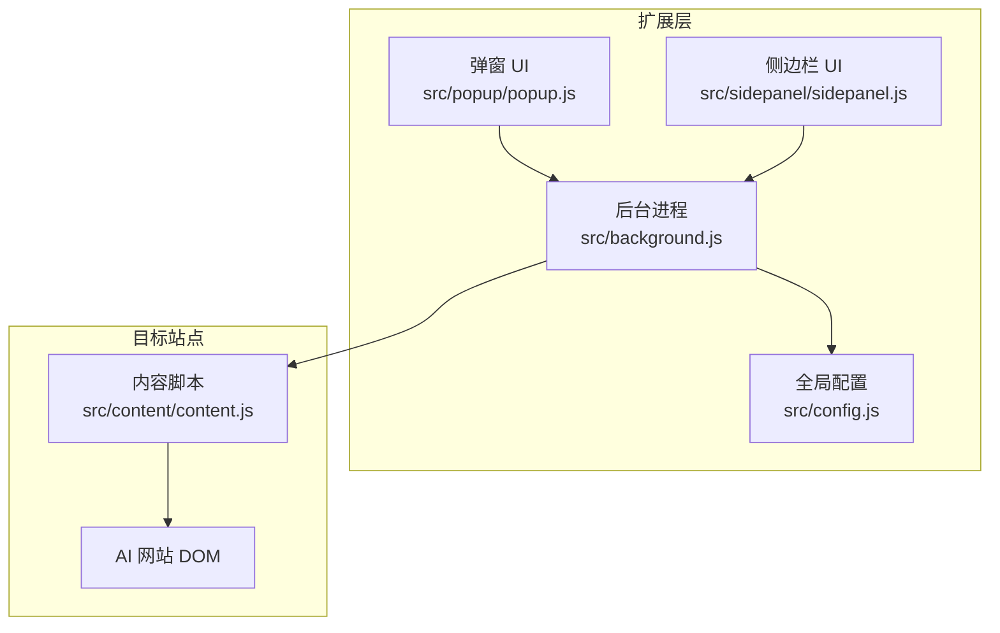
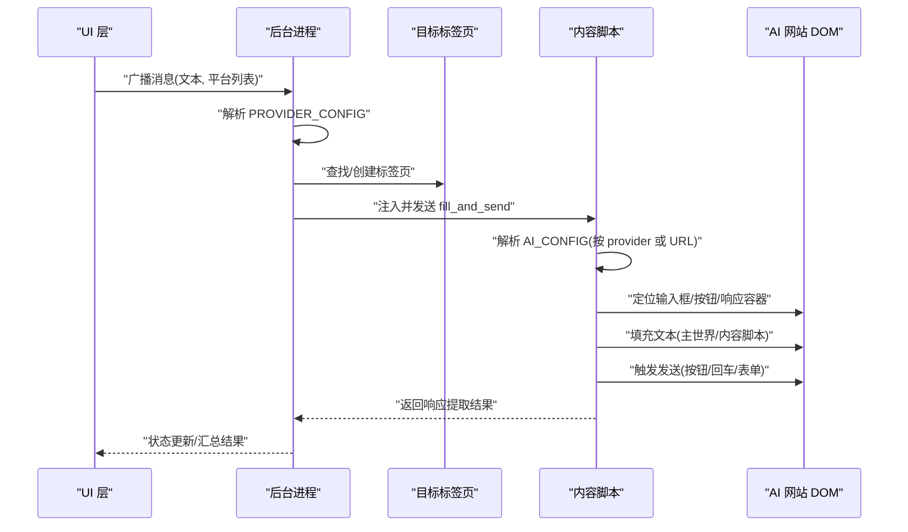
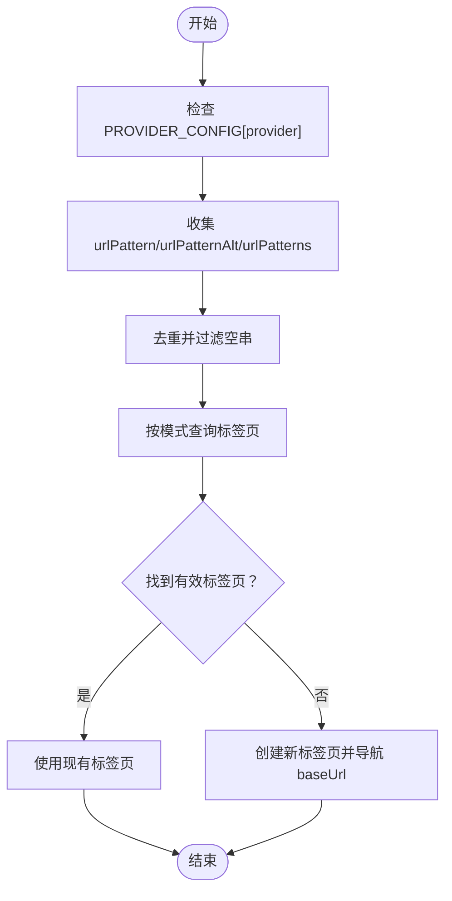
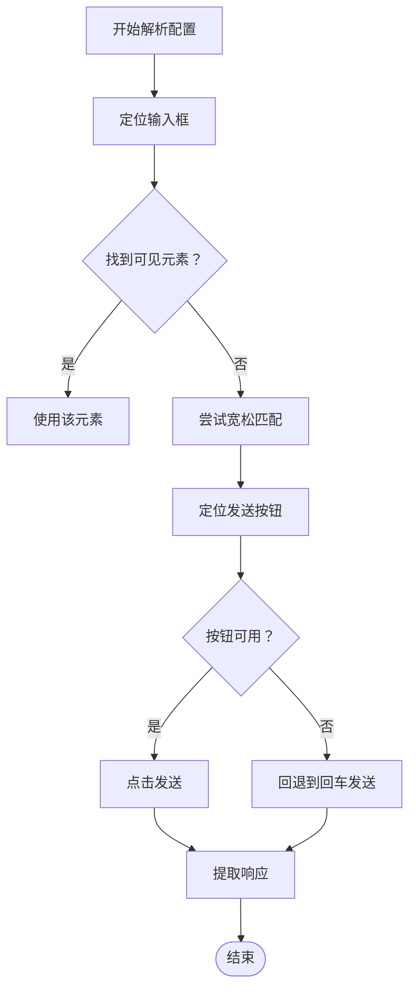
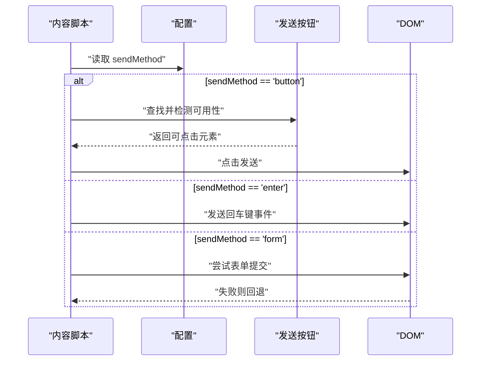
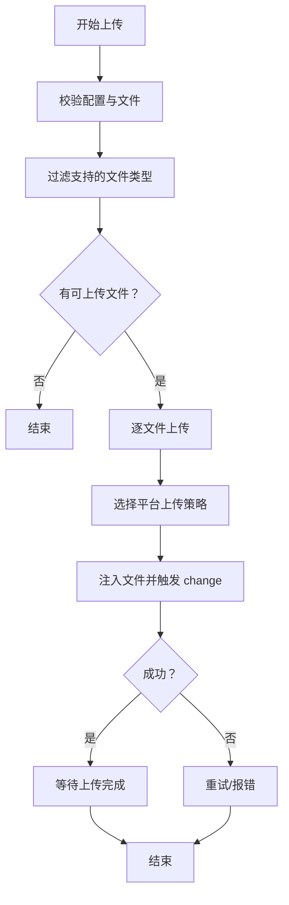
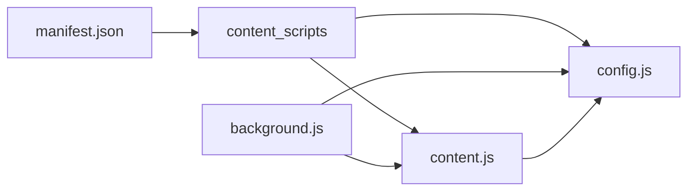

# 配置管理系统

<cite>
**本文档引用的文件**
- [src/config.js](file://src/config.js)
- [src/background.js](file://src/background.js)
- [src/content/content.js](file://src/content/content.js)
- [manifest.json](file://manifest.json)
- [src/popup/popup.js](file://src/popup/popup.js)
- [src/sidepanel/sidepanel.js](file://src/sidepanel/sidepanel.js)
</cite>

## 目录
1. [简介](#简介)
2. [项目结构](#项目结构)
3. [核心组件](#核心组件)
4. [架构总览](#架构总览)
5. [详细组件分析](#详细组件分析)
6. [依赖关系分析](#依赖关系分析)
7. [性能考量](#性能考量)
8. [故障排除指南](#故障排除指南)
9. [结论](#结论)
10. [附录](#附录)

## 简介
本文件系统性解析 AI 多重宇宙对话扩展的配置管理系统，重点阐述如何统一管理 7 个 AI 平台的配置信息，包括：
- AI_CONFIG 对象的数据结构与字段语义
- URL 模式匹配策略
- 选择器映射机制与适配策略
- 发送方法抽象层与跨平台一致性
- 文件支持配置与上传限制
- 扩展新平台的方法论与最佳实践

## 项目结构
该扩展采用“配置集中化 + 内容脚本自动化 + 后台进程编排”的分层架构：
- 配置层：src/config.js 定义 AI_CONFIG，包含各平台的 URL 模式、选择器、发送/填充方法、文件支持等
- 内容层：src/content/content.js 注入到目标站点，负责 DOM 自动化与消息发送
- 控制层：src/background.js 负责标签页发现/创建、消息广播、窗口布局、状态通知
- UI 层：src/popup/popup.js 与 src/sidepanel/sidepanel.js 提供用户交互入口

图表来源
- [src/background.js](file://src/background.js#L1-L120)
- [src/config.js](file://src/config.js#L1-L204)
- [src/content/content.js](file://src/content/content.js#L1-L120)
- [src/popup/popup.js](file://src/popup/popup.js#L1-L61)
- [src/sidepanel/sidepanel.js](file://src/sidepanel/sidepanel.js#L1-L120)

章节来源
- [manifest.json](file://manifest.json#L45-L69)
- [src/config.js](file://src/config.js#L1-L204)

## 核心组件
- AI_CONFIG：统一的全局配置对象，按平台键值组织，包含 URL 模式、基础 URL、选择器映射、填充与发送方法、文件支持等
- PROVIDER_CONFIG：后台进程对 AI_CONFIG 的别名或兜底配置，用于在后台上下文中统一访问平台配置
- 内容脚本配置解析：内容脚本根据传入的 provider 或 URL 主机名动态解析对应配置
- 发送方法抽象层：统一的 sendMessage 流程，屏蔽平台差异，支持按钮点击、回车提交、表单提交等策略
- 文件上传抽象层：统一的 uploadFiles/单文件上传策略，按平台差异化处理上传控件与事件

章节来源
- [src/background.js](file://src/background.js#L133-L137)
- [src/content/content.js](file://src/content/content.js#L323-L418)

## 架构总览
配置系统贯穿扩展生命周期：
- 加载阶段：manifest.json 声明 content_scripts 注入 config.js 与 content.js
- 运行阶段：后台进程通过 PROVIDER_CONFIG 选择平台，内容脚本通过 AI_CONFIG 解析平台配置
- 发送阶段：内容脚本依据配置执行填充与发送，后台进程负责窗口发现/创建与消息广播

图表来源
- [src/background.js](file://src/background.js#L138-L197)
- [src/background.js](file://src/background.js#L718-L786)
- [src/content/content.js](file://src/content/content.js#L200-L216)
- [src/content/content.js](file://src/content/content.js#L323-L418)

## 详细组件分析

### AI_CONFIG 数据结构与字段语义
AI_CONFIG 是统一的全局配置对象，按平台键值组织，每个平台包含以下关键字段：
- name：平台名称（用于 UI 展示）
- icon：平台图标路径（用于 UI 展示）
- urlPattern：主 URL 模式（用于标签页匹配）
- urlPatternAlt/urlPatterns：备用/多模式 URL（增强匹配鲁棒性）
- baseUrl：平台首页 URL（用于新建标签页）
- selectors：选择器映射，包含 input/button/response/fileUpload 等
- fillMethod：填充方法（main-world/content-script）
- sendMethod：发送方法（button/enter/form）
- supportsFiles：是否支持文件上传
- supportedFileTypes：支持的文件类型列表（MIME/扩展名/通配符）

章节来源
- [src/config.js](file://src/config.js#L5-L199)

### URL 模式匹配策略
- 后台进程在查找/创建标签页时，优先使用 PROVIDER_CONFIG[provider] 的 urlPattern/urlPatternAlt/urlPatterns
- 通过去重集合过滤空字符串，避免误匹配
- 若未找到现有标签页，将创建新标签页并导航至 baseUrl
- 内容脚本在无法通过 provider 精确匹配时，回退到基于 URL 主机名的模糊匹配

图表来源
- [src/background.js](file://src/background.js#L216-L237)
- [src/background.js](file://src/background.js#L742-L770)
- [src/content/content.js](file://src/content/content.js#L348-L367)

章节来源
- [src/background.js](file://src/background.js#L216-L237)
- [src/background.js](file://src/background.js#L742-L770)
- [src/content/content.js](file://src/content/content.js#L348-L367)

### 选择器映射机制与适配策略
- 输入框选择器：优先使用精确可见元素，其次使用宽松匹配
- 按钮选择器：针对不同平台的按钮结构设计多条候选，必要时提升到可点击父节点
- 响应容器选择器：按平台维护多条候选，优先选择最近一条且内容非空的元素
- 文件上传选择器：部分平台直接使用 input[type="file"]，部分平台需先点击上传按钮再触发文件选择

图表来源
- [src/content/content.js](file://src/content/content.js#L574-L590)
- [src/content/content.js](file://src/content/content.js#L466-L565)
- [src/content/content.js](file://src/content/content.js#L218-L320)

章节来源
- [src/content/content.js](file://src/content/content.js#L574-L590)
- [src/content/content.js](file://src/content/content.js#L466-L565)
- [src/content/content.js](file://src/content/content.js#L218-L320)

### 发送方法抽象层
统一的 sendMessage 流程：
- button：循环查找按钮，提升到可点击父节点，检测禁用状态，点击发送；对异步 UI 设定不同等待阈值
- enter：发送回车键事件，部分平台（如 Kimi）额外确保焦点与延迟
- form：尝试表单提交，失败则回退到按钮或回车

图表来源
- [src/content/content.js](file://src/content/content.js#L526-L565)

章节来源
- [src/content/content.js](file://src/content/content.js#L526-L565)

### 文件支持配置与上传流程
- supportsFiles：是否支持文件上传
- supportedFileTypes：支持的文件类型（MIME 类型、扩展名、通配符）
- 上传策略：按平台分别实现 uploadToXxx，优先使用现有 input[type="file"]，否则点击上传按钮后再注入文件
- 上传控制：最大重试次数、超时控制、逐文件上传与进度反馈

图表来源
- [src/content/content.js](file://src/content/content.js#L616-L672)
- [src/content/content.js](file://src/content/content.js#L715-L742)
- [src/content/content.js](file://src/content/content.js#L747-L788)

章节来源
- [src/content/content.js](file://src/content/content.js#L616-L672)
- [src/content/content.js](file://src/content/content.js#L715-L742)
- [src/content/content.js](file://src/content/content.js#L747-L788)

### 后台进程对配置的使用
- PROVIDER_CONFIG：后台进程对 AI_CONFIG 的别名，若全局配置缺失则提供最小兜底
- 标签页发现/创建：基于 URL 模式匹配，支持多模式与备用模式
- 消息广播：并行向多个平台发送 fill_and_send 消息
- 状态通知：通过 runtime.sendMessage 将状态回传 UI

章节来源
- [src/background.js](file://src/background.js#L133-L137)
- [src/background.js](file://src/background.js#L718-L786)

### 内容脚本对配置的使用
- 动态解析：优先按 provider 精确匹配，否则按 URL 主机名回退
- 响应提取：按平台响应选择器序列，取最后一条有效元素
- 文件上传：按平台策略注入文件并触发事件
- 错误处理：对无效输入、未知 provider、选择器失效等情况进行降级与提示

章节来源
- [src/content/content.js](file://src/content/content.js#L342-L368)
- [src/content/content.js](file://src/content/content.js#L218-L320)
- [src/content/content.js](file://src/content/content.js#L616-L672)

## 依赖关系分析
- manifest.json 声明 content_scripts 注入 config.js 与 content.js，确保全局配置与内容脚本可用
- background.js 通过 importScripts 或全局变量访问 AI_CONFIG，并将其作为 PROVIDER_CONFIG 使用
- content.js 通过全局 AI_CONFIG 解析平台配置，实现跨平台一致性

图表来源
- [manifest.json](file://manifest.json#L45-L69)
- [src/background.js](file://src/background.js#L69-L74)
- [src/config.js](file://src/config.js#L201-L204)

章节来源
- [manifest.json](file://manifest.json#L45-L69)
- [src/background.js](file://src/background.js#L69-L74)
- [src/config.js](file://src/config.js#L201-L204)

## 性能考量
- 选择器查找：先精确后宽松，减少 DOM 查询成本
- 发送等待：异步 UI 设置更长等待时间，避免频繁点击导致的按钮禁用
- 上传并发：逐文件上传，避免一次性大量文件导致的超时与失败
- 状态反馈：后台进程并行处理多个平台，提高整体吞吐

## 故障排除指南
- 选择器失效：使用诊断工具（后台进程提供 diagnose_selectors）查看各选择器命中情况，定位最合适的响应选择器
- 上传失败：检查 supportedFileTypes 是否包含目标文件类型，确认上传按钮/输入框是否存在
- 发送无响应：确认 sendMethod 是否正确，按钮是否禁用，必要时回退到回车发送
- 标签页未找到：检查 urlPattern/urlPatternAlt/urlPatterns 是否覆盖目标域名，或尝试刷新/重新登录

章节来源
- [src/background.js](file://src/background.js#L163-L169)
- [src/content/content.js](file://src/content/content.js#L126-L197)

## 结论
该配置管理系统通过 AI_CONFIG 将 7 个 AI 平台的差异抽象为统一的数据结构，结合后台进程与内容脚本的协作，实现了跨平台的一致性体验。其设计要点在于：
- 配置集中化与可扩展
- 选择器映射与适配策略
- 发送方法与文件上传的抽象层
- URL 模式匹配与标签页发现机制

## 附录

### 扩展新平台的方法与最佳实践
- 新增平台键值：在 AI_CONFIG 中添加新平台键，至少包含 name、icon、urlPattern、baseUrl、selectors、fillMethod、sendMethod
- 选择器设计：为 input/button/response/fileUpload 分别提供多条候选，优先可见元素，必要时提供回退策略
- 发送方法：优先使用按钮点击，对异步 UI 可考虑回车回退；仅在确有表单场景使用 form
- 文件支持：明确 supportsFiles 与 supportedFileTypes，按平台实现 uploadToXxx
- URL 模式：提供 urlPattern 与 urlPatternAlt/urlPatterns，覆盖常见域名变体
- 诊断与测试：使用 diagnose_selectors 验证选择器有效性，关注响应容器长度与内容

章节来源
- [src/config.js](file://src/config.js#L5-L199)
- [src/content/content.js](file://src/content/content.js#L126-L197)