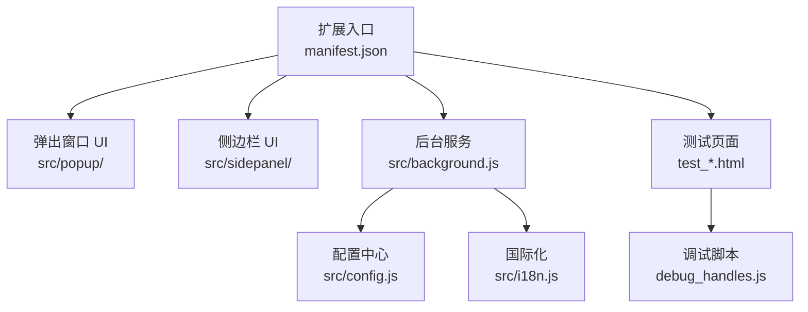
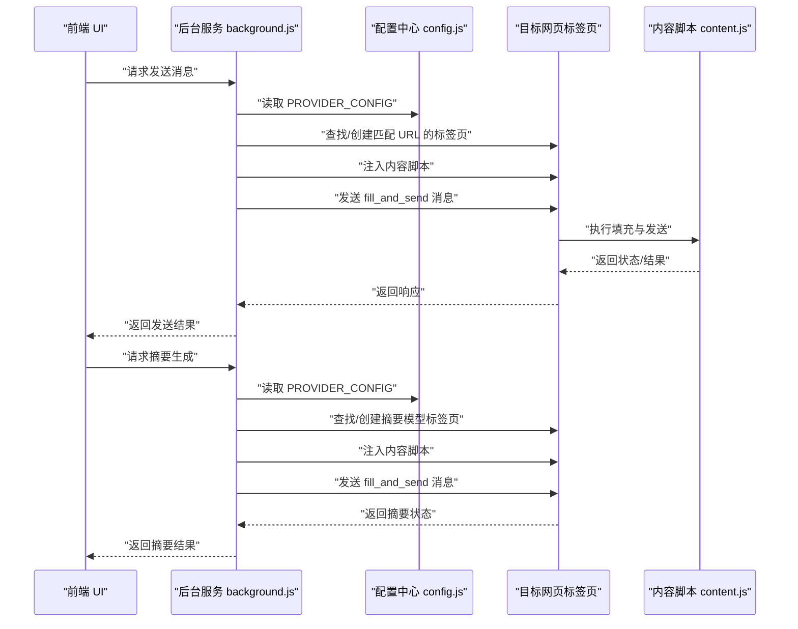
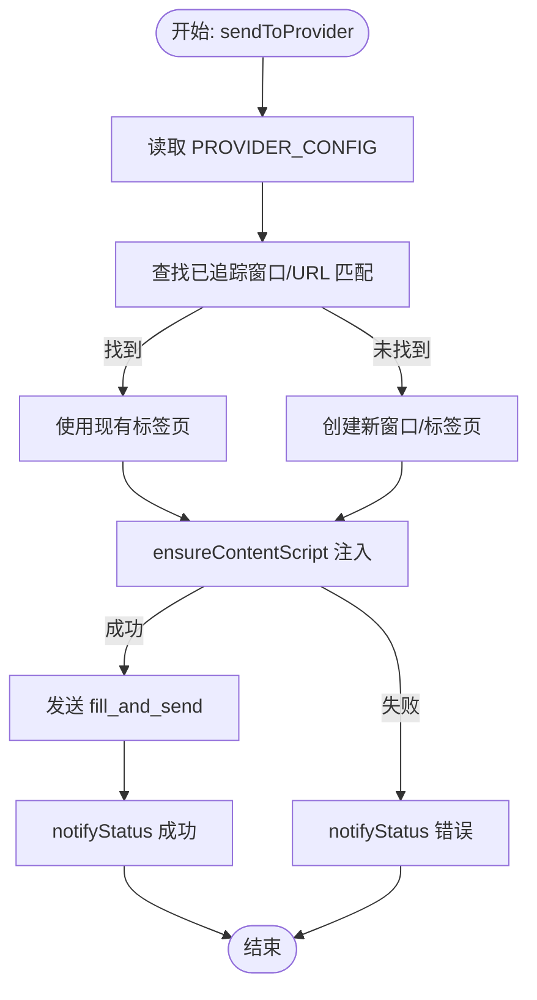
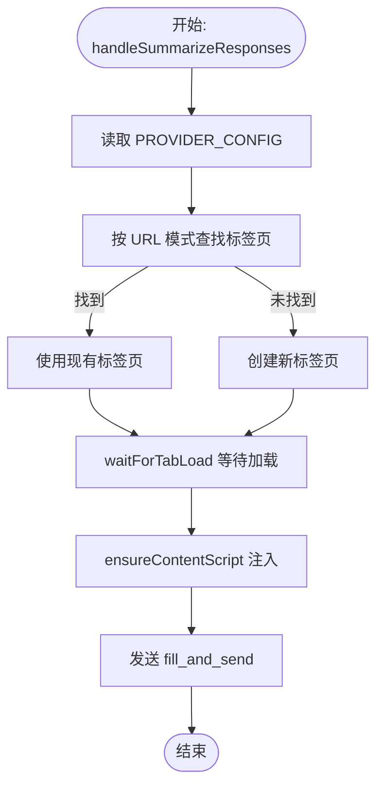
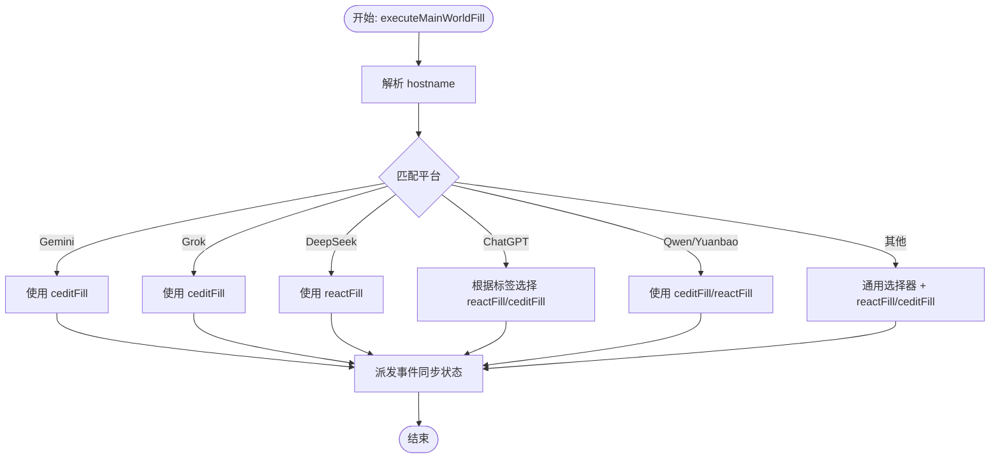
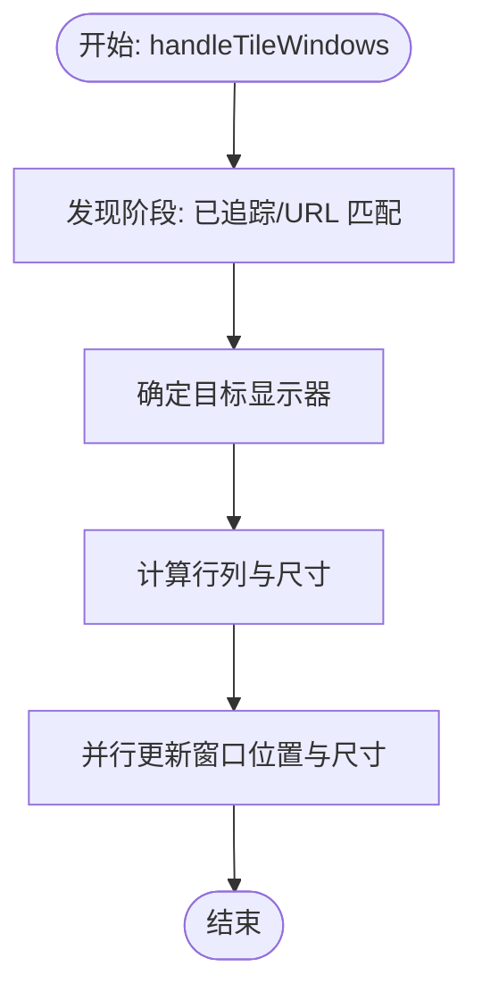
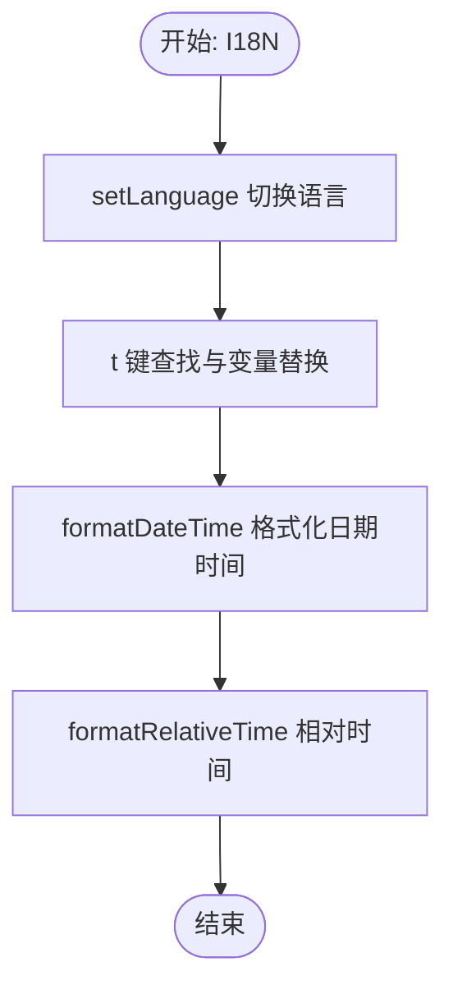
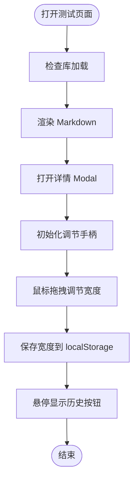
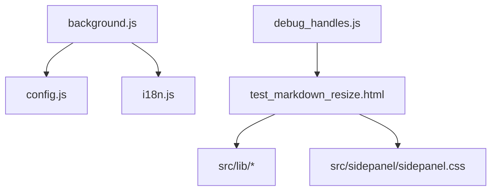

# 单元测试

<cite>
**本文引用的文件**
- [README.md](file://README.md)
- [CONTRIBUTING.md](file://CONTRIBUTING.md)
- [TESTING_v1.7.md](file://TESTING_v1.7.md)
- [QUICK_TEST_GUIDE.md](file://QUICK_TEST_GUIDE.md)
- [debug_handles.js](file://debug_handles.js)
- [src/background.js](file://src/background.js)
- [src/config.js](file://src/config.js)
- [src/i18n.js](file://src/i18n.js)
- [test_markdown_resize.html](file://test_markdown_resize.html)
- [test_hover_buttons.html](file://test_hover_buttons.html)
- [test_history_buttons.html](file://test_history_buttons.html)
</cite>

## 目录
1. [简介](#简介)
2. [项目结构](#项目结构)
3. [核心组件](#核心组件)
4. [架构总览](#架构总览)
5. [详细组件分析](#详细组件分析)
6. [依赖分析](#依赖分析)
7. [性能考虑](#性能考虑)
8. [故障排查指南](#故障排查指南)
9. [结论](#结论)
10. [附录](#附录)

## 简介
本单元测试文档面向 AI Multiverse Chat Chrome 扩展，目标是建立系统化的单元测试与测试策略，确保消息发送、状态管理、DOM 操作、国际化与后台任务等关键路径的稳定性与可维护性。文档涵盖测试设计原则、测试用例编写规范、断言方法、测试数据准备、测试环境配置、异步与事件处理测试、错误处理测试、覆盖率要求以及持续集成中的执行流程。

## 项目结构
该项目采用原生 JavaScript、HTML、CSS 构建，无打包工具，便于直接在浏览器环境中进行端到端与单元测试。关键模块包括：
- 配置中心：统一管理各 AI 平台的 URL 模式、选择器、填充与发送方式等
- 国际化：提供多语言文本与时间格式化
- 后台服务：负责窗口管理、消息分发、内容脚本注入、摘要生成等
- 测试辅助页面：用于验证 Markdown 渲染、窗口调节手柄、历史按钮 UI 等

**图表来源**
- [README.md](file://README.md#L20-L29)
- [src/background.js](file://src/background.js#L1-L20)
- [src/config.js](file://src/config.js#L1-L10)
- [src/i18n.js](file://src/i18n.js#L1-L10)

**章节来源**
- [README.md](file://README.md#L20-L29)

## 核心组件
- 配置中心（AI_CONFIG）：集中定义各平台的 URL 模式、基础地址、选择器、填充与发送方式、文件支持等。用于消息发送与内容脚本注入的策略依据。
- 国际化（I18N）：提供 t、setLanguage、formatDateTime、formatRelativeTime 等函数，支撑 UI 文案与时间文案的本地化。
- 后台服务（background.js）：负责扩展点击行为、窗口管理、消息监听与分发、内容脚本注入、摘要生成、窗口平铺等。
- 测试页面与调试脚本：提供 Markdown 渲染、窗口调节手柄、历史按钮 UI 的手动验证与调试能力。

**章节来源**
- [src/config.js](file://src/config.js#L1-L204)
- [src/i18n.js](file://src/i18n.js#L1-L120)
- [src/background.js](file://src/background.js#L1-L120)
- [test_markdown_resize.html](file://test_markdown_resize.html#L1-L60)
- [debug_handles.js](file://debug_handles.js#L1-L20)

## 架构总览
以下序列图展示“消息发送”与“摘要生成”的关键流程，体现后台服务、配置中心与内容脚本之间的交互。

**图表来源**
- [src/background.js](file://src/background.js#L138-L197)
- [src/background.js](file://src/background.js#L298-L376)
- [src/config.js](file://src/config.js#L5-L199)

## 详细组件分析

### 组件一：消息发送函数（sendToProvider）
- 目标：对指定提供商发送消息，包含标签页发现/创建、内容脚本注入、消息发送与状态通知。
- 关键点：
  - 通过 PROVIDER_CONFIG 解析 URL 模式与基础地址
  - 使用 chrome.tabs.query 与 chrome.windows 查询/创建目标标签页
  - ensureContentScript 确保内容脚本可用
  - chrome.tabs.sendMessage 发送 fill_and_send
  - notifyStatus 通过 runtime 发送状态更新
- 断言建议：
  - 返回值为 Promise，需断言 resolve/reject
  - 断言标签页创建/查询成功
  - 断言内容脚本注入成功
  - 断言消息发送成功与状态更新

**图表来源**
- [src/background.js](file://src/background.js#L718-L790)

**章节来源**
- [src/background.js](file://src/background.js#L718-L790)

### 组件二：摘要生成（handleSummarizeResponses）
- 目标：根据提供商与提示词，定位或创建摘要模型标签页，注入内容脚本并发送填充与发送指令。
- 关键点：
  - 通过 PROVIDER_CONFIG 解析 URL 模式与基础地址
  - 使用 chrome.tabs.query 查找匹配标签页
  - waitForTabLoad 等待页面加载
  - ensureContentScript 注入内容脚本
  - chrome.tabs.sendMessage 发送 fill_and_send
- 断言建议：
  - 断言 PROVIDER_CONFIG 存在
  - 断言标签页创建/查询成功
  - 断言内容脚本注入成功
  - 断言消息发送成功

**图表来源**
- [src/background.js](file://src/background.js#L298-L376)

**章节来源**
- [src/background.js](file://src/background.js#L298-L376)

### 组件三：主世界填充（executeMainWorldFill）
- 目标：在目标页面的 MAIN 世界执行文本填充，兼容不同编辑器（如 Tiptap/ProseMirror、React textarea、contenteditable 等）。
- 关键点：
  - 根据 hostname 选择不同填充策略
  - reactFill 与 ceditFill 分别处理 React 与 contenteditable 场景
  - 事件派发确保编辑器状态同步
- 断言建议：
  - 断言选择器命中目标元素
  - 断言文本正确写入并触发 input/change 等事件
  - 断言长文本场景的处理

**图表来源**
- [src/background.js](file://src/background.js#L378-L526)

**章节来源**
- [src/background.js](file://src/background.js#L378-L526)

### 组件四：窗口平铺（handleTileWindows）
- 目标：根据显示器信息与提供商窗口集合，计算网格布局并批量更新窗口尺寸与位置。
- 关键点：
  - 发现阶段：优先使用已追踪窗口，其次按 URL 模式匹配
  - 目标显示器：优先使用弹窗所在显示器，其次使用存储的显示器偏好，最后使用主显示器
  - 布局计算：根据窗口数量计算行列数
  - 并行更新：Promise.all 并行应用布局
- 断言建议：
  - 断言发现阶段正确识别窗口
  - 断言目标显示器选择正确
  - 断言行列数与尺寸计算正确
  - 断言并行更新成功

**图表来源**
- [src/background.js](file://src/background.js#L527-L643)

**章节来源**
- [src/background.js](file://src/background.js#L527-L643)

### 组件五：国际化（I18N）
- 目标：提供 t、setLanguage、formatDateTime、formatRelativeTime 等函数，支撑 UI 文案与时间文案的本地化。
- 关键点：
  - t 支持嵌套键与变量替换
  - formatDateTime/formatRelativeTime 基于当前语言与 Intl
- 断言建议：
  - 断言 t 返回正确文案（含变量替换）
  - 断言 setLanguage 切换成功
  - 断言 formatDateTime/formatRelativeTime 输出符合语言习惯

**图表来源**
- [src/i18n.js](file://src/i18n.js#L354-L488)

**章节来源**
- [src/i18n.js](file://src/i18n.js#L354-L488)

### 组件六：测试页面与调试脚本（Markdown 渲染、窗口调节手柄、历史按钮 UI）
- 目标：提供独立页面验证 Markdown 渲染、窗口调节手柄可见性与拖拽、历史按钮 UI 的交互。
- 关键点：
  - test_markdown_resize.html：验证 marked、highlight、DOMPurify 加载与渲染，初始化 modal-resize-handle 并绑定拖拽事件
  - test_hover_buttons.html / test_history_buttons.html：验证悬停显示与按钮样式
  - debug_handles.js：在控制台检查 modal、手柄、CSS 样式与遮挡情况
- 断言建议：
  - 断言库加载成功与 marked 配置
  - 断言 modal-resize-handle 创建与事件绑定
  - 断言拖拽后宽度保存到 localStorage
  - 断言悬停时按钮显隐与样式过渡

**图表来源**
- [test_markdown_resize.html](file://test_markdown_resize.html#L174-L410)
- [debug_handles.js](file://debug_handles.js#L1-L73)
- [test_hover_buttons.html](file://test_hover_buttons.html#L1-L60)
- [test_history_buttons.html](file://test_history_buttons.html#L1-L60)

**章节来源**
- [test_markdown_resize.html](file://test_markdown_resize.html#L174-L410)
- [debug_handles.js](file://debug_handles.js#L1-L73)
- [test_hover_buttons.html](file://test_hover_buttons.html#L1-L60)
- [test_history_buttons.html](file://test_history_buttons.html#L1-L60)

## 依赖分析
- 后台服务依赖配置中心与国际化模块；配置中心提供 PROVIDER_CONFIG；国际化提供 t 与时间格式化。
- 测试页面依赖 src/lib 下的 marked、highlight、purify 库；依赖侧边栏样式文件。
- 调试脚本用于验证手柄创建与样式状态。

**图表来源**
- [src/background.js](file://src/background.js#L69-L97)
- [src/config.js](file://src/config.js#L1-L10)
- [src/i18n.js](file://src/i18n.js#L1-L10)
- [test_markdown_resize.html](file://test_markdown_resize.html#L7-L115)

**章节来源**
- [src/background.js](file://src/background.js#L69-L97)
- [src/config.js](file://src/config.js#L1-L10)
- [src/i18n.js](file://src/i18n.js#L1-L10)
- [test_markdown_resize.html](file://test_markdown_resize.html#L7-L115)

## 性能考虑
- 并行处理：窗口平铺使用 Promise.all 并行更新窗口，减少总耗时。
- 超时与健壮性：标签页加载使用 waitForTabLoad 并带超时，避免阻塞。
- 事件派发：主世界填充中派发 input/change 等事件，确保编辑器状态同步，降低后续交互成本。
- 测试页面：库加载与渲染分离，避免重复初始化。

[本节为通用指导，无需具体文件分析]

## 故障排查指南
- 窗口调节手柄不可见或无法拖拽：
  - 使用 debug_handles.js 在控制台检查 modal、手柄数量、CSS 样式与遮挡情况
  - 确认 initModalResize 已被调用，z-index 与 position 设置正确
- Markdown 渲染失败：
  - 检查库加载状态（marked、highlight、DOMPurify）
  - 确认 marked 配置与 DOMPurify 洗净
- 摘要生成失败：
  - 检查 PROVIDER_CONFIG 中的 URL 模式与基础地址
  - 确认标签页创建/加载与内容脚本注入成功
- 国际化文案缺失：
  - 检查 t 键是否存在，变量替换是否正确

**章节来源**
- [debug_handles.js](file://debug_handles.js#L1-L73)
- [test_markdown_resize.html](file://test_markdown_resize.html#L174-L255)
- [src/background.js](file://src/background.js#L298-L376)
- [src/i18n.js](file://src/i18n.js#L354-L383)

## 结论
通过明确的测试策略与覆盖关键路径（消息发送、摘要生成、主世界填充、窗口平铺、国际化、DOM 操作与渲染），结合测试页面与调试脚本，可以有效保障扩展在多平台、多场景下的稳定性与一致性。建议在 CI 中引入自动化测试与覆盖率统计，持续提升质量。

[本节为总结，无需具体文件分析]

## 附录

### 测试设计原则与策略
- 单元测试：隔离函数与方法，验证输入输出与内部状态变更
- 集成测试：验证跨模块协作（后台服务与内容脚本、配置中心与 UI）
- 手动测试：验证 UI 交互与视觉效果（Markdown 渲染、按钮样式、手柄拖拽）
- 属性测试：关注状态一致性与 DOM 行为（如按钮可见性、摘要按钮状态、宽度约束）

**章节来源**
- [.kiro/specs/ui-improvements/design.md](file://.kiro/specs/ui-improvements/design.md#L640-L690)
- [.kiro/specs/modal-navigation/design.md](file://.kiro/specs/modal-navigation/design.md#L350-L370)

### 测试用例编写规范
- 命名规范：描述性命名，包含被测函数、场景与期望结果
- 断言方法：使用 Promise 断言、DOM 断言、事件断言、存储断言
- 测试数据准备：构造最小化输入、边界值、异常场景；使用 mock 或真实环境
- 异步与事件：使用 async/await、事件监听与清理、定时器清理
- 错误处理：断言错误抛出与错误信息

### 测试环境配置指南
- 测试框架选择：Jest（推荐）或 Mocha + Chai
- 测试工具设置：
  - Jest：配置 DOM 全局（jsdom）、Chrome 扩展 API Mock、静态资源处理
  - Mocha：配合 Sinon（Mock/Stub）、Chai（断言）、Chrome 扩展 API Polyfill
- 测试页面：利用 test_*.html 作为 UI 验证入口，结合调试脚本定位问题

**章节来源**
- [QUICK_TEST_GUIDE.md](file://QUICK_TEST_GUIDE.md#L1-L40)

### 具体测试代码示例（路径指引）
- 异步操作：参考后台服务中的 Promise.allSettled、Promise.all、超时处理
  - [src/background.js](file://src/background.js#L718-L721)
  - [src/background.js](file://src/background.js#L639-L643)
- 事件处理：参考测试页面中的鼠标事件绑定与拖拽逻辑
  - [test_markdown_resize.html](file://test_markdown_resize.html#L337-L404)
- 错误处理：参考后台服务中的 try/catch、错误消息与通知
  - [src/background.js](file://src/background.js#L773-L785)
  - [src/background.js](file://src/background.js#L256-L263)

### 测试覆盖率要求与持续集成
- 覆盖率要求：关键函数（消息发送、摘要生成、主世界填充、窗口平铺、国际化）达到高覆盖率（建议 >80%）
- 持续集成：在 CI 中执行单元测试与覆盖率统计，结合手动测试页面进行回归验证

**章节来源**
- [TESTING_v1.7.md](file://TESTING_v1.7.md#L1-L50)