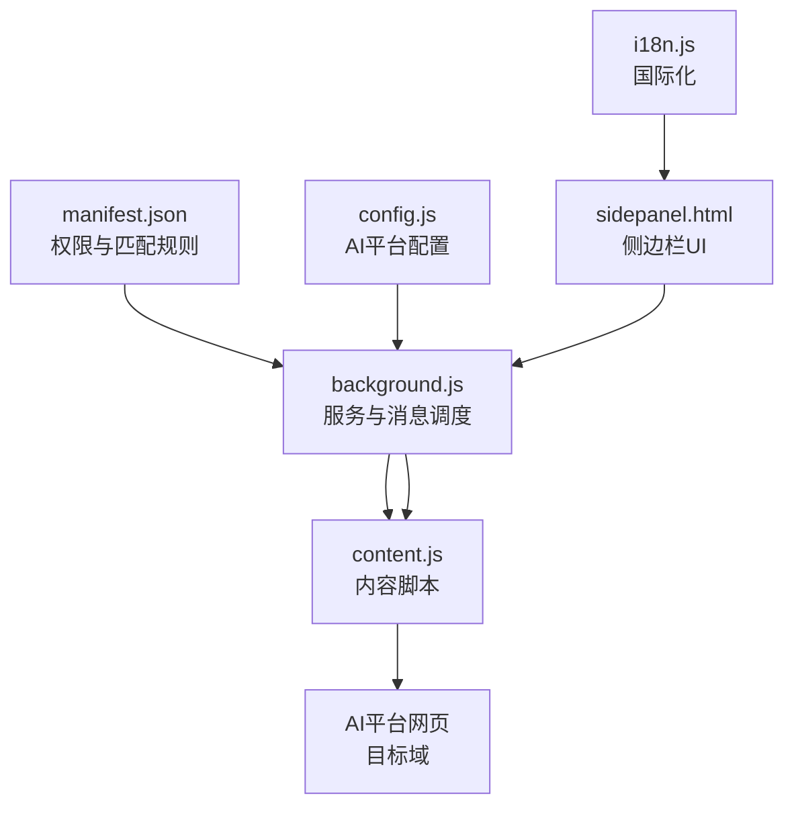
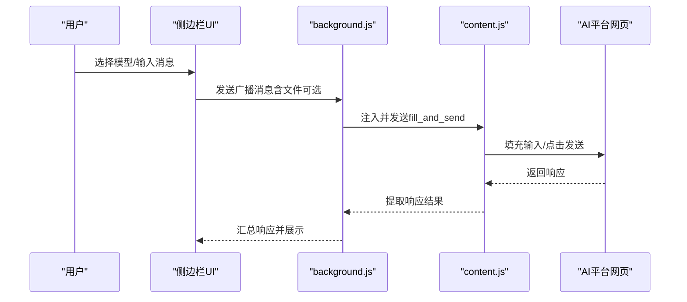
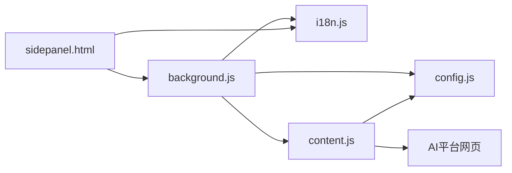

# 测试文档

<cite>
**本文档引用的文件**
- [README.md](file://README.md)
- [CONTRIBUTING.md](file://CONTRIBUTING.md)
- [TESTING_v1.7.md](file://TESTING_v1.7.md)
- [User_UAT_Checklist.md](file://User_UAT_Checklist.md)
- [QUICK_TEST_GUIDE.md](file://QUICK_TEST_GUIDE.md)
- [test_markdown_resize.html](file://test_markdown_resize.html)
- [test_hover_buttons.html](file://test_hover_buttons.html)
- [debug_handles.js](file://debug_handles.js)
- [manifest.json](file://manifest.json)
- [src/background.js](file://src/background.js)
- [src/config.js](file://src/config.js)
- [src/i18n.js](file://src/i18n.js)
- [src/content/content.js](file://src/content/content.js)
- [src/sidepanel/sidepanel.html](file://src/sidepanel/sidepanel.html)
- [src/popup/popup.html](file://src/popup/popup.html)
</cite>

## 目录
1. [引言](#引言)
2. [项目结构](#项目结构)
3. [核心组件](#核心组件)
4. [架构总览](#架构总览)
5. [详细组件分析](#详细组件分析)
6. [依赖分析](#依赖分析)
7. [性能考虑](#性能考虑)
8. [故障排查指南](#故障排查指南)
9. [结论](#结论)
10. [附录](#附录)

## 引言
本测试文档面向AI多重宇宙Chrome扩展项目，旨在提供一套系统化的测试策略与实施方案，覆盖单元测试、集成测试、用户验收测试（UAT）、自动化测试与回归策略，并给出性能测试指南与工具推荐。文档基于仓库现有测试材料与源码进行整理，确保方案可落地、可追踪。

## 项目结构
该项目为轻量级Chrome扩展，采用原生JavaScript、HTML与CSS，无构建工具，便于快速测试与调试。核心模块包括：
- manifest与权限声明：定义扩展元信息、权限与内容脚本匹配规则
- 背景服务：负责窗口管理、消息分发、脚本注入与跨标签通信
- 配置中心：统一管理各AI平台的选择器、提交方式与文件支持
- 国际化：提供中英双语文案与时间格式化
- 内容脚本：在目标AI网页内执行输入填充、发送与响应提取
- 侧边栏与弹窗UI：提供聊天、响应展示、文件上传与总结设置等交互

图表来源
- [manifest.json](file://manifest.json#L1-L79)
- [src/background.js](file://src/background.js#L1-L120)
- [src/config.js](file://src/config.js#L1-L204)
- [src/i18n.js](file://src/i18n.js#L1-L120)
- [src/content/content.js](file://src/content/content.js#L1-L120)
- [src/sidepanel/sidepanel.html](file://src/sidepanel/sidepanel.html#L1-L120)

章节来源
- [README.md](file://README.md#L20-L29)
- [manifest.json](file://manifest.json#L1-L79)

## 核心组件
- 背景服务（background.js）
  - 窗口生命周期管理、消息路由、脚本注入、跨标签通信、窗口平铺布局
- 配置中心（config.js）
  - 统一维护各AI平台的域名匹配、输入/按钮/响应选择器、文件上传支持与提交方式
- 国际化（i18n.js）
  - 提供中英双语文案、变量替换、相对时间格式化与全局暴露函数
- 内容脚本（content.js）
  - 在目标页面执行输入填充、发送、响应提取、思维内容过滤与调试诊断
- UI（sidepanel.html、popup.html）
  - 提供聊天、响应展示、文件上传预览、总结设置与导航

章节来源
- [src/background.js](file://src/background.js#L1-L200)
- [src/config.js](file://src/config.js#L1-L204)
- [src/i18n.js](file://src/i18n.js#L1-L200)
- [src/content/content.js](file://src/content/content.js#L1-L200)
- [src/sidepanel/sidepanel.html](file://src/sidepanel/sidepanel.html#L1-L200)
- [src/popup/popup.html](file://src/popup/popup.html#L1-L50)

## 架构总览
扩展采用“背景服务 + 内容脚本 + UI”的典型Chrome扩展架构。背景服务负责跨域通信与窗口管理；内容脚本在目标页面注入并执行自动化；UI通过消息与背景服务交互。

图表来源
- [src/background.js](file://src/background.js#L138-L197)
- [src/content/content.js](file://src/content/content.js#L199-L260)
- [src/sidepanel/sidepanel.html](file://src/sidepanel/sidepanel.html#L300-L390)

## 详细组件分析

### 单元测试策略
- 测试框架选择
  - 建议使用Jest或Vitest，结合jsdom进行DOM环境模拟，适合对纯函数与工具函数进行测试
- 测试用例设计
  - 国际化模块：文案键存在性、变量替换、语言切换、时间格式化
  - 配置模块：平台选择器有效性、文件类型支持、提交方式一致性
  - 内容脚本：输入填充（主世界/内容脚本路径）、响应提取、思维内容过滤、重试与超时
  - 背景服务：消息路由、窗口发现/创建、脚本注入、窗口平铺
- 覆盖率要求
  - 关键路径：≥80%
  - 业务逻辑：≥70%
  - 回归场景：≥60%

章节来源
- [src/i18n.js](file://src/i18n.js#L355-L414)
- [src/config.js](file://src/config.js#L1-L204)
- [src/content/content.js](file://src/content/content.js#L1-L200)
- [src/background.js](file://src/background.js#L138-L197)

### 集成测试方法
- 组件间交互测试
  - 背景服务与内容脚本：通过chrome.runtime.onMessage监听与响应，验证消息结构与返回值
  - UI与背景服务：侧边栏按钮点击触发消息发送，验证状态更新与窗口行为
- API接口测试
  - 通过manifest声明的host_permissions与content_scripts匹配，验证目标域访问与脚本注入
- 端到端流程测试
  - 从UI输入到目标平台响应展示的完整链路，包括文件上传、多模型广播、总结流程

章节来源
- [manifest.json](file://manifest.json#L19-L68)
- [src/background.js](file://src/background.js#L138-L197)
- [src/content/content.js](file://src/content/content.js#L199-L260)
- [src/sidepanel/sidepanel.html](file://src/sidepanel/sidepanel.html#L300-L390)

### 用户验收测试（UAT）流程
- 测试计划制定
  - 明确测试范围：文件上传、多平台兼容、国际化、历史记录、性能与稳定性
  - 制定通过标准：参考UAT清单中的验收标准
- 测试用例设计
  - 文件限制验证：单文件大小、总大小上限、类型过滤
  - 发送功能：仅文件、文件+文本、多平台发送
  - 平台特定：各AI平台的上传与预览行为
  - 错误处理：超时、重试、错误提示
  - 国际化：英文/中文界面一致性
  - 历史记录：元数据保存与展示
  - UI交互：悬停效果、焦点状态
  - 性能：响应时间、内存占用
- 用户反馈收集
  - 使用UAT清单记录测试结果与问题，形成问题记录与修复闭环

章节来源
- [User_UAT_Checklist.md](file://User_UAT_Checklist.md#L1-L305)

### 自动化测试实施方案
- 测试脚本编写
  - 使用Puppeteer或Playwright驱动真实浏览器，模拟用户操作（选择模型、输入消息、点击发送、文件上传）
  - 针对Markdown渲染与窗口调节手柄，使用仓库提供的测试页面进行自动化校验
- CI/CD集成
  - 在CI中执行：
    - 语法检查（node -c）
    - 单元测试（Jest/Vitest）
    - 端到端测试（Puppeteer/Playwright）
    - UAT清单核对与报告生成
- 回归测试策略
  - 新增AI平台或修改选择器时，优先运行相关集成测试与UAT清单
  - 对国际化文案变更进行回归校验

章节来源
- [QUICK_TEST_GUIDE.md](file://QUICK_TEST_GUIDE.md#L1-L139)
- [test_markdown_resize.html](file://test_markdown_resize.html#L1-L120)
- [test_hover_buttons.html](file://test_hover_buttons.html#L1-L120)

### 性能测试指南
- 负载测试
  - 并发发送消息至多个平台，统计平均响应时间与失败率
- 压力测试
  - 长文本输入、大文件上传、频繁切换语言与主题，观察UI卡顿与内存变化
- 性能基准测试
  - 使用Chrome DevTools Performance面板录制关键操作（打开侧边栏、发送消息、渲染响应）
  - 对比不同平台的输入填充与发送耗时

章节来源
- [User_UAT_Checklist.md](file://User_UAT_Checklist.md#L256-L274)

### 测试工具推荐与测试环境配置
- 工具推荐
  - 单元测试：Jest或Vitest + jsdom
  - 端到端：Puppeteer或Playwright
  - 性能分析：Chrome DevTools Performance与Memory
  - 文本校验：ESLint（遵循仓库代码风格）
- 环境配置
  - 开发者模式加载扩展，启用“允许不受支持的API”（如需）
  - 使用仓库提供的测试页面进行局部功能验证
  - 通过UAT清单逐项核对功能与国际化

章节来源
- [QUICK_TEST_GUIDE.md](file://QUICK_TEST_GUIDE.md#L66-L79)
- [test_markdown_resize.html](file://test_markdown_resize.html#L1-L120)

## 依赖分析
- 组件耦合
  - 背景服务依赖配置中心与国际化模块；内容脚本依赖配置中心；UI通过消息与背景服务交互
- 外部依赖
  - 目标AI平台域名权限与内容脚本匹配
  - Markdown渲染库（marked、highlight、DOMPurify）在UI与测试页面中使用

图表来源
- [src/background.js](file://src/background.js#L69-L74)
- [src/config.js](file://src/config.js#L1-L204)
- [src/i18n.js](file://src/i18n.js#L1-L120)
- [src/content/content.js](file://src/content/content.js#L1-L120)
- [src/sidepanel/sidepanel.html](file://src/sidepanel/sidepanel.html#L1-L120)

章节来源
- [manifest.json](file://manifest.json#L19-L68)
- [src/background.js](file://src/background.js#L69-L74)

## 性能考虑
- 选择器匹配与DOM查询
  - 避免过于宽泛的选择器，减少不必要的遍历
- 脚本注入与超时
  - 设置合理的注入与加载超时，防止阻塞UI
- 文件上传与渲染
  - 控制文件大小与数量，避免内存峰值过高
- 主题与国际化
  - 文案与样式切换应尽量使用CSS变量与轻量计算

## 故障排查指南
- 调试手柄不可见
  - 使用调试脚本检查modal、内容区与手柄的DOM状态与样式
  - 确认z-index、position与display属性
- Markdown渲染异常
  - 检查库文件加载状态与marked配置时机
- 选择器失效
  - 使用诊断工具定位最佳响应选择器
- 语言切换未生效
  - 确认国际化模块已初始化并正确应用

章节来源
- [debug_handles.js](file://debug_handles.js#L1-L73)
- [test_markdown_resize.html](file://test_markdown_resize.html#L174-L211)
- [src/content/content.js](file://src/content/content.js#L126-L197)
- [src/i18n.js](file://src/i18n.js#L355-L414)

## 结论
本测试文档基于仓库现有测试材料与源码，提出了覆盖单元、集成、UAT与性能的测试策略，并给出了自动化与回归测试的实施方案。建议在CI中固化测试流程，持续提升质量与稳定性。

## 附录
- 快速测试指南与测试页面
  - Markdown渲染与窗口调节手柄测试
- 贡献与新增AI平台的测试要点
  - 配置新增后需验证选择器、提交方式与文件支持

章节来源
- [QUICK_TEST_GUIDE.md](file://QUICK_TEST_GUIDE.md#L1-L139)
- [CONTRIBUTING.md](file://CONTRIBUTING.md#L1-L56)