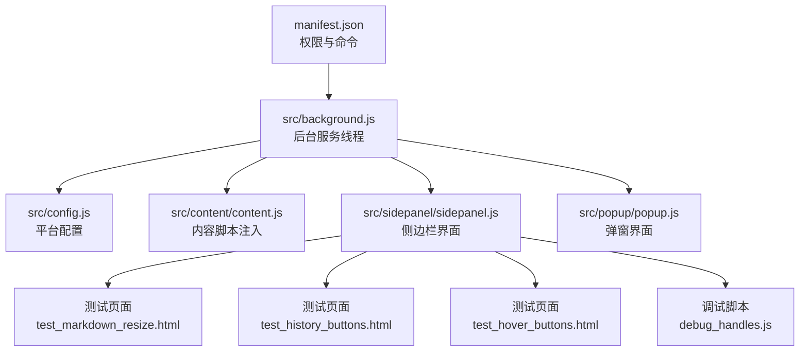
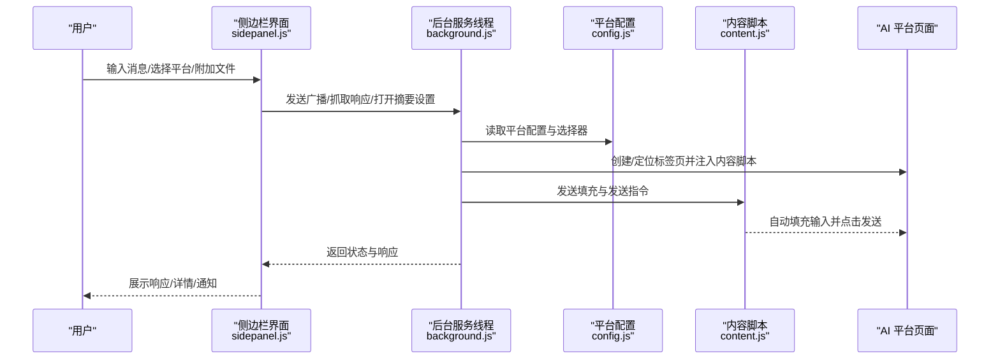
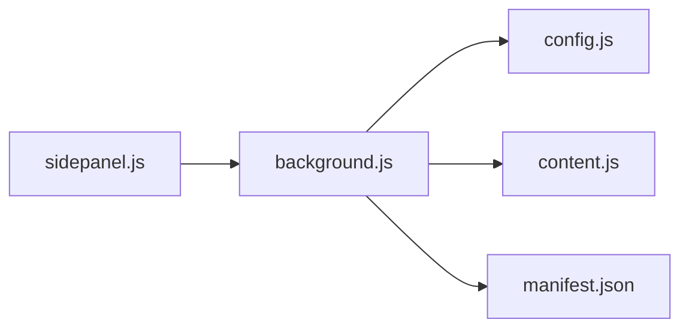

# 用户验收测试

<cite>
**本文档引用的文件**
- [User_UAT_Checklist.md](file://User_UAT_Checklist.md)
- [TESTING_v1.7.md](file://TESTING_v1.7.md)
- [QUICK_TEST_GUIDE.md](file://QUICK_TEST_GUIDE.md)
- [README.md](file://README.md)
- [CONTRIBUTING.md](file://CONTRIBUTING.md)
- [manifest.json](file://manifest.json)
- [src/config.js](file://src/config.js)
- [src/background.js](file://src/background.js)
- [src/sidepanel/sidepanel.js](file://src/sidepanel/sidepanel.js)
- [src/popup/popup.js](file://src/popup/popup.js)
- [test_markdown_resize.html](file://test_markdown_resize.html)
- [test_history_buttons.html](file://test_history_buttons.html)
- [test_hover_buttons.html](file://test_hover_buttons.html)
- [debug_handles.js](file://debug_handles.js)
</cite>

## 目录
1. [简介](#简介)
2. [项目结构](#项目结构)
3. [核心组件](#核心组件)
4. [架构总览](#架构总览)
5. [详细组件分析](#详细组件分析)
6. [依赖分析](#依赖分析)
7. [性能考虑](#性能考虑)
8. [故障排查指南](#故障排查指南)
9. [结论](#结论)
10. [附录](#附录)

## 简介
本文件面向用户验收测试（UAT）场景，提供系统化的测试流程、测试计划制定方法、测试用例设计指南、测试环境与数据准备步骤、测试报告模板与缺陷跟踪方法，以及回归测试与版本验证策略。目标是帮助测试团队在真实浏览器环境中高效验证扩展的核心功能、边界条件与异常处理，并形成可追溯的测试证据与改进闭环。

## 项目结构
该 Chrome 扩展采用 Manifest V3，核心由后台服务线程、侧边栏界面、弹窗界面、内容脚本与全局配置组成。关键模块职责如下：
- manifest.json：声明权限、主机权限、命令与入口
- src/background.js：后台服务线程，负责标签页管理、消息路由、脚本注入与跨页面通信
- src/config.js：统一的 AI 平台配置，包含各平台的选择器、上传与发送策略
- src/sidepanel/sidepanel.js：侧边栏主界面逻辑，包含文件上传、Markdown 渲染、响应详情与导航、摘要设置等
- src/popup/popup.js：弹窗界面逻辑，负责快速发送消息与状态展示
- 测试页面与调试脚本：独立 HTML 页面用于快速验证 Markdown 渲染、窗口调节手柄、历史按钮 UI 等

图表来源
- [manifest.json](file://manifest.json#L1-L79)
- [src/background.js](file://src/background.js#L1-L120)
- [src/config.js](file://src/config.js#L1-L204)
- [src/sidepanel/sidepanel.js](file://src/sidepanel/sidepanel.js#L1-L120)
- [src/popup/popup.js](file://src/popup/popup.js#L1-L61)
- [test_markdown_resize.html](file://test_markdown_resize.html#L1-L120)
- [test_history_buttons.html](file://test_history_buttons.html#L1-L80)
- [test_hover_buttons.html](file://test_hover_buttons.html#L1-L80)
- [debug_handles.js](file://debug_handles.js#L1-L73)

章节来源
- [README.md](file://README.md#L1-L107)
- [manifest.json](file://manifest.json#L1-L79)

## 核心组件
- 平台配置与选择器：集中于 src/config.js，定义各 AI 平台的 URL 模式、输入/发送选择器、文件上传策略与支持的文件类型
- 后台服务线程：负责发现/创建/注入内容脚本、跨标签页消息分发、窗口布局与状态通知
- 侧边栏界面：负责用户输入、文件上传与预览、响应抓取与详情展示、摘要设置与执行、主题与语言切换
- 弹窗界面：提供快速发送与状态日志展示
- 测试页面与调试脚本：辅助验证 Markdown 渲染、窗口调节手柄、历史按钮 UI 等

章节来源
- [src/config.js](file://src/config.js#L1-L204)
- [src/background.js](file://src/background.js#L138-L197)
- [src/sidepanel/sidepanel.js](file://src/sidepanel/sidepanel.js#L41-L120)
- [src/popup/popup.js](file://src/popup/popup.js#L1-L61)
- [test_markdown_resize.html](file://test_markdown_resize.html#L1-L120)
- [test_history_buttons.html](file://test_history_buttons.html#L1-L80)
- [test_hover_buttons.html](file://test_hover_buttons.html#L1-L80)
- [debug_handles.js](file://debug_handles.js#L1-L73)

## 架构总览
下图展示 UAT 关注的关键交互路径：用户通过侧边栏或弹窗发起消息，后台服务线程根据配置定位对应平台标签页，注入内容脚本并执行填充与发送；侧边栏负责响应抓取与详情展示；Markdown 渲染与窗口调节手柄在侧边栏详情中使用。

图表来源
- [src/sidepanel/sidepanel.js](file://src/sidepanel/sidepanel.js#L374-L389)
- [src/background.js](file://src/background.js#L138-L197)
- [src/config.js](file://src/config.js#L1-L204)

## 详细组件分析

### 1) 测试流程与测试计划制定
- 测试目标设定
  - 功能覆盖：文件上传与预览、多文件操作、发送至多平台、平台特定行为、错误处理、国际化、历史记录、UI 交互、性能
  - 质量标准：通过所有测试用例即视为通过验收
- 测试范围确定
  - 覆盖平台：Gemini、Grok、Kimi、DeepSeek、ChatGPT、通义千问、腾讯元宝
  - 覆盖场景：基础功能、多文件、文件限制、发送、平台特定、错误处理、国际化、历史记录、UI 交互、性能
- 测试时间安排
  - 建议按“功能域”分批进行：文件上传与发送、平台特定、国际化与历史、UI 与性能、错误处理
  - 每个功能域预留 1-2 个工作日，留出 1 天用于回归与缺陷修复验证

章节来源
- [User_UAT_Checklist.md](file://User_UAT_Checklist.md#L1-L305)
- [TESTING_v1.7.md](file://TESTING_v1.7.md#L1-L211)

### 2) 用户测试用例设计指南
- 基础功能测试
  - 附件按钮显示与提示文案
  - 文件选择与预览区显示
  - 清空所有文件
- 多文件操作
  - 多文件选择与垂直排列
  - 单个文件移除
  - 快速连续操作无卡顿
- 文件限制验证
  - 单文件大小限制（>10MB 报错）
  - 总大小限制（>50MB 报错）
  - 边界值（恰好 10MB 可添加）
- 发送功能
  - 仅文件发送
  - 文件+文本发送
  - 多平台发送
- 平台特定测试
  - Gemini：图片/PDF 上传与预览
  - ChatGPT：代码文件与 PDF 上传
  - Kimi：Word 与 Markdown 上传与内容显示
- 错误处理
  - 文件类型过滤（不支持类型不显示）
  - 上传失败模拟（断网、超时、重试与最终错误提示）
- 国际化
  - 英文界面：按钮与错误消息为英文
  - 中文界面：按钮与错误消息为中文
- 历史记录
  - 历史记录显示文件名、类型、大小
- UI 交互
  - 鼠标悬停效果与焦点状态
- 性能测试
  - 大文件预览时间（≤3 秒）
  - 内存使用无明显增长（无内存泄漏）

章节来源
- [User_UAT_Checklist.md](file://User_UAT_Checklist.md#L10-L290)

### 3) 用户反馈收集与处理流程
- 用户界面测试
  - 按钮提示文案、图标与交互反馈
  - 预览区布局与文件信息展示
- 用户体验评估
  - 操作路径是否直观、错误提示是否明确
  - 多平台发送一致性与可读性
- 功能可用性测试
  - 侧边栏打开方式（快捷键）、响应抓取与详情查看
  - Markdown 渲染与复制按钮可用性
- 反馈收集
  - 使用测试清单逐项打钩，记录“发现的问题”与“改进建议”
  - 保留截图与日志，便于后续回归

章节来源
- [TESTING_v1.7.md](file://TESTING_v1.7.md#L71-L211)

### 4) 测试环境搭建与测试数据准备
- 测试环境要求
  - Chrome 浏览器（启用开发者模式）
  - 已登录各目标 AI 平台账号
  - 已安装扩展（开发者模式加载已解压扩展）
- 测试数据准备
  - 图片文件（JPG/PNG）、PDF、TXT、DOC/DOCX、MD、JSON、CSV、PY、JS 等
  - 大文件（>10MB）与超限组合（>50MB）
  - 多平台页面均处于可交互状态
- 测试页面与调试工具
  - 使用 test_markdown_resize.html 验证 Markdown 渲染与窗口调节手柄
  - 使用 test_history_buttons.html 与 test_hover_buttons.html 验证历史按钮 UI
  - 使用 debug_handles.js 在控制台诊断手柄问题

章节来源
- [README.md](file://README.md#L30-L106)
- [QUICK_TEST_GUIDE.md](file://QUICK_TEST_GUIDE.md#L20-L139)
- [test_markdown_resize.html](file://test_markdown_resize.html#L1-L120)
- [test_history_buttons.html](file://test_history_buttons.html#L1-L80)
- [test_hover_buttons.html](file://test_hover_buttons.html#L1-L80)
- [debug_handles.js](file://debug_handles.js#L1-L73)

### 5) 测试报告模板与缺陷跟踪
- 测试报告模板
  - 测试概要：测试目标、范围、时间、参与人员
  - 测试结果：通过/需修复，逐条用例结果与结论
  - 已知问题：记录当前版本存在的问题
  - 附件：截图、日志、视频
- 缺陷跟踪
  - 缺陷编号、严重级别、重现步骤、期望结果、实际结果、截图/日志
  - 与开发团队协作，按优先级推进修复与回归

章节来源
- [User_UAT_Checklist.md](file://User_UAT_Checklist.md#L277-L305)

### 6) 回归测试与版本验证策略
- 回归测试
  - 每次修复后，重点回归文件上传/发送、多平台、国际化、历史记录、UI 交互与性能
- 版本验证
  - 以 UAT 检查清单为基准，确保所有验收标准项通过
  - 结合 QUICK_TEST_GUIDE 的快速验证步骤，确认 Markdown 渲染、窗口调节手柄等关键 UI 修复有效

章节来源
- [User_UAT_Checklist.md](file://User_UAT_Checklist.md#L277-L305)
- [QUICK_TEST_GUIDE.md](file://QUICK_TEST_GUIDE.md#L20-L139)

## 依赖分析
- 组件耦合与关系
  - sidepanel.js 依赖 background.js 的消息通道与状态通知
  - background.js 依赖 config.js 的平台配置与选择器
  - content scripts 由 background.js 注入到目标平台页面
- 外部依赖与集成点
  - 主机权限与内容脚本匹配规则由 manifest.json 定义
  - 平台选择器与发送策略由 config.js 维护，影响 content script 的填充与点击行为

图表来源
- [src/sidepanel/sidepanel.js](file://src/sidepanel/sidepanel.js#L374-L389)
- [src/background.js](file://src/background.js#L138-L197)
- [src/config.js](file://src/config.js#L1-L204)
- [manifest.json](file://manifest.json#L45-L68)

章节来源
- [src/background.js](file://src/background.js#L138-L197)
- [src/config.js](file://src/config.js#L1-L204)
- [manifest.json](file://manifest.json#L1-L79)

## 性能考虑
- 大文件处理
  - 预览显示时间应 ≤3 秒
  - 避免内存泄漏，执行 10 次文件操作后内存无明显增长
- Markdown 渲染
  - marked.js 与 highlight.js 配置时机正确，DOMPurify 进行安全净化
- 窗口调节手柄
  - 手柄宽度 20px，悬停发光效果，拖拽时实时变更宽度并持久化

章节来源
- [User_UAT_Checklist.md](file://User_UAT_Checklist.md#L256-L274)
- [QUICK_TEST_GUIDE.md](file://QUICK_TEST_GUIDE.md#L47-L139)
- [test_markdown_resize.html](file://test_markdown_resize.html#L292-L404)

## 故障排查指南
- Markdown 渲染问题
  - 检查库文件加载状态（marked、highlight、DOMPurify）
  - 确认 marked 配置与 DOMPurify 安全净化
- 窗口调节手柄问题
  - 使用 debug_handles.js 检查 modal、content、手柄数量与样式
  - 确认手柄 z-index、position、cursor 正确，无遮挡
- 历史按钮 UI 问题
  - 对比 test_history_buttons.html 与 test_hover_buttons.html 的样式与交互
- 平台选择器问题
  - 使用 background.js 的诊断接口（如 diagnose_selectors）检查选择器有效性

章节来源
- [QUICK_TEST_GUIDE.md](file://QUICK_TEST_GUIDE.md#L66-L139)
- [debug_handles.js](file://debug_handles.js#L1-L73)
- [test_history_buttons.html](file://test_history_buttons.html#L1-L80)
- [test_hover_buttons.html](file://test_hover_buttons.html#L1-L80)
- [src/background.js](file://src/background.js#L163-L169)

## 结论
通过系统化的测试流程与用例设计，结合测试环境与数据准备、测试报告与缺陷跟踪、回归测试与版本验证策略，能够有效保障扩展在多平台、多文件、多语言与复杂交互场景下的稳定性与可用性。建议在每次迭代中严格执行 UAT 检查清单，并持续优化用户体验与性能表现。

## 附录
- 新增平台接入流程参考 CONTRIBUTING.md，确保新增平台的配置与权限在 manifest.json 中正确声明
- 平台配置集中维护于 src/config.js，新增平台需补充选择器与发送策略

章节来源
- [CONTRIBUTING.md](file://CONTRIBUTING.md#L5-L56)
- [src/config.js](file://src/config.js#L1-L204)
- [manifest.json](file://manifest.json#L19-L79)