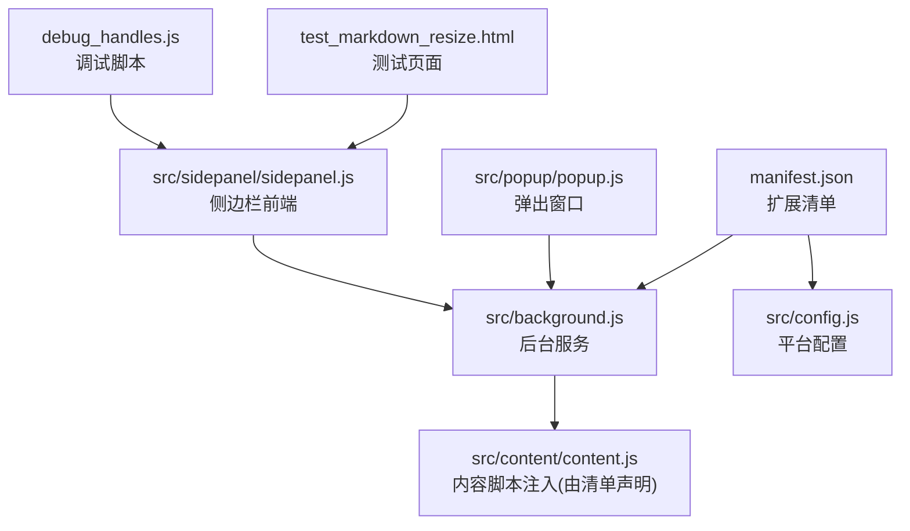
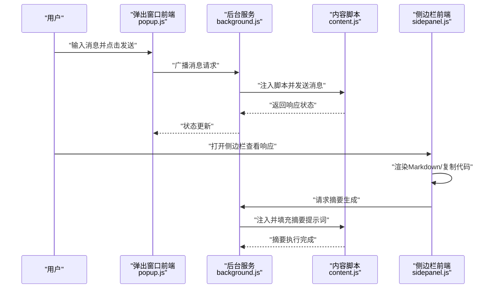
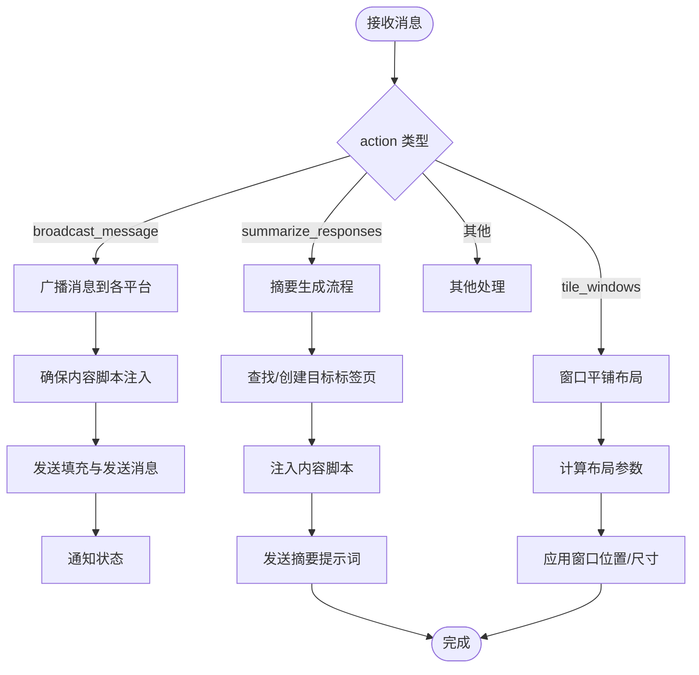
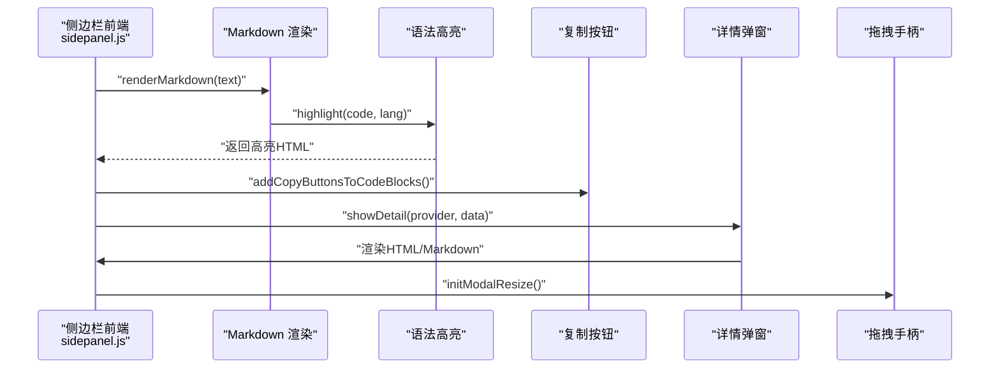
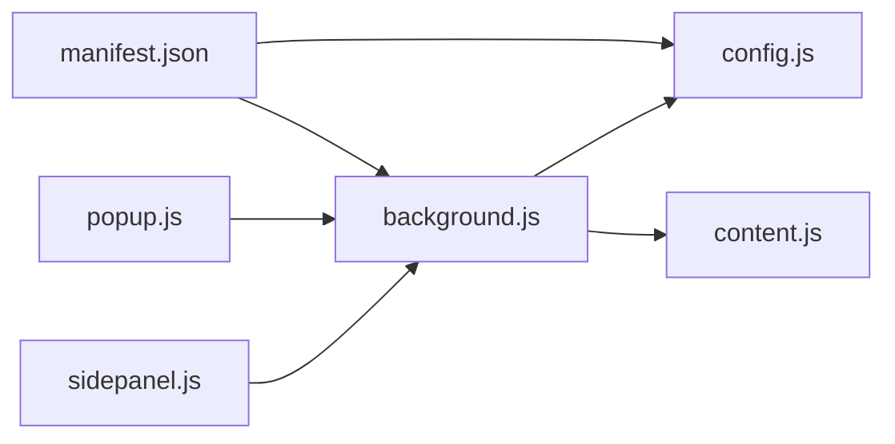

# 自动化测试

<cite>
**本文档引用的文件**
- [README.md](file://README.md)
- [CONTRIBUTING.md](file://CONTRIBUTING.md)
- [manifest.json](file://manifest.json)
- [src/config.js](file://src/config.js)
- [src/background.js](file://src/background.js)
- [src/sidepanel/sidepanel.js](file://src/sidepanel/sidepanel.js)
- [src/popup/popup.js](file://src/popup/popup.js)
- [QUICK_TEST_GUIDE.md](file://QUICK_TEST_GUIDE.md)
- [TESTING_v1.7.md](file://TESTING_v1.7.md)
- [User_UAT_Checklist.md](file://User_UAT_Checklist.md)
- [debug_handles.js](file://debug_handles.js)
- [test_markdown_resize.html](file://test_markdown_resize.html)
- [test_hover_buttons.html](file://test_hover_buttons.html)
- [test_history_buttons.html](file://test_history_buttons.html)
- [.kiro/specs/ui-improvements/design.md](file://.kiro/specs/ui-improvements/design.md)
- [.kiro/specs/modal-navigation/tasks.md](file://.kiro/specs/modal-navigation/tasks.md)
</cite>

## 目录
1. [简介](#简介)
2. [项目结构](#项目结构)
3. [核心组件](#核心组件)
4. [架构总览](#架构总览)
5. [详细组件分析](#详细组件分析)
6. [依赖分析](#依赖分析)
7. [性能考虑](#性能考虑)
8. [故障排查指南](#故障排查指南)
9. [结论](#结论)
10. [附录](#附录)

## 简介
本文件面向自动化测试实施，结合仓库现有的手动测试与用户验收材料，系统化梳理测试框架选择与配置、测试脚本编写规范、测试执行策略、CI/CD集成方法、回归测试策略、性能测试自动化方案、测试数据与环境管理、以及测试覆盖率与质量度量方法。目标是在不改变现有扩展架构的前提下，建立可落地、可维护、可扩展的自动化测试体系。

## 项目结构
该项目为 Chrome 扩展，采用原生 JavaScript、HTML、CSS 构建，无构建工具，结构清晰、模块职责明确：
- manifest.json：扩展清单，声明权限、匹配规则、内容脚本注入时机等
- src/config.js：统一的 AI 平台配置中心，包含各平台的选择器、提交方式、文件支持等
- src/background.js：后台服务工作线程，负责窗口管理、消息分发、脚本注入、摘要生成等
- src/sidepanel/sidepanel.js：侧边栏前端逻辑，包含 Markdown 渲染、代码复制、响应详情弹窗、导航控制器等
- src/popup/popup.js：弹出窗口前端逻辑，负责广播消息、状态展示
- 测试辅助页面与脚本：用于手动测试与调试（如 test_markdown_resize.html、debug_handles.js）

图表来源
- [manifest.json](file://manifest.json#L45-L68)
- [src/background.js](file://src/background.js#L69-L74)
- [src/config.js](file://src/config.js#L1-L204)
- [src/popup/popup.js](file://src/popup/popup.js#L1-L61)
- [src/sidepanel/sidepanel.js](file://src/sidepanel/sidepanel.js#L1-L800)
- [test_markdown_resize.html](file://test_markdown_resize.html)
- [debug_handles.js](file://debug_handles.js#L1-L73)

章节来源
- [README.md](file://README.md#L20-L29)
- [manifest.json](file://manifest.json#L1-L79)

## 核心组件
- 平台配置中心（AI_CONFIG）：集中管理各 AI 平台的 URL 模式、基础 URL、输入/发送选择器、文件上传支持等，是自动化测试的关键数据源
- 后台服务（background）：负责跨标签页通信、脚本注入、摘要生成、窗口布局等，是端到端测试的中枢
- 侧边栏前端（sidepanel）：负责 Markdown 渲染、代码复制、响应详情弹窗、导航控制器等，是 UI 自动化测试的重点
- 弹出窗口前端（popup）：负责广播消息、状态展示，是交互测试的入口之一
- 测试辅助页面与脚本：提供独立的 UI 场景验证与调试能力

章节来源
- [src/config.js](file://src/config.js#L1-L204)
- [src/background.js](file://src/background.js#L138-L197)
- [src/sidepanel/sidepanel.js](file://src/sidepanel/sidepanel.js#L41-L390)
- [src/popup/popup.js](file://src/popup/popup.js#L1-L61)

## 架构总览
下图展示了扩展的端到端交互路径，便于设计自动化测试场景：

图表来源
- [src/popup/popup.js](file://src/popup/popup.js#L16-L45)
- [src/background.js](file://src/background.js#L138-L197)
- [src/background.js](file://src/background.js#L718-L786)
- [src/sidepanel/sidepanel.js](file://src/sidepanel/sidepanel.js#L530-L633)

## 详细组件分析

### 平台配置（AI_CONFIG）与测试数据管理
- 配置要点：包含各平台的 URL 模式、基础 URL、输入/发送选择器、文件上传支持、提交方式等
- 测试数据管理建议：
  - 将各平台选择器与提交方式作为“测试数据”，在自动化测试中按需读取
  - 为每个平台维护“最小可用用例集”，覆盖输入框定位、发送按钮点击、响应提取等关键路径
  - 通过配置驱动测试，减少硬编码，提升可维护性

章节来源
- [src/config.js](file://src/config.js#L5-L199)

### 后台服务（background）与消息流
- 关键职责：监听消息、广播消息、脚本注入、摘要生成、窗口布局
- 自动化测试关注点：
  - 消息监听与响应：验证 action 分发、异步回调、错误处理
  - 脚本注入：验证注入时机、注入成功/失败分支
  - 摘要生成：验证目标标签页发现、内容脚本注入、消息发送
  - 窗口布局：验证多显示器、窗口发现与布局计算

图表来源
- [src/background.js](file://src/background.js#L138-L197)
- [src/background.js](file://src/background.js#L718-L786)
- [src/background.js](file://src/background.js#L298-L376)
- [src/background.js](file://src/background.js#L527-L643)

章节来源
- [src/background.js](file://src/background.js#L138-L197)
- [src/background.js](file://src/background.js#L656-L716)

### 侧边栏前端（sidepanel）与 UI 自动化
- 关键职责：Markdown 渲染、代码复制、响应详情弹窗、导航控制器、拖拽手柄初始化
- 自动化测试关注点：
  - Markdown 渲染：验证 marked.js 与 DOMPurify 配置、语法高亮、回退逻辑
  - 代码复制：验证复制按钮创建、剪贴板写入、UI 反馈
  - 详情弹窗：验证内容渲染（HTML/Markdown）、导航控件、复制按钮
  - 拖拽手柄：验证初始化、可见性、拖拽行为、宽度约束

图表来源
- [src/sidepanel/sidepanel.js](file://src/sidepanel/sidepanel.js#L64-L135)
- [src/sidepanel/sidepanel.js](file://src/sidepanel/sidepanel.js#L136-L187)
- [src/sidepanel/sidepanel.js](file://src/sidepanel/sidepanel.js#L530-L633)
- [src/sidepanel/sidepanel.js](file://src/sidepanel/sidepanel.js#L629-L633)

章节来源
- [src/sidepanel/sidepanel.js](file://src/sidepanel/sidepanel.js#L41-L390)

### 弹出窗口前端（popup）与交互测试
- 关键职责：加载已选平台、发送消息、接收状态更新
- 自动化测试关注点：
  - 平台选择持久化：验证本地存储读写
  - 发送流程：验证消息广播、禁用/启用按钮、状态展示

章节来源
- [src/popup/popup.js](file://src/popup/popup.js#L1-L61)

### 测试辅助页面与调试脚本
- test_markdown_resize.html：用于验证 Markdown 渲染、拖拽手柄、复制按钮等 UI 行为
- debug_handles.js：用于调试手柄状态、CSS 样式、层级关系等

章节来源
- [QUICK_TEST_GUIDE.md](file://QUICK_TEST_GUIDE.md#L20-L139)
- [debug_handles.js](file://debug_handles.js#L1-L73)
- [test_markdown_resize.html](file://test_markdown_resize.html)

## 依赖分析
- manifest.json 声明了内容脚本注入时机（document_idle）与 host 权限，直接影响自动化测试的启动顺序与稳定性
- src/config.js 作为全局配置，被后台与内容脚本共享，是测试数据与断言的重要依据
- src/background.js 依赖 chrome.* API，自动化测试需在受支持的环境中运行

图表来源
- [manifest.json](file://manifest.json#L45-L68)
- [src/background.js](file://src/background.js#L69-L74)
- [src/config.js](file://src/config.js#L1-L204)
- [src/popup/popup.js](file://src/popup/popup.js#L1-L61)
- [src/sidepanel/sidepanel.js](file://src/sidepanel/sidepanel.js#L1-L800)

章节来源
- [manifest.json](file://manifest.json#L1-L79)
- [src/config.js](file://src/config.js#L1-L204)

## 性能考虑
- 自动化测试应避免阻塞主线程，优先使用异步等待与超时控制
- UI 自动化测试应尽量减少 DOM 查询次数，批量断言
- 跨标签页通信测试需考虑注入延迟与页面加载状态
- 性能测试可结合现有用户验收测试中的性能指标（如大文件预览时间、内存占用）进行回归

## 故障排查指南
- 手柄不可见或无法拖拽：参考调试脚本与快速测试指南，检查 modal 状态、CSS 样式、z-index、遮挡元素
- Markdown 渲染异常：确认 marked.js 与 DOMPurify 加载顺序与版本兼容
- 摘要生成失败：检查目标标签页发现、内容脚本注入、消息发送

章节来源
- [QUICK_TEST_GUIDE.md](file://QUICK_TEST_GUIDE.md#L66-L139)
- [debug_handles.js](file://debug_handles.js#L1-L73)

## 结论
本项目具备良好的模块化结构与丰富的手动测试材料，适合在此基础上引入自动化测试。建议以“配置驱动 + 端到端 + UI 自动化”的组合策略推进，逐步完善 CI/CD 集成与性能测试自动化，并建立持续的质量度量体系。

## 附录

### 自动化测试框架选择与配置
- 建议框架：Playwright（支持 Chromium，天然契合 Chrome 扩展测试）
- 配置要点：
  - 使用 chromium 通道，启用扩展加载（load extension）
  - 设置合适的 viewport 与设备模拟
  - 为侧边栏与弹出窗口分别准备测试上下文
- 测试脚本编写规范：
  - 以“场景”为单位组织测试，每个场景包含前置条件、步骤、断言
  - 使用配置驱动的数据，避免硬编码
  - 为关键流程（消息广播、摘要生成、Markdown 渲染）编写独立测试文件

### 测试执行策略
- 单元测试：针对 sidepanel 的 Markdown 渲染、复制按钮、导航控制器等函数
- 集成测试：针对 background 的消息分发、脚本注入、摘要生成流程
- 端到端测试：覆盖从弹出窗口到各 AI 平台的完整交互
- 回归测试：基于现有用户验收测试清单与快速测试指南，建立回归用例矩阵

### CI/CD 集成方法
- GitHub Actions 工作流建议：
  - 任务：安装依赖、构建（如需）、运行单元/集成/UI 测试、生成报告
  - 环境：使用 Ubuntu Runner，启用 Chrome 扩展加载
  - 缓存：缓存 node_modules 与 Playwright 浏览器缓存
- 自动化测试流水线：
  - 触发：push 到主分支或 PR
  - 并行：按测试类型拆分 job 并行执行
  - 报告：生成 JUnit/HTML 报告并上传 Artifacts
- 测试结果报告生成：使用 Playwright 的内置报告器或第三方报告工具

### 回归测试策略设计
- 用例优先级：
  - 高优先级：消息广播、摘要生成、Markdown 渲染、跨平台兼容
  - 中优先级：文件上传、拖拽手柄、UI 交互
  - 低优先级：国际化、主题切换
- 执行频率：
  - 主分支：全量回归（每日或每次重大变更）
  - PR：关键路径回归（快速验证）
  - 端到端：每周一次

### 性能测试自动化方案
- 负载测试：模拟多平台并发发送，测量平均/95 分位响应时间
- 压力测试：逐步增加消息速率与文件大小，观察内存与 CPU 使用
- 基准测试：固定场景下对比不同平台的渲染与交互性能
- 指标采集：结合现有用户验收测试指标（如大文件预览时间、内存占用）建立基线

### 测试数据管理与测试环境自动化
- 测试数据管理：
  - 将各平台选择器与提交方式抽取为配置文件，按需加载
  - 为敏感字段（如 API Key）使用环境变量或占位符
- 测试环境自动化：
  - 使用 Docker 或 GitHub Actions Matrix 为不同平台准备测试环境
  - 通过 manifest 的 host 权限与 content_scripts 匹配规则，确保注入生效

### 测试覆盖率监控与测试质量度量
- 覆盖率：
  - 单元测试：语句/分支/函数/行覆盖率
  - UI 自动化：关键交互路径覆盖率
- 质量度量：
  - 测试通过率、失败率、重试率
  - 平均执行时间、最长执行时间
  - 缺陷密度、修复时间