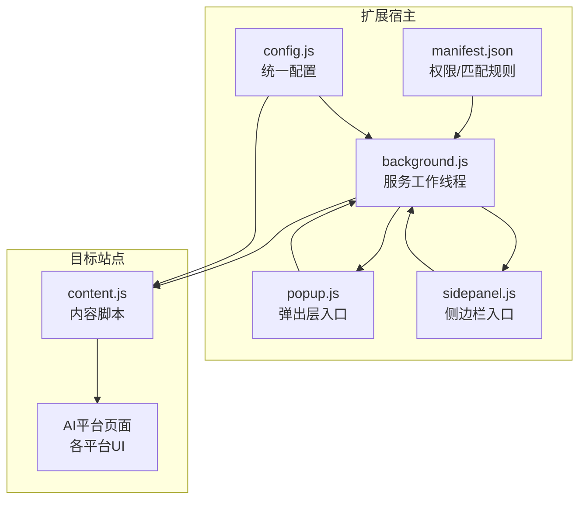
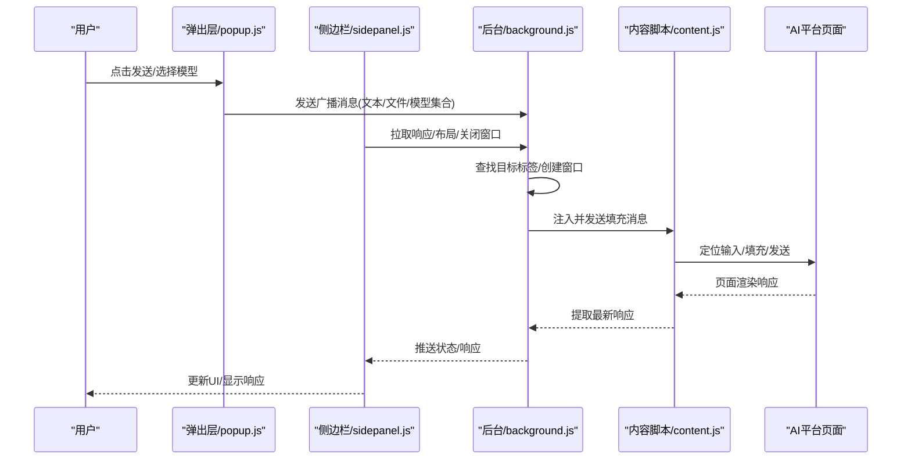
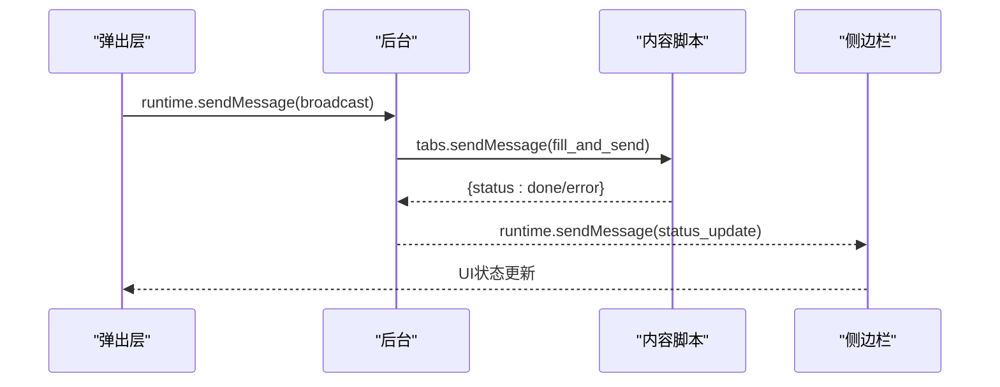
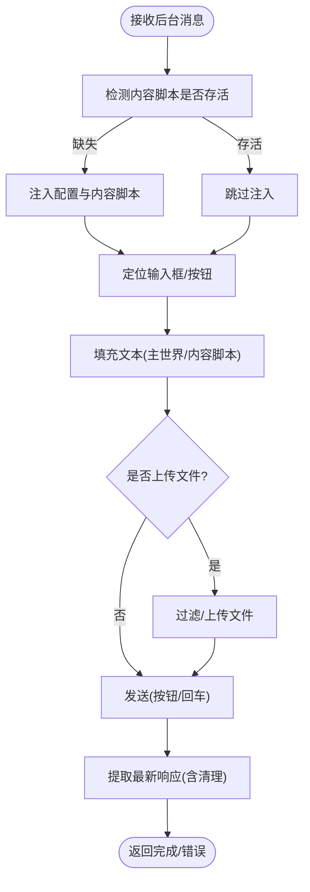
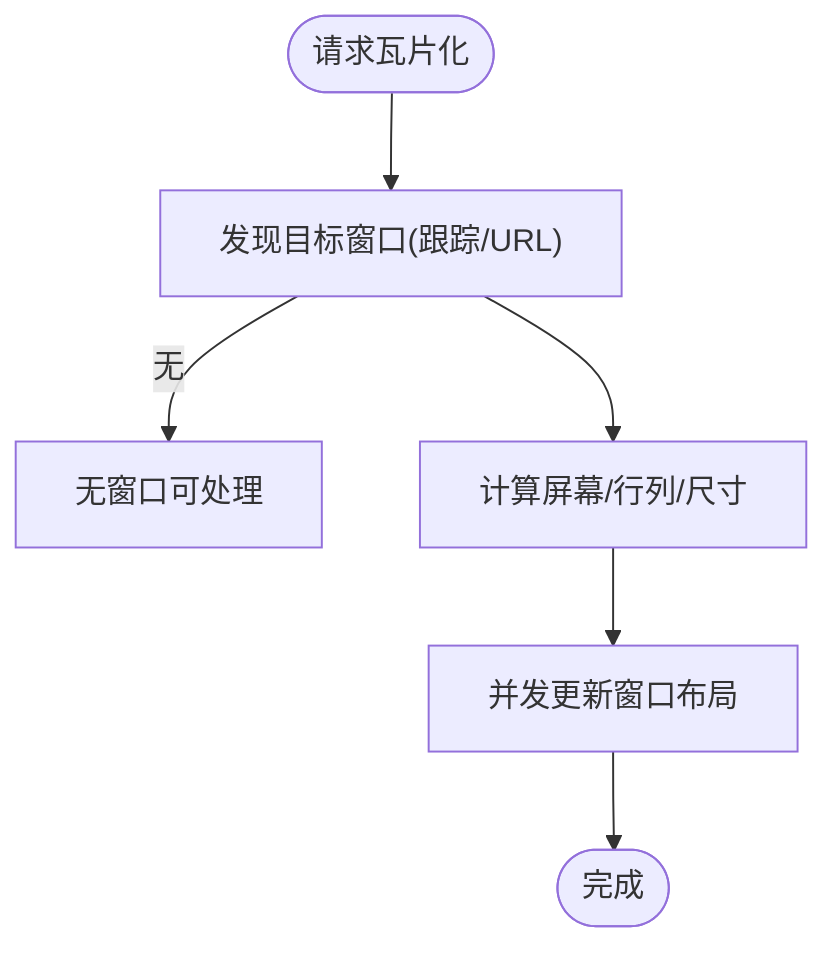
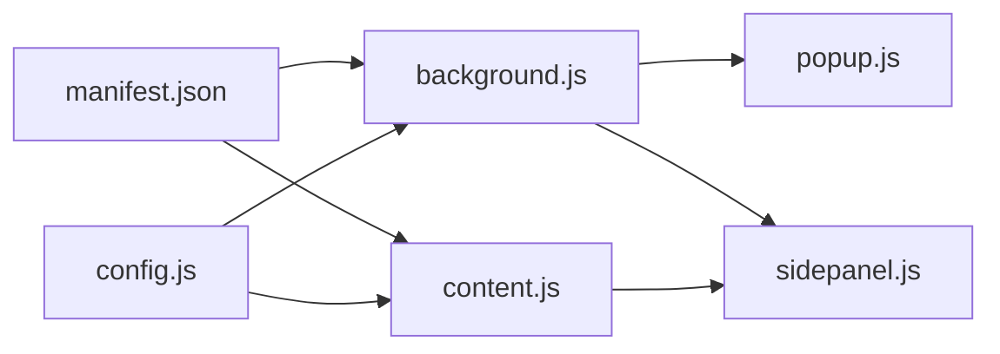

# 集成测试

<cite>
**本文引用的文件**
- [README.md](file://README.md)
- [manifest.json](file://manifest.json)
- [src/background.js](file://src/background.js)
- [src/content/content.js](file://src/content/content.js)
- [src/popup/popup.js](file://src/popup/popup.js)
- [src/sidepanel/sidepanel.js](file://src/sidepanel/sidepanel.js)
- [src/config.js](file://src/config.js)
- [QUICK_TEST_GUIDE.md](file://QUICK_TEST_GUIDE.md)
- [test_markdown_resize.html](file://test_markdown_resize.html)
- [User_UAT_Checklist.md](file://User_UAT_Checklist.md)
</cite>

## 目录
1. [简介](#简介)
2. [项目结构](#项目结构)
3. [核心组件](#核心组件)
4. [架构总览](#架构总览)
5. [详细组件分析](#详细组件分析)
6. [依赖关系分析](#依赖关系分析)
7. [性能考虑](#性能考虑)
8. [故障排查指南](#故障排查指南)
9. [结论](#结论)
10. [附录](#附录)

## 简介
本集成测试文档面向“AI Multiverse Chat”Chrome扩展，围绕组件间交互、消息传递与状态同步进行系统化测试设计，覆盖从扩展启动到AI响应获取的完整端到端流程。文档同时提供Chrome扩展API与第三方AI平台接口的测试方法、测试数据与环境管理建议、以及性能与压力测试策略。

## 项目结构
该项目采用极简架构：manifest声明权限与内容脚本注入，后台服务工作线程协调窗口与消息，弹出层与侧边栏作为用户入口，内容脚本在目标AI站点内自动化输入与提交，统一配置集中于全局配置模块。

图表来源
- [manifest.json](file://manifest.json#L1-L79)
- [src/background.js](file://src/background.js#L1-L120)
- [src/popup/popup.js](file://src/popup/popup.js#L1-L61)
- [src/sidepanel/sidepanel.js](file://src/sidepanel/sidepanel.js#L1-L120)
- [src/config.js](file://src/config.js#L1-L204)
- [src/content/content.js](file://src/content/content.js#L1-L60)

章节来源
- [README.md](file://README.md#L20-L29)
- [manifest.json](file://manifest.json#L1-L79)

## 核心组件
- 后台服务工作线程：负责窗口管理、消息监听、跨标签页通信、脚本注入与状态通知。
- 内容脚本：在AI站点内定位输入框、填充文本、触发发送、提取响应。
- 弹出层与侧边栏：用户输入与操作入口，发起广播、拉取响应、执行布局与关闭等动作。
- 统一配置：定义各AI平台的选择器、提交方式、文件上传能力等。

章节来源
- [src/background.js](file://src/background.js#L138-L197)
- [src/content/content.js](file://src/content/content.js#L199-L216)
- [src/popup/popup.js](file://src/popup/popup.js#L16-L45)
- [src/sidepanel/sidepanel.js](file://src/sidepanel/sidepanel.js#L1198-L1200)
- [src/config.js](file://src/config.js#L5-L199)

## 架构总览
下图展示从用户操作到AI响应获取的端到端流程，包括消息传递、脚本注入、状态同步与UI更新。

图表来源
- [src/popup/popup.js](file://src/popup/popup.js#L30-L44)
- [src/sidepanel/sidepanel.js](file://src/sidepanel/sidepanel.js#L1198-L1200)
- [src/background.js](file://src/background.js#L138-L197)
- [src/content/content.js](file://src/content/content.js#L218-L320)

## 详细组件分析

### 组件A：消息传递与状态同步
- 背景到内容：后台通过标签页消息发送“填充并发送”指令，内容脚本返回“完成/错误”状态。
- 前端到后台：弹出层与侧边栏通过运行时消息发起广播、拉取响应、布局与关闭窗口。
- 状态推送：后台将各模型发送状态推送到前端UI，实现可视化反馈。

图表来源
- [src/popup/popup.js](file://src/popup/popup.js#L30-L44)
- [src/background.js](file://src/background.js#L138-L197)
- [src/content/content.js](file://src/content/content.js#L199-L216)

章节来源
- [src/popup/popup.js](file://src/popup/popup.js#L16-L60)
- [src/background.js](file://src/background.js#L138-L197)
- [src/content/content.js](file://src/content/content.js#L199-L216)

### 组件B：脚本注入与页面交互
- 注入策略：后台检测内容脚本存活，必要时注入配置与内容脚本；内容脚本监听消息并执行填充与发送。
- 选择器与提交：依据统一配置选择输入框与发送按钮，处理异步UI与禁用态，确保唯一发送。
- 响应提取：按平台选择器提取最新响应，清理思维/推理片段，支持回退选择器。

图表来源
- [src/background.js](file://src/background.js#L657-L678)
- [src/content/content.js](file://src/content/content.js#L322-L418)
- [src/content/content.js](file://src/content/content.js#L218-L320)
- [src/config.js](file://src/config.js#L5-L199)

章节来源
- [src/background.js](file://src/background.js#L657-L678)
- [src/content/content.js](file://src/content/content.js#L322-L418)
- [src/content/content.js](file://src/content/content.js#L218-L320)
- [src/config.js](file://src/config.js#L5-L199)

### 组件C：窗口管理与布局
- 瓦片化布局：根据显示器与窗口集合计算网格布局，批量更新窗口位置与尺寸。
- 窗口发现：优先使用跟踪ID，其次按URL模式匹配，排除扩展自身标签与内部页。
- 关闭与复用：支持一键关闭所有窗口，复用现有窗口减少重复创建。

图表来源
- [src/background.js](file://src/background.js#L528-L643)

章节来源
- [src/background.js](file://src/background.js#L528-L643)

### 组件D：统一配置与平台适配
- 配置结构：每平台包含名称、图标、URL模式、基础URL、选择器、填充/提交方式、文件支持与类型。
- 适配策略：针对不同平台UI差异（React/编辑器/异步按钮）采用差异化填充与发送策略。

章节来源
- [src/config.js](file://src/config.js#L5-L199)

### 组件E：前端UI与交互
- 侧边栏：主题/语言切换、模型选择、文件拖拽/附件、响应展示与详情模态、导航控制器、可调整详情窗口宽度。
- 弹出层：发起广播、接收状态更新、显示发送进度与结果。

章节来源
- [src/sidepanel/sidepanel.js](file://src/sidepanel/sidepanel.js#L1-L120)
- [src/sidepanel/sidepanel.js](file://src/sidepanel/sidepanel.js#L800-L990)
- [src/sidepanel/sidepanel.js](file://src/sidepanel/sidepanel.js#L1057-L1196)
- [src/popup/popup.js](file://src/popup/popup.js#L1-L61)

## 依赖关系分析
- manifest声明权限与内容脚本注入范围，决定后台与内容脚本的协作边界。
- 后台依赖配置模块进行平台适配，依赖运行时API进行消息与窗口管理。
- 内容脚本依赖配置模块与运行时API进行消息与脚本注入。
- 前端UI依赖内容脚本与后台提供的状态与响应数据。

图表来源
- [manifest.json](file://manifest.json#L12-L68)
- [src/background.js](file://src/background.js#L69-L74)
- [src/content/content.js](file://src/content/content.js#L1-L10)
- [src/config.js](file://src/config.js#L1-L10)
- [src/popup/popup.js](file://src/popup/popup.js#L1-L10)
- [src/sidepanel/sidepanel.js](file://src/sidepanel/sidepanel.js#L1-L10)

章节来源
- [manifest.json](file://manifest.json#L12-L68)
- [src/background.js](file://src/background.js#L69-L74)
- [src/content/content.js](file://src/content/content.js#L1-L10)
- [src/config.js](file://src/config.js#L1-L10)
- [src/popup/popup.js](file://src/popup/popup.js#L1-L10)
- [src/sidepanel/sidepanel.js](file://src/sidepanel/sidepanel.js#L1-L10)

## 性能考虑
- 并发与批处理：后台在处理多个平台时使用并行任务与Promise.allSettled，降低整体延迟。
- 注入与等待：注入后等待页面加载完成，避免过早交互导致失败。
- 重试与超时：文件上传设置最大重试次数与超时，平衡稳定性与用户体验。
- UI渲染：Markdown渲染与高亮在侧边栏初始化时进行，避免重复配置。

章节来源
- [src/background.js](file://src/background.js#L718-L721)
- [src/background.js](file://src/background.js#L680-L716)
- [src/content/content.js](file://src/content/content.js#L616-L672)
- [src/sidepanel/sidepanel.js](file://src/sidepanel/sidepanel.js#L5-L39)

## 故障排查指南
- 内容脚本未注入
  - 现象：后台报告注入失败或内容脚本未响应。
  - 排查：确认manifest内容脚本匹配规则、后台注入逻辑、页面URL是否命中。
- 响应提取为空
  - 现象：提取响应为空或无文本。
  - 排查：使用诊断工具检查选择器有效性，确认页面是否加载完成，是否存在思维/推理片段需清理。
- 发送按钮不可用
  - 现象：按钮禁用或异步状态未就绪。
  - 排查：检查平台选择器与禁用态判定，适当增加等待时间或回退至回车提交。
- 窗口布局异常
  - 现象：瓦片化后窗口未正确排列或焦点异常。
  - 排查：确认显示器信息获取、窗口发现逻辑与并发更新顺序。

章节来源
- [src/background.js](file://src/background.js#L657-L678)
- [src/content/content.js](file://src/content/content.js#L126-L197)
- [src/content/content.js](file://src/content/content.js#L465-L565)
- [src/background.js](file://src/background.js#L528-L643)

## 结论
本集成测试文档提供了从消息传递、脚本注入、窗口管理到UI交互的全链路测试策略。通过明确的端到端流程、API测试方法与性能优化建议，可系统性保障扩展在多平台场景下的稳定性与一致性。

## 附录

### A. 端到端流程测试清单
- 启动与入口
  - 打开扩展侧边栏，确认UI加载与主题/语言状态。
- 广播发送
  - 选择多个模型，输入文本与文件，点击发送，观察后台状态推送与各模型响应提取。
- 响应获取
  - 切换到响应视图，核对各模型响应文本/HTML长度与状态。
- 布局与关闭
  - 执行瓦片化布局，检查窗口排列；执行关闭所有窗口，确认资源回收。
- 文件上传
  - 按用户验收测试清单逐项验证文件类型、大小限制与平台适配。

章节来源
- [src/popup/popup.js](file://src/popup/popup.js#L16-L45)
- [src/sidepanel/sidepanel.js](file://src/sidepanel/sidepanel.js#L1198-L1200)
- [src/background.js](file://src/background.js#L138-L197)
- [src/content/content.js](file://src/content/content.js#L218-L320)
- [User_UAT_Checklist.md](file://User_UAT_Checklist.md#L105-L191)

### B. Chrome扩展API测试方法
- 运行时消息
  - 使用运行时消息接口验证前后端双向通信，断言响应结构与状态码。
- 标签页与窗口
  - 创建/查询/更新窗口与标签页，验证URL匹配与窗口状态。
- 脚本注入
  - 执行脚本注入并验证内容脚本存活，捕获注入失败场景。
- 存储与本地存储
  - 读写本地存储验证偏好设置与宽度持久化。

章节来源
- [src/background.js](file://src/background.js#L138-L197)
- [src/background.js](file://src/background.js#L657-L678)
- [src/sidepanel/sidepanel.js](file://src/sidepanel/sidepanel.js#L1057-L1196)

### C. 第三方AI平台接口模拟测试
- 选择器有效性
  - 使用测试页面验证各平台选择器在不同UI版本下的稳定性。
- 响应提取
  - 模拟不同响应结构，验证清理逻辑与回退策略。
- 文件上传
  - 模拟上传流程（成功/失败/超时），验证重试与错误提示。

章节来源
- [test_markdown_resize.html](file://test_markdown_resize.html#L113-L280)
- [src/content/content.js](file://src/content/content.js#L616-L742)
- [src/content/content.js](file://src/content/content.js#L126-L197)

### D. 测试数据与环境隔离
- 测试数据
  - 使用最小化文本与典型文件（图片/PDF/代码）进行端到端验证。
- 环境隔离
  - 为不同平台准备独立的测试页面或本地mock，避免相互干扰。
- 本地存储
  - 在测试前清理本地存储，确保测试结果可重复。

章节来源
- [src/sidepanel/sidepanel.js](file://src/sidepanel/sidepanel.js#L1057-L1196)
- [QUICK_TEST_GUIDE.md](file://QUICK_TEST_GUIDE.md#L20-L46)

### E. 性能与压力测试
- 并发发送
  - 同时向多个平台发送消息，统计平均耗时与失败率。
- 大文件上传
  - 逐步增大文件大小，测量上传耗时与超时重试次数。
- UI渲染
  - 大量Markdown渲染与高亮，监控渲染时间与内存占用。

章节来源
- [src/background.js](file://src/background.js#L718-L721)
- [src/content/content.js](file://src/content/content.js#L616-L672)
- [User_UAT_Checklist.md](file://User_UAT_Checklist.md#L256-L274)