# 主题切换系统

<cite>
**本文档引用的文件**
- [manifest.json](file://manifest.json)
- [sidepanel.css](file://src/sidepanel/sidepanel.css)
- [sidepanel.js](file://src/sidepanel/sidepanel.js)
- [sidepanel.html](file://src/sidepanel/sidepanel.html)
- [background.js](file://src/background.js)
- [i18n.js](file://src/i18n.js)
- [config.js](file://src/config.js)
</cite>

## 目录
1. [简介](#简介)
2. [项目结构](#项目结构)
3. [核心组件](#核心组件)
4. [架构概览](#架构概览)
5. [详细组件分析](#详细组件分析)
6. [依赖关系分析](#依赖关系分析)
7. [性能考虑](#性能考虑)
8. [故障排除指南](#故障排除指南)
9. [结论](#结论)

## 简介

AI Multiverse Chat 扩展的主题切换系统是一个基于 CSS 变量的现代化主题管理解决方案。该系统实现了完整的暗色/亮色主题切换功能，包括主题变量定义、作用域管理、动态切换机制和用户偏好持久化。

系统采用 CSS 自定义属性（CSS Variables）作为核心技术，通过 `:root` 和 `[data-theme]` 选择器实现主题变量的作用域控制。主题切换通过 JavaScript 动态修改 `data-theme` 属性来实现，确保了高性能的样式切换体验。

## 项目结构

主题系统主要分布在以下文件中：

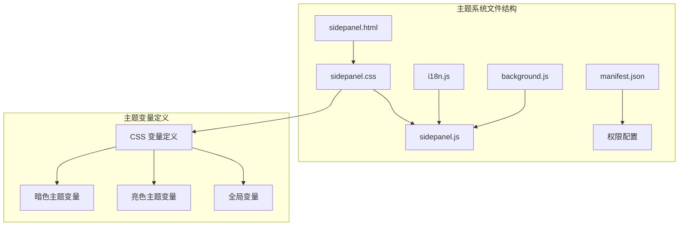

**图表来源**
- [sidepanel.html](file://src/sidepanel/sidepanel.html#L1-L400)
- [sidepanel.css](file://src/sidepanel/sidepanel.css#L1-L100)

**章节来源**
- [sidepanel.html](file://src/sidepanel/sidepanel.html#L1-L400)
- [sidepanel.css](file://src/sidepanel/sidepanel.css#L1-L100)
- [sidepanel.js](file://src/sidepanel/sidepanel.js#L1833-L1862)

## 核心组件

### CSS 变量系统

主题系统的核心是基于 CSS 自定义属性的变量系统。系统定义了完整的变量层次结构：

#### 主题变量层次结构

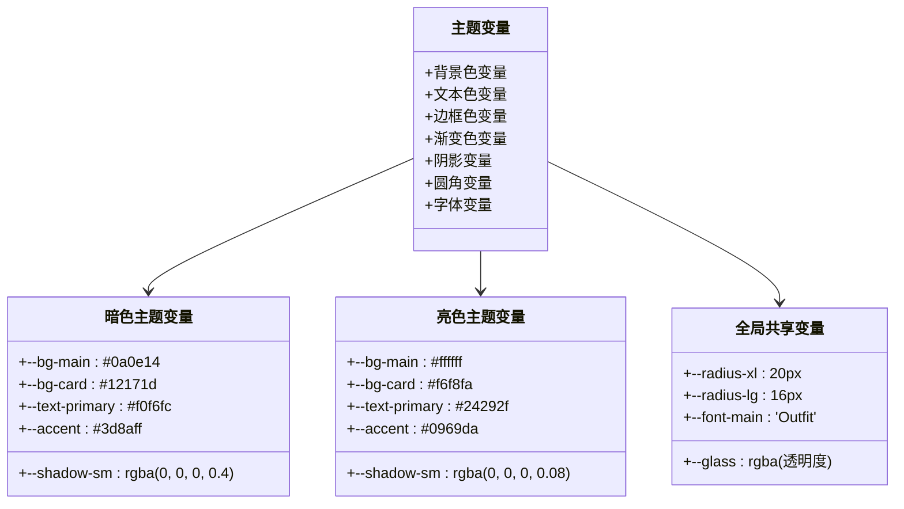

**图表来源**
- [sidepanel.css](file://src/sidepanel/sidepanel.css#L1-L100)

#### 颜色映射表

系统实现了完整的颜色映射体系：

| 颜色类别 | 暗色主题值 | 亮色主题值 | 用途 |
|---------|-----------|-----------|------|
| 主色调 | #3d8aff | #0969da | 主要交互元素 |
| 成功色 | #2ea043 | #1a7f37 | 成功状态 |
| 错误色 | #da3633 | #cf222e | 错误状态 |
| 警告色 | #ffc107 | #ffc107 | 警告状态 |
| 背景色主 | #0a0e14/#ffffff | #0a0e14/#ffffff | 页面主背景 |
| 卡片背景 | #12171d/#f6f8fa | #12171d/#f6f8fa | 卡片容器 |
| 文本主色 | #f0f6fc/#24292f | #f0f6fc/#24292f | 主要文本 |

**章节来源**
- [sidepanel.css](file://src/sidepanel/sidepanel.css#L1-L100)

### 主题切换机制

主题切换通过以下三个层面协同工作：

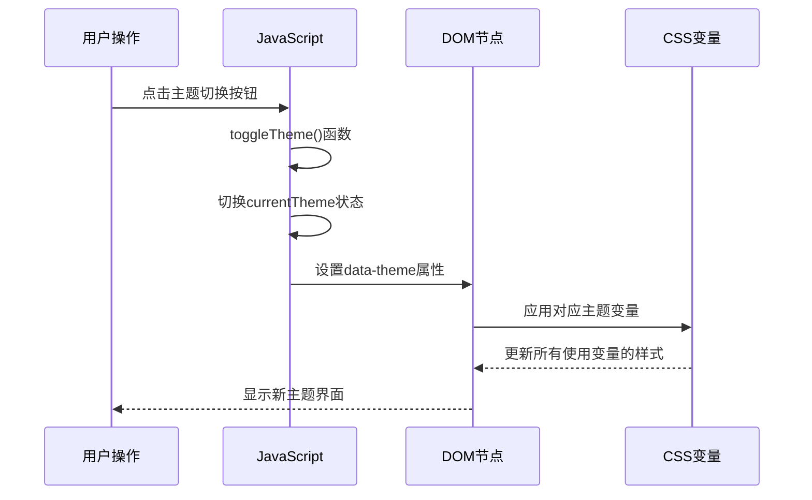

**图表来源**
- [sidepanel.js](file://src/sidepanel/sidepanel.js#L1842-L1862)

**章节来源**
- [sidepanel.js](file://src/sidepanel/sidepanel.js#L1842-L1862)

## 架构概览

### 整体架构设计

```mermaid
graph TB
subgraph "用户界面层"
A[主题切换按钮]
B[图标显示]
C[状态指示器]
end
subgraph "业务逻辑层"
D[loadTheme函数]
E[toggleTheme函数]
F[applyTheme函数]
end
subgraph "数据持久化层"
G[chrome.storage.local]
H[localStorage]
I[主题状态存储]
end
subgraph "样式渲染层"
J[:root选择器]
K[[data-theme]选择器]
L[C各种CSS变量]
end
A --> D
D --> E
E --> F
F --> G
G --> H
H --> I
I --> J
I --> K
K --> L
J --> L
```

**图表来源**
- [sidepanel.js](file://src/sidepanel/sidepanel.js#L1835-L1862)
- [sidepanel.css](file://src/sidepanel/sidepanel.css#L68-L100)

### 主题变量作用域管理

系统采用多层作用域管理机制：

```mermaid
flowchart TD
A[根级变量 :root] --> B[全局默认值]
C[主题级变量 [data-theme="dark"]] --> D[暗色主题专用值]
E[主题级变量 [data-theme="light"]] --> F[亮色主题专用值]
B --> G[继承到所有元素]
D --> G
F --> G
G --> H[元素级覆盖]
H --> I[局部样式优先]
style A fill:#e1f5fe
style C fill:#ffebee
style E fill:#e8f5e8
style G fill:#fff3e0
```

**图表来源**
- [sidepanel.css](file://src/sidepanel/sidepanel.css#L68-L100)

**章节来源**
- [sidepanel.css](file://src/sidepanel/sidepanel.css#L68-L100)

## 详细组件分析

### 主题切换核心逻辑

#### 加载主题函数

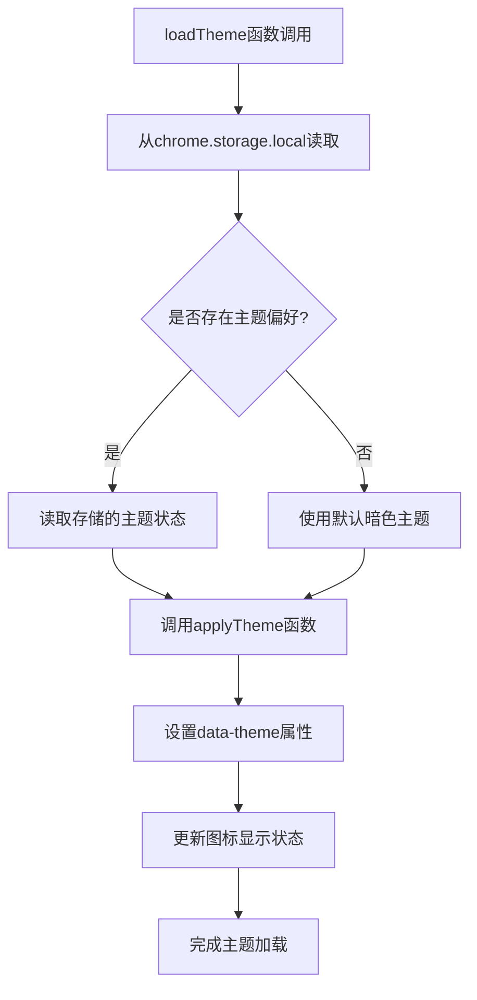

**图表来源**
- [sidepanel.js](file://src/sidepanel/sidepanel.js#L1835-L1840)

#### 主题切换函数

主题切换函数实现了完整的状态管理流程：

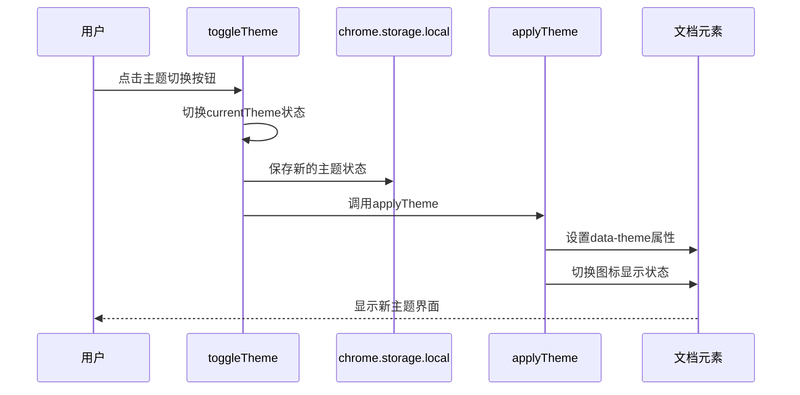

**图表来源**
- [sidepanel.js](file://src/sidepanel/sidepanel.js#L1842-L1862)

**章节来源**
- [sidepanel.js](file://src/sidepanel/sidepanel.js#L1835-L1862)

### 用户偏好持久化

#### 存储策略

系统采用双层存储策略确保主题状态的可靠持久化：

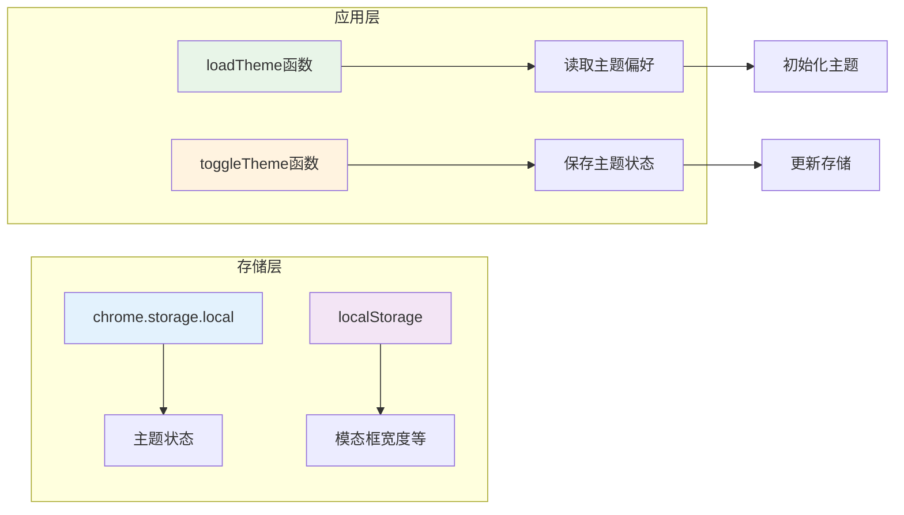

**图表来源**
- [sidepanel.js](file://src/sidepanel/sidepanel.js#L1835-L1846)

#### 状态同步机制

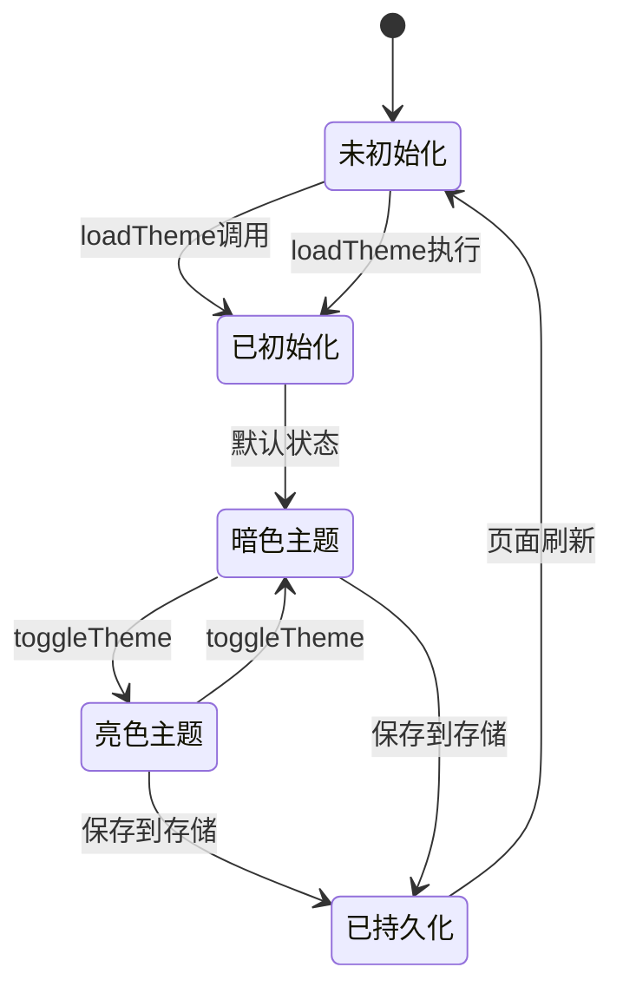

**图表来源**
- [sidepanel.js](file://src/sidepanel/sidepanel.js#L1835-L1846)

**章节来源**
- [sidepanel.js](file://src/sidepanel/sidepanel.js#L1835-L1846)

### 渐变色和阴影系统

#### 渐变色定义

系统实现了丰富的渐变色系统：

| 渐变类型 | 暗色主题 | 亮色主题 | 使用场景 |
|---------|---------|---------|---------|
| 主色调渐变 | linear-gradient(135deg, #3d8aff 0%, #2a7bd9 100%) | linear-gradient(135deg, #0969da 0%, #0050ba 100%) | 按钮、进度条 |
| 成功渐变 | linear-gradient(135deg, #2ea043 0%, #238636 100%) | linear-gradient(135deg, #1a7f37 0%, #116329 100%) | 成功状态 |
| 错误渐变 | linear-gradient(135deg, #da3633 0%, #b62324 100%) | linear-gradient(135deg, #cf222e 0%, #a40e26 100%) | 错误状态 |

#### 阴影效果系统

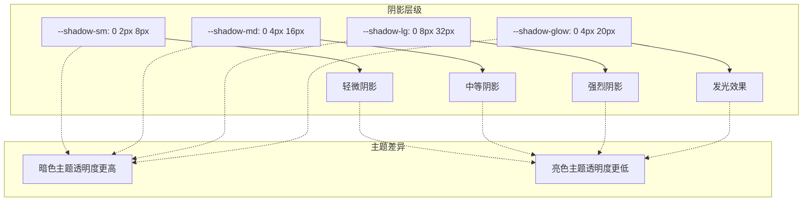

**图表来源**
- [sidepanel.css](file://src/sidepanel/sidepanel.css#L29-L66)

**章节来源**
- [sidepanel.css](file://src/sidepanel/sidepanel.css#L29-L66)

### 圆角系统

系统实现了完整的圆角层级体系：

| 圆角级别 | 数值 | 使用场景 |
|---------|------|---------|
| --radius-xl | 20px | 模态框、大容器 |
| --radius-lg | 16px | 卡片、按钮 |
| --radius-md | 12px | 输入框、表单元素 |
| --radius-sm | 8px | 徽章、小按钮 |
| --radius-xs | 6px | 微型元素 |

**章节来源**
- [sidepanel.css](file://src/sidepanel/sidepanel.css#L23-L61)

## 依赖关系分析

### 组件间依赖关系

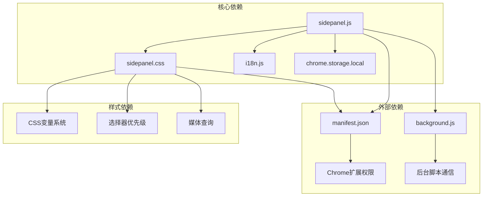

**图表来源**
- [sidepanel.js](file://src/sidepanel/sidepanel.js#L1-L50)
- [manifest.json](file://manifest.json#L12-L18)

### 权限配置

扩展需要以下权限支持主题系统：

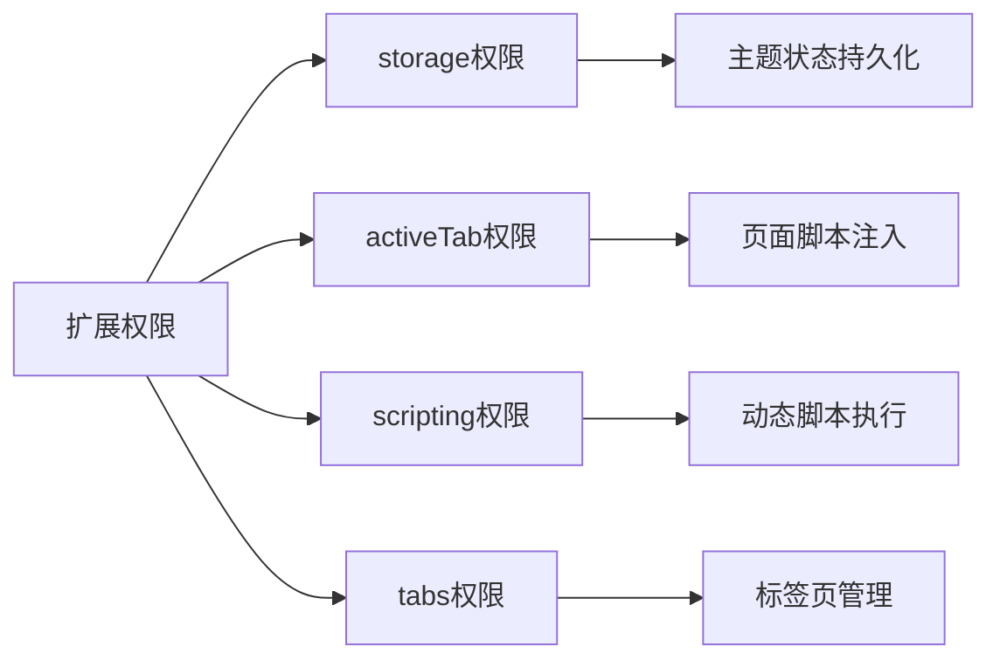

**图表来源**
- [manifest.json](file://manifest.json#L12-L18)

**章节来源**
- [manifest.json](file://manifest.json#L12-L18)

## 性能考虑

### CSS变量缓存机制

系统通过以下机制优化性能：

#### 变量访问优化

- **静态变量缓存**: CSS变量在编译时解析，运行时直接访问
- **选择器复用**: 通过类名复用而非重复定义变量
- **作用域优化**: 合理的作用域划分减少不必要的样式计算

#### 重绘最小化策略

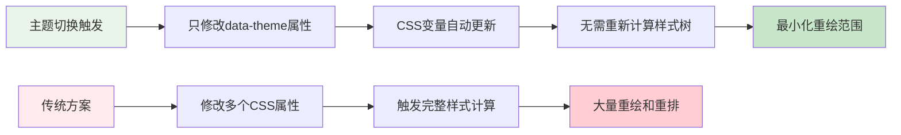

**图表来源**
- [sidepanel.js](file://src/sidepanel/sidepanel.js#L1848-L1862)

### 动画流畅度优化

#### 切换动画

系统实现了平滑的主题切换动画：

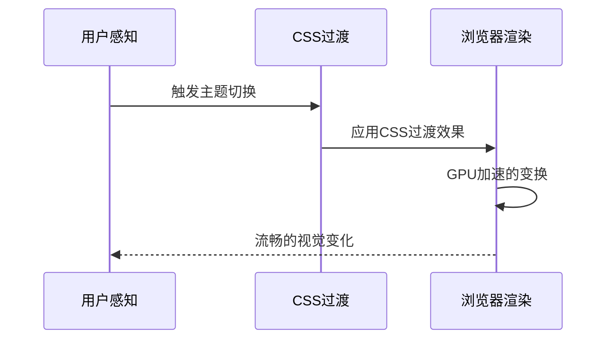

**图表来源**
- [sidepanel.css](file://src/sidepanel/sidepanel.css#L108-L115)

### 内存优化

- **变量复用**: 相同颜色值在不同主题间复用
- **选择器优化**: 避免深层嵌套选择器
- **样式压缩**: 生产环境样式文件经过压缩

## 故障排除指南

### 常见问题及解决方案

#### 主题状态不同步

**问题描述**: 切换主题后状态与预期不符

**解决方案**:
1. 检查 `chrome.storage.local` 中的主题状态
2. 验证 `loadTheme` 函数是否正确执行
3. 确认 `applyTheme` 函数中的 DOM 操作

#### 图标显示异常

**问题描述**: 主题切换按钮图标显示不正确

**解决方案**:
1. 检查 `.theme-icon-sun` 和 `.theme-icon-moon` 的显示状态
2. 验证 `applyTheme` 函数中的图标切换逻辑
3. 确认 CSS 中的 `display` 属性设置

#### 样式变量未生效

**问题描述**: 主题变量更改后样式未更新

**解决方案**:
1. 检查 `data-theme` 属性是否正确设置
2. 验证 CSS 变量的优先级和作用域
3. 确认没有其他样式规则覆盖变量值

**章节来源**
- [sidepanel.js](file://src/sidepanel/sidepanel.js#L1848-L1862)

### 调试技巧

#### 开发者工具调试

1. **Elements面板**: 检查 `data-theme` 属性状态
2. **Styles面板**: 查看变量值的最终计算结果
3. **Console面板**: 监听主题切换事件和存储变化

#### 日志监控

```javascript
// 在关键函数中添加日志
console.log('Theme toggle triggered:', currentTheme);
console.log('Saving theme to storage:', currentTheme);
console.log('Applying theme to DOM:', currentTheme);
```

## 结论

AI Multiverse Chat 的主题切换系统是一个设计精良的现代化解决方案。通过采用 CSS 自定义属性和 `data-theme` 机制，系统实现了高性能、低耦合的主题管理。

### 系统优势

1. **高性能**: 基于 CSS 变量的切换避免了重排重绘
2. **易维护**: 清晰的变量层次结构便于维护和扩展
3. **用户体验**: 平滑的动画过渡提供优秀的用户体验
4. **可扩展性**: 完整的变量系统支持未来主题扩展

### 技术亮点

- **CSS 变量系统**: 实现了完整的主题变量定义和作用域管理
- **双层存储**: 确保主题状态的可靠持久化
- **性能优化**: 通过选择器复用和缓存机制提升性能
- **跨平台兼容**: 支持 Chrome 扩展的标准 API

该系统为开发者提供了良好的主题扩展基础，可以轻松添加新的主题变量和颜色方案，同时保持系统的稳定性和性能表现。