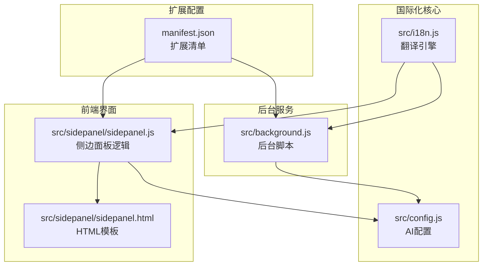
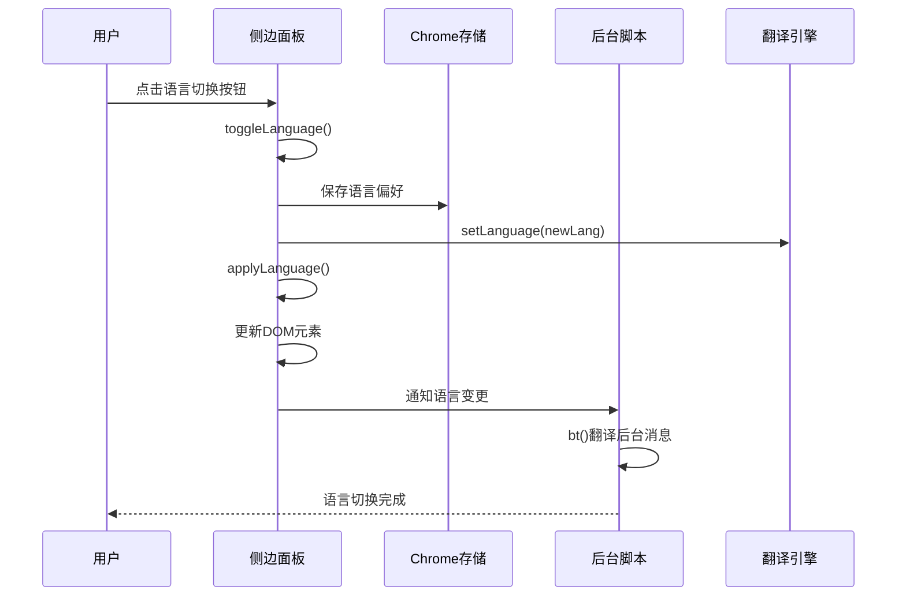
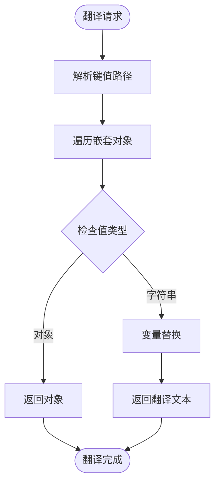
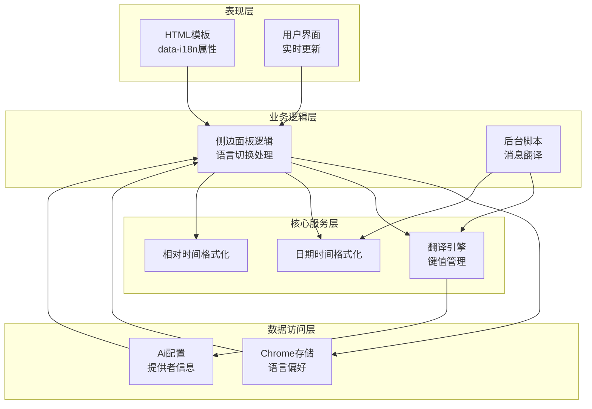
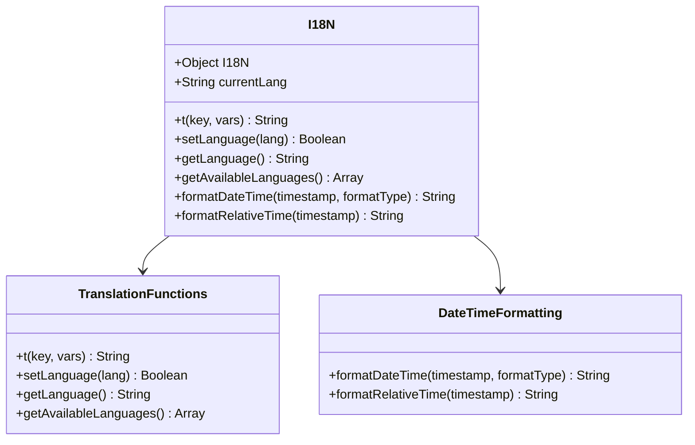
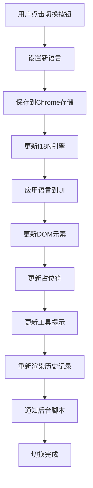
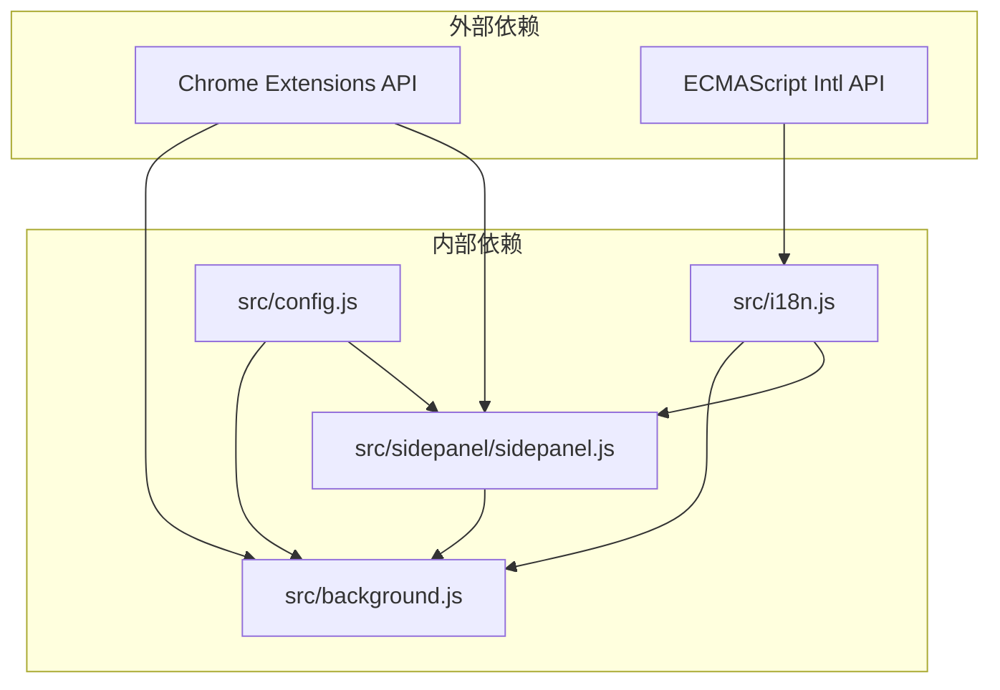

# 国际化系统

<cite>
**本文档引用的文件**
- [src/i18n.js](file://src/i18n.js)
- [src/sidepanel/sidepanel.js](file://src/sidepanel/sidepanel.js)
- [src/sidepanel/sidepanel.html](file://src/sidepanel/sidepanel.html)
- [src/background.js](file://src/background.js)
- [src/config.js](file://src/config.js)
- [manifest.json](file://manifest.json)
</cite>

## 目录
1. [简介](#简介)
2. [项目结构](#项目结构)
3. [核心组件](#核心组件)
4. [架构概览](#架构概览)
5. [详细组件分析](#详细组件分析)
6. [依赖关系分析](#依赖关系分析)
7. [性能考虑](#性能考虑)
8. [故障排除指南](#故障排除指南)
9. [结论](#结论)
10. [附录](#附录)

## 简介

AI Multiverse 的国际化系统是一个完整的多语言支持解决方案，支持英语（en）和中文（zh-CN）。该系统采用模块化设计，提供了翻译键值管理、语言检测机制、实时语言切换和本地化格式化等功能。

系统的核心特性包括：
- 嵌套对象式的翻译键值管理系统
- 支持变量替换的动态翻译
- 实时语言切换和界面更新
- 日期时间本地化格式化
- 相对时间格式化
- 完整的模态框和工具提示翻译支持

## 项目结构

国际化系统主要分布在以下几个关键文件中：



**图表来源**
- [src/i18n.js](file://src/i18n.js#L1-L504)
- [src/sidepanel/sidepanel.js](file://src/sidepanel/sidepanel.js#L1-L2813)
- [src/sidepanel/sidepanel.html](file://src/sidepanel/sidepanel.html#L1-L400)
- [src/background.js](file://src/background.js#L1-L1028)
- [manifest.json](file://manifest.json#L1-L79)

**章节来源**
- [src/i18n.js](file://src/i18n.js#L1-L504)
- [src/sidepanel/sidepanel.js](file://src/sidepanel/sidepanel.js#L1-L2813)
- [src/sidepanel/sidepanel.html](file://src/sidepanel/sidepanel.html#L1-L400)
- [src/background.js](file://src/background.js#L1-L1028)
- [manifest.json](file://manifest.json#L1-L79)

## 核心组件

### 翻译引擎 (I18N)

翻译引擎是整个国际化系统的核心，提供了完整的翻译管理功能：

#### 主要功能
- **翻译键值管理**：支持嵌套对象结构的翻译键值
- **动态翻译**：支持变量替换和参数化翻译
- **语言切换**：实时切换当前语言环境
- **日期时间格式化**：本地化的日期时间显示
- **相对时间格式化**：人性化的时间显示

#### 翻译键值结构
系统采用层次化的键值结构，支持深度嵌套：

```mermaid
graph TD
I18N[I18N对象] --> EN[English(en)]
I18N --> ZH[Chinese(zh-CN)]
EN --> Header[Header]
EN --> Tabs[Tabs]
EN --> History[History]
EN --> Responses[Responses]
EN --> Buttons[Buttons]
EN --> Status[Status]
EN --> Models[Model Selection]
EN --> Providers[Provider Names]
EN --> Modals[Modals]
EN --> Placeholders[Placeholders]
EN --> Files[File Upload]
EN --> Errors[Errors]
EN --> Success[Success Messages]
EN --> DateTime[Date/Time Formats]
EN --> Navigation[Modal Navigation]
ZH --> Header
ZH --> Tabs
ZH --> History
ZH --> Responses
ZH --> Buttons
ZH --> Status
ZH --> Models
ZH --> Providers
ZH --> Modals
ZH --> Placeholders
ZH --> Files
ZH --> Errors
ZH --> Success
ZH --> DateTime
ZH --> Navigation
```

**图表来源**
- [src/i18n.js](file://src/i18n.js#L6-L346)

**章节来源**
- [src/i18n.js](file://src/i18n.js#L6-L346)

### 语言切换机制

系统实现了完整的语言切换机制，支持实时切换和持久化存储：



**图表来源**
- [src/sidepanel/sidepanel.js](file://src/sidepanel/sidepanel.js#L1874-L1885)
- [src/background.js](file://src/background.js#L99-L112)

**章节来源**
- [src/sidepanel/sidepanel.js](file://src/sidepanel/sidepanel.js#L1864-L1921)
- [src/background.js](file://src/background.js#L92-L112)

### 翻译键值系统

系统采用了标准化的翻译键值命名规范：

#### 键值命名规范
- **功能分类**：使用下划线分隔的功能类别
- **语义明确**：键值名称直接反映功能用途
- **层级结构**：支持多层嵌套的对象结构
- **一致性**：相同功能在不同语言中使用相同的键值

#### 动态翻译机制
翻译系统支持变量替换，允许在翻译文本中插入动态内容：



**图表来源**
- [src/i18n.js](file://src/i18n.js#L361-L383)

**章节来源**
- [src/i18n.js](file://src/i18n.js#L355-L383)

## 架构概览

国际化系统采用分层架构设计，确保了良好的模块化和可维护性：



**图表来源**
- [src/i18n.js](file://src/i18n.js#L494-L503)
- [src/sidepanel/sidepanel.js](file://src/sidepanel/sidepanel.js#L1864-L1921)
- [src/background.js](file://src/background.js#L76-L112)

**章节来源**
- [src/i18n.js](file://src/i18n.js#L494-L503)
- [src/sidepanel/sidepanel.js](file://src/sidepanel/sidepanel.js#L1864-L1921)
- [src/background.js](file://src/background.js#L76-L112)

## 详细组件分析

### 翻译引擎实现

翻译引擎是系统的核心组件，提供了完整的翻译管理功能：

#### 核心函数分析



**图表来源**
- [src/i18n.js](file://src/i18n.js#L6-L503)

#### 翻译函数实现

翻译函数支持复杂的嵌套键值访问和变量替换：

**章节来源**
- [src/i18n.js](file://src/i18n.js#L355-L383)

### 语言切换实现

语言切换功能实现了完整的用户界面更新机制：

#### 切换流程分析



**图表来源**
- [src/sidepanel/sidepanel.js](file://src/sidepanel/sidepanel.js#L1874-L1921)

**章节来源**
- [src/sidepanel/sidepanel.js](file://src/sidepanel/sidepanel.js#L1864-L1921)

### HTML模板集成

HTML模板采用了统一的国际化标记规范：

#### 数据属性规范

| 属性类型 | 用途 | 示例 |
|---------|------|------|
| `data-i18n` | 文本内容翻译 | `<span data-i18n="logo">AI Multiverse</span>` |
| `data-i18n-title` | 工具提示翻译 | `<button data-i18n-title="switch_language">切换语言</button>` |
| `data-i18n-placeholder` | 占位符翻译 | `<textarea data-i18n-placeholder="prompt_placeholder_custom">输入提示词...</textarea>` |

**章节来源**
- [src/sidepanel/sidepanel.html](file://src/sidepanel/sidepanel.html#L21-L396)

### 后台脚本国际化

后台脚本实现了独立的翻译支持：

#### 后台翻译机制

后台脚本使用独立的翻译字典，支持基本的消息翻译：

**章节来源**
- [src/background.js](file://src/background.js#L76-L112)

## 依赖关系分析

国际化系统与其他组件的依赖关系如下：



**图表来源**
- [src/i18n.js](file://src/i18n.js#L456-L457)
- [src/sidepanel/sidepanel.js](file://src/sidepanel/sidepanel.js#L1864-L1885)
- [src/background.js](file://src/background.js#L92-L97)

**章节来源**
- [src/i18n.js](file://src/i18n.js#L456-L457)
- [src/sidepanel/sidepanel.js](file://src/sidepanel/sidepanel.js#L1864-L1885)
- [src/background.js](file://src/background.js#L92-L97)

## 性能考虑

国际化系统在设计时充分考虑了性能优化：

### 性能优化策略

1. **延迟初始化**：翻译函数仅在需要时执行
2. **缓存机制**：当前语言状态在内存中缓存
3. **批量更新**：语言切换时批量更新DOM元素
4. **条件渲染**：只更新实际发生变化的元素

### 内存使用优化

- 翻译字典作为常量对象存储
- 语言切换不重新加载整个页面
- DOM元素更新采用最小化操作

## 故障排除指南

### 常见问题及解决方案

#### 翻译缺失问题
**症状**：某些文本显示为键值而非翻译内容
**原因**：翻译键值不存在或拼写错误
**解决**：检查翻译字典中的键值是否存在

#### 语言切换失效
**症状**：点击切换按钮但界面不更新
**原因**：Chrome存储访问权限问题或DOM元素未正确标记
**解决**：检查Chrome存储权限和data-i18n属性

#### 变量替换失败
**症状**：翻译文本中包含未替换的变量占位符
**原因**：变量对象中缺少对应的键值
**解决**：确保传递给翻译函数的变量对象包含所有必需的键值

**章节来源**
- [src/i18n.js](file://src/i18n.js#L369-L372)
- [src/sidepanel/sidepanel.js](file://src/sidepanel/sidepanel.js#L1892-L1910)

## 结论

AI Multiverse的国际化系统是一个设计精良、功能完整的多语言支持解决方案。系统采用了模块化设计，提供了：

1. **完整的翻译管理**：支持嵌套键值结构和变量替换
2. **实时语言切换**：无需刷新页面即可切换语言
3. **全面的UI覆盖**：支持按钮、模态框、工具提示等所有界面元素
4. **本地化格式化**：支持日期时间格式化和相对时间显示
5. **良好的扩展性**：易于添加新语言和新功能

系统的设计充分考虑了用户体验和技术实现的最佳实践，为用户提供了一致且自然的多语言使用体验。

## 附录

### 新语言添加指南

#### 步骤1：添加翻译字典
在`src/i18n.js`中添加新的语言对象：

```javascript
// 在I18N对象中添加新语言
"new-lang": {
    // 翻译键值...
}
```

#### 步骤2：更新HTML模板
为新语言添加相应的`data-i18n`属性：

```html
<button data-i18n="your_key">默认文本</button>
```

#### 步骤3：更新语言列表
在`getAvailableLanguages()`函数中确保新语言被识别：

```javascript
function getAvailableLanguages() {
    return ["en", "zh-CN", "new-lang"];
}
```

#### 步骤4：测试验证
- 切换到新语言验证所有界面元素
- 检查翻译是否正确显示
- 验证变量替换功能

### 翻译维护策略

#### 键值命名规范
- 使用小写字母和下划线
- 采用功能域分组
- 保持语义清晰

#### 翻译质量保证
- 定期审查翻译完整性
- 测试变量替换功能
- 验证本地化格式正确性

### 本地化测试方法

#### 自动化测试
- 编写单元测试验证翻译函数
- 创建集成测试验证UI更新
- 实施端到端测试验证完整流程

#### 手动测试清单
- [ ] 语言切换功能测试
- [ ] 翻译完整性检查
- [ ] 变量替换验证
- [ ] 本地化格式测试
- [ ] 模态框翻译验证