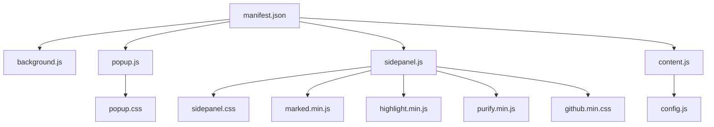
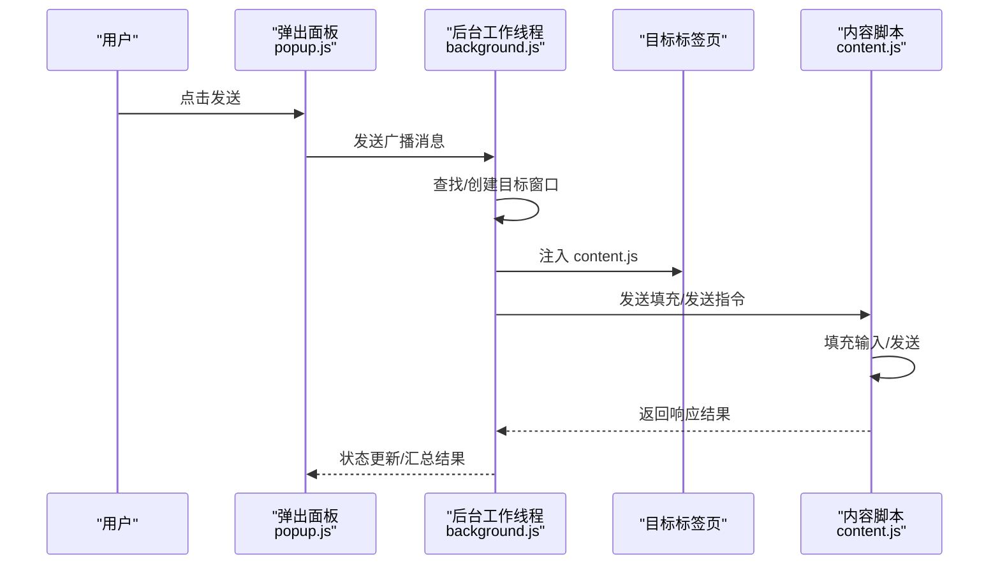
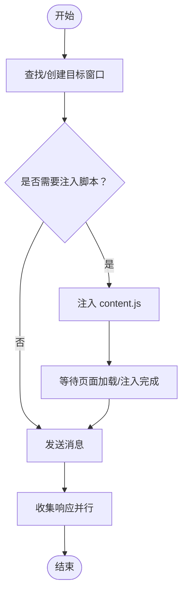
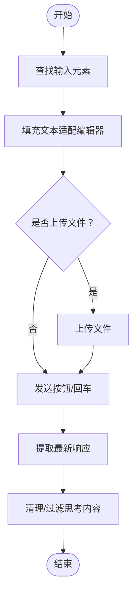
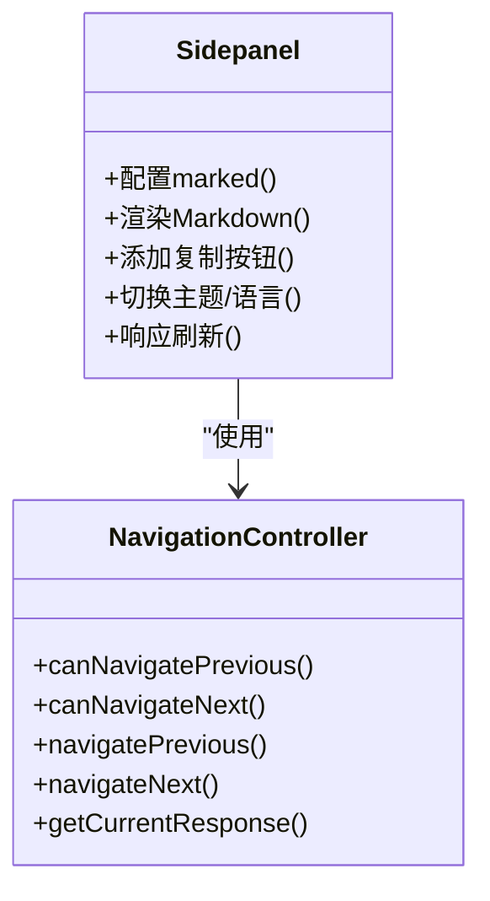
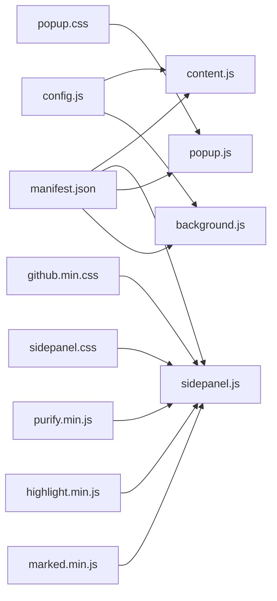

# 性能优化策略

<cite>
**本文档引用的文件**
- [manifest.json](file://manifest.json)
- [background.js](file://src/background.js)
- [popup.js](file://src/popup/popup.js)
- [sidepanel.js](file://src/sidepanel/sidepanel.js)
- [config.js](file://src/config.js)
- [content.js](file://src/content/content.js)
- [popup.css](file://src/popup/popup.css)
- [sidepanel.css](file://src/sidepanel/sidepanel.css)
- [github.min.css](file://src/lib/github.min.css)
- [marked.min.js](file://src/lib/marked.min.js)
- [highlight.min.js](file://src/lib/highlight.min.js)
- [purify.min.js](file://src/lib/purify.min.js)
</cite>

## 目录
1. [引言](#引言)
2. [项目结构](#项目结构)
3. [核心组件](#核心组件)
4. [架构总览](#架构总览)
5. [详细组件分析](#详细组件分析)
6. [依赖关系分析](#依赖关系分析)
7. [性能考虑](#性能考虑)
8. [故障排查指南](#故障排查指南)
9. [结论](#结论)

## 引言
本文件系统性梳理该浏览器扩展在性能优化方面的实践与建议，覆盖加载优化（CSS 压缩、JS 代码分割、资源懒加载）、内存管理（DOM 节点清理、事件监听器移除、内存泄漏预防）、网络请求优化（请求合并、缓存策略、CDN 使用）、渲染性能优化（CSS 动画优化、重绘重排避免、GPU 加速应用）以及性能监控与评估方法。文档面向不同技术背景读者，既提供高层概览，也给出可操作的落地建议。

## 项目结构
该项目采用 Manifest V3 架构，包含后台服务工作线程、弹出面板、侧边栏面板、内容脚本与第三方库。关键文件职责如下：
- manifest.json：声明权限、主机权限、入口与资源加载时机
- background.js：后台服务工作线程，负责窗口管理、消息路由、脚本注入与超时控制
- popup.js：弹出面板交互逻辑
- sidepanel.js：侧边栏面板交互与渲染逻辑
- config.js：统一配置（各 AI 平台的选择器、发送方式等）
- content.js：内容脚本，负责注入、填充输入、发送消息、提取响应
- 各 CSS 文件与第三方库：marked、highlight、purify、github.min.css

图表来源
- [manifest.json](file://manifest.json#L1-L79)
- [background.js](file://src/background.js#L1-L120)
- [popup.js](file://src/popup/popup.js#L1-L61)
- [sidepanel.js](file://src/sidepanel/sidepanel.js#L1-L120)
- [content.js](file://src/content/content.js#L1-L60)
- [sidepanel.css](file://src/sidepanel/sidepanel.css#L1-L120)
- [popup.css](file://src/popup/popup.css#L1-L134)
- [marked.min.js](file://src/lib/marked.min.js#L1-L7)
- [highlight.min.js](file://src/lib/highlight.min.js#L1-L8)
- [purify.min.js](file://src/lib/purify.min.js#L1-L4)
- [github.min.css](file://src/lib/github.min.css#L1-L10)
- [config.js](file://src/config.js#L1-L60)

章节来源
- [manifest.json](file://manifest.json#L1-L79)
- [background.js](file://src/background.js#L1-L120)
- [popup.js](file://src/popup/popup.js#L1-L61)
- [sidepanel.js](file://src/sidepanel/sidepanel.js#L1-L120)
- [content.js](file://src/content/content.js#L1-L60)
- [config.js](file://src/config.js#L1-L60)

## 核心组件
- 后台服务工作线程：负责窗口发现/创建、脚本注入、消息分发、超时控制与状态通知
- 内容脚本：在目标站点注入，负责输入填充、发送、响应提取与清理
- 侧边栏面板：负责 Markdown 渲染、语法高亮、DOM 结构与事件绑定
- 弹出面板：轻量交互入口，发起广播消息
- 第三方库：marked（解析 Markdown）、highlight（语法高亮）、DOMPurify（HTML 清洗）、highlight 主题样式

章节来源
- [background.js](file://src/background.js#L138-L197)
- [content.js](file://src/content/content.js#L200-L216)
- [sidepanel.js](file://src/sidepanel/sidepanel.js#L6-L39)
- [popup.js](file://src/popup/popup.js#L1-L61)

## 架构总览
整体流程：用户在弹出面板或侧边栏面板发起请求，后台工作线程根据配置定位目标窗口/标签页，必要时创建新窗口并注入内容脚本，内容脚本执行填充与发送，后台收集响应并返回结果。

图表来源
- [popup.js](file://src/popup/popup.js#L16-L45)
- [background.js](file://src/background.js#L138-L197)
- [content.js](file://src/content/content.js#L200-L216)

## 详细组件分析

### 后台服务工作线程（性能要点）
- 窗口发现与复用：优先使用已跟踪的窗口 ID，减少跨进程查询成本
- 并行处理：批量任务使用 Promise.allSettled 并行执行，缩短总耗时
- 超时与清理：为标签页加载与脚本注入设置超时，避免阻塞
- 事件监听：仅注册必要监听器，避免常驻监听造成内存压力

图表来源
- [background.js](file://src/background.js#L200-L268)
- [background.js](file://src/background.js#L656-L678)
- [background.js](file://src/background.js#L680-L716)

章节来源
- [background.js](file://src/background.js#L138-L197)
- [background.js](file://src/background.js#L200-L268)
- [background.js](file://src/background.js#L656-L716)

### 内容脚本（性能要点）
- 选择器与等待：对输入/按钮选择器进行精确查找，并设置最大等待次数与间隔，避免忙等
- 文本填充：针对不同编辑器类型采用合适策略（直接赋值、清空后再输入），减少事件风暴
- 发送策略：优先点击按钮，若平台异步则在特定时机回退至 Enter 键，降低重复发送风险
- 响应提取：按最新元素提取，支持多种回退选择器，兼顾稳定性

图表来源
- [content.js](file://src/content/content.js#L323-L418)
- [content.js](file://src/content/content.js#L466-L565)
- [content.js](file://src/content/content.js#L218-L320)

章节来源
- [content.js](file://src/content/content.js#L200-L216)
- [content.js](file://src/content/content.js#L323-L418)
- [content.js](file://src/content/content.js#L466-L565)
- [content.js](file://src/content/content.js#L218-L320)

### 侧边栏面板（性能要点）
- Markdown 渲染：延迟初始化 marked 与 highlight，仅在 DOM 加载完成后启用
- DOM 结构：使用网格布局，响应式宽度切换，避免频繁重排
- 事件绑定：Tab 切换时按需触发响应刷新，减少不必要的渲染
- 代码块复制：仅在需要时添加复制按钮，避免冗余节点

图表来源
- [sidepanel.js](file://src/sidepanel/sidepanel.js#L6-L39)
- [sidepanel.js](file://src/sidepanel/sidepanel.js#L712-L800)

章节来源
- [sidepanel.js](file://src/sidepanel/sidepanel.js#L6-L39)
- [sidepanel.js](file://src/sidepanel/sidepanel.js#L712-L800)

### 弹出面板（性能要点）
- 轻量交互：仅保存/恢复选中的模型，避免复杂状态管理
- 消息发送：禁用按钮防止重复提交，发送完成后恢复 UI

章节来源
- [popup.js](file://src/popup/popup.js#L1-L61)

### 第三方库与样式（性能要点）
- marked：在 DOM 加载后才初始化，避免提前占用主线程
- highlight：仅在需要时启用，避免全局加载
- DOMPurify：对渲染的 HTML 进行白名单清洗，降低 XSS 风险同时保持性能
- github.min.css：作为预连接资源引入，减少样式阻塞

章节来源
- [sidepanel.js](file://src/sidepanel/sidepanel.js#L6-L39)
- [sidepanel.js](file://src/sidepanel/sidepanel.js#L64-L123)
- [sidepanel.css](file://src/sidepanel/sidepanel.css#L1-L120)
- [github.min.css](file://src/lib/github.min.css#L1-L10)

## 依赖关系分析
- manifest.json 控制资源加载时机（如 content_scripts 的 run_at）
- background.js 依赖 config.js 中的统一配置
- content.js 依赖 config.js 的选择器与发送策略
- sidepanel.js 依赖 marked、highlight、DOMPurify 与主题样式

图表来源
- [manifest.json](file://manifest.json#L45-L68)
- [background.js](file://src/background.js#L69-L74)
- [content.js](file://src/content/content.js#L1-L20)
- [sidepanel.js](file://src/sidepanel/sidepanel.js#L13-L15)
- [popup.js](file://src/popup/popup.js#L1-L10)

章节来源
- [manifest.json](file://manifest.json#L45-L68)
- [background.js](file://src/background.js#L69-L74)
- [content.js](file://src/content/content.js#L1-L20)
- [sidepanel.js](file://src/sidepanel/sidepanel.js#L13-L15)
- [popup.js](file://src/popup/popup.js#L1-L10)

## 性能考虑

### 加载优化
- CSS 压缩与预连接
  - 已引入压缩后的样式文件（如 github.min.css），减少体积与下载时间
  - 在 sidepanel.html 中对字体资源进行预连接，降低首屏渲染阻塞
- JavaScript 代码分割
  - 当前内容脚本与面板脚本未进行拆分。建议将第三方库与面板逻辑进一步拆分，按需加载
- 资源懒加载
  - marked、highlight 在 DOMContentLoaded 后初始化，避免阻塞首屏
  - 可在首次打开响应面板时再加载渲染相关依赖，减少弹出面板初始开销

章节来源
- [sidepanel.css](file://src/sidepanel/sidepanel.css#L1-L120)
- [sidepanel.js](file://src/sidepanel/sidepanel.js#L6-L39)
- [sidepanel.html](file://src/sidepanel/sidepanel.html#L9-L11)
- [github.min.css](file://src/lib/github.min.css#L1-L10)

### 内存管理
- DOM 节点清理
  - 侧边栏面板在切换标签或关闭模态时，确保移除复制按钮等动态节点，避免残留
- 事件监听器移除
  - 事件绑定集中在初始化阶段，切换时统一解绑旧事件，避免重复绑定
- 内存泄漏预防
  - 避免闭包持有长生命周期对象；清理定时器与监听器；及时释放大对象引用

章节来源
- [sidepanel.js](file://src/sidepanel/sidepanel.js#L140-L187)
- [sidepanel.js](file://src/sidepanel/sidepanel.js#L366-L389)

### 网络请求优化
- 请求合并
  - 后台工作线程对多个提供商使用 Promise.allSettled 并行处理，缩短总耗时
- 缓存策略
  - 建议对第三方库（marked、highlight、purify）启用浏览器缓存与版本化命名，避免重复下载
- CDN 使用
  - 可将第三方库托管于 CDN，结合浏览器缓存与预连接，提升加载速度

章节来源
- [background.js](file://src/background.js#L718-L721)

### 渲染性能优化
- CSS 动画与 GPU 加速
  - 使用 CSS 变量与过渡属性，避免强制同步布局；利用 transform/opacity 触发合成层
- 重绘重排避免
  - 批量修改 DOM 属性，使用文档片段或容器一次性插入
- 代码高亮与 Markdown 渲染
  - 仅在需要时启用 highlight，避免对纯文本进行无谓高亮
  - 渲染后立即移除复制按钮等临时节点，减少 DOM 负担

章节来源
- [sidepanel.css](file://src/sidepanel/sidepanel.css#L1-L120)
- [sidepanel.js](file://src/sidepanel/sidepanel.js#L140-L187)
- [sidepanel.js](file://src/sidepanel/sidepanel.js#L64-L123)

### 性能监控与评估
- 指标采集
  - 记录窗口创建/注入耗时、消息往返时延、响应提取耗时
- 评估方法
  - 对比不同提供商的平均响应时间与成功率
  - 对比开启/关闭并行处理的性能差异
- 优化验证
  - 通过用户反馈与日志统计验证优化效果

章节来源
- [background.js](file://src/background.js#L680-L716)
- [content.js](file://src/content/content.js#L323-L418)

## 故障排查指南
- 注入失败
  - 检查 content.js 是否成功 ping 通，必要时重新注入
- 页面未加载完成
  - 使用 waitForTabLoad 设置合理超时，避免过早操作
- 选择器失效
  - 使用 diagnoseSelectors 获取当前页面匹配情况，更新配置
- 响应为空
  - 检查回退选择器与思考内容过滤逻辑

章节来源
- [background.js](file://src/background.js#L656-L678)
- [background.js](file://src/background.js#L680-L716)
- [content.js](file://src/content/content.js#L127-L197)

## 结论
本项目在窗口管理、脚本注入与响应提取方面已具备良好的并发与容错能力。为进一步提升性能，建议在加载优化（懒加载与拆分）、内存管理（事件与节点清理）、网络优化（缓存与 CDN）与渲染优化（避免重排与合理高亮）方面持续改进，并建立完善的性能监控体系以量化优化效果。