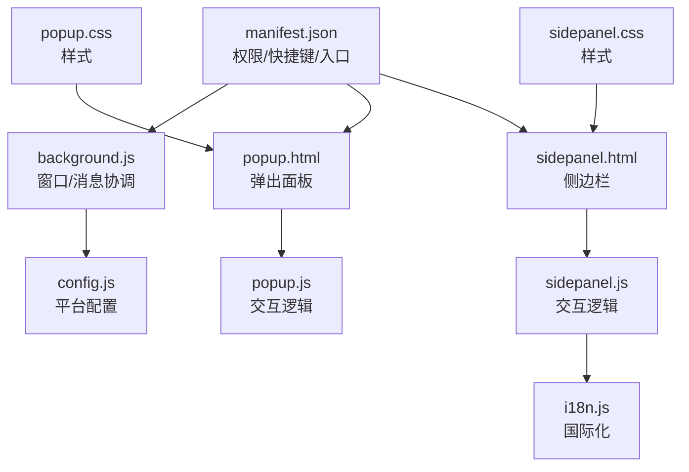
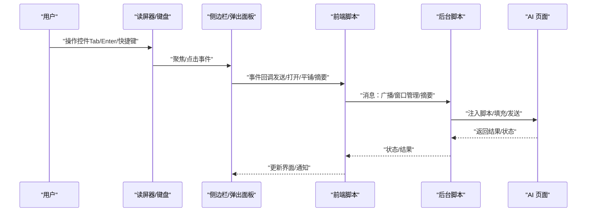
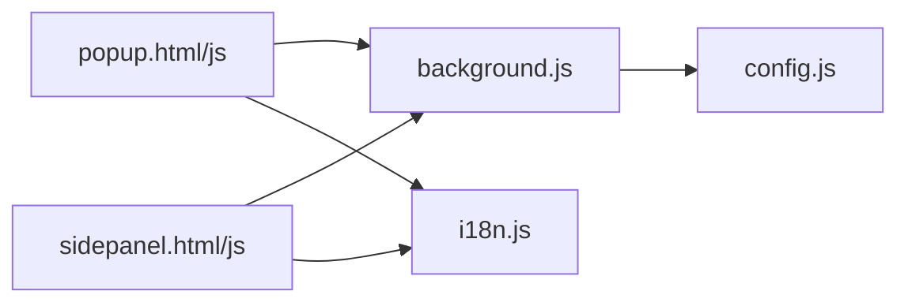

# 无障碍支持

<cite>
**本文引用的文件**
- [manifest.json](file://manifest.json)
- [popup.html](file://src/popup/popup.html)
- [popup.css](file://src/popup/popup.css)
- [popup.js](file://src/popup/popup.js)
- [sidepanel.html](file://src/sidepanel/sidepanel.html)
- [sidepanel.css](file://src/sidepanel/sidepanel.css)
- [sidepanel.js](file://src/sidepanel/sidepanel.js)
- [background.js](file://src/background.js)
- [i18n.js](file://src/i18n.js)
- [config.js](file://src/config.js)
- [test_history_buttons.html](file://test_history_buttons.html)
- [test_hover_buttons.html](file://test_hover_buttons.html)
- [test_markdown_resize.html](file://test_markdown_resize.html)
- [README.md](file://README.md)
</cite>

## 目录
1. [简介](#简介)
2. [项目结构](#项目结构)
3. [核心组件](#核心组件)
4. [架构总览](#架构总览)
5. [详细组件分析](#详细组件分析)
6. [依赖关系分析](#依赖关系分析)
7. [性能考虑](#性能考虑)
8. [故障排查指南](#故障排查指南)
9. [结论](#结论)
10. [附录](#附录)

## 简介
本文件围绕本 Chrome 扩展的无障碍支持进行系统化梳理，重点覆盖以下方面：
- 键盘导航：Tab 顺序管理、焦点可见性、快捷键支持
- 屏幕阅读器兼容：ARIA 属性使用、语义化标记、读屏器测试
- 视觉辅助：高对比度支持、缩放适配、颜色盲友好
- 触觉反馈与移动端：触摸目标尺寸、手势支持、移动端优化
- 无障碍测试方法、合规性检查与持续改进策略

本项目采用原生 HTML/CSS/JS，UI 主要由弹出面板与侧边栏构成，并通过后台脚本协调多标签页交互。现有实现中已包含部分可访问性基础（如标题层级、可点击元素、图标按钮等），但尚缺乏系统性的 ARIA 属性与键盘可达性设计。

## 项目结构
- Manifest 定义扩展权限、快捷键与入口
- 弹出面板与侧边栏提供用户交互界面
- 背景脚本负责窗口管理、消息分发与跨页面通信
- 国际化模块提供多语言文本与本地化日期时间
- 配置模块集中管理各 AI 平台的选择器与交互方式

**图表来源**
- [manifest.json](file://manifest.json#L1-L79)
- [popup.html](file://src/popup/popup.html#L1-L50)
- [sidepanel.html](file://src/sidepanel/sidepanel.html#L1-L400)
- [popup.css](file://src/popup/popup.css#L1-L134)
- [sidepanel.css](file://src/sidepanel/sidepanel.css#L1-L800)
- [popup.js](file://src/popup/popup.js#L1-L61)
- [sidepanel.js](file://src/sidepanel/sidepanel.js#L1-L800)
- [background.js](file://src/background.js#L1-L800)
- [i18n.js](file://src/i18n.js#L1-L504)
- [config.js](file://src/config.js#L1-L204)

**章节来源**
- [README.md](file://README.md#L1-L107)
- [manifest.json](file://manifest.json#L1-L79)

## 核心组件
- 弹出面板（popup）：用于快速选择模型与发送消息，具备文本输入、复选框与按钮等控件
- 侧边栏（sidepanel）：持久化界面，包含聊天历史、响应面板、模态对话框、主题与语言切换等
- 背景脚本（background）：负责窗口生命周期、消息广播、窗口平铺、摘要生成等
- 国际化（i18n）：提供英文与中文文本，支持日期时间格式化与相对时间显示
- 配置（config）：集中管理各 AI 平台的选择器、上传能力与交互方式

**章节来源**
- [popup.html](file://src/popup/popup.html#L1-L50)
- [sidepanel.html](file://src/sidepanel/sidepanel.html#L1-L400)
- [background.js](file://src/background.js#L1-L800)
- [i18n.js](file://src/i18n.js#L1-L504)
- [config.js](file://src/config.js#L1-L204)

## 架构总览
下图展示扩展的可访问性相关交互路径：用户通过键盘或读屏器操作 UI 控件，触发脚本逻辑，后台脚本协调各 AI 页面执行自动化操作。

**图表来源**
- [sidepanel.js](file://src/sidepanel/sidepanel.js#L1-L800)
- [popup.js](file://src/popup/popup.js#L1-L61)
- [background.js](file://src/background.js#L1-L800)
- [config.js](file://src/config.js#L1-L204)

## 详细组件分析

### 键盘导航与焦点管理
- Tab 顺序现状
  - 弹出面板：文本域、复选框、按钮等具有自然顺序，但缺少明确的顺序规划与可预测的焦点路径
  - 侧边栏：包含多个按钮组、模态框、选项卡与列表，需确保焦点在模态框内循环并在关闭后返回触发元素
- 焦点可见性
  - 文本域在获得焦点时具备可见的轮廓与阴影，有助于指示当前焦点位置
  - 图标按钮与卡片在悬停时有视觉反馈，但键盘激活态（如 :focus-visible）未显式定义
- 快捷键支持
  - Manifest 定义了全局快捷键（Alt+Shift+S），便于快速打开扩展
  - 侧边栏与弹出面板未见针对具体操作的快捷键绑定

建议改进
- 为关键控件添加明确的 tabindex，确保 Tab 顺序符合逻辑（如“发送”按钮置于输入框之后）
- 为模态框启用焦点陷阱（Focus Trap），保证键盘在模态内循环
- 为常用操作添加快捷键（如 Ctrl+Enter 发送、Esc 关闭模态）
- 明确键盘激活态样式，提升焦点可见性

**章节来源**
- [popup.html](file://src/popup/popup.html#L1-L50)
- [popup.css](file://src/popup/popup.css#L74-L78)
- [sidepanel.html](file://src/sidepanel/sidepanel.html#L1-L400)
- [sidepanel.css](file://src/sidepanel/sidepanel.css#L1-L800)
- [manifest.json](file://manifest.json#L70-L78)

### 屏幕阅读器兼容性
- 标题与语义化
  - 弹出面板与侧边栏均使用语义化标题层级（h1、h2、h3），有助于读屏器建立页面结构
  - 复选框与按钮具备关联的 label，利于读屏器朗读
- ARIA 属性现状
  - 侧边栏的模态导航箭头按钮具备 aria-label，有助于读屏器描述其用途
  - 大多数按钮与控件缺少 ARIA 属性（如 role、aria-expanded、aria-selected、aria-live）
- 读屏器测试
  - 可使用系统自带的 VoiceOver（macOS）、NVDA（Windows）或 Orca（Linux）进行基本验证
  - 建议在关键交互处增加 aria-live 区域，用于播报状态变化（如发送成功/失败）

建议改进
- 为模态框、选项卡、列表项等添加 role 与状态属性
- 为动态内容更新区域添加 aria-live，确保读屏器及时播报
- 为按钮组与开关控件添加 aria-expanded/aria-checked 等状态属性

**章节来源**
- [sidepanel.html](file://src/sidepanel/sidepanel.html#L142-L181)
- [i18n.js](file://src/i18n.js#L1-L504)

### 视觉辅助功能
- 高对比度支持
  - 项目提供深色/浅色主题变量，可在系统高对比度模式下自动切换
  - 建议补充高对比度专用样式，确保文本与背景对比度满足 WCAG AA/AAA 要求
- 缩放适配
  - 侧边栏采用相对单位与弹性布局，具备一定缩放适应性
  - 建议在关键区域（如按钮、输入框）设置最小尺寸，避免缩放后文字截断
- 颜色盲友好
  - 当前颜色方案主要依赖蓝色/绿色等区分，建议引入色盲友好配色，并通过形状/图标增强区分度

**章节来源**
- [sidepanel.css](file://src/sidepanel/sidepanel.css#L1-L800)

### 触觉反馈与移动端支持
- 触摸目标尺寸
  - 图标按钮与操作按钮尺寸较小，移动端点击体验不佳
  - 建议增大触摸目标尺寸（至少 44px），并增加点击反馈
- 手势支持
  - 侧边栏包含拖拽上传区域，但未见手势优化（如长按、滑动）
- 移动端优化
  - 项目未提供移动端适配策略，建议在小屏设备上简化布局与交互

**章节来源**
- [sidepanel.html](file://src/sidepanel/sidepanel.html#L310-L390)
- [sidepanel.js](file://src/sidepanel/sidepanel.js#L414-L495)

### 无障碍测试方法与合规性检查
- 自动化测试
  - 使用 axe-core、Lighthouse 等工具扫描可访问性问题
- 手动测试
  - 键盘仅导航：Tab/Shift+Tab、Enter/Space 操作
  - 读屏器测试：VoiceOver/NVDA/Orca 下朗读与交互
  - 高对比度测试：系统高对比度模式下的可读性
- 合规性标准
  - 建议遵循 WCAG 2.1 AA/AAA 要求，重点关注感知、操作、理解与耐受性

**章节来源**
- [test_history_buttons.html](file://test_history_buttons.html)
- [test_hover_buttons.html](file://test_hover_buttons.html)
- [test_markdown_resize.html](file://test_markdown_resize.html)

### 持续改进策略
- 建立可访问性检查清单，纳入 CI/CD 流程
- 设计可访问性里程碑：第一阶段补齐 ARIA 属性与键盘可达性，第二阶段完善读屏器与高对比度
- 用户反馈闭环：收集残障用户的使用反馈，持续迭代

## 依赖关系分析
- 弹出面板与侧边栏依赖国际化模块提供本地化文本
- 侧边栏与后台脚本通过消息机制通信，实现跨页面控制
- 配置模块为后台脚本与内容脚本提供平台选择器与交互策略

**图表来源**
- [popup.js](file://src/popup/popup.js#L1-L61)
- [sidepanel.js](file://src/sidepanel/sidepanel.js#L1-L800)
- [background.js](file://src/background.js#L1-L800)
- [i18n.js](file://src/i18n.js#L1-L504)
- [config.js](file://src/config.js#L1-L204)

**章节来源**
- [popup.js](file://src/popup/popup.js#L1-L61)
- [sidepanel.js](file://src/sidepanel/sidepanel.js#L1-L800)
- [background.js](file://src/background.js#L1-L800)
- [i18n.js](file://src/i18n.js#L1-L504)
- [config.js](file://src/config.js#L1-L204)

## 性能考虑
- 可访问性优化不应显著影响渲染性能，建议：
  - 将 ARIA 动态更新限制在必要范围
  - 使用防抖/节流处理高频键盘事件
  - 模态框与大列表采用虚拟滚动与延迟渲染

## 故障排查指南
- 无法通过键盘操作
  - 检查控件是否具备 tabindex 或可聚焦
  - 确认事件监听是否正确绑定
- 读屏器无法正确朗读
  - 补充 aria-label/aria-describedby
  - 为动态内容区域添加 aria-live
- 高对比度模式下可读性差
  - 检查颜色变量与对比度阈值
  - 增加高对比度专用样式

**章节来源**
- [sidepanel.js](file://src/sidepanel/sidepanel.js#L530-L651)
- [sidepanel.css](file://src/sidepanel/sidepanel.css#L1-L800)

## 结论
本项目在无障碍方面已具备一定基础（标题层级、可点击元素、图标按钮等），但在键盘可达性、ARIA 属性与读屏器支持方面仍需系统性加强。建议优先完成 ARIA 属性补全与键盘导航优化，随后逐步完善高对比度与移动端体验，并建立持续的可访问性测试与改进流程。

## 附录
- 测试页面参考
  - [test_history_buttons.html](file://test_history_buttons.html)
  - [test_hover_buttons.html](file://test_hover_buttons.html)
  - [test_markdown_resize.html](file://test_markdown_resize.html)