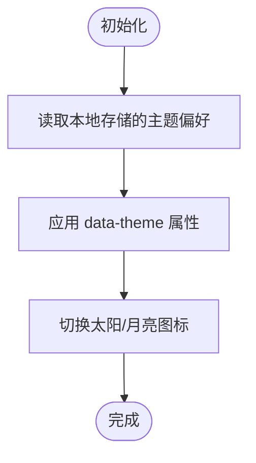

# 用户体验优化

<cite>
**本文引用的文件**
- [manifest.json](file://manifest.json)
- [src/background.js](file://src/background.js)
- [src/config.js](file://src/config.js)
- [src/i18n.js](file://src/i18n.js)
- [src/popup/popup.js](file://src/popup/popup.js)
- [src/popup/popup.css](file://src/popup/popup.css)
- [src/sidepanel/sidepanel.html](file://src/sidepanel/sidepanel.html)
- [src/sidepanel/sidepanel.js](file://src/sidepanel/sidepanel.js)
- [src/sidepanel/sidepanel.css](file://src/sidepanel/sidepanel.css)
- [src/content/content.js](file://src/content/content.js)
- [UI_V1.7.1.md](file://UI_V1.7.1.md)
- [BUGFIX_v1.7.6.md](file://BUGFIX_v1.7.6.md)
- [PROJECT_ANALYSIS_v1.6.md](file://PROJECT_ANALYSIS_v1.6.md)
- [MAINTENANCE.md](file://MAINTENANCE.md)
- [.kiro/specs/modal-navigation/requirements.md](file://.kiro/specs/modal-navigation/requirements.md)
- [.kiro/specs/modal-navigation/design.md](file://.kiro/specs/modal-navigation/design.md)
</cite>

## 目录
1. [简介](#简介)
2. [项目结构](#项目结构)
3. [核心组件](#核心组件)
4. [架构总览](#架构总览)
5. [详细组件分析](#详细组件分析)
6. [依赖关系分析](#依赖关系分析)
7. [性能考虑](#性能考虑)
8. [无障碍支持方案](#无障碍支持方案)
9. [用户体验测试与改进建议](#用户体验测试与改进建议)
10. [结论](#结论)

## 简介
本文件围绕用户体验优化进行系统化梳理，覆盖界面设计原则（响应式布局、动画与交互反馈）、主题切换系统（暗/亮主题、CSS变量与偏好持久化）、多语言支持架构（国际化设计、翻译键值管理与语言切换）、性能优化策略（加载、内存与网络请求）、无障碍支持（键盘导航、屏幕阅读器与视觉辅助）以及测试方法与改进建议。文档以仓库现有实现为基础，结合设计规范与问题修复记录，形成可操作的优化指南。

## 项目结构
该项目为浏览器扩展，采用 Manifest V3 架构，包含后台服务工作线程、侧边面板前端、弹出页前端、内容脚本与国际化模块等核心部分。整体结构清晰，职责分离明确：

- manifest.json：声明权限、命令、图标与后台脚本
- background.js：扩展控制面板、窗口管理、消息分发与跨页面通信
- sidepanel：侧边面板前端（HTML/CSS/JS），负责聊天、响应展示、主题与语言切换、模态导航等
- popup：弹出页前端（HTML/CSS/JS），用于快速选择模型与发送消息
- content：内容脚本，注入目标站点以填充输入与提取响应
- i18n：国际化翻译与日期时间格式化
- config：统一配置（AI提供商、选择器、文件上传支持等）

图表来源
- [manifest.json](file://manifest.json#L1-L79)
- [src/background.js](file://src/background.js#L1-L120)
- [src/sidepanel/sidepanel.html](file://src/sidepanel/sidepanel.html#L1-L60)
- [src/popup/popup.html](file://src/popup/popup.html#L1-L60)
- [src/content/content.js](file://src/content/content.js#L1-L40)
- [src/i18n.js](file://src/i18n.js#L1-L40)
- [src/config.js](file://src/config.js#L1-L40)

章节来源
- [manifest.json](file://manifest.json#L1-L79)

## 核心组件
- 主题与语言系统：通过 data-theme 属性与 CSS 变量实现主题切换；通过本地存储持久化用户偏好；国际化键值集中管理，支持动态语言切换与日期时间格式化。
- 响应式布局：侧边面板根据窗口宽度自动切换“纵向列表”与“宽屏并列”两种布局，提升多响应对比效率。
- 动画与交互反馈：按钮悬停/激活反馈、状态指示器脉冲动画、模态切换与导航过渡动画、复制按钮即时反馈等。
- 多语言支持：翻译键值按模块组织，支持变量替换与相对时间格式化，提供中英文双语。
- 内容脚本与选择器：针对多家 AI 平台的输入框、发送按钮、响应容器与文件上传控件进行适配，确保跨站注入与交互稳定性。
- 后台服务：窗口管理、消息路由、跨标签通信、定时与超时控制、内容脚本注入与诊断工具。

章节来源
- [src/sidepanel/sidepanel.js](file://src/sidepanel/sidepanel.js#L344-L363)
- [src/sidepanel/sidepanel.css](file://src/sidepanel/sidepanel.css#L813-L872)
- [src/i18n.js](file://src/i18n.js#L355-L414)
- [src/config.js](file://src/config.js#L5-L199)
- [src/content/content.js](file://src/content/content.js#L126-L197)
- [src/background.js](file://src/background.js#L138-L197)

## 架构总览
下图展示了扩展的端到端交互流程：用户在侧边面板输入消息，后台服务根据选择的提供商打开/定位对应窗口，内容脚本注入并填充输入，发送后提取响应，最终将状态与结果回传给侧边面板进行展示。

图表来源
- [src/sidepanel/sidepanel.js](file://src/sidepanel/sidepanel.js#L16-L45)
- [src/background.js](file://src/background.js#L138-L197)
- [src/content/content.js](file://src/content/content.js#L199-L200)

## 详细组件分析

### 主题切换系统（暗/亮主题）
- 实现方式
  - HTML 根节点设置 data-theme="dark"，CSS 使用 [data-theme] 选择器与 CSS 变量实现主题切换。
  - 切换时动态更新太阳/月亮图标显示状态。
  - 语言徽章与主题联动，保持视觉一致性。
- 偏好持久化
  - 通过本地存储保存用户选择的主题，启动时加载并应用。
- 设计要点
  - 使用统一的 CSS 变量体系，便于全局调整与维护。
  - 滚动条、阴影、渐变等细节在两套主题下分别适配，保证对比度与可读性。

图表来源
- [src/sidepanel/sidepanel.html](file://src/sidepanel/sidepanel.html#L2-L2)
- [src/sidepanel/sidepanel.js](file://src/sidepanel/sidepanel.js#L1848-L1862)
- [src/sidepanel/sidepanel.css](file://src/sidepanel/sidepanel.css#L1-L100)

章节来源
- [src/sidepanel/sidepanel.html](file://src/sidepanel/sidepanel.html#L2-L2)
- [src/sidepanel/sidepanel.js](file://src/sidepanel/sidepanel.js#L1848-L1885)
- [src/sidepanel/sidepanel.css](file://src/sidepanel/sidepanel.css#L1-L100)
- [BUGFIX_v1.7.6.md](file://BUGFIX_v1.7.6.md#L28-L48)

### 多语言支持架构（国际化）
- 翻译键值管理
  - 英文与中文键值集中于 i18n.js 的 I18N 对象，按模块划分（头部、标签、历史、响应、按钮、状态、文件、错误、成功、日期时间等）。
  - 支持变量替换与嵌套对象访问，提供 t()、formatDateTime()、formatRelativeTime() 等全局函数。
- 语言切换机制
  - 侧边面板语言切换按钮读取/写入本地存储，动态更新界面文案与徽章。
  - 后台服务监听语言变更并同步翻译字典。
- 日期时间格式化
  - 根据当前语言使用 Intl.DateTimeFormat，支持日期/时间/相对时间格式化。

图表来源
- [src/sidepanel/sidepanel.js](file://src/sidepanel/sidepanel.js#L1864-L1885)
- [src/i18n.js](file://src/i18n.js#L355-L414)
- [src/background.js](file://src/background.js#L94-L112)

章节来源
- [src/i18n.js](file://src/i18n.js#L6-L346)
- [src/sidepanel/sidepanel.js](file://src/sidepanel/sidepanel.js#L1864-L1885)
- [src/background.js](file://src/background.js#L94-L112)

### 响应式布局与交互反馈
- 响应式布局
  - 根据窗口宽度阈值（如 900px）自动切换“默认竖向”与“宽屏并列”布局，提升多响应对比效率。
- 交互反馈
  - 按钮悬停/激活动画、复制按钮即时反馈、状态指示器脉冲动画、模态切换与导航过渡动画、滚动条美化与高亮。
- 可视化一致性
  - 统一圆角半径、阴影层级与渐变风格，确保在不同主题下的一致体验。

图表来源
- [src/sidepanel/sidepanel.js](file://src/sidepanel/sidepanel.js#L350-L363)
- [src/sidepanel/sidepanel.css](file://src/sidepanel/sidepanel.css#L813-L872)

章节来源
- [src/sidepanel/sidepanel.js](file://src/sidepanel/sidepanel.js#L350-L363)
- [src/sidepanel/sidepanel.css](file://src/sidepanel/sidepanel.css#L813-L872)
- [UI_V1.7.1.md](file://UI_V1.7.1.md#L57-L271)

### 模态导航与键盘支持
- 导航控制器
  - NavigationController 提供前后循环导航、当前位置与总数信息、当前响应对象访问。
- 导航状态
  - modalNavigationState 维护响应数组、当前索引、最后查看索引与并发锁，支持持久化与重置。
- 交互与反馈
  - 左右箭头切换、键盘高亮动画、位置指示器（数字与圆点）、复制当前响应。
- 键盘导航要求
  - 支持左右箭头与 ESC 键，仅在模态聚焦时响应，防止与文本选择/输入冲突。

图表来源
- [src/sidepanel/sidepanel.js](file://src/sidepanel/sidepanel.js#L712-L800)
- [src/sidepanel/sidepanel.js](file://src/sidepanel/sidepanel.js#L653-L711)

章节来源
- [src/sidepanel/sidepanel.js](file://src/sidepanel/sidepanel.js#L530-L651)
- [.kiro/specs/modal-navigation/requirements.md](file://.kiro/specs/modal-navigation/requirements.md#L32-L57)
- [.kiro/specs/modal-navigation/design.md](file://.kiro/specs/modal-navigation/design.md#L406-L437)

### 内容脚本与跨站交互
- 选择器诊断
  - diagnoseSelectors 遍历配置中的响应选择器，统计命中数量与文本长度，输出最佳选择器。
- 文本净化与思维块过滤
  - sanitizeText 移除 HTML 标签；removeThinkingBlocks/filterThinkingText 过滤特定平台的推理/思考内容。
- 填充与发送
  - executeMainWorldFill 针对不同站点执行主世界注入与填充，确保输入框状态同步与事件触发。

图表来源
- [src/content/content.js](file://src/content/content.js#L126-L197)
- [src/content/content.js](file://src/content/content.js#L31-L124)

章节来源
- [src/content/content.js](file://src/content/content.js#L126-L197)
- [src/content/content.js](file://src/content/content.js#L31-L124)

### 弹出页与后台通信
- 弹出页
  - 选择提供商、输入消息、发送按钮与状态日志展示；偏好保存与 UI 状态更新。
- 后台服务
  - 监听消息、广播消息、拉取响应、汇总响应、窗口管理、内容脚本注入与诊断、语言同步。

图表来源
- [src/popup/popup.js](file://src/popup/popup.js#L16-L45)
- [src/background.js](file://src/background.js#L138-L197)

章节来源
- [src/popup/popup.js](file://src/popup/popup.js#L1-L61)
- [src/background.js](file://src/background.js#L138-L197)

## 依赖关系分析
- 组件耦合
  - sidepanel 依赖 i18n 与 config；content 依赖 config；background 统筹调度 content 与 UI。
- 外部依赖
  - marked.js、highlight.js、DOMPurify 用于 Markdown 渲染与安全处理；字体资源通过预连接优化加载。
- 权限与主机匹配
  - manifest 声明权限与 host_permissions，确保内容脚本注入与跨站访问。

图表来源
- [src/sidepanel/sidepanel.js](file://src/sidepanel/sidepanel.js#L46-L54)
- [src/background.js](file://src/background.js#L69-L74)
- [src/content/content.js](file://src/content/content.js#L1-L25)
- [manifest.json](file://manifest.json#L45-L68)

章节来源
- [manifest.json](file://manifest.json#L12-L32)
- [src/config.js](file://src/config.js#L1-L40)

## 性能考虑
- 加载优化
  - 字体资源预连接，减少首屏阻塞；内容脚本按需注入，避免不必要的开销。
- 内存管理
  - 定时器与事件监听清理建议：项目中存在多处定时器与事件监听未跟踪/清理，建议引入统一的定时器管理器与生命周期清理。
- 网络与渲染
  - 全量 DOM 重绘（如历史列表、响应网格、文件预览）在大数据集场景下会产生闪烁与卡顿，建议采用增量更新或虚拟滚动。
- 动画与交互
  - 使用 transform 与 GPU 加速的动画更流畅；限制动画时长与频率，避免过度阴影与复杂渐变。

章节来源
- [PROJECT_ANALYSIS_v1.6.md](file://PROJECT_ANALYSIS_v1.6.md#L244-L336)
- [MAINTENANCE.md](file://MAINTENANCE.md#L391-L445)
- [UI_V1.7.1.md](file://UI_V1.7.1.md#L212-L238)

## 无障碍支持方案
- 键盘导航
  - 模态导航支持左右箭头与 ESC 键，仅在模态聚焦时响应；提供键盘高亮视觉反馈。
- 屏幕阅读器
  - 为导航箭头与按钮提供 aria-label 与 data-i18n-title，确保可读性与上下文提示。
- 视觉辅助
  - 深/浅主题下的对比度与高亮一致；滚动条在悬停时高亮；状态指示器提供脉冲反馈。
- 输入焦点
  - 统一的聚焦光晕与键盘导航可见性，减少对悬停的依赖。

章节来源
- [.kiro/specs/modal-navigation/requirements.md](file://.kiro/specs/modal-navigation/requirements.md#L46-L57)
- [src/sidepanel/sidepanel.html](file://src/sidepanel/sidepanel.html#L141-L181)
- [UI_V1.7.1.md](file://UI_V1.7.1.md#L226-L238)

## 用户体验测试与改进建议
- 测试方法
  - 功能测试：主题切换、语言切换、响应抓取、汇总生成、文件上传与拖拽、模态导航与键盘操作。
  - 兼容性测试：多显示器布局、窗口尺寸变化、不同分辨率与缩放比例。
  - 可访问性测试：键盘可达性、屏幕阅读器朗读、高对比度模式。
- 改进建议
  - 通知系统：将 alert 替换为 Toast，避免阻塞 UI 并提升现代感。
  - 单卡刷新：为响应卡片添加单独刷新按钮，避免全量重渲染。
  - 虚拟滚动：对历史与响应列表采用虚拟滚动，降低大数据集渲染成本。
  - 动画选项：允许用户禁用动画，满足性能与可访问性需求。
  - 键盘快捷键：支持 Home/End 跳转至首尾响应，增强高效操作体验。

章节来源
- [MAINTENANCE.md](file://MAINTENANCE.md#L398-L445)
- [.kiro/specs/modal-navigation/design.md](file://.kiro/specs/modal-navigation/design.md#L429-L437)

## 结论
本项目在主题与语言系统、响应式布局、动画反馈与模态导航方面具备良好的基础，配合内容脚本与后台服务实现了跨站交互的稳定性。为进一步提升用户体验，建议完善通知系统、优化渲染性能、加强无障碍支持，并持续进行兼容性与可访问性测试。通过统一的 CSS 变量体系与国际化键值管理，项目具备良好的可维护性与扩展性。