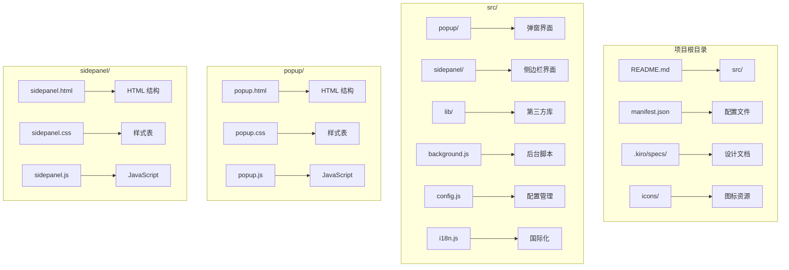
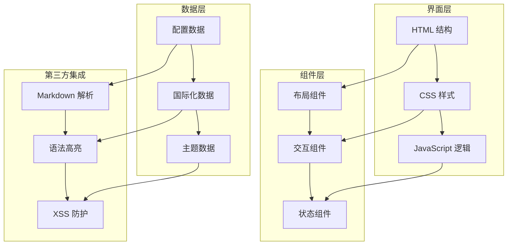
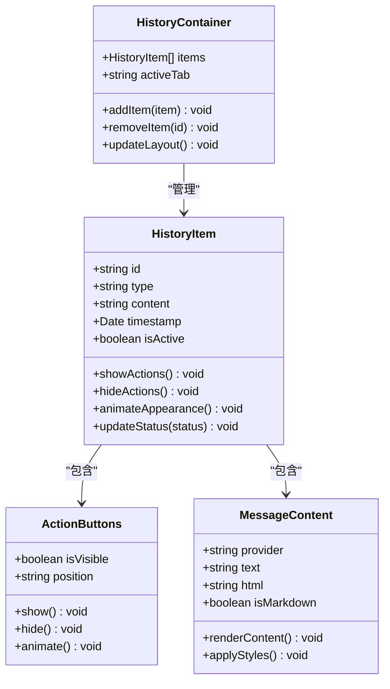
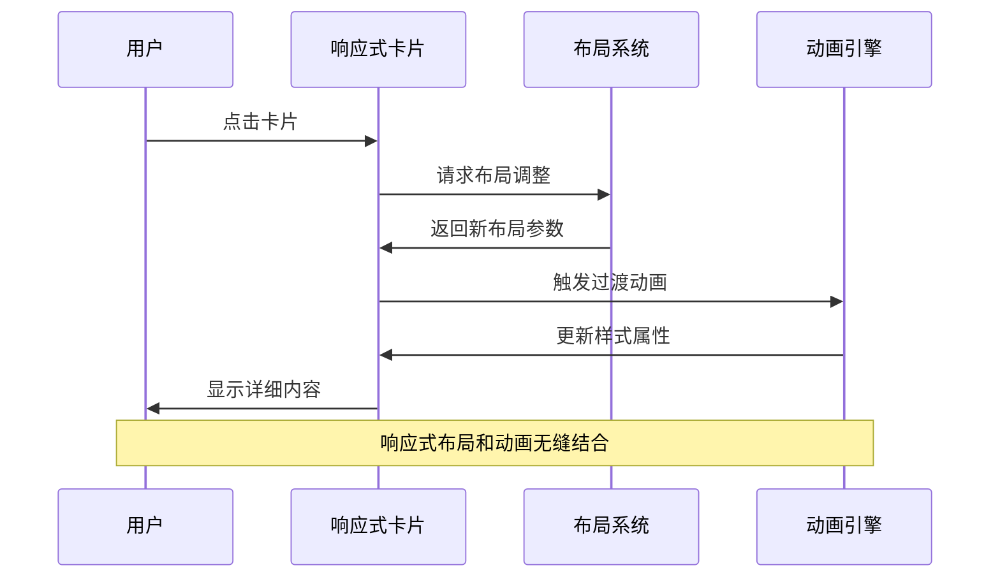
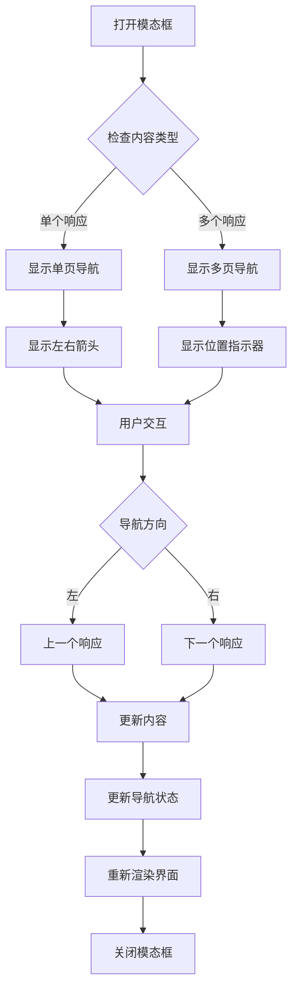
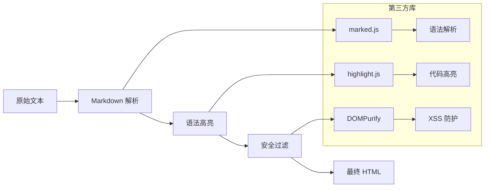
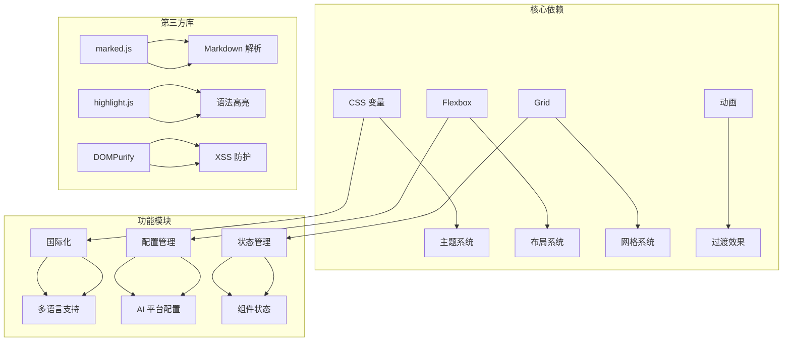

# 界面设计系统

<cite>
**本文档引用的文件**
- [README.md](file://README.md)
- [popup.css](file://src/popup/popup.css)
- [popup.html](file://src/popup/popup.html)
- [sidepanel.css](file://src/sidepanel/sidepanel.css)
- [sidepanel.html](file://src/sidepanel/sidepanel.html)
- [sidepanel.js](file://src/sidepanel/sidepanel.js)
- [design.md](file://.kiro/specs/ui-improvements/design.md)
- [requirements.md](file://.kiro/specs/ui-improvements/requirements.md)
- [modal-design.md](file://.kiro/specs/modal-navigation/design.md)
- [marked.min.js](file://src/lib/marked.min.js)
- [highlight-all.min.js](file://src/lib/highlight-all.min.js)
- [config.js](file://src/config.js)
- [i18n.js](file://src/i18n.js)
</cite>

## 目录
1. [项目概述](#项目概述)
2. [项目结构](#项目结构)
3. [核心组件](#核心组件)
4. [架构概览](#架构概览)
5. [详细组件分析](#详细组件分析)
6. [依赖关系分析](#依赖关系分析)
7. [性能考虑](#性能考虑)
8. [故障排除指南](#故障排除指南)
9. [结论](#结论)

## 项目概述

AI Multiverse 是一个轻量级的 Chrome 扩展程序，允许用户同时向多个 AI 聊天机器人广播消息。该项目采用原生 JavaScript、HTML 和 CSS 构建，无需构建工具，保持了项目的简单性和轻量化。

该界面设计系统专注于提供现代化的用户体验，包括响应式布局、流畅的动画效果、丰富的组件设计和一致的视觉层次结构。

## 项目结构

项目采用模块化结构，主要包含以下核心目录：

**图表来源**
- [README.md](file://README.md#L20-L28)
- [popup.html](file://src/popup/popup.html#L1-L50)
- [sidepanel.html](file://src/sidepanel/sidepanel.html#L1-L400)

**章节来源**
- [README.md](file://README.md#L20-L28)

## 核心组件

### 响应式布局系统

界面设计系统采用了多层次的响应式布局策略：

#### Flexbox 布局
- **主容器布局**：使用 `display: flex` 实现垂直和水平布局
- **弹性项目**：通过 `flex` 属性控制项目伸缩行为
- **对齐方式**：支持 `justify-content` 和 `align-items` 的灵活组合

#### CSS Grid 系统
- **响应式网格**：在响应式卡片布局中使用 CSS Grid
- **自动换行**：利用 `grid-auto-flow` 和 `grid-template-columns` 实现智能布局
- **间距控制**：通过 `gap` 属性统一控制网格间距

#### 媒体查询应用
- **断点设计**：针对不同屏幕尺寸优化布局
- **流式设计**：确保内容在各种设备上的良好显示效果

### 动画效果实现

系统实现了多层次的动画效果：

#### 关键帧动画
- **脉冲效果**：使用 `@keyframes` 创建状态指示器的脉冲动画
- **加载动画**：实现复杂的加载状态动画序列
- **过渡效果**：平滑的状态转换和交互反馈

#### 过渡效果
- **悬停效果**：按钮和卡片的悬停状态变化
- **位置动画**：元素的位置变换和位移动画
- **透明度变化**：渐隐渐现的显示隐藏效果

#### 交互反馈机制
- **状态指示**：实时反映系统状态的视觉反馈
- **用户操作**：针对用户操作的即时响应
- **错误处理**：友好的错误状态展示

### 组件设计规范

#### 按钮组件
- **基础按钮**：统一的按钮样式和交互行为
- **功能按钮**：针对特定功能的定制化按钮
- **状态管理**：根据系统状态动态调整按钮外观

#### 卡片组件
- **响应式卡片**：适配不同屏幕尺寸的卡片布局
- **信息层次**：清晰的信息组织和视觉层次
- **交互设计**：卡片的悬停、点击等交互效果

#### 模态框组件
- **多层模态**：支持嵌套和层级管理的模态框
- **导航功能**：在模态框内的内容导航
- **尺寸控制**：可调整的模态框尺寸和位置

### 视觉层次结构

#### 色彩体系
- **主题变量**：使用 CSS 自定义属性实现主题切换
- **色彩语义**：不同颜色代表不同状态和功能
- **对比度保证**：确保足够的色彩对比度以满足可访问性要求

#### 字体排版
- **字体选择**：基于系统字体的现代字体栈
- **字号层次**：清晰的标题、正文、辅助文字的字号体系
- **行高控制**：优化的阅读体验

#### 间距规范
- **网格系统**：基于 8px 基础单位的间距系统
- **一致性**：全局统一的间距标准
- **响应式调整**：根据不同设备调整间距大小

**章节来源**
- [sidepanel.css](file://src/sidepanel/sidepanel.css#L1-L100)
- [popup.css](file://src/popup/popup.css#L1-L134)

## 架构概览

界面设计系统采用分层架构，确保各组件之间的松耦合和高内聚：

**图表来源**
- [sidepanel.js](file://src/sidepanel/sidepanel.js#L1-L200)
- [config.js](file://src/config.js#L1-L204)
- [i18n.js](file://src/i18n.js#L1-L504)

## 详细组件分析

### 历史消息组件

历史消息组件是界面设计的核心组成部分，实现了现代化的消息展示和交互功能：

**图表来源**
- [sidepanel.css](file://src/sidepanel/sidepanel.css#L396-L429)
- [sidepanel.css](file://src/sidepanel/sidepanel.css#L567-L583)

#### 布局设计原则
- **消息气泡**：使用不同的样式区分用户消息和 AI 消息
- **时间戳**：在消息底部显示精确的时间信息
- **状态指示**：通过颜色和图标反映消息的不同状态

#### 交互设计
- **悬停效果**：鼠标悬停时显示操作按钮
- **动画过渡**：平滑的消息出现和消失动画
- **响应式布局**：适配不同屏幕尺寸的消息显示

**章节来源**
- [sidepanel.css](file://src/sidepanel/sidepanel.css#L396-L429)
- [sidepanel.css](file://src/sidepanel/sidepanel.css#L515-L527)

### 响应式卡片系统

响应式卡片系统提供了灵活的内容展示方式：

**图表来源**
- [sidepanel.css](file://src/sidepanel/sidepanel.css#L803-L811)
- [sidepanel.css](file://src/sidepanel/sidepanel.css#L850-L855)

#### 设计特点
- **弹性布局**：使用 `flex` 和 `grid` 实现灵活的卡片排列
- **自动换行**：在小屏幕上自动调整卡片数量
- **统一间距**：通过 `gap` 属性保持一致的间距

#### 交互特性
- **悬停效果**：卡片悬停时的提升和阴影效果
- **点击反馈**：点击时的按压动画
- **状态变化**：根据内容状态调整卡片外观

**章节来源**
- [sidepanel.css](file://src/sidepanel/sidepanel.css#L803-L811)
- [sidepanel.css](file://src/sidepanel/sidepanel.css#L857-L862)

### 模态框导航系统

模态框导航系统提供了强大的内容浏览功能：

**图表来源**
- [modal-design.md](file://.kiro/specs/modal-navigation/design.md#L41-L59)
- [sidepanel.html](file://src/sidepanel/sidepanel.html#L141-L181)

#### 导航功能
- **键盘导航**：支持左右箭头键进行内容切换
- **触摸手势**：支持滑动手势进行快速导航
- **视觉指示**：清晰的位置指示和进度显示

#### 状态管理
- **索引跟踪**：维护当前显示内容的索引
- **边界检查**：防止越界访问
- **状态同步**：确保所有导航控件状态一致

**章节来源**
- [modal-design.md](file://.kiro/specs/modal-navigation/design.md#L112-L122)
- [sidepanel.html](file://src/sidepanel/sidepanel.html#L141-L181)

### Markdown 渲染系统

Markdown 渲染系统集成了强大的文本格式化能力：

**图表来源**
- [sidepanel.js](file://src/sidepanel/sidepanel.js#L6-L39)
- [sidepanel.js](file://src/sidepanel/sidepanel.js#L70-L123)

#### 渲染流程
- **智能检测**：自动识别纯文本和 HTML 内容
- **语法解析**：使用 marked.js 进行 Markdown 语法解析
- **代码高亮**：自动检测编程语言并应用语法高亮
- **安全过滤**：使用 DOMPurify 防止 XSS 攻击

#### 功能特性
- **代码块支持**：完整的代码块渲染和复制功能
- **列表格式**：支持有序和无序列表的正确渲染
- **链接处理**：自动识别和格式化 URL 链接
- **表格支持**：复杂表格的正确显示

**章节来源**
- [sidepanel.js](file://src/sidepanel/sidepanel.js#L6-L39)
- [sidepanel.js](file://src/sidepanel/sidepanel.js#L70-L123)

## 依赖关系分析

界面设计系统具有清晰的依赖关系结构：

**图表来源**
- [config.js](file://src/config.js#L5-L199)
- [i18n.js](file://src/i18n.js#L6-L346)

### 组件耦合度
- **低耦合设计**：各组件之间通过接口通信，减少直接依赖
- **模块化架构**：功能按模块划分，便于维护和扩展
- **接口标准化**：统一的组件接口规范

### 外部依赖管理
- **版本锁定**：明确的第三方库版本要求
- **安全考虑**：定期更新和安全审计
- **性能优化**：按需加载和懒加载策略

**章节来源**
- [config.js](file://src/config.js#L5-L199)
- [i18n.js](file://src/i18n.js#L1-L504)

## 性能考虑

界面设计系统在性能方面采用了多项优化策略：

### 渲染优化
- **CSS 动画优先**：使用 GPU 加速的 CSS 动画而非 JavaScript 动画
- **虚拟滚动**：对于大量历史消息采用虚拟滚动技术
- **懒加载**：图片和内容的延迟加载机制

### 内存管理
- **事件监听器清理**：及时移除不再使用的事件监听器
- **DOM 元素复用**：重用 DOM 元素而非频繁创建销毁
- **垃圾回收友好**：避免内存泄漏的编程模式

### 网络优化
- **缓存策略**：合理使用浏览器缓存机制
- **CDN 利用**：第三方库通过 CDN 加速加载
- **压缩传输**：CSS 和 JavaScript 文件的压缩传输

## 故障排除指南

### 常见问题诊断

#### 样式问题
- **主题不生效**：检查 CSS 变量是否正确设置
- **布局错乱**：验证 Flexbox 和 Grid 的使用是否正确
- **响应式失效**：确认媒体查询的断点设置

#### 功能问题
- **动画异常**：检查 CSS 动画属性和浏览器兼容性
- **交互无响应**：验证事件监听器的绑定和移除
- **第三方库冲突**：确认库的版本兼容性和加载顺序

#### 性能问题
- **页面卡顿**：分析 JavaScript 执行时间和 DOM 操作
- **内存泄漏**：使用浏览器开发者工具监控内存使用
- **渲染延迟**：检查 CSS 和 JavaScript 的加载优化

### 调试工具使用

#### 浏览器开发者工具
- **Elements 面板**：检查 DOM 结构和样式应用
- **Console 面板**：查看 JavaScript 错误和警告
- **Performance 面板**：分析页面性能瓶颈
- **Network 面板**：监控资源加载情况

#### 特定问题排查
- **Flexbox 问题**：使用 Flexbox Inspector 工具
- **Grid 问题**：检查 Grid 线和区域定义
- **动画问题**：验证 CSS 动画的关键帧定义

**章节来源**
- [sidepanel.js](file://src/sidepanel/sidepanel.js#L6-L39)
- [sidepanel.css](file://src/sidepanel/sidepanel.css#L1-L100)

## 结论

AI Multiverse 的界面设计系统展现了现代 Web 开发的最佳实践。通过精心设计的响应式布局、流畅的动画效果、规范的组件设计和完善的视觉层次，为用户提供了优秀的交互体验。

### 主要成就
- **响应式设计**：完美适配各种设备和屏幕尺寸
- **动画流畅性**：提供自然的过渡和交互反馈
- **组件复用性**：模块化的组件设计便于维护和扩展
- **性能优化**：注重性能的前端开发实践

### 技术亮点
- **CSS 变量系统**：实现灵活的主题切换和样式管理
- **第三方库集成**：Markdown 解析、语法高亮和安全防护的完美结合
- **国际化支持**：完整的多语言本地化解决方案
- **无障碍设计**：考虑不同用户需求的可访问性设计

### 未来发展方向
- **性能进一步优化**：持续改进页面加载和运行时性能
- **功能扩展**：根据用户反馈增加新的界面功能
- **技术升级**：跟进最新的 Web 标准和技术发展
- **用户体验提升**：不断优化交互设计和用户流程

该界面设计系统为类似项目的开发提供了宝贵的参考和借鉴价值，其模块化的设计思路和最佳实践值得推广和学习。