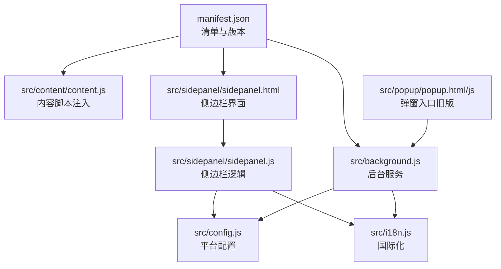
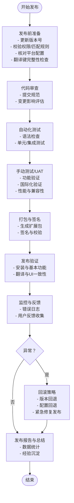
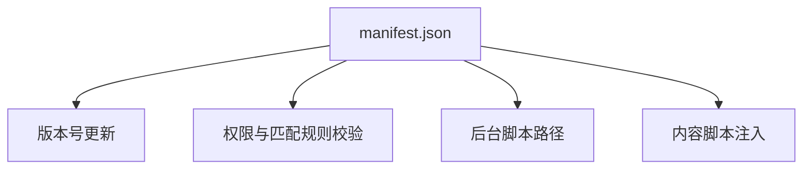
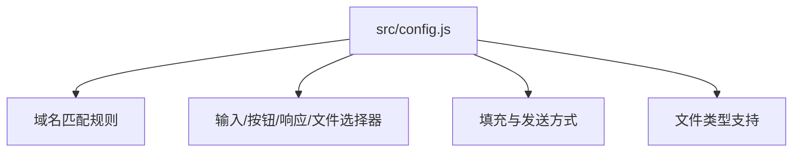
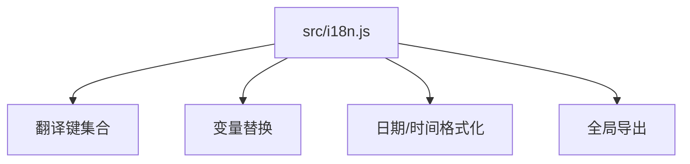
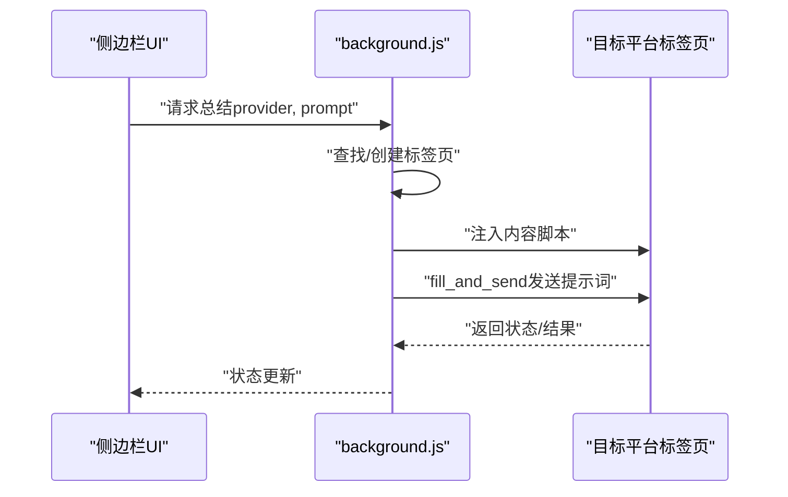
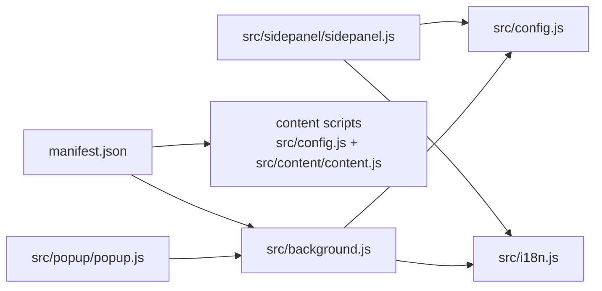

# 发布流程

<cite>
**本文引用的文件**
- [README.md](file://README.md)
- [CONTRIBUTING.md](file://CONTRIBUTING.md)
- [manifest.json](file://manifest.json)
- [src/config.js](file://src/config.js)
- [src/i18n.js](file://src/i18n.js)
- [src/background.js](file://src/background.js)
- [src/popup/popup.js](file://src/popup/popup.js)
- [src/sidepanel/sidepanel.js](file://src/sidepanel/sidepanel.js)
- [RELEASE_v1.7.9.md](file://RELEASE_v1.7.9.md)
- [RELEASE_v1.8.0.md](file://RELEASE_v1.8.0.md)
- [RELEASE_v1.8.1.md](file://RELEASE_v1.8.1.md)
- [RELEASE_v1.8.2.md](file://RELEASE_v1.8.2.md)
- [User_UAT_Checklist.md](file://User_UAT_Checklist.md)
- [TESTING_v1.7.md](file://TESTING_v1.7.md)
- [QUICK_TEST_GUIDE.md](file://QUICK_TEST_GUIDE.md)
</cite>

## 目录
1. [简介](#简介)
2. [项目结构](#项目结构)
3. [核心组件](#核心组件)
4. [架构总览](#架构总览)
5. [详细组件分析](#详细组件分析)
6. [依赖关系分析](#依赖关系分析)
7. [性能考量](#性能考量)
8. [故障排查指南](#故障排查指南)
9. [结论](#结论)
10. [附录](#附录)

## 简介
本文件面向发布工程师与项目维护者，系统化梳理从代码合并到最终发布的完整流程，涵盖代码审查、自动化测试、构建打包与部署验证等关键步骤，并给出发布前准备、发布执行、发布后验证、异常处理与回滚策略、发布报告模板与总结文档规范。结合仓库中现有的发布说明与测试文档，形成可落地的发布实践。

## 项目结构
该项目为 Chrome 扩展，采用原生 JS、HTML、CSS 构建，无构建工具，便于直接打包与发布。核心目录与文件如下：
- manifest.json：扩展清单，定义版本、权限、入口脚本等
- src/config.js：AI 平台统一配置，包含各平台的选择器、提交方式等
- src/i18n.js：国际化翻译与日期时间格式化
- src/background.js：后台服务工作线程，负责窗口调度、消息转发、总结触发等
- src/popup/popup.js：弹窗入口逻辑（旧版）
- src/sidepanel/sidepanel.js：侧边栏主逻辑（新版 UI）
- 各版本发布说明（RELEASE_v1.7.9.md、RELEASE_v1.8.0.md、RELEASE_v1.8.1.md、RELEASE_v1.8.2.md）：记录翻译修复、按钮 tooltip 修复、模态框修复等
- User_UAT_Checklist.md、TESTING_v1.7.md、QUICK_TEST_GUIDE.md：用户验收测试、自测清单与快速测试指南

图表来源
- [manifest.json](file://manifest.json#L1-L79)
- [src/config.js](file://src/config.js#L1-L204)
- [src/i18n.js](file://src/i18n.js#L1-L504)
- [src/background.js](file://src/background.js#L1-L800)
- [src/popup/popup.js](file://src/popup/popup.js#L1-L61)
- [src/sidepanel/sidepanel.js](file://src/sidepanel/sidepanel.js#L1-L800)

章节来源
- [README.md](file://README.md#L20-L29)
- [manifest.json](file://manifest.json#L1-L79)

## 核心组件
- 清单与版本管理：通过 manifest.json 的 version 字段管理版本号，发布前需更新版本并校验权限与匹配规则
- 平台配置中心：src/config.js 统一管理各 AI 平台的选择器、提交方式、文件支持等，发布前需核对平台域名与选择器
- 国际化系统：src/i18n.js 提供翻译键、变量替换、日期时间格式化，发布前需确保翻译键完整
- 后台服务：src/background.js 负责广播消息、窗口平铺、总结触发、脚本注入与超时等待，发布前需验证消息通道与注入逻辑
- 侧边栏与弹窗：src/sidepanel/sidepanel.js 为主逻辑入口，src/popup/popup.js 为旧版入口；发布前需验证 UI 交互与翻译更新

章节来源
- [manifest.json](file://manifest.json#L1-L79)
- [src/config.js](file://src/config.js#L1-L204)
- [src/i18n.js](file://src/i18n.js#L1-L504)
- [src/background.js](file://src/background.js#L1-L800)
- [src/popup/popup.js](file://src/popup/popup.js#L1-L61)
- [src/sidepanel/sidepanel.js](file://src/sidepanel/sidepanel.js#L1-L800)

## 架构总览
发布流程围绕“清单版本更新—配置与国际化校验—功能与国际化测试—打包与验证—发布—验证与回滚”的闭环展开。下图展示从代码合并到发布的端到端流程：

## 详细组件分析

### 清单与版本管理（manifest.json）
- 版本字段：用于标识当前版本，发布前需更新
- 权限与主机权限：确保 content_scripts 与 host_permissions 覆盖目标平台域名
- 后台与内容脚本：确认 service_worker 与 content scripts 的路径与注入时机

图表来源
- [manifest.json](file://manifest.json#L1-L79)

章节来源
- [manifest.json](file://manifest.json#L1-L79)

### 平台配置中心（src/config.js）
- 平台选择器：输入框、发送按钮、响应容器、文件上传等选择器
- 提交方式：main-world 或 content-script，Enter 或 Button
- 文件支持：各平台支持的文件类型
- 发布前检查要点：域名匹配、选择器有效性、提交方式稳定性

图表来源
- [src/config.js](file://src/config.js#L1-L204)

章节来源
- [src/config.js](file://src/config.js#L1-L204)

### 国际化系统（src/i18n.js）
- 翻译键：英文与中文键值，支持变量替换
- 日期时间格式化：本地化格式与相对时间
- 发布前检查要点：翻译键完整性、变量替换正确性、函数导出一致性

图表来源
- [src/i18n.js](file://src/i18n.js#L1-L504)

章节来源
- [src/i18n.js](file://src/i18n.js#L1-L504)

### 后台服务（src/background.js）
- 广播消息：向多个平台发送消息
- 窗口平铺：根据显示器布局计算并应用窗口尺寸
- 总结触发：定位/创建目标平台标签页，注入内容脚本并发送总结提示词
- 超时等待：等待页面加载完成，避免注入失败
- 发布前检查要点：消息通道、注入逻辑、超时处理、错误通知

图表来源
- [src/background.js](file://src/background.js#L1-L800)

章节来源
- [src/background.js](file://src/background.js#L1-L800)

### 侧边栏与弹窗（src/sidepanel/sidepanel.js 与 src/popup/popup.js）
- 侧边栏：Markdown 渲染、文件上传、响应详情、模态框导航、主题与语言切换
- 弹窗：旧版入口，主要进行广播消息
- 发布前检查要点：UI 交互、翻译更新、Markdown 渲染、拖拽与复制按钮

章节来源
- [src/sidepanel/sidepanel.js](file://src/sidepanel/sidepanel.js#L1-L800)
- [src/popup/popup.js](file://src/popup/popup.js#L1-L61)

### 发布说明与测试文档（RELEASE_* 与测试清单）
- v1.7.9：国际化翻译完整修复，翻译键新增与结构优化
- v1.8.0：按钮 Tooltip 翻译修复，HTML data-i18n-title 与 JS 更新逻辑
- v1.8.1：按钮文字翻译缺失修复，data-i18n 属性补全
- v1.8.2：全面翻译完整性修复，模态框、导航按钮、占位符等统一处理
- User_UAT_Checklist.md：用户验收测试清单，覆盖文件上传、多平台发送、错误处理、国际化、历史记录、UI 交互与性能
- TESTING_v1.7.md：自测检查清单，涵盖总结按钮显示逻辑、状态管理、国际化、设置持久化等
- QUICK_TEST_GUIDE.md：快速测试指南，覆盖 Markdown 渲染、窗口调节手柄、复制按钮等

章节来源
- [RELEASE_v1.7.9.md](file://RELEASE_v1.7.9.md#L1-L241)
- [RELEASE_v1.8.0.md](file://RELEASE_v1.8.0.md#L1-L203)
- [RELEASE_v1.8.1.md](file://RELEASE_v1.8.1.md#L1-L98)
- [RELEASE_v1.8.2.md](file://RELEASE_v1.8.2.md#L1-L247)
- [User_UAT_Checklist.md](file://User_UAT_Checklist.md#L1-L305)
- [TESTING_v1.7.md](file://TESTING_v1.7.md#L1-L211)
- [QUICK_TEST_GUIDE.md](file://QUICK_TEST_GUIDE.md#L1-L139)

## 依赖关系分析
- manifest.json 依赖 src/background.js 与 content scripts（src/config.js、src/content/content.js）
- src/sidepanel/sidepanel.js 依赖 src/i18n.js 与 src/config.js
- src/background.js 依赖 src/config.js 与 src/i18n.js（背景语言翻译）
- src/popup/popup.js 依赖 background.js 的消息通道

图表来源
- [manifest.json](file://manifest.json#L1-L79)
- [src/config.js](file://src/config.js#L1-L204)
- [src/i18n.js](file://src/i18n.js#L1-L504)
- [src/background.js](file://src/background.js#L1-L800)
- [src/popup/popup.js](file://src/popup/popup.js#L1-L61)
- [src/sidepanel/sidepanel.js](file://src/sidepanel/sidepanel.js#L1-L800)

章节来源
- [manifest.json](file://manifest.json#L1-L79)
- [src/config.js](file://src/config.js#L1-L204)
- [src/i18n.js](file://src/i18n.js#L1-L504)
- [src/background.js](file://src/background.js#L1-L800)
- [src/popup/popup.js](file://src/popup/popup.js#L1-L61)
- [src/sidepanel/sidepanel.js](file://src/sidepanel/sidepanel.js#L1-L800)

## 性能考量
- 侧边栏 Markdown 渲染与语法高亮：使用 marked.js 与 highlight.js，注意库加载时机与错误降级
- 文件上传与预览：限制单文件与总大小，避免内存压力
- 窗口平铺：按显示器工作区计算布局，减少重绘与闪烁
- 服务工作线程注入：等待页面加载完成，避免频繁注入失败

章节来源
- [src/sidepanel/sidepanel.js](file://src/sidepanel/sidepanel.js#L1-L800)
- [src/background.js](file://src/background.js#L1-L800)

## 故障排查指南
- 服务工作线程注入失败：检查 content scripts 注入逻辑与页面加载状态
- 翻译缺失或不一致：核对 data-i18n 属性与翻译键，确保 applyLanguage/updateButtonLabels 生效
- 按钮 Tooltip 不随语言切换：确认 data-i18n-title 与 title 属性更新逻辑
- 模态框与导航：检查 data-i18n-* 属性与导航控制器状态
- UAT 测试问题：参考 User_UAT_Checklist.md 逐项验证文件上传、多平台发送、错误处理、国际化与性能

章节来源
- [src/background.js](file://src/background.js#L1-L800)
- [src/i18n.js](file://src/i18n.js#L1-L504)
- [src/sidepanel/sidepanel.js](file://src/sidepanel/sidepanel.js#L1-L800)
- [User_UAT_Checklist.md](file://User_UAT_Checklist.md#L1-L305)

## 结论
本发布流程以清单与配置为中心，结合国际化与后台服务的关键路径，通过发布说明与测试清单确保质量闭环。建议在每次发布前严格执行版本更新、配置校验、翻译完整性检查与 UAT 测试，并建立标准化的回滚与应急响应机制，保障发布质量与用户体验。

## 附录

### 发布前准备清单
- 版本更新：更新 manifest.json 的 version
- 权限与匹配规则：校验 host_permissions 与 content_scripts.matches
- 平台配置：核对 src/config.js 的域名与选择器
- 国际化：核对 src/i18n.js 的翻译键与变量替换
- 代码质量：语法检查（如 node -c）、无破坏性改动
- 测试覆盖：UAT 与自测清单逐项验证

章节来源
- [manifest.json](file://manifest.json#L1-L79)
- [src/config.js](file://src/config.js#L1-L204)
- [src/i18n.js](file://src/i18n.js#L1-L504)
- [TESTING_v1.7.md](file://TESTING_v1.7.md#L1-L211)
- [User_UAT_Checklist.md](file://User_UAT_Checklist.md#L1-L305)

### 发布执行步骤
- 代码审查：遵循 CONTRIBUTING.md 的提交规范与分支策略
- 自动化测试：语法检查与单元/集成测试
- 手动测试/UAT：依据测试清单与快速测试指南
- 打包与签名：生成扩展包并进行签名与校验
- 发布验证：安装与基本功能验证、翻译与 UI 一致性检查

章节来源
- [CONTRIBUTING.md](file://CONTRIBUTING.md#L1-L56)
- [RELEASE_v1.7.9.md](file://RELEASE_v1.7.9.md#L1-L241)
- [RELEASE_v1.8.0.md](file://RELEASE_v1.8.0.md#L1-L203)
- [RELEASE_v1.8.1.md](file://RELEASE_v1.8.1.md#L1-L98)
- [RELEASE_v1.8.2.md](file://RELEASE_v1.8.2.md#L1-L247)
- [QUICK_TEST_GUIDE.md](file://QUICK_TEST_GUIDE.md#L1-L139)

### 发布后验证流程
- 功能测试：广播消息、窗口平铺、总结触发、文件上传
- 国际化验证：语言切换、Tooltip、模态框文本、占位符
- 性能监控：内存使用、响应时间、渲染性能
- 用户反馈收集：通过 README.md 中的反馈渠道收集问题

章节来源
- [User_UAT_Checklist.md](file://User_UAT_Checklist.md#L1-L305)
- [README.md](file://README.md#L1-L107)

### 异常处理与回滚策略
- 回滚策略：版本回退、配置回退、紧急修复发布
- 应急响应：快速定位问题（注入失败、翻译缺失、UI 不一致），依据发布说明与测试清单快速修复与验证

章节来源
- [RELEASE_v1.8.1.md](file://RELEASE_v1.8.1.md#L1-L98)
- [RELEASE_v1.8.2.md](file://RELEASE_v1.8.2.md#L1-L247)

### 发布报告模板与总结文档规范
- 发布报告模板（建议结构）
  - 版本号与发布日期
  - 主要变更摘要
  - 影响范围与风险评估
  - 测试覆盖与结果
  - 性能指标与监控
  - 用户反馈与问题追踪
  - 经验教训与改进建议
- 总结文档规范
  - 基于 RELEASE_* 的事实记录
  - 结合测试清单与快速测试指南的验证结果
  - 明确后续计划与回归测试建议

章节来源
- [RELEASE_v1.7.9.md](file://RELEASE_v1.7.9.md#L1-L241)
- [RELEASE_v1.8.0.md](file://RELEASE_v1.8.0.md#L1-L203)
- [RELEASE_v1.8.1.md](file://RELEASE_v1.8.1.md#L1-L98)
- [RELEASE_v1.8.2.md](file://RELEASE_v1.8.2.md#L1-L247)
- [User_UAT_Checklist.md](file://User_UAT_Checklist.md#L1-L305)
- [TESTING_v1.7.md](file://TESTING_v1.7.md#L1-L211)
- [QUICK_TEST_GUIDE.md](file://QUICK_TEST_GUIDE.md#L1-L139)