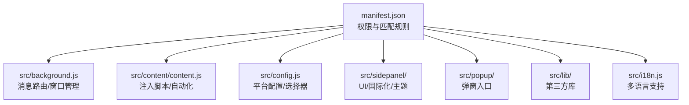
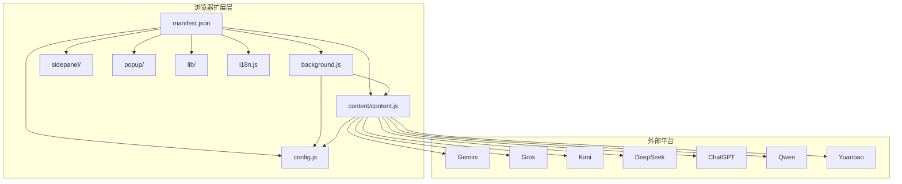
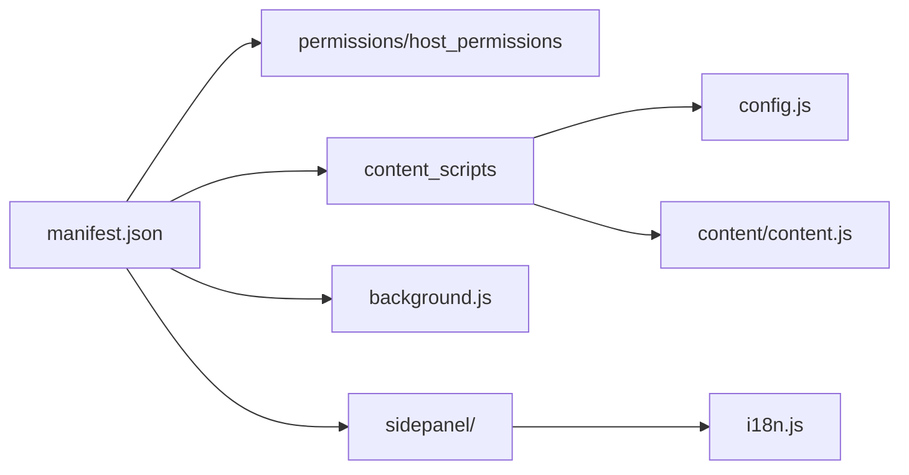

# 开源策略

<cite>
**本文引用的文件**
- [OPEN_SOURCE_STRATEGY.md](file://OPEN_SOURCE_STRATEGY.md)
- [CONTRIBUTING.md](file://CONTRIBUTING.md)
- [LICENSE](file://LICENSE)
- [README.md](file://README.md)
- [MAINTENANCE.md](file://MAINTENANCE.md)
- [manifest.json](file://manifest.json)
- [DEVLOG.md](file://DEVLOG.md)
- [User_UAT_Checklist.md](file://User_UAT_Checklist.md)
- [PROJECT_ANALYSIS_v1.6.md](file://PROJECT_ANALYSIS_v1.6.md)
</cite>

## 目录
1. [引言](#引言)
2. [项目结构](#项目结构)
3. [核心组件](#核心组件)
4. [架构总览](#架构总览)
5. [详细组件分析](#详细组件分析)
6. [依赖关系分析](#依赖关系分析)
7. [性能考量](#性能考量)
8. [故障排查指南](#故障排查指南)
9. [结论](#结论)
10. [附录](#附录)

## 引言
本指南围绕开源策略与合规实践，结合仓库现有文档与代码结构，系统阐述以下主题：
- 开源许可证选择与使用规范（以 MIT 为例）
- 贡献者协议与知识产权管理（贡献代码的版权归属与使用授权）
- 社区维护策略（规则制定、贡献者激励、活动组织）
- 项目治理结构（决策流程、权限管理、责任分工）
- 开源合规性检查清单（满足常见许可证要求）
- 推广与品牌建设（发布渠道、产品展示、社区运营）

本指南既面向技术读者，也兼顾非技术读者，帮助团队在开源演进过程中建立可持续、透明且合规的协作生态。

## 项目结构
该项目是一个 Chrome 扩展，采用 Manifest V3，核心模块包括：
- manifest.json：扩展配置（权限、主机权限、内容脚本、命令等）
- src/background.js：后台逻辑（消息路由、窗口管理、与各平台交互）
- src/content/content.js：内容脚本（注入到目标站点，自动化输入与提交）
- src/config.js：集中式配置（AI 平台列表、选择器、上传策略等）
- src/sidepanel/：侧边栏 UI（主界面、文件上传、国际化、主题等）
- src/popup/：弹窗界面（快捷入口）
- src/lib/：第三方库（高亮、解析、净化等）
- src/i18n.js：国际化翻译
- 其他资源：icons、assets 等

图表来源
- [manifest.json](file://manifest.json#L1-L79)

章节来源
- [README.md](file://README.md#L20-L28)
- [manifest.json](file://manifest.json#L1-L79)

## 核心组件
- 许可证与合规：仓库包含 MIT 许可证文件，明确软件使用、复制、修改、分发、再许可与销售的权利与义务，以及免责声明与版权提示要求。
- 贡献指南：提供新增 AI 平台接入的步骤、配置与测试流程，强调保持轻量化与可维护性。
- 维护日志与质量报告：记录版本迭代、关键缺陷修复、安全与性能优化建议，体现持续改进与质量控制。
- 发布与清单：通过 manifest.json 明确扩展版本、权限、主机权限与内容脚本匹配规则，支撑发布与合规审计。

章节来源
- [LICENSE](file://LICENSE#L1-L22)
- [CONTRIBUTING.md](file://CONTRIBUTING.md#L1-L56)
- [MAINTENANCE.md](file://MAINTENANCE.md#L1-L531)
- [manifest.json](file://manifest.json#L1-L79)

## 架构总览
从开源策略视角，项目采用“内容脚本 + 配置中心 + 后台协调”的架构，配合 Manifest V3 的权限模型与主机权限声明，实现对多家 AI 平台的统一接入与自动化交互。该架构便于社区贡献者按插件化方式扩展新平台，降低耦合度与维护成本。

图表来源
- [manifest.json](file://manifest.json#L42-L68)
- [README.md](file://README.md#L24-L28)

## 详细组件分析

### 组件A：开源许可证与合规（MIT）
- 权利与义务
  - 允许商用、修改、复制、分发、再许可与销售
  - 要求在分发或复制中包含版权与许可声明
  - 软件按“现状”提供，不提供任何明示或暗示担保
- 实践要点
  - 在发布包中保留 LICENSE 文件
  - 在 README 或发行说明中标注许可证信息
  - 在贡献者提交中明确版权归属与授权同意（见贡献者协议章节）

章节来源
- [LICENSE](file://LICENSE#L1-L22)

### 组件B：贡献者协议与知识产权管理
- 贡献流程
  - 新增平台：在配置中心添加平台配置，更新清单文件（如需要），补充图标与 UI
  - 提交流程：Fork 仓库、创建特性分支、提交变更、发起 PR
  - 代码风格：保持轻量化（避免构建工具）、语义化命名
- 知识产权与授权
  - 贡献代码默认遵循项目许可证（MIT）
  - 建议在贡献前签署贡献者许可协议（CLA）以明确版权归属与再许可授权
  - 对第三方库与资源（图标、字体、样式）确保具备合法使用权并注明来源

章节来源
- [CONTRIBUTING.md](file://CONTRIBUTING.md#L1-L56)

### 组件C：社区维护策略
- 规则制定
  - Issue 模板：Bug 报告与功能请求模板，标准化问题描述
  - PR 规范：分支命名、提交信息、测试与文档更新
- 贡献者激励
  - 里程碑奖励、致谢名单、公开认可
  - 优秀贡献者晋升为维护者或审阅者
- 社区活动
  - 发布公告、功能演示视频、用户反馈收集
  - 与平台方沟通，及时修复选择器失效问题

章节来源
- [OPEN_SOURCE_STRATEGY.md](file://OPEN_SOURCE_STRATEGY.md#L18-L27)

### 组件D：治理结构
- 决策流程
  - 重大变更通过 Issue 讨论与 PR 审阅
  - 核心维护者拥有合并权限，遵循“共识优先”
- 权限管理
  - 仓库访问权限分级（作者、维护者、审阅者）
  - 主机权限与权限最小化原则（manifest.json）
- 责任分工
  - 质量保证：测试清单、UAT 检查表、代码审查报告
  - 安全与合规：XSS 修复、依赖审计、许可证合规

章节来源
- [MAINTENANCE.md](file://MAINTENANCE.md#L355-L531)
- [User_UAT_Checklist.md](file://User_UAT_Checklist.md#L1-L305)

### 组件E：合规性检查清单
- 版本与清单
  - manifest.json 版本号与权限声明准确
  - 主机权限覆盖所有目标平台域名
- 许可证与版权声明
  - 包含 LICENSE 文件
  - 代码中保留版权与许可声明
- 安全与隐私
  - 避免明文存储敏感信息
  - 数据最小化与本地处理优先
- 第三方依赖
  - 记录第三方库及其许可证
  - 定期审计与升级
- 用户界面与国际化
  - 确保 UI 文案与翻译一致
  - 无障碍与可访问性检查

章节来源
- [manifest.json](file://manifest.json#L1-L79)
- [LICENSE](file://LICENSE#L1-L22)
- [PROJECT_ANALYSIS_v1.6.md](file://PROJECT_ANALYSIS_v1.6.md#L26-L80)

### 组件F：推广与品牌建设
- 发布渠道
  - Chrome Web Store 正式发布，提升信任度
  - 产品页面与截图、演示视频准备
- 品牌传播
  - 社交媒体与技术社区分享
  - 用户案例与使用场景展示
- 社区运营
  - Discord/Slack 空间用于用户反馈与选择器修复协作
  - 定期直播演示与问答

章节来源
- [OPEN_SOURCE_STRATEGY.md](file://OPEN_SOURCE_STRATEGY.md#L82-L86)

## 依赖关系分析
- Manifest V3 权限与主机权限
  - permissions：activeTab、scripting、tabs、storage、system.display
  - host_permissions：覆盖所有支持的 AI 平台域名
- 内容脚本注入
  - 在目标平台页面注入配置与内容脚本，执行自动化交互
- 国际化与 UI
  - i18n.js 提供翻译键值，sidepanel 与 popup 使用 data-i18n 属性进行动态替换

图表来源
- [manifest.json](file://manifest.json#L12-L68)

章节来源
- [manifest.json](file://manifest.json#L12-L68)
- [DEVLOG.md](file://DEVLOG.md#L1-L397)

## 性能考量
- 代码体积与加载速度
  - 保持轻量化，避免引入重型框架
  - 按需注入内容脚本，减少全局开销
- 文件上传与传输
  - 采用 DataTransfer 与 Data URL，避免直接写入 input.files
  - 设置合理超时与重试策略，避免阻塞 UI
- UI 渲染与交互
  - 避免全量 DOM 重绘，采用增量更新
  - 使用虚拟滚动或分页策略处理长列表

章节来源
- [MAINTENANCE.md](file://MAINTENANCE.md#L284-L346)
- [PROJECT_ANALYSIS_v1.6.md](file://PROJECT_ANALYSIS_v1.6.md#L283-L370)

## 故障排查指南
- 常见问题与修复
  - XSS 注入风险：使用 textContent 或 DOMPurify 替换 innerHTML
  - alert 阻塞 UI：改用 Toast 通知系统
  - 事件监听器与定时器未清理：统一注册与清理机制
  - 选择器失效：优先检查 config.js 中的最新选择器
- 测试与验证
  - 使用 UAT 检查表逐项验证功能
  - 代码审查报告中的关键问题优先修复

章节来源
- [PROJECT_ANALYSIS_v1.6.md](file://PROJECT_ANALYSIS_v1.6.md#L26-L80)
- [User_UAT_Checklist.md](file://User_UAT_Checklist.md#L1-L305)

## 结论
本项目在开源策略方面已具备良好基础：明确的 MIT 许可证、完善的贡献指南、持续的质量与安全改进、以及清晰的发布与治理流程。建议进一步完善贡献者许可协议（CLA）、强化第三方依赖审计、建立自动化合规检查与发布流水线，以支撑更大规模的社区协作与长期可持续发展。

## 附录
- 版本与发布日志：参考开发日志与维护日志，确保每次发布均包含变更摘要与测试验证
- 国际化与可访问性：持续完善翻译键值与无障碍设计，提升全球用户可用性

章节来源
- [DEVLOG.md](file://DEVLOG.md#L1-L397)
- [MAINTENANCE.md](file://MAINTENANCE.md#L1-L531)