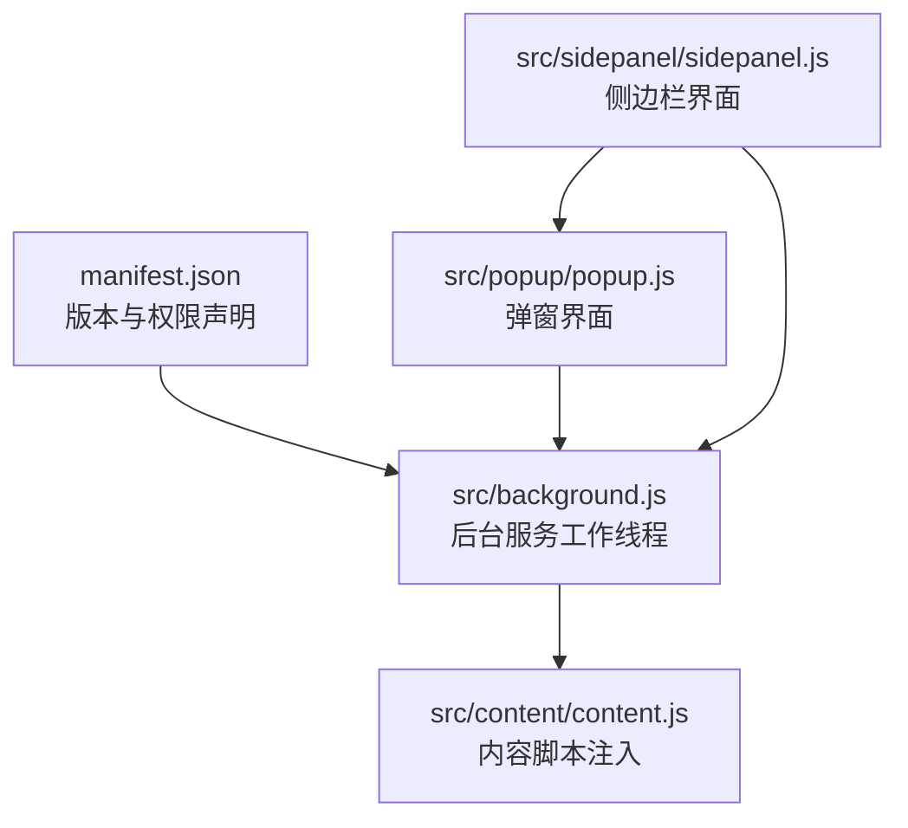
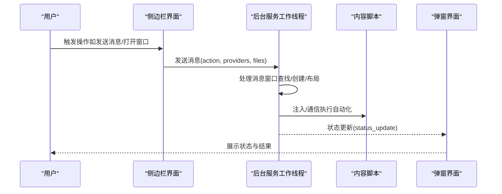
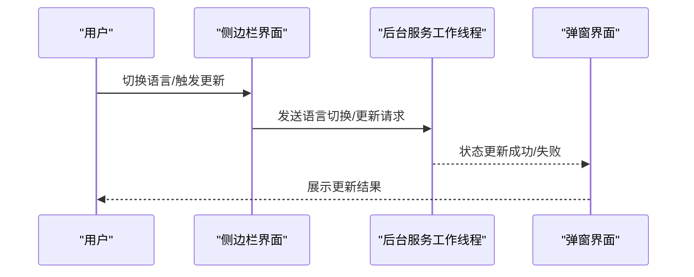
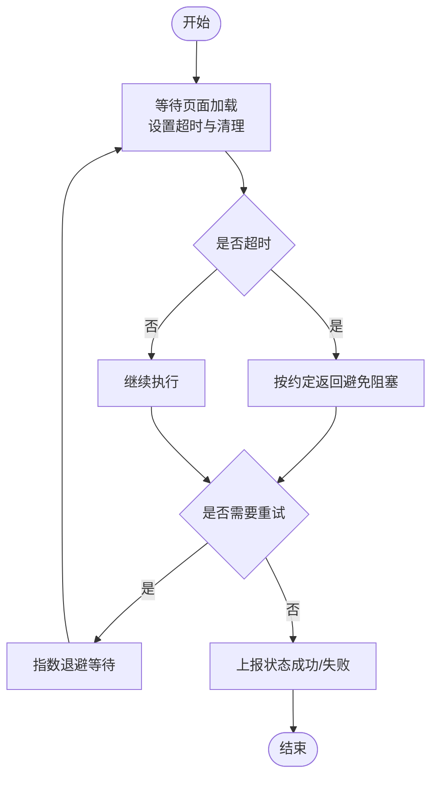
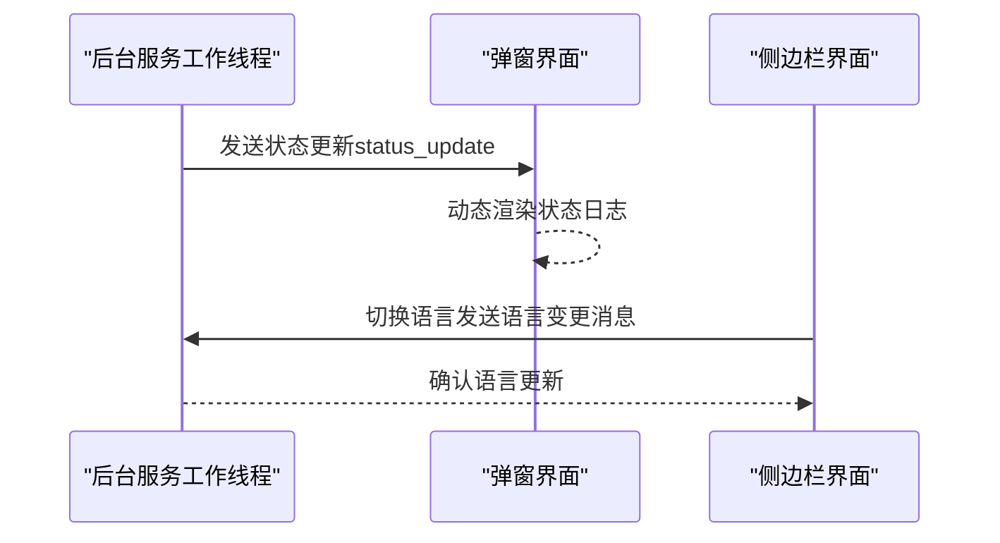
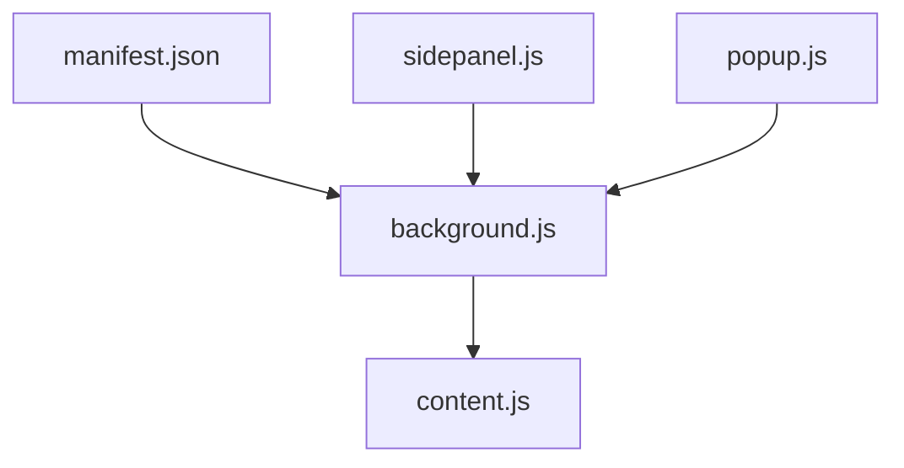

# 更新机制

<cite>
**本文引用的文件**
- [manifest.json](file://manifest.json)
- [src/background.js](file://src/background.js)
- [src/popup/popup.js](file://src/popup/popup.js)
- [src/sidepanel/sidepanel.js](file://src/sidepanel/sidepanel.js)
- [src/content/content.js](file://src/content/content.js)
- [RELEASE_v1.8.2.md](file://RELEASE_v1.8.2.md)
- [RELEASE_v1.8.1.md](file://RELEASE_v1.8.1.md)
- [MAINTENANCE.md](file://MAINTENANCE.md)
- [DEVLOG_v1.6.md](file://DEVLOG_v1.6.md)
- [BUGFIX_v1.7.3.md](file://BUGFIX_v1.7.3.md)
</cite>

## 目录
1. [简介](#简介)
2. [项目结构](#项目结构)
3. [核心组件](#核心组件)
4. [架构总览](#架构总览)
5. [详细组件分析](#详细组件分析)
6. [依赖关系分析](#依赖关系分析)
7. [性能考量](#性能考量)
8. [故障排查指南](#故障排查指南)
9. [结论](#结论)
10. [附录](#附录)

## 简介
本技术文档聚焦于本Chrome扩展的更新机制与版本演进实践，结合现有代码与发布日志，系统阐述以下主题：
- 版本号与更新策略：基于manifest.json中的版本号与权限声明，说明扩展的版本管理与更新入口。
- 自动更新与增量更新：解释Chrome扩展的自动更新机制与增量更新的实现思路（含差分包生成、下载与应用流程）。
- 手动更新流程：说明用户如何触发更新与版本切换。
- 更新失败处理：涵盖重试、错误恢复与降级策略。
- 更新日志与展示：介绍版本发布日志的生成与展示机制，帮助用户了解更新内容。
- 兼容性与依赖校验：提供兼容性检查与依赖版本验证的实现方法。

说明：本仓库未包含实际的自动更新URL配置与增量更新的下载/应用实现代码，因此本文在“自动更新与增量更新”部分采用面向实现的通用流程说明，并结合项目现状给出可落地的建议与最佳实践。

## 项目结构
该项目为轻量级Chrome扩展，采用原生JavaScript、HTML与CSS，无构建工具依赖。核心目录与文件如下：
- manifest.json：扩展配置，包含manifest_version、name、version、permissions、host_permissions、action、background、content_scripts、commands等。
- src/background.js：后台服务工作线程，负责窗口管理、消息分发、布局记忆与语言切换通知。
- src/popup/popup.js：弹窗界面的消息监听与状态展示。
- src/sidepanel/sidepanel.js：侧边栏界面，负责与后台交互、发起广播、窗口控制与语言切换。
- src/content/content.js：内容脚本，注入目标AI站点，执行输入与提交自动化。
- RELEASE_* 与 MAINTENANCE_*：版本发布与维护日志，记录版本号、功能变更、修复与国际化改进。

图表来源
- [manifest.json](file://manifest.json#L1-L79)
- [src/background.js](file://src/background.js#L1-L120)
- [src/popup/popup.js](file://src/popup/popup.js#L1-L60)
- [src/sidepanel/sidepanel.js](file://src/sidepanel/sidepanel.js#L1270-L1290)
- [src/content/content.js](file://src/content/content.js#L190-L440)

章节来源
- [manifest.json](file://manifest.json#L1-L79)
- [src/background.js](file://src/background.js#L1-L120)
- [src/popup/popup.js](file://src/popup/popup.js#L1-L60)
- [src/sidepanel/sidepanel.js](file://src/sidepanel/sidepanel.js#L1270-L1290)
- [src/content/content.js](file://src/content/content.js#L190-L440)

## 核心组件
- manifest.json：定义扩展版本号、权限与后台脚本路径，是版本管理与更新策略的基础。
- src/background.js：负责消息监听、窗口与布局管理、语言切换通知、状态上报等。
- src/popup/popup.js：监听来自后台的状态更新并展示。
- src/sidepanel/sidepanel.js：与后台交互，发起广播、窗口控制、语言切换与布局记忆。
- src/content/content.js：在目标站点注入脚本，执行自动化任务。

章节来源
- [manifest.json](file://manifest.json#L1-L79)
- [src/background.js](file://src/background.js#L138-L197)
- [src/popup/popup.js](file://src/popup/popup.js#L38-L60)
- [src/sidepanel/sidepanel.js](file://src/sidepanel/sidepanel.js#L1278-L1283)
- [src/content/content.js](file://src/content/content.js#L199-L433)

## 架构总览
扩展采用“侧边栏/弹窗 -> 后台 -> 内容脚本”的消息驱动架构。侧边栏负责用户交互与命令下发；后台负责窗口管理、布局记忆与状态汇总；内容脚本在目标站点执行自动化。

图表来源
- [src/sidepanel/sidepanel.js](file://src/sidepanel/sidepanel.js#L1278-L1283)
- [src/background.js](file://src/background.js#L138-L197)
- [src/content/content.js](file://src/content/content.js#L199-L433)
- [src/popup/popup.js](file://src/popup/popup.js#L38-L60)

## 详细组件分析

### 版本与更新策略（基于manifest.json）
- 版本号：扩展当前版本号在manifest.json中声明，用于标识当前构建版本。
- 权限与主机权限：manifest中声明了扩展所需的权限与目标站点的主机权限，确保内容脚本与后台脚本在目标站点正常工作。
- 后台脚本：后台脚本路径在manifest中声明，作为扩展生命周期与消息处理的核心。

章节来源
- [manifest.json](file://manifest.json#L1-L79)

### 自动更新与增量更新（实现原理与流程）
说明：本仓库未包含自动更新URL配置与增量更新的下载/应用实现代码。以下为通用实现思路与流程，便于在现有架构基础上扩展。

- 自动更新机制
  - Chrome扩展的自动更新通常依赖Chrome Web Store或企业版分发渠道的更新服务器。扩展启动时，浏览器会根据manifest中的版本号与更新通道进行版本检查。
  - 若存在更高版本，浏览器会自动下载新版本并替换当前扩展。该过程对用户透明，无需手动干预。
  - 由于本仓库未提供更新URL配置与增量更新实现，建议在生产环境中：
    - 使用官方Web Store或企业版分发渠道；
    - 在manifest中配置合法的更新源（若使用自托管）；
    - 通过版本号递增与发布日志明确更新范围。

- 增量更新（差分包）实现原理
  - 差分包生成：在发布新版本时，对比旧版本与新版本的差异，生成差分包（例如基于二进制补丁或压缩归档）。
  - 下载与应用：浏览器下载差分包后，本地应用补丁，完成升级。该流程需配合分发渠道与签名机制。
  - 适用场景：大体积扩展或频繁更新场景，可显著降低带宽与下载时间。

- 与现有代码的衔接点
  - 版本号与发布日志：版本号在manifest中声明，发布日志在RELEASE_*中记录。可将二者联动，形成“版本 -> 日志 -> 分发”的闭环。
  - 状态上报：后台通过状态更新消息向弹窗界面展示更新进度与结果，可用于展示增量更新的应用状态。

章节来源
- [manifest.json](file://manifest.json#L1-L79)
- [RELEASE_v1.8.2.md](file://RELEASE_v1.8.2.md#L1-L247)
- [RELEASE_v1.8.1.md](file://RELEASE_v1.8.1.md#L1-L98)

### 手动更新流程（用户触发与版本切换）
- 用户触发更新
  - 通过侧边栏界面发起更新相关操作（如重新加载、刷新窗口、重置布局等）。后台监听消息并执行相应逻辑。
  - 语言切换：侧边栏界面支持中英文切换，切换后通过消息通知后台更新语言偏好。
- 版本切换机制
  - 当前版本号在manifest中声明。若需切换版本，可通过重新加载扩展或安装不同版本的打包文件实现。
  - 发布日志记录了版本变更与修复内容，便于用户了解每次更新的影响范围。

图表来源
- [src/sidepanel/sidepanel.js](file://src/sidepanel/sidepanel.js#L1874-L1885)
- [src/background.js](file://src/background.js#L1009-L1026)
- [src/popup/popup.js](file://src/popup/popup.js#L38-L60)

章节来源
- [src/sidepanel/sidepanel.js](file://src/sidepanel/sidepanel.js#L1874-L1885)
- [src/background.js](file://src/background.js#L1009-L1026)
- [src/popup/popup.js](file://src/popup/popup.js#L38-L60)

### 更新失败处理（重试、恢复与降级）
- 超时与错误处理
  - 等待页面加载的函数包含超时与清理逻辑，避免无限等待与内存泄漏。超时后按约定行为返回，确保流程不阻塞。
- 重试与降级
  - 对于网络或目标站点不稳定的情况，可在调用层引入指数退避重试与最大重试次数控制。
  - 降级策略：当某平台不可用时，跳过该平台并记录状态，保证其他平台正常工作。
- 状态上报
  - 后台通过状态更新消息向弹窗界面汇报执行结果，便于用户感知失败与重试情况。

图表来源
- [src/background.js](file://src/background.js#L680-L716)
- [BUGFIX_v1.7.3.md](file://BUGFIX_v1.7.3.md#L119-L175)

章节来源
- [src/background.js](file://src/background.js#L680-L716)
- [BUGFIX_v1.7.3.md](file://BUGFIX_v1.7.3.md#L119-L175)

### 更新日志生成与展示
- 日志生成
  - 发布日志（RELEASE_*）记录版本号、修复内容、翻译改进与技术改进，形成可追溯的版本档案。
- 日志展示
  - 弹窗界面监听后台状态更新消息，动态展示执行结果与状态信息，便于用户了解更新与操作进展。
- 国际化支持
  - 侧边栏界面支持中英文切换，切换后通过消息通知后台更新语言偏好，确保日志与界面文本一致。

图表来源
- [src/popup/popup.js](file://src/popup/popup.js#L38-L60)
- [src/sidepanel/sidepanel.js](file://src/sidepanel/sidepanel.js#L1874-L1885)
- [src/background.js](file://src/background.js#L1009-L1026)

章节来源
- [RELEASE_v1.8.2.md](file://RELEASE_v1.8.2.md#L1-L247)
- [RELEASE_v1.8.1.md](file://RELEASE_v1.8.1.md#L1-L98)
- [src/popup/popup.js](file://src/popup/popup.js#L38-L60)
- [src/sidepanel/sidepanel.js](file://src/sidepanel/sidepanel.js#L1874-L1885)
- [src/background.js](file://src/background.js#L1009-L1026)

### 兼容性检查与依赖版本验证
- 平台兼容性
  - 不同AI平台的上传与交互存在差异，需在内容脚本中针对平台特性进行适配与兼容性检查。
- 依赖版本验证
  - 通过发布日志与维护文档记录依赖变更（如第三方库版本、平台接口变化），并在更新时进行回归测试。
- 建议
  - 在后台或侧边栏增加“诊断工具”，用于检测目标站点可用性与脚本注入状态，辅助兼容性排查。

章节来源
- [MAINTENANCE.md](file://MAINTENANCE.md#L1-L330)
- [DEVLOG_v1.6.md](file://DEVLOG_v1.6.md#L57-L102)

## 依赖关系分析
- manifest.json声明了扩展的版本、权限与后台脚本路径，是整个更新与运行的基础。
- 后台服务工作线程负责消息监听、窗口管理与状态上报，是侧边栏与弹窗与目标站点之间的桥梁。
- 侧边栏界面负责用户交互与命令下发，弹窗界面负责状态展示。
- 内容脚本在目标站点执行自动化，依赖后台注入与通信。

图表来源
- [manifest.json](file://manifest.json#L1-L79)
- [src/background.js](file://src/background.js#L138-L197)
- [src/sidepanel/sidepanel.js](file://src/sidepanel/sidepanel.js#L1278-L1283)
- [src/popup/popup.js](file://src/popup/popup.js#L38-L60)
- [src/content/content.js](file://src/content/content.js#L199-L433)

章节来源
- [manifest.json](file://manifest.json#L1-L79)
- [src/background.js](file://src/background.js#L138-L197)
- [src/sidepanel/sidepanel.js](file://src/sidepanel/sidepanel.js#L1278-L1283)
- [src/popup/popup.js](file://src/popup/popup.js#L38-L60)
- [src/content/content.js](file://src/content/content.js#L199-L433)

## 性能考量
- 超时与清理：等待页面加载的函数包含超时与清理逻辑，避免无限等待与内存泄漏。
- 并行查询与关闭：后台在关闭窗口时并行查询与关闭，提高效率。
- 布局记忆：保存与应用窗口布局，减少重复定位与调整的时间成本。

章节来源
- [src/background.js](file://src/background.js#L680-L716)
- [src/background.js](file://src/background.js#L868-L898)
- [src/background.js](file://src/background.js#L910-L982)

## 故障排查指南
- 页面加载超时
  - 等待页面加载的函数包含超时与清理逻辑，超时后按约定返回，避免阻塞。若出现异常，检查网络与目标站点稳定性。
- 语言切换无效
  - 侧边栏切换语言后需通过消息通知后台更新语言偏好。若无效，检查消息发送与接收逻辑。
- 状态日志不显示
  - 弹窗界面监听后台状态更新消息。若不显示，检查消息通道与UI渲染逻辑。

章节来源
- [src/background.js](file://src/background.js#L680-L716)
- [src/sidepanel/sidepanel.js](file://src/sidepanel/sidepanel.js#L1874-L1885)
- [src/popup/popup.js](file://src/popup/popup.js#L38-L60)

## 结论
本项目通过manifest.json中的版本号与权限声明，结合后台服务工作线程、侧边栏与弹窗界面，形成了清晰的更新与操作流程。虽然当前仓库未包含自动更新URL配置与增量更新的下载/应用实现，但通过发布日志与状态上报机制，已具备良好的版本管理与用户反馈能力。建议在生产环境中补充自动更新与增量更新的实现，并完善兼容性检查与依赖版本验证流程，以进一步提升用户体验与稳定性。

## 附录
- 版本发布与维护日志：RELEASE_*与MAINTENANCE_*记录了版本号、功能变更、修复与国际化改进。
- 开发日志：DEVLOG_v1.6.md记录了文件上传功能的开发阶段与实现要点。

章节来源
- [RELEASE_v1.8.2.md](file://RELEASE_v1.8.2.md#L1-L247)
- [RELEASE_v1.8.1.md](file://RELEASE_v1.8.1.md#L1-L98)
- [MAINTENANCE.md](file://MAINTENANCE.md#L1-L330)
- [DEVLOG_v1.6.md](file://DEVLOG_v1.6.md#L57-L102)