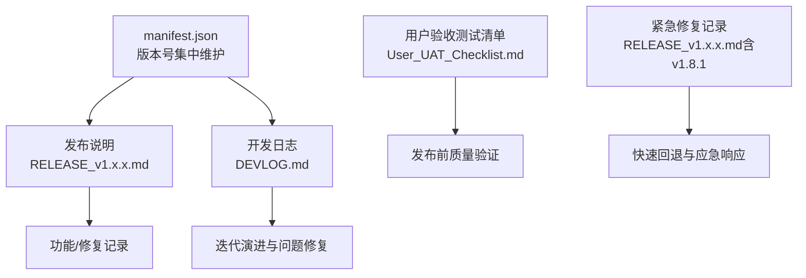
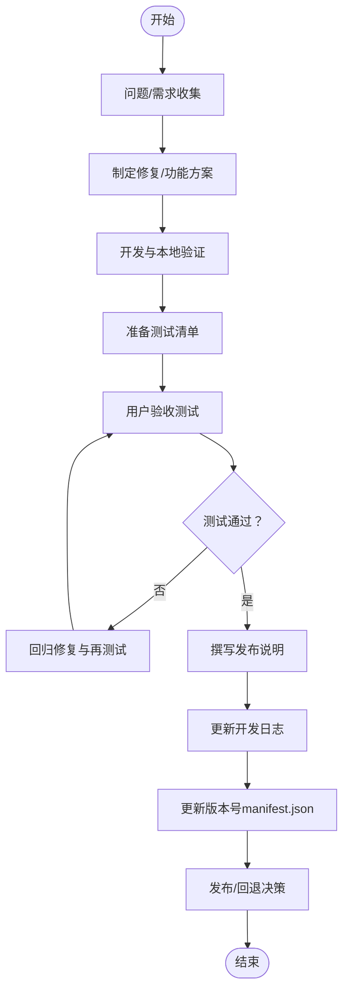
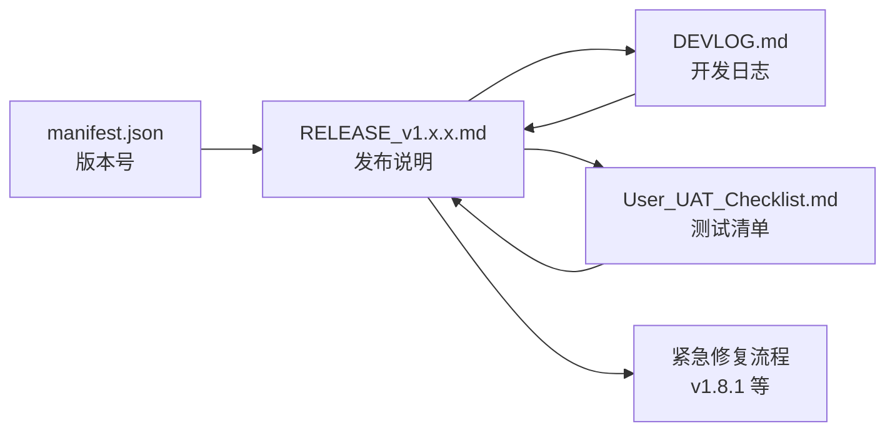
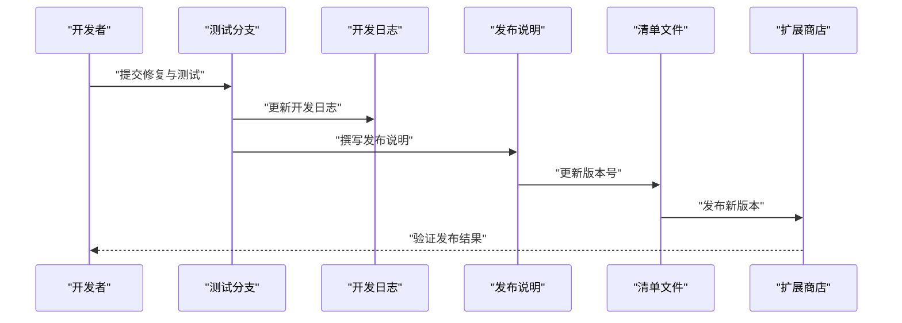

# 版本管理

<cite>
**本文引用的文件**
- [README.md](file://README.md)
- [manifest.json](file://manifest.json)
- [DEVLOG.md](file://DEVLOG.md)
- [RELEASE_v1.7.9.md](file://RELEASE_v1.7.9.md)
- [RELEASE_v1.8.0.md](file://RELEASE_v1.8.0.md)
- [RELEASE_v1.8.1.md](file://RELEASE_v1.8.1.md)
- [RELEASE_v1.8.2.md](file://RELEASE_v1.8.2.md)
- [User_UAT_Checklist.md](file://User_UAT_Checklist.md)
- [BUGFIX_v1.7.7.md](file://BUGFIX_v1.7.7.md)
- [BUGFIX_v1.7.6.md](file://BUGFIX_v1.7.6.md)
</cite>

## 目录
1. [简介](#简介)
2. [项目结构](#项目结构)
3. [核心组件](#核心组件)
4. [架构总览](#架构总览)
5. [详细组件分析](#详细组件分析)
6. [依赖关系分析](#依赖关系分析)
7. [性能考量](#性能考量)
8. [故障排查指南](#故障排查指南)
9. [结论](#结论)
10. [附录](#附录)

## 简介
本指南面向本项目的版本管理实践，结合仓库中现有的发布说明、开发日志与测试清单，系统阐述版本号命名与语义化版本策略、变更日志维护规范、分支管理建议、发布检查清单、向后兼容性保障与破坏性变更处理流程、以及版本回退与紧急修复的快速响应机制。目标是帮助贡献者与维护者建立一致、可追溯且低风险的发布流程。

## 项目结构
本项目采用轻量前端架构，核心入口为 Chrome Extension 的清单文件，配合若干功能模块与国际化支持文件。版本号在清单文件中集中维护，发布说明与开发日志以独立 Markdown 文件形式沉淀，便于追踪每个版本的功能、修复与测试要点。

图表来源
- [manifest.json](file://manifest.json#L1-L79)
- [DEVLOG.md](file://DEVLOG.md#L1-L397)
- [RELEASE_v1.7.9.md](file://RELEASE_v1.7.9.md#L1-L241)
- [RELEASE_v1.8.0.md](file://RELEASE_v1.8.0.md#L1-L203)
- [RELEASE_v1.8.1.md](file://RELEASE_v1.8.1.md#L1-L98)
- [RELEASE_v1.8.2.md](file://RELEASE_v1.8.2.md#L1-L247)
- [User_UAT_Checklist.md](file://User_UAT_Checklist.md#L1-L305)

章节来源
- [README.md](file://README.md#L1-L107)
- [manifest.json](file://manifest.json#L1-L79)

## 核心组件
- 版本号与清单：版本号在清单文件中集中维护，随发布更新，确保扩展商店与本地加载的一致性。
- 发布说明：每个版本配套发布说明，记录问题背景、修复详情、技术细节、变更文件与验证步骤。
- 开发日志：汇总迭代过程中的问题发现、解决方案与测试结果，形成可追溯的演进轨迹。
- 测试清单：提供用户验收测试步骤，确保发布前的质量验证覆盖关键路径。
- 紧急修复：针对回归或严重缺陷的快速修复，明确问题、修复策略与验证清单。

章节来源
- [manifest.json](file://manifest.json#L1-L79)
- [DEVLOG.md](file://DEVLOG.md#L1-L397)
- [RELEASE_v1.7.9.md](file://RELEASE_v1.7.9.md#L1-L241)
- [RELEASE_v1.8.0.md](file://RELEASE_v1.8.0.md#L1-L203)
- [RELEASE_v1.8.1.md](file://RELEASE_v1.8.1.md#L1-L98)
- [RELEASE_v1.8.2.md](file://RELEASE_v1.8.2.md#L1-L247)
- [User_UAT_Checklist.md](file://User_UAT_Checklist.md#L1-L305)

## 架构总览
下图展示从“问题发现/需求提出”到“发布说明编写、开发日志记录、测试验证、版本号更新”的闭环流程，体现版本管理的端到端实践。

图表来源
- [DEVLOG.md](file://DEVLOG.md#L1-L397)
- [RELEASE_v1.7.9.md](file://RELEASE_v1.7.9.md#L1-L241)
- [RELEASE_v1.8.0.md](file://RELEASE_v1.8.0.md#L1-L203)
- [RELEASE_v1.8.1.md](file://RELEASE_v1.8.1.md#L1-L98)
- [RELEASE_v1.8.2.md](file://RELEASE_v1.8.2.md#L1-L247)
- [User_UAT_Checklist.md](file://User_UAT_Checklist.md#L1-L305)
- [manifest.json](file://manifest.json#L1-L79)

## 详细组件分析

### 版本号命名与语义化版本策略
- 版本号位置：版本号集中维护在清单文件中，随每次发布更新，确保一致性。
- 语义化版本实践：
  - 主版本（1.x.x）：重大破坏性变更或架构调整，如 v1.8.0 的 Tooltip 翻译重构、v1.8.2 的全面翻译修复。
  - 次版本（x.8.x）：向后兼容的新功能或大规模改进，如 v1.8.0 的 Tooltip 翻译、v1.8.1 的按钮文字缺失修复、v1.8.2 的全面翻译修复。
  - 补丁版本（x.x.9/x.x.1/x.x.2）：小范围修复与优化，如 v1.7.9 的国际化修复、v1.7.7 的智能总结触发修复、v1.7.6 的主题切换修复。
- 版本号更新流程：每次发布说明完成后，更新清单文件中的版本号字段，确保与发布说明一致。

章节来源
- [manifest.json](file://manifest.json#L1-L79)
- [RELEASE_v1.7.9.md](file://RELEASE_v1.7.9.md#L1-L241)
- [RELEASE_v1.8.0.md](file://RELEASE_v1.8.0.md#L1-L203)
- [RELEASE_v1.8.1.md](file://RELEASE_v1.8.1.md#L1-L98)
- [RELEASE_v1.8.2.md](file://RELEASE_v1.8.2.md#L1-L247)

### 变更日志维护规范
- 分类记录：发布说明按“问题描述、根本原因、修复详情、技术细节、变更文件、语法验证、使用说明、验证步骤、统计数据、注意事项、后续计划、往期版本”等维度组织，确保可追溯与可复现。
- 开发日志：以迭代为单位记录问题发现、解决方案与测试结果，便于回溯演进过程。
- 示例参考：
  - v1.8.2：全面翻译修复，涵盖模态框、导航按钮、占位符等多处硬编码问题，统一翻译属性与处理流程。
  - v1.8.1：按钮文字翻译缺失的紧急修复，明确问题、修复策略与验证清单。
  - v1.8.0：Tooltip 翻译修复，引入 data-i18n-title 属性与增强翻译函数。
  - v1.7.9：国际化翻译完整修复，重写翻译文件并统一函数定义。
  - v1.7.7：智能总结触发修复，改进事件处理与状态重置。
  - v1.7.6：主题切换修复与元宝响应问题诊断。

章节来源
- [DEVLOG.md](file://DEVLOG.md#L1-L397)
- [RELEASE_v1.7.9.md](file://RELEASE_v1.7.9.md#L1-L241)
- [RELEASE_v1.8.0.md](file://RELEASE_v1.8.0.md#L1-L203)
- [RELEASE_v1.8.1.md](file://RELEASE_v1.8.1.md#L1-L98)
- [RELEASE_v1.8.2.md](file://RELEASE_v1.8.2.md#L1-L247)
- [BUGFIX_v1.7.7.md](file://BUGFIX_v1.7.7.md#L1-L342)
- [BUGFIX_v1.7.6.md](file://BUGFIX_v1.7.6.md#L1-L240)

### 发布分支管理策略
- 开发分支：用于日常功能开发与修复，建议以功能/修复命名，合并前通过本地测试与代码审查。
- 测试分支：在发布前创建测试分支，集中进行用户验收测试与回归验证，确保质量门禁达标。
- 稳定分支：发布后基于稳定版本打标签与维护补丁，紧急修复通过紧急修复流程进入稳定分支并发布新补丁版本。
- 合并与发布：测试通过后合并至主分支，更新版本号并发布；若发现回归，回退至上一稳定版本并发布紧急修复。

（本节为概念性分支策略说明，不直接分析具体文件）

### 版本发布检查清单
- 功能验证：对照用户验收测试清单逐项验证，确保关键路径通过。
- 回归测试：重点验证已修复问题不再出现，避免引入新问题。
- 国际化：验证多语言切换与翻译键覆盖情况。
- 性能与稳定性：关注 UI 响应、内存占用与错误处理。
- 发布说明与日志：确保发布说明与开发日志完整、准确，版本号与清单一致。

章节来源
- [User_UAT_Checklist.md](file://User_UAT_Checklist.md#L1-L305)

### 向后兼容性保证与破坏性变更处理
- 向后兼容：尽量保持 API 与行为稳定，避免破坏性变更；若必须变更，应在发布说明中明确标注破坏性变更并提供迁移指引。
- 破坏性变更处理：在主版本更新时进行，提前通知用户并提供过渡期；在次/补丁版本中避免引入破坏性变更。
- 示例参考：
  - v1.8.0/v1.8.1/v1.8.2：围绕翻译系统的重构与增强，属于向后兼容的改进，未引入破坏性变更。
  - v1.7.7：改进事件处理与状态重置，提升稳定性，未改变对外接口。

章节来源
- [RELEASE_v1.8.0.md](file://RELEASE_v1.8.0.md#L1-L203)
- [RELEASE_v1.8.1.md](file://RELEASE_v1.8.1.md#L1-L98)
- [RELEASE_v1.8.2.md](file://RELEASE_v1.8.2.md#L1-L247)
- [BUGFIX_v1.7.7.md](file://BUGFIX_v1.7.7.md#L1-L342)

### 版本回退与紧急修复快速响应
- 快速响应流程：
  - 问题定位：通过发布说明与开发日志快速定位问题根因与影响范围。
  - 紧急修复：在测试分支上快速修复并进行最小化回归测试，确保修复有效且无副作用。
  - 发布与回退：紧急修复通过独立发布说明与版本号更新，必要时回滚至上一稳定版本并发布新补丁。
- 示例参考：
  - v1.8.1：按钮文字翻译缺失的紧急修复，明确问题、修复策略与验证清单，随后发布 v1.8.1。
  - v1.7.7：智能总结触发修复，改进事件处理与状态重置，避免阻塞与状态不一致。

章节来源
- [RELEASE_v1.8.1.md](file://RELEASE_v1.8.1.md#L1-L98)
- [BUGFIX_v1.7.7.md](file://BUGFIX_v1.7.7.md#L1-L342)

## 依赖关系分析
版本管理的关键依赖关系体现在“清单文件版本号”“发布说明”“开发日志”“测试清单”与“紧急修复”之间：

图表来源
- [manifest.json](file://manifest.json#L1-L79)
- [DEVLOG.md](file://DEVLOG.md#L1-L397)
- [RELEASE_v1.7.9.md](file://RELEASE_v1.7.9.md#L1-L241)
- [RELEASE_v1.8.0.md](file://RELEASE_v1.8.0.md#L1-L203)
- [RELEASE_v1.8.1.md](file://RELEASE_v1.8.1.md#L1-L98)
- [RELEASE_v1.8.2.md](file://RELEASE_v1.8.2.md#L1-L247)
- [User_UAT_Checklist.md](file://User_UAT_Checklist.md#L1-L305)

章节来源
- [manifest.json](file://manifest.json#L1-L79)
- [DEVLOG.md](file://DEVLOG.md#L1-L397)
- [RELEASE_v1.7.9.md](file://RELEASE_v1.7.9.md#L1-L241)
- [RELEASE_v1.8.0.md](file://RELEASE_v1.8.0.md#L1-L203)
- [RELEASE_v1.8.1.md](file://RELEASE_v1.8.1.md#L1-L98)
- [RELEASE_v1.8.2.md](file://RELEASE_v1.8.2.md#L1-L247)
- [User_UAT_Checklist.md](file://User_UAT_Checklist.md#L1-L305)

## 性能考量
- 代码质量：通过语法检查与注释增强，减少潜在性能隐患与维护成本。
- 翻译系统：统一的翻译属性与处理流程，减少重复逻辑与 DOM 查询次数，提升切换语言时的响应速度。
- 测试覆盖：用户验收测试清单覆盖关键路径与边界条件，有助于在早期发现性能与稳定性问题。

（本节提供一般性指导，不直接分析具体文件）

## 故障排查指南
- 发布说明与开发日志对照：通过发布说明与开发日志快速定位问题根因与修复策略。
- 测试清单验证：按照用户验收测试清单逐项验证，确保问题已修复且无回归。
- 紧急修复流程：针对严重缺陷，遵循快速响应流程，优先修复并发布紧急补丁版本。

章节来源
- [DEVLOG.md](file://DEVLOG.md#L1-L397)
- [RELEASE_v1.8.1.md](file://RELEASE_v1.8.1.md#L1-L98)
- [User_UAT_Checklist.md](file://User_UAT_Checklist.md#L1-L305)

## 结论
本项目的版本管理实践以“清单文件集中维护版本号、发布说明与开发日志双轨记录、用户验收测试保障质量、紧急修复快速响应”为核心，形成了可追溯、可验证、可回退的发布闭环。建议在现有基础上进一步固化分支策略与自动化检查，持续提升发布效率与质量稳定性。

## 附录
- 版本号更新流程示例（序列图）：从“修复完成”到“更新清单版本号并发布”的典型流程。

图表来源
- [DEVLOG.md](file://DEVLOG.md#L1-L397)
- [RELEASE_v1.7.9.md](file://RELEASE_v1.7.9.md#L1-L241)
- [RELEASE_v1.8.0.md](file://RELEASE_v1.8.0.md#L1-L203)
- [RELEASE_v1.8.1.md](file://RELEASE_v1.8.1.md#L1-L98)
- [RELEASE_v1.8.2.md](file://RELEASE_v1.8.2.md#L1-L247)
- [manifest.json](file://manifest.json#L1-L79)