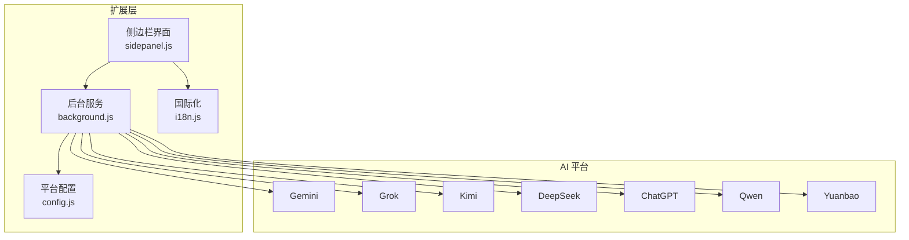
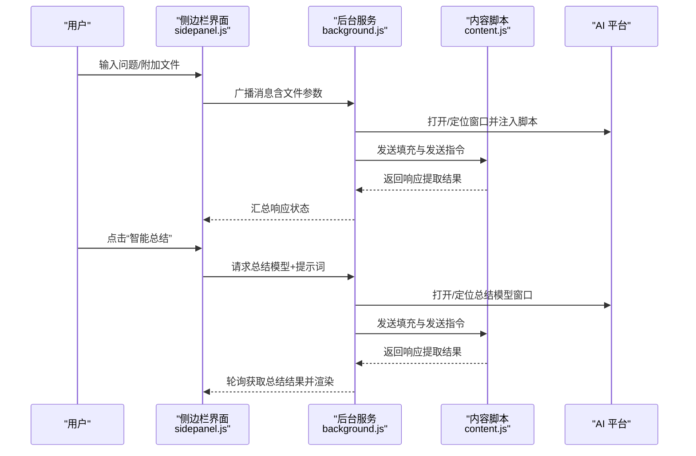
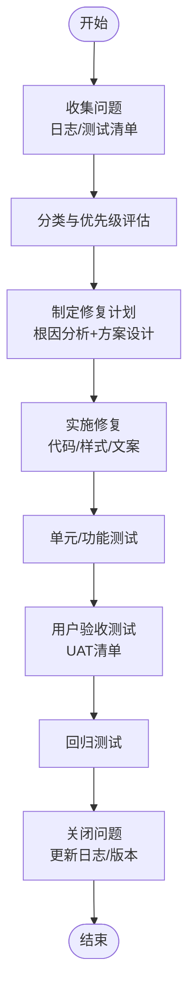
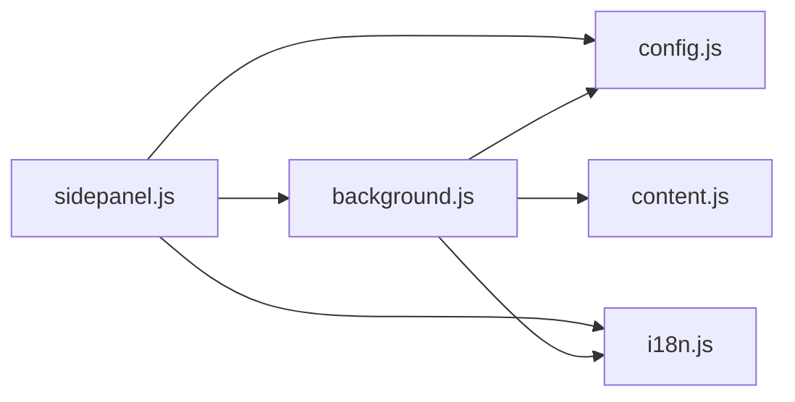

# 用户反馈处理

<cite>
**本文档引用的文件**
- [README.md](file://README.md)
- [User_UAT_Checklist.md](file://User_UAT_Checklist.md)
- [CONTRIBUTING.md](file://CONTRIBUTING.md)
- [TESTING_v1.7.md](file://TESTING_v1.7.md)
- [DEVLOG.md](file://DEVLOG.md)
- [SUMMARIZATION_BUGFIX_v1.7.8.md](file://SUMMARIZATION_BUGFIX_v1.7.8.md)
- [QUICK_TEST_GUIDE.md](file://QUICK_TEST_GUIDE.md)
- [BUGFIX_v1.7.3.md](file://BUGFIX_v1.7.3.md)
- [src/sidepanel/sidepanel.js](file://src/sidepanel/sidepanel.js)
- [src/background.js](file://src/background.js)
- [src/i18n.js](file://src/i18n.js)
- [src/config.js](file://src/config.js)
</cite>

## 目录
1. [引言](#引言)
2. [项目结构](#项目结构)
3. [核心组件](#核心组件)
4. [架构总览](#架构总览)
5. [详细组件分析](#详细组件分析)
6. [依赖关系分析](#依赖关系分析)
7. [性能考量](#性能考量)
8. [故障排查指南](#故障排查指南)
9. [结论](#结论)
10. [附录](#附录)

## 引言
本文件面向“用户反馈处理”的全流程规范与实践，结合仓库中的开发日志、测试清单与源码实现，系统化梳理问题收集、分类与优先级评估、处理流程、UAT 执行方法、问题跟踪与沟通机制，并给出持续改进建议与用户满意度调查路径。目标是帮助维护者与使用者建立一致、可追溯、可验证的反馈闭环。

## 项目结构
该项目为 Chrome 扩展，采用原生前端技术栈，核心模块围绕“弹出面板（sidepanel）+ 后台服务（background）+ 内容脚本（content）+ 配置与国际化（config/i18n）”组织。用户反馈处理涉及的关键位置包括：
- 侧边栏 UI 与交互（问题输入、文件上传、响应展示、总结按钮）
- 后台消息路由与跨标签页通信（广播、提取响应、总结）
- 国际化与本地化（i18n）支撑多语言反馈与提示
- 配置中心（AI_CONFIG）支撑多平台集成与问题定位

图表来源
- [src/sidepanel/sidepanel.js](file://src/sidepanel/sidepanel.js#L1-L800)
- [src/background.js](file://src/background.js#L1-L800)
- [src/config.js](file://src/config.js#L1-L204)
- [src/i18n.js](file://src/i18n.js#L1-L504)

章节来源
- [README.md](file://README.md#L1-L107)

## 核心组件
- 侧边栏交互与状态管理：负责问题输入、文件上传、响应展示、总结触发与 UI 状态反馈。
- 后台消息中枢：负责跨标签页通信、窗口调度、内容脚本注入、总结流程编排。
- 平台配置中心：统一管理各 AI 平台的选择器、上传与发送策略，支撑问题定位与修复。
- 国际化系统：提供中英双语文案与日期/相对时间格式化，保障反馈提示一致性。

章节来源
- [src/sidepanel/sidepanel.js](file://src/sidepanel/sidepanel.js#L1-L800)
- [src/background.js](file://src/background.js#L1-L800)
- [src/config.js](file://src/config.js#L1-L204)
- [src/i18n.js](file://src/i18n.js#L1-L504)

## 架构总览
用户反馈处理的端到端流程如下：

图表来源
- [src/background.js](file://src/background.js#L138-L197)
- [src/background.js](file://src/background.js#L298-L376)
- [src/sidepanel/sidepanel.js](file://src/sidepanel/sidepanel.js#L252-L335)

## 详细组件分析

### 问题收集机制
- 多渠道入口
  - 侧边栏输入框与文件上传：支持图片/文档等文件附加，限制单文件与总大小，提供拖拽与预览。
  - 响应视图：获取各平台响应，支持复制、查看详情与导航。
- 问题分类与优先级
  - 按功能域分类：文件上传、响应提取、总结流程、国际化、窗口布局等。
  - 优先级依据：影响范围（全局/局部）、稳定性（内存泄漏/超时）、用户体验（UI 卡顿/文案缺失）。
- 问题记录与溯源
  - 开发日志按版本记录问题、根因、修复与测试验证，便于回溯与审计。

章节来源
- [src/sidepanel/sidepanel.js](file://src/sidepanel/sidepanel.js#L409-L495)
- [src/sidepanel/sidepanel.js](file://src/sidepanel/sidepanel.js#L530-L633)
- [DEVLOG.md](file://DEVLOG.md#L1-L397)

### 问题处理流程（确认—修复—验证—回归）
- 问题确认
  - 通过测试清单与日志定位：如“智能总结功能”修复中明确“提示词截断”“无结果显示”“显示格式异常”三类问题。
  - 交叉验证：前后端联动（sidepanel 与 background）确保消息通道与窗口调度稳定。
- 修复与验证
  - 修复示例：轮询机制获取总结结果、新增结果显示函数、样式增强。
  - 验证清单：功能测试、边界测试、国际化测试、性能测试。
- 回归测试
  - 重复执行测试清单，覆盖新增/变更路径，确保无回归。

图表来源
- [SUMMARIZATION_BUGFIX_v1.7.8.md](file://SUMMARIZATION_BUGFIX_v1.7.8.md#L1-L320)
- [User_UAT_Checklist.md](file://User_UAT_Checklist.md#L1-L305)
- [TESTING_v1.7.md](file://TESTING_v1.7.md#L1-L211)

章节来源
- [SUMMARIZATION_BUGFIX_v1.7.8.md](file://SUMMARIZATION_BUGFIX_v1.7.8.md#L1-L320)
- [TESTING_v1.7.md](file://TESTING_v1.7.md#L1-L211)

### 用户验收测试（UAT）执行方法
- 准备工作：打开 Chrome、至少一个平台页面并登录、打开侧边栏。
- 测试维度：基础功能（附件、选择、预览、清空）、多文件操作、文件限制、发送功能、平台特定、错误处理、国际化、历史记录、UI 交互、性能。
- 测试签名与验收标准：通过所有测试项方可验收，记录测试人员、日期与结果。

章节来源
- [User_UAT_Checklist.md](file://User_UAT_Checklist.md#L1-L305)

### 问题跟踪系统（状态管理、进度跟踪、时效控制）
- 版本化跟踪：开发日志按版本记录问题、修复与测试，形成可追溯的变更记录。
- 状态管理建议
  - 待处理：问题登记与初步分类
  - 处理中：分配负责人、设定截止时间
  - 已修复：修复验证与回归测试
  - 已关闭：合并/发布并关闭工单
- 进度跟踪：以版本里程碑为节点，汇总修复数量与影响范围。
- 时效控制：为关键问题设定 SLA（如内存泄漏/超时），在测试清单中体现。

章节来源
- [DEVLOG.md](file://DEVLOG.md#L1-L397)
- [BUGFIX_v1.7.3.md](file://BUGFIX_v1.7.3.md#L1-L398)

### 用户沟通机制（回复—进度通知—方案说明）
- 回复渠道
  - 扩展内提示：通过 i18n 提供中英双语提示，覆盖发送、错误、成功等状态。
  - 测试清单与日志：为用户提供可执行的自测步骤与预期结果。
- 进度通知
  - 响应视图：展示各平台状态（等待/完成/失败/超时）。
  - 总结流程：在侧边栏显示加载动画与最终结果。
- 方案说明
  - 开发日志详细记录问题背景、根因、修复细节与测试验证，便于向用户解释。

章节来源
- [src/i18n.js](file://src/i18n.js#L1-L504)
- [src/sidepanel/sidepanel.js](file://src/sidepanel/sidepanel.js#L530-L633)
- [DEVLOG.md](file://DEVLOG.md#L1-L397)

### 用户满意度与持续改进建议
- 用户满意度调查
  - 在测试清单末尾预留用户反馈区域，收集“发现的问题”与“改进建议”，作为持续优化依据。
- 持续改进建议收集
  - 版本规划：短期/中期/长期优化方向（如总结历史、导出、对比等）。
  - 社区协作：贡献指南明确了新增 AI 平台的接入流程与测试要求，鼓励社区参与。

章节来源
- [TESTING_v1.7.md](file://TESTING_v1.7.md#L176-L194)
- [CONTRIBUTING.md](file://CONTRIBUTING.md#L1-L56)

## 依赖关系分析
- 侧边栏依赖后台进行跨标签页通信与窗口管理；依赖配置中心进行平台选择器与上传策略；依赖国际化系统进行文案与格式化。
- 后台依赖配置中心进行平台识别与窗口定位；依赖内容脚本进行注入与交互；依赖存储 API 进行状态持久化。
- 国际化系统被 UI 与后台共同使用，确保一致的提示文案。

图表来源
- [src/sidepanel/sidepanel.js](file://src/sidepanel/sidepanel.js#L1-L800)
- [src/background.js](file://src/background.js#L1-L800)
- [src/config.js](file://src/config.js#L1-L204)
- [src/i18n.js](file://src/i18n.js#L1-L504)

章节来源
- [src/sidepanel/sidepanel.js](file://src/sidepanel/sidepanel.js#L1-L800)
- [src/background.js](file://src/background.js#L1-L800)
- [src/config.js](file://src/config.js#L1-L204)
- [src/i18n.js](file://src/i18n.js#L1-L504)

## 性能考量
- 轮询与超时：总结流程采用定时轮询与超时控制，避免阻塞主线程。
- 内存管理：修复事件监听器泄漏与超时清理，降低长时间使用的内存压力。
- UI 渲染：Markdown 渲染与代码高亮需在库加载完成后进行，避免空值与异常。

章节来源
- [SUMMARIZATION_BUGFIX_v1.7.8.md](file://SUMMARIZATION_BUGFIX_v1.7.8.md#L49-L93)
- [BUGFIX_v1.7.3.md](file://BUGFIX_v1.7.3.md#L113-L183)
- [QUICK_TEST_GUIDE.md](file://QUICK_TEST_GUIDE.md#L1-L139)

## 故障排查指南
- 常见问题定位
  - Markdown 渲染：检查库加载顺序与配置时机，确认 marked 与 highlight.js 可用。
  - 窗口调节手柄：确认模态打开、手柄创建与 z-index 设置。
  - 文件上传：检查文件大小限制、类型过滤与平台支持列表。
- 调试工具
  - 控制台日志：关注“Markdown libraries loaded and configured successfully”“Summary timeout”等关键日志。
  - 快速测试页面：通过独立页面验证库加载与渲染效果。

章节来源
- [QUICK_TEST_GUIDE.md](file://QUICK_TEST_GUIDE.md#L66-L139)
- [src/sidepanel/sidepanel.js](file://src/sidepanel/sidepanel.js#L5-L39)

## 结论
本项目通过完善的开发日志、测试清单与源码实现，形成了可执行的用户反馈处理闭环：从问题收集、分类与优先级评估，到修复验证与回归测试，再到用户验收与沟通机制，均具备可追溯与可复现的流程。建议在现有基础上引入正式的问题跟踪系统（状态管理、进度看板、时效控制），并持续完善用户满意度调查与社区协作机制，以进一步提升交付质量与用户信任度。

## 附录
- 快速测试指南：提供独立页面与扩展内测试步骤，便于快速验证 UI 与功能。
- 贡献指南：明确新增 AI 平台的接入流程与测试要求，便于社区协作。

章节来源
- [QUICK_TEST_GUIDE.md](file://QUICK_TEST_GUIDE.md#L1-L139)
- [CONTRIBUTING.md](file://CONTRIBUTING.md#L1-L56)