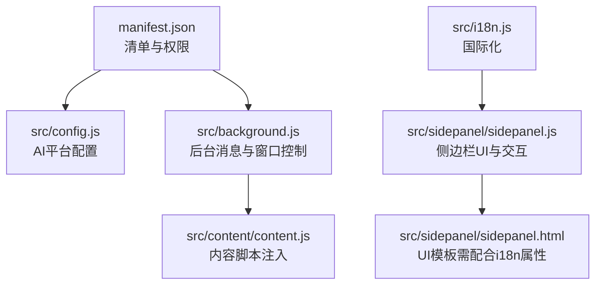
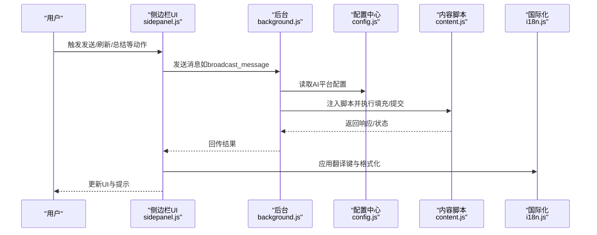
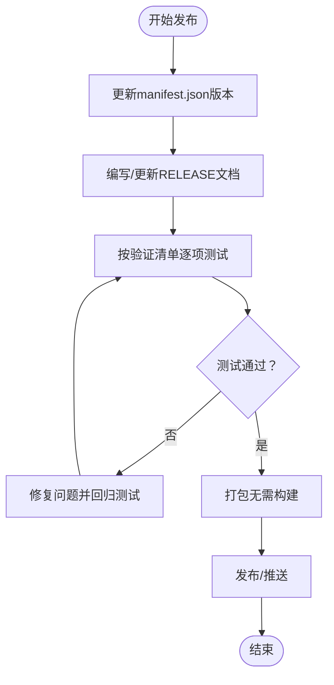
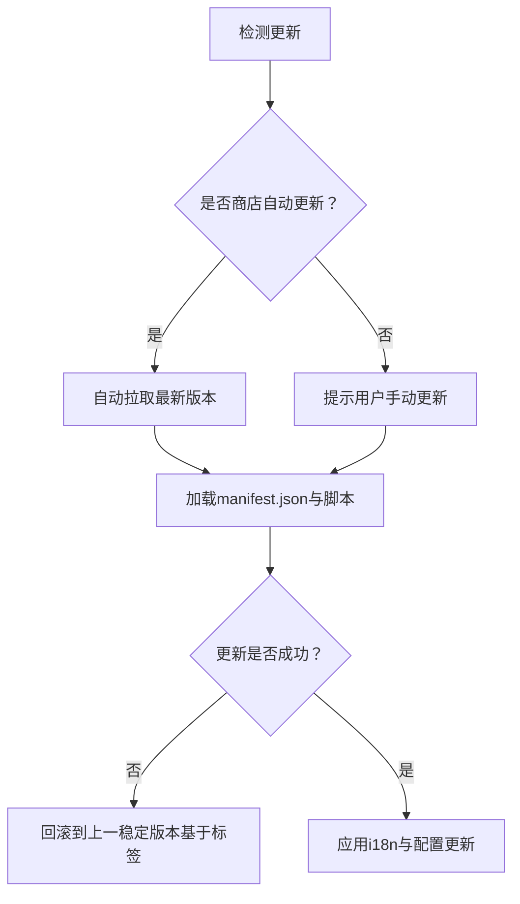
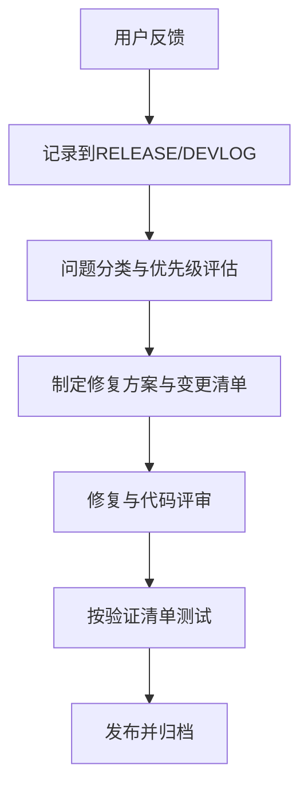
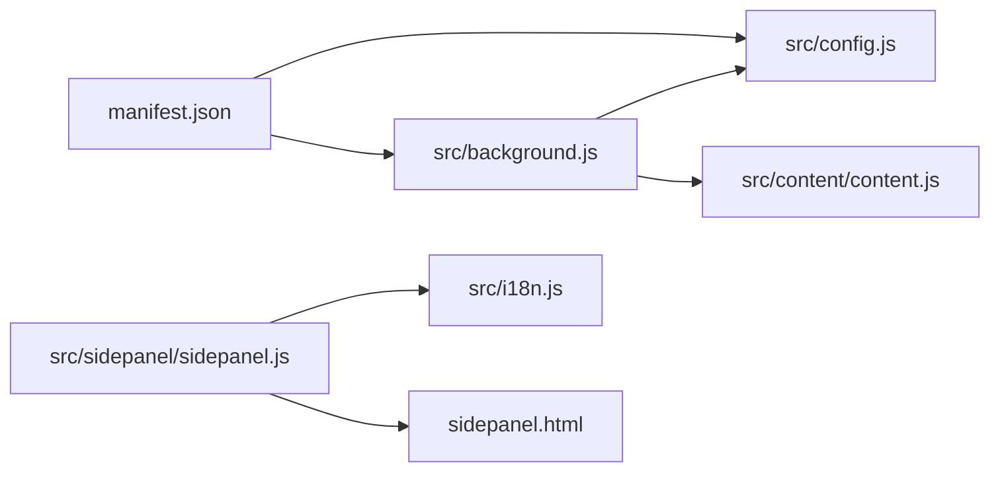

# 部署与发布

<cite>
**本文引用的文件**
- [README.md](file://README.md)
- [CONTRIBUTING.md](file://CONTRIBUTING.md)
- [OPEN_SOURCE_STRATEGY.md](file://OPEN_SOURCE_STRATEGY.md)
- [DEVLOG.md](file://DEVLOG.md)
- [MAINTENANCE.md](file://MAINTENANCE.md)
- [RELEASE_v1.8.2.md](file://RELEASE_v1.8.2.md)
- [RELEASE_v1.8.1.md](file://RELEASE_v1.8.1.md)
- [RELEASE_v1.8.0.md](file://RELEASE_v1.8.0.md)
- [RELEASE_v1.7.9.md](file://RELEASE_v1.7.9.md)
- [manifest.json](file://manifest.json)
- [src/i18n.js](file://src/i18n.js)
- [src/config.js](file://src/config.js)
- [src/background.js](file://src/background.js)
- [src/sidepanel/sidepanel.js](file://src/sidepanel/sidepanel.js)
</cite>

## 目录
1. [简介](#简介)
2. [项目结构](#项目结构)
3. [核心组件](#核心组件)
4. [架构总览](#架构总览)
5. [详细组件分析](#详细组件分析)
6. [依赖关系分析](#依赖关系分析)
7. [性能考量](#性能考量)
8. [故障排查指南](#故障排查指南)
9. [结论](#结论)
10. [附录](#附录)

## 简介
本指南面向部署与发布全流程，结合仓库现有发布日志、开发日志与维护文档，系统梳理版本管理策略、发布流程规范、更新机制设计、用户反馈处理、开源策略与发布后的监控与持续改进。目标是帮助团队在不引入外部CI/CD工具的前提下，也能形成可复用、可追溯、可验证的发布体系。

## 项目结构
该项目为Chrome扩展（Manifest V3），采用原生JS/HTML/CSS，无构建工具，便于快速迭代与发布。关键目录与文件如下：
- manifest.json：扩展元信息、权限、匹配域名、内容脚本注入顺序等
- src/config.js：统一的AI平台配置（含选择器、上传能力等）
- src/background.js：后台服务工作线程，处理消息、窗口管理、调用内容脚本
- src/i18n.js：国际化翻译与日期时间格式化
- src/sidepanel/sidepanel.js：侧边栏UI逻辑、Markdown渲染、文件上传、翻译应用等
- 多个RELEASE_*与DEVLOG/MAINTENANCE文档：记录版本变更、修复与维护要点

图表来源
- [manifest.json](file://manifest.json#L1-L79)
- [src/config.js](file://src/config.js#L1-L204)
- [src/background.js](file://src/background.js#L1-L200)
- [src/i18n.js](file://src/i18n.js#L1-L504)
- [src/sidepanel/sidepanel.js](file://src/sidepanel/sidepanel.js#L1-L200)

章节来源
- [README.md](file://README.md#L1-L107)
- [manifest.json](file://manifest.json#L1-L79)

## 核心组件
- 版本与清单管理：通过manifest.json的version字段与各RELEASE文档共同维护版本号与变更摘要
- 国际化系统：src/i18n.js集中管理翻译键与格式化函数，并在sidepanel.js中应用
- 配置中心：src/config.js集中管理各AI平台的选择器、上传能力与提交方式
- 后台编排：src/background.js监听前端消息，协调窗口、注入脚本与跨页通信
- 发布日志与开发日志：DEVLOG/RELEASE_*文档记录每次发布的问题定位、修复方案与验证清单

章节来源
- [src/i18n.js](file://src/i18n.js#L1-L504)
- [src/config.js](file://src/config.js#L1-L204)
- [src/background.js](file://src/background.js#L1-L200)
- [DEVLOG.md](file://DEVLOG.md#L1-L397)
- [RELEASE_v1.8.2.md](file://RELEASE_v1.8.2.md#L1-L247)

## 架构总览
下图展示从用户触发到各AI平台响应的整体流程，以及与国际化、配置与后台编排的关系。

图表来源
- [src/sidepanel/sidepanel.js](file://src/sidepanel/sidepanel.js#L1-L200)
- [src/background.js](file://src/background.js#L138-L197)
- [src/config.js](file://src/config.js#L5-L199)
- [src/i18n.js](file://src/i18n.js#L355-L414)

## 详细组件分析

### 版本管理策略
- 版本号规则
  - 采用语义化版本：主版本.次版本.修订号（例如v1.8.2）
  - 版本号在manifest.json中维护，每次发布均需同步更新
- 变更日志维护
  - 使用RELEASE_*文档记录每次发布的问题背景、修复方案、验证清单与统计数据
  - 使用DEVLOG.md汇总近期开发与修复要点，便于追溯
- 发布分支管理
  - 仓库未见专用发布分支；建议在合并到主干后打标签并产出RELEASE文档
  - 重要修复可基于主干切临时热修复分支，完成后合并并打标签

章节来源
- [RELEASE_v1.8.2.md](file://RELEASE_v1.8.2.md#L1-L247)
- [RELEASE_v1.8.1.md](file://RELEASE_v1.8.1.md#L1-L98)
- [RELEASE_v1.8.0.md](file://RELEASE_v1.8.0.md#L1-L203)
- [RELEASE_v1.7.9.md](file://RELEASE_v1.7.9.md#L1-L241)
- [DEVLOG.md](file://DEVLOG.md#L1-L397)
- [manifest.json](file://manifest.json#L4-L4)

### 发布流程规范
- 构建与打包
  - 项目为原生JS/HTML/CSS，无需构建工具；发布时以源码形式打包
- 测试验证
  - 依据RELEASE文档中的“验证清单”逐项核验（如按钮文字、tooltip、模态框文案、占位符等）
  - 对国际化修复，需在中英文模式下分别验证
- 发布部署
  - 更新manifest.json的version
  - 产出RELEASE_*文档与更新DEVLOG.md
  - 如需发布商店，准备截图、视频与说明材料（参考开源策略）

图表来源
- [RELEASE_v1.8.2.md](file://RELEASE_v1.8.2.md#L125-L155)
- [RELEASE_v1.8.1.md](file://RELEASE_v1.8.1.md#L71-L82)
- [RELEASE_v1.8.0.md](file://RELEASE_v1.8.0.md#L107-L127)
- [manifest.json](file://manifest.json#L4-L4)

章节来源
- [RELEASE_v1.8.2.md](file://RELEASE_v1.8.2.md#L125-L155)
- [RELEASE_v1.8.1.md](file://RELEASE_v1.8.1.md#L71-L82)
- [RELEASE_v1.8.0.md](file://RELEASE_v1.8.0.md#L107-L127)
- [DEVLOG.md](file://DEVLOG.md#L1-L397)

### 更新机制设计
- 自动更新
  - 项目为Chrome扩展，可通过商店渠道进行自动更新（需发布商店）
  - 若无商店，用户需手动重新加载扩展或安装新版本
- 增量更新
  - 国际化更新采用“翻译键 + data-i18n属性”的统一机制，减少重复代码与遗漏
  - 通过applyLanguage()/updateButtonLabels()统一处理文本、title与placeholder
- 回滚策略
  - 基于版本标签与RELEASE文档回溯；若出现严重问题，可回退至上一稳定版本并发布热修复

图表来源
- [src/i18n.js](file://src/i18n.js#L355-L414)
- [src/sidepanel/sidepanel.js](file://src/sidepanel/sidepanel.js#L1-L200)
- [manifest.json](file://manifest.json#L1-L79)

章节来源
- [src/i18n.js](file://src/i18n.js#L355-L414)
- [src/sidepanel/sidepanel.js](file://src/sidepanel/sidepanel.js#L1-L200)
- [RELEASE_v1.8.2.md](file://RELEASE_v1.8.2.md#L196-L221)

### 用户反馈处理流程
- 问题收集
  - 通过RELEASE文档记录用户反馈的问题（如tooltip未翻译、模态框硬编码文本等）
- 优先级排序
  - 依据影响范围与修复难度分级（如tooltip修复、模态框文案修复、翻译键缺失）
- 解决方案跟踪
  - 在RELEASE文档中明确“修复方案”、“变更文件”、“增强/简化函数”、“验证清单”
  - 通过DEVLOG.md汇总近期修复与改进，便于追踪

图表来源
- [RELEASE_v1.8.2.md](file://RELEASE_v1.8.2.md#L1-L247)
- [RELEASE_v1.8.1.md](file://RELEASE_v1.8.1.md#L1-L98)
- [RELEASE_v1.8.0.md](file://RELEASE_v1.8.0.md#L1-L203)
- [DEVLOG.md](file://DEVLOG.md#L1-L397)

章节来源
- [RELEASE_v1.8.2.md](file://RELEASE_v1.8.2.md#L1-L247)
- [RELEASE_v1.8.1.md](file://RELEASE_v1.8.1.md#L1-L98)
- [RELEASE_v1.8.0.md](file://RELEASE_v1.8.0.md#L1-L203)
- [DEVLOG.md](file://DEVLOG.md#L1-L397)

### 开源策略实施
- 许可证管理
  - 建议采用宽松许可证（如MIT）以鼓励采用与二次开发
- 贡献者协议
  - 通过CONTRIBUTING.md规范新增AI提供商的接入流程（配置、清单更新、图标与测试）
- 社区维护
  - 通过Issue模板、PR流程与贡献指南降低协作门槛
  - 保持README与安装说明清晰，便于新贡献者快速上手

章节来源
- [CONTRIBUTING.md](file://CONTRIBUTING.md#L1-L56)
- [README.md](file://README.md#L1-L107)
- [OPEN_SOURCE_STRATEGY.md](file://OPEN_SOURCE_STRATEGY.md#L1-L90)

### 发布后的监控与持续改进
- 监控
  - 通过RELEASE/DEVLOG记录用户反馈与回归问题，建立“问题-修复-验证-发布”的闭环
- 维护
  - MAINTENANCE.md记录关键缺陷与架构决策，避免回归
- 持续改进
  - 基于审查报告与Roadmap，逐步引入Toast通知、单条响应刷新、拖拽上传等增强功能

章节来源
- [MAINTENANCE.md](file://MAINTENANCE.md#L1-L531)
- [DEVLOG.md](file://DEVLOG.md#L1-L397)

## 依赖关系分析
- 清单与注入
  - manifest.json声明content_scripts注入顺序（先config.js，再content.js），确保全局配置先就绪
- 配置与内容脚本
  - background.js读取AI_CONFIG，决定注入策略与平台行为
- 国际化与UI
  - sidepanel.js在DOM加载后应用翻译键，统一处理文本、title与placeholder

图表来源
- [manifest.json](file://manifest.json#L45-L68)
- [src/config.js](file://src/config.js#L1-L204)
- [src/background.js](file://src/background.js#L69-L74)
- [src/i18n.js](file://src/i18n.js#L1-L504)
- [src/sidepanel/sidepanel.js](file://src/sidepanel/sidepanel.js#L1-L200)

章节来源
- [manifest.json](file://manifest.json#L45-L68)
- [src/config.js](file://src/config.js#L1-L204)
- [src/background.js](file://src/background.js#L69-L74)
- [src/i18n.js](file://src/i18n.js#L1-L504)
- [src/sidepanel/sidepanel.js](file://src/sidepanel/sidepanel.js#L1-L200)

## 性能考量
- 国际化渲染
  - 统一通过applyLanguage()/updateButtonLabels()处理，减少重复逻辑与DOM查询
- 文件上传
  - 采用DataTransfer对象与Promise封装，避免回调地狱与竞态条件
- UI更新
  - 建议在大规模列表更新时采用增量渲染或虚拟滚动（参考审查报告建议）

章节来源
- [src/i18n.js](file://src/i18n.js#L355-L414)
- [src/sidepanel/sidepanel.js](file://src/sidepanel/sidepanel.js#L1-L200)
- [MAINTENANCE.md](file://MAINTENANCE.md#L340-L434)

## 故障排查指南
- 翻译未生效
  - 检查HTML元素是否添加data-i18n/data-i18n-title/data-i18n-placeholder
  - 确认翻译键已在i18n.js中定义且语言切换逻辑正常
- 按钮tooltip不更新
  - 确认updateButtonLabels()与applyLanguage()的调用时机
- 选择器失效
  - 检查config.js中对应平台的选择器是否仍有效，必要时更新
- 文件上传失败
  - 检查DataTransfer赋值与change事件派发，确认平台支持的文件类型

章节来源
- [RELEASE_v1.8.2.md](file://RELEASE_v1.8.2.md#L196-L221)
- [RELEASE_v1.8.1.md](file://RELEASE_v1.8.1.md#L58-L90)
- [RELEASE_v1.8.0.md](file://RELEASE_v1.8.0.md#L98-L127)
- [src/i18n.js](file://src/i18n.js#L355-L414)
- [src/config.js](file://src/config.js#L1-L204)
- [MAINTENANCE.md](file://MAINTENANCE.md#L160-L227)

## 结论
本项目已形成完善的发布与维护实践：以RELEASE/DEVLOG文档为载体的版本与变更管理、以i18n统一化的国际化更新机制、以config.js为中心的平台适配与注入策略。建议在现有基础上进一步标准化发布流程（如打标签、产物校验）与引入自动化测试（单元/端到端），以提升发布效率与质量稳定性。

## 附录
- 快速参考
  - 版本更新：修改manifest.json的version并同步RELEASE文档
  - 国际化更新：在i18n.js新增翻译键，HTML中使用data-i18n属性，sidepanel.js应用翻译
  - 平台接入：在config.js新增AI配置，必要时更新manifest.json的host_permissions与content_scripts

章节来源
- [manifest.json](file://manifest.json#L4-L4)
- [src/i18n.js](file://src/i18n.js#L1-L504)
- [src/config.js](file://src/config.js#L1-L204)
- [CONTRIBUTING.md](file://CONTRIBUTING.md#L1-L56)