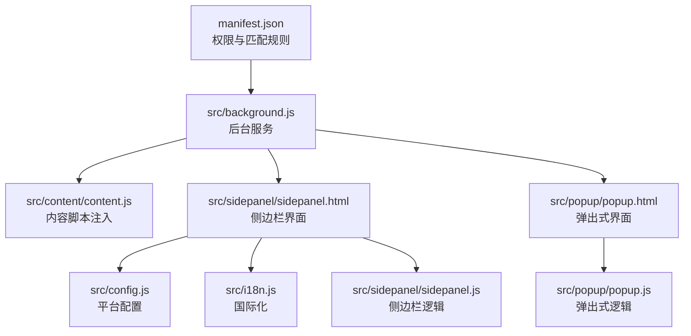
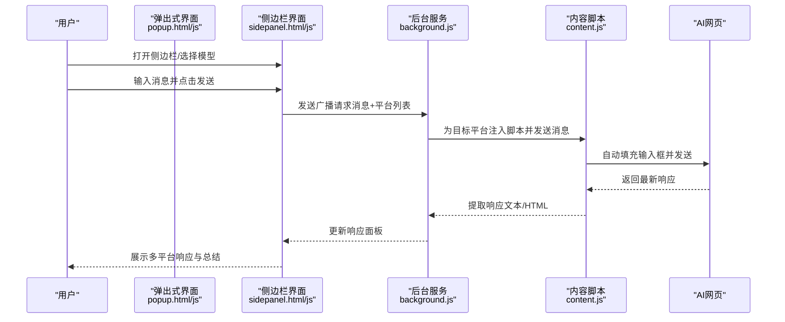
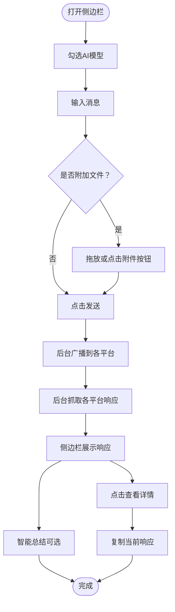
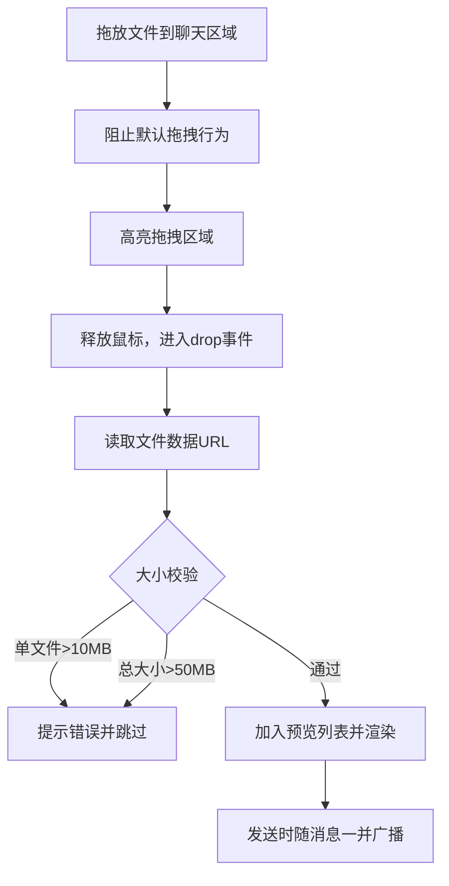
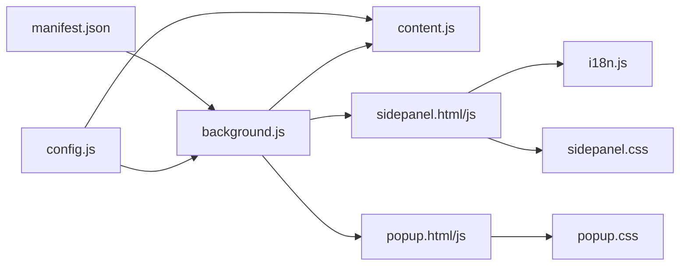

# 使用教程

<cite>
**本文引用的文件**
- [README.md](file://README.md)
- [manifest.json](file://manifest.json)
- [src/popup/popup.html](file://src/popup/popup.html)
- [src/popup/popup.js](file://src/popup/popup.js)
- [src/sidepanel/sidepanel.html](file://src/sidepanel/sidepanel.html)
- [src/sidepanel/sidepanel.js](file://src/sidepanel/sidepanel.js)
- [src/background.js](file://src/background.js)
- [src/config.js](file://src/config.js)
- [src/i18n.js](file://src/i18n.js)
- [src/content/content.js](file://src/content/content.js)
- [src/sidepanel/sidepanel.css](file://src/sidepanel/sidepanel.css)
- [src/popup/popup.css](file://src/popup/popup.css)
- [DRAG_DROP_IMPLEMENTATION.md](file://DRAG_DROP_IMPLEMENTATION.md)
- [QUICK_TEST_GUIDE.md](file://QUICK_TEST_GUIDE.md)
</cite>

## 目录
1. [简介](#简介)
2. [项目结构](#项目结构)
3. [核心组件](#核心组件)
4. [架构总览](#架构总览)
5. [详细组件分析](#详细组件分析)
6. [依赖关系分析](#依赖关系分析)
7. [性能考虑](#性能考虑)
8. [故障排除指南](#故障排除指南)
9. [结论](#结论)
10. [附录](#附录)

## 简介
本教程面向首次使用“AI多重宇宙对话”Chrome扩展的用户，提供从安装、启动、平台选择、消息发送、响应查看到文件上传的完整使用流程。文档还涵盖侧边栏界面的功能说明、多平台对比与使用技巧、常见场景解决方案与效率提升建议，帮助您快速掌握扩展并发挥最大价值。

## 项目结构
该扩展采用轻量级原生技术栈（HTML/CSS/JavaScript），无构建工具依赖，便于安装与维护。主要模块包括：
- manifest.json：扩展清单与权限声明
- src/popup/：弹出式交互界面（轻量入口）
- src/sidepanel/：侧边栏界面（持久化对话管理与丰富功能）
- src/background.js：后台服务，负责标签页管理、消息分发与窗口布局
- src/content/content.js：内容脚本，注入到各AI网页以自动化输入与发送
- src/config.js：统一配置，包含各平台的选择器、提交方式、文件支持等
- src/i18n.js：国际化（中英双语）

图表来源
- [manifest.json](file://manifest.json#L1-L79)
- [src/background.js](file://src/background.js#L1-L120)
- [src/sidepanel/sidepanel.html](file://src/sidepanel/sidepanel.html#L1-L120)
- [src/popup/popup.html](file://src/popup/popup.html#L1-L50)
- [src/config.js](file://src/config.js#L1-L60)
- [src/i18n.js](file://src/i18n.js#L1-L60)
- [src/sidepanel/sidepanel.js](file://src/sidepanel/sidepanel.js#L1-L60)
- [src/popup/popup.js](file://src/popup/popup.js#L1-L30)

章节来源
- [README.md](file://README.md#L20-L29)
- [manifest.json](file://manifest.json#L1-L79)

## 核心组件
- 扩展入口与快捷键
  - 通过浏览器工具栏扩展图标或快捷键（默认 Alt+Shift+S）打开侧边栏
  - 也可在扩展页面中点击“打开已解压的扩展程序”加载本地版本
- 侧边栏界面
  - 提供对话历史、响应查看、模型选择、文件上传、窗口平铺、智能总结等功能
- 弹出式界面
  - 快速勾选平台并发送消息，适合一次性快速问答
- 后台服务
  - 统一调度各平台窗口，执行消息广播、窗口布局、响应抓取与总结
- 内容脚本
  - 注入到各AI网页，根据平台选择器自动填写输入框、点击发送按钮或按回车发送
- 平台配置
  - 统一管理各平台的URL匹配、输入框/按钮选择器、提交方式、文件支持等

章节来源
- [README.md](file://README.md#L48-L107)
- [manifest.json](file://manifest.json#L70-L79)
- [src/sidepanel/sidepanel.html](file://src/sidepanel/sidepanel.html#L1-L120)
- [src/popup/popup.html](file://src/popup/popup.html#L1-L50)
- [src/background.js](file://src/background.js#L1-L120)
- [src/content/content.js](file://src/content/content.js#L1-L60)
- [src/config.js](file://src/config.js#L1-L60)

## 架构总览
扩展采用“后台服务 + 内容脚本 + 多平台配置”的分层架构：
- 后台服务负责跨平台窗口发现、消息广播、窗口布局与响应抓取
- 内容脚本在目标AI网页中执行自动化操作（填充输入、点击发送、提取响应）
- 侧边栏与弹出式界面提供用户交互入口与状态反馈

图表来源
- [src/background.js](file://src/background.js#L138-L197)
- [src/content/content.js](file://src/content/content.js#L200-L220)
- [src/sidepanel/sidepanel.html](file://src/sidepanel/sidepanel.html#L110-L140)
- [src/sidepanel/sidepanel.js](file://src/sidepanel/sidepanel.js#L365-L390)

## 详细组件分析

### 侧边栏界面与功能
- 顶部区域
  - 语言切换（EN/中）、主题切换（明/暗）、智能总结设置、模型选择弹窗、在线状态指示
- 标签页
  - “对话”标签：展示历史记录与操作（清空、重发、编辑、删除）
  - “响应”标签：抓取并展示各平台返回的响应，支持复制全部、逐条复制、详情查看与导航
- 输入区
  - 文本输入框、附件按钮（拖放支持）、打开/平铺/关闭窗口、发送/总结按钮
- 响应详情模态
  - 支持左右导航、复制当前响应、Markdown渲染、代码块复制按钮
- 模型选择弹窗
  - 勾选目标平台，确认后更新选择徽章

图表来源
- [src/sidepanel/sidepanel.html](file://src/sidepanel/sidepanel.html#L183-L246)
- [src/sidepanel/sidepanel.js](file://src/sidepanel/sidepanel.js#L391-L408)
- [src/sidepanel/sidepanel.js](file://src/sidepanel/sidepanel.js#L409-L496)
- [src/sidepanel/sidepanel.js](file://src/sidepanel/sidepanel.js#L530-L641)

章节来源
- [src/sidepanel/sidepanel.html](file://src/sidepanel/sidepanel.html#L1-L200)
- [src/sidepanel/sidepanel.js](file://src/sidepanel/sidepanel.js#L337-L390)

### 文件上传与拖放
- 支持拖放上传与点击附件两种方式
- 实时校验单文件大小（最大10MB）与总大小（最大50MB）
- 与各平台文件上传机制集成，自动过滤不支持的文件类型
- 上传成功后显示预览与通知

图表来源
- [DRAG_DROP_IMPLEMENTATION.md](file://DRAG_DROP_IMPLEMENTATION.md#L46-L104)
- [src/sidepanel/sidepanel.js](file://src/sidepanel/sidepanel.js#L414-L496)

章节来源
- [DRAG_DROP_IMPLEMENTATION.md](file://DRAG_DROP_IMPLEMENTATION.md#L1-L161)
- [src/sidepanel/sidepanel.js](file://src/sidepanel/sidepanel.js#L409-L496)

### 多平台对比与使用技巧
- 平台支持：Gemini、Grok、Kimi、DeepSeek、ChatGPT、通义千问（Qwen）、腾讯元宝（Yuanbao）
- 提交方式差异
  - 大多数平台使用“点击发送按钮”
  - 部分平台（如DeepSeek、Qwen）使用“按回车提交”，Kimi明确使用“点击发送”
- 文件支持差异
  - 各平台支持的文件类型不同，扩展会自动过滤不支持的类型
- 选择器策略
  - 扩展内置多套选择器，针对不同平台UI进行适配，必要时可诊断选择器有效性

章节来源
- [src/config.js](file://src/config.js#L1-L204)
- [src/content/content.js](file://src/content/content.js#L465-L565)

### 响应抓取与智能总结
- 响应抓取
  - 在“响应”标签页点击“获取响应”，后台遍历各平台窗口，注入内容脚本提取最新响应
- 智能总结
  - 选择一个平台作为总结发起者，使用自定义提示词对多平台响应进行综合总结
  - 支持手动触发，避免重复计算

章节来源
- [src/background.js](file://src/background.js#L199-L268)
- [src/sidepanel/sidepanel.js](file://src/sidepanel/sidepanel.js#L258-L336)

### 弹出式界面（快速入口）
- 适合一次性快速问答
- 支持勾选平台、输入消息、发送到全部
- 发送完成后显示状态日志

章节来源
- [src/popup/popup.html](file://src/popup/popup.html#L1-L50)
- [src/popup/popup.js](file://src/popup/popup.js#L1-L61)

## 依赖关系分析
- manifest.json声明权限与主机权限，确保扩展可在各AI网站注入脚本
- 后台服务依赖配置文件与内容脚本，实现跨平台自动化
- 侧边栏界面依赖国际化与Markdown渲染库，提供良好的阅读体验

图表来源
- [manifest.json](file://manifest.json#L12-L32)
- [src/background.js](file://src/background.js#L69-L75)
- [src/config.js](file://src/config.js#L1-L60)
- [src/content/content.js](file://src/content/content.js#L1-L30)
- [src/sidepanel/sidepanel.html](file://src/sidepanel/sidepanel.html#L1-L20)
- [src/popup/popup.html](file://src/popup/popup.html#L1-L10)
- [src/i18n.js](file://src/i18n.js#L1-L40)
- [src/sidepanel/sidepanel.css](file://src/sidepanel/sidepanel.css#L1-L60)
- [src/popup/popup.css](file://src/popup/popup.css#L1-L20)

章节来源
- [manifest.json](file://manifest.json#L12-L32)
- [src/background.js](file://src/background.js#L69-L75)

## 性能考虑
- 并行广播：后台对多个平台的消息发送采用并行处理，提高整体效率
- 选择器诊断：内置诊断工具可定位平台选择器失效问题，减少无效尝试
- 延迟与重试：针对异步UI与网络延迟，脚本内置等待与重试逻辑，提升稳定性
- Markdown渲染：仅在需要时加载渲染库，避免不必要的资源消耗

章节来源
- [src/background.js](file://src/background.js#L718-L721)
- [src/content/content.js](file://src/content/content.js#L126-L197)

## 故障排除指南
- 无法打开侧边栏
  - 确认扩展已启用并固定到工具栏
  - 使用快捷键（默认 Alt+Shift+S）或点击扩展图标打开
- 发送失败或无响应
  - 确认已在对应AI网站登录
  - 检查后台状态日志，查看具体错误信息
  - 使用“诊断选择器”功能定位平台选择器问题
- 文件上传失败
  - 检查文件大小与类型是否超出平台限制
  - 确认拖放区域与附件按钮均可使用
- 响应未显示
  - 切换到“响应”标签页，点击“获取响应”
  - 确认各平台窗口已加载完成
- 窗口布局异常
  - 使用“平铺”功能将各平台窗口整齐排列
  - 如需关闭所有窗口，使用“关闭全部”确认弹窗

章节来源
- [README.md](file://README.md#L99-L107)
- [src/background.js](file://src/background.js#L138-L197)
- [src/content/content.js](file://src/content/content.js#L126-L197)
- [src/sidepanel/sidepanel.js](file://src/sidepanel/sidepanel.js#L508-L530)

## 结论
通过本教程，您可以从零开始掌握“AI多重宇宙对话”扩展的安装、启动、平台选择、消息发送、响应查看与文件上传等核心功能。结合侧边栏的持久化管理、多平台对比与智能总结能力，您可以在多AI平台上高效地进行对比分析与知识整合，显著提升工作与学习效率。

## 附录
- 快速测试指南：包含手柄外观、拖拽测试与调试工具说明，便于验证界面与功能
- 拖放实现说明：详细记录拖放上传的技术实现与用户体验流程

章节来源
- [QUICK_TEST_GUIDE.md](file://QUICK_TEST_GUIDE.md#L1-L139)
- [DRAG_DROP_IMPLEMENTATION.md](file://DRAG_DROP_IMPLEMENTATION.md#L1-L161)