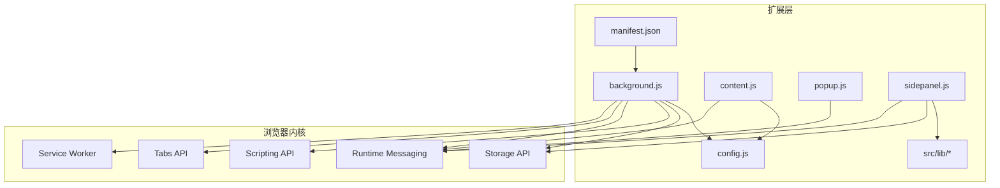
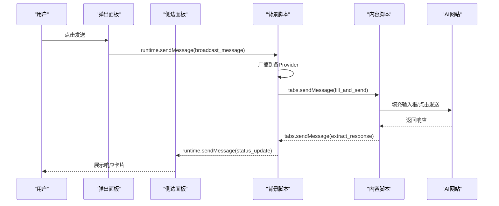
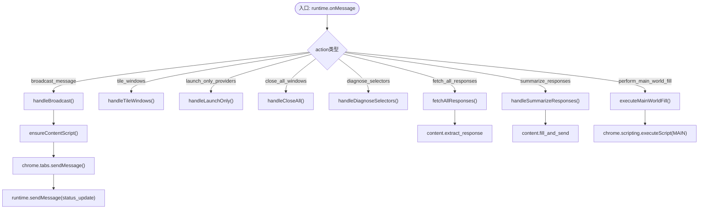
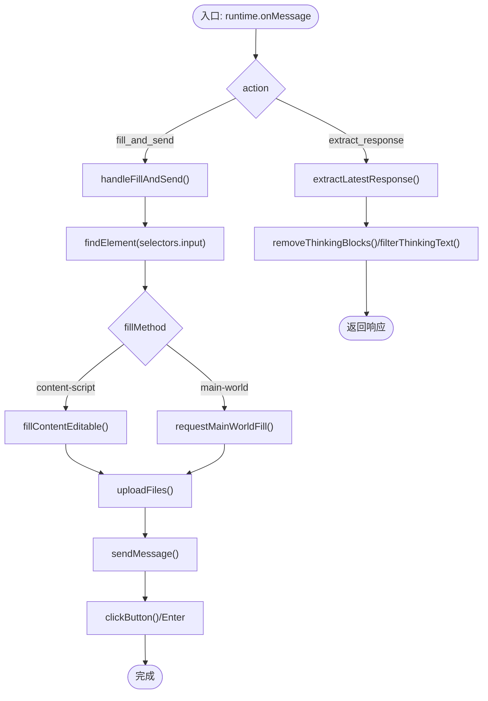
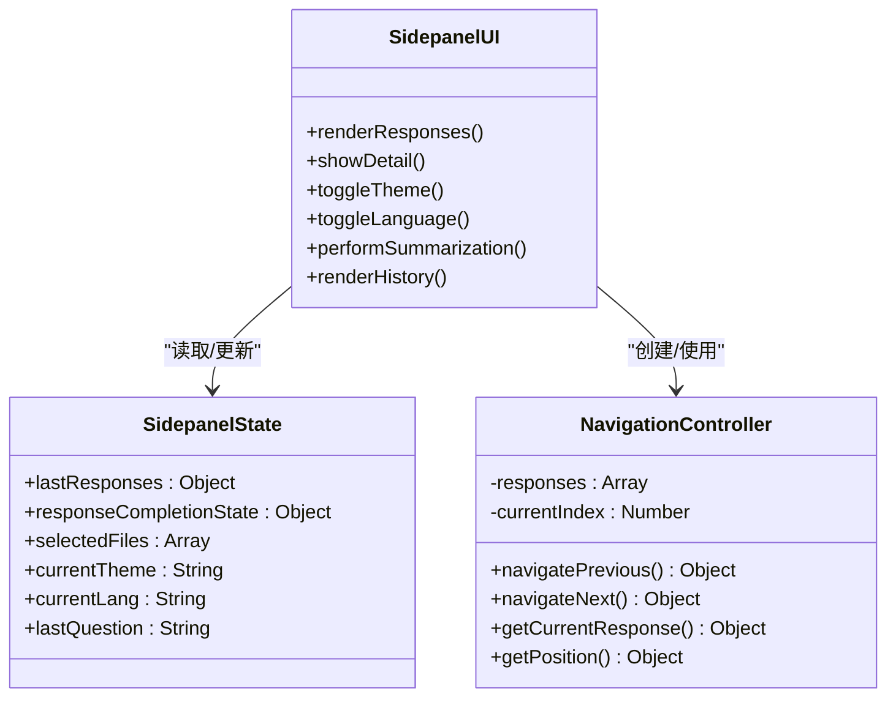
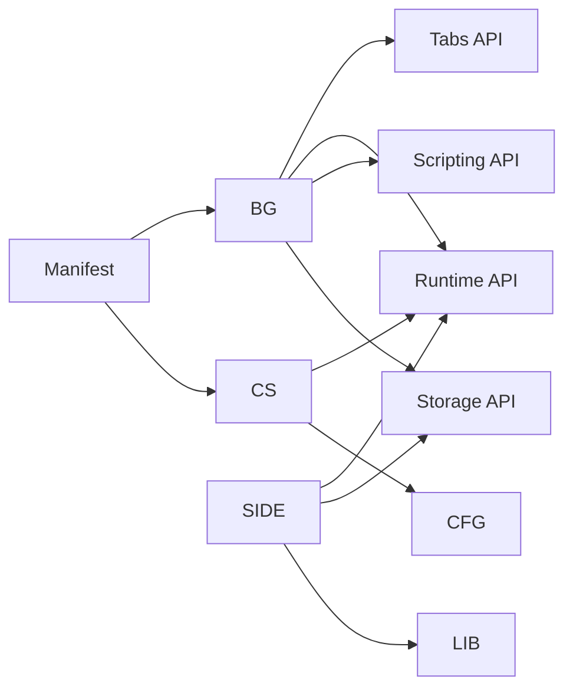

# 技术架构

<cite>
**本文档引用的文件**
- [manifest.json](file://manifest.json)
- [background.js](file://src/background.js)
- [content.js](file://src/content/content.js)
- [popup.js](file://src/popup/popup.js)
- [sidepanel.js](file://src/sidepanel/sidepanel.js)
- [config.js](file://src/config.js)
- [github.min.css](file://src/lib/github.min.css)
- [marked.min.js](file://src/lib/marked.min.js)
</cite>

## 目录
1. [引言](#引言)
2. [项目结构](#项目结构)
3. [核心组件](#核心组件)
4. [架构总览](#架构总览)
5. [详细组件分析](#详细组件分析)
6. [依赖关系分析](#依赖关系分析)
7. [性能考虑](#性能考虑)
8. [故障排除指南](#故障排除指南)
9. [结论](#结论)

## 引言
本技术架构文档面向AI多重宇宙对话扩展，系统性阐述Chrome扩展的整体架构设计与实现细节。重点覆盖背景脚本、内容脚本、用户界面三大核心组件的职责与交互关系，解释MVVM架构模式在侧边面板中的应用、消息传递机制与异步处理策略，并深入分析扩展的生命周期管理、权限配置与安全隔离等关键技术点。同时提供数据流向分析与组件间通信协议说明，为开发者提供清晰的架构理解和扩展指导。

## 项目结构
该扩展采用模块化组织方式，遵循Chrome扩展Manifest V3规范，核心目录与文件如下：
- manifest.json：声明扩展元数据、权限、后台脚本、内容脚本与命令等
- src/background.js：服务工作线程，负责窗口管理、消息路由、跨标签通信与异步任务协调
- src/content/content.js：内容脚本，注入到目标AI网站，负责页面元素填充、发送消息与响应提取
- src/popup/popup.js：弹出面板逻辑，提供快速发送入口与状态反馈
- src/sidepanel/sidepanel.js：侧边面板逻辑，实现MVVM架构、响应展示、多模态导航与摘要功能
- src/config.js：统一配置中心，定义各AI平台的选择器、发送策略与文件上传支持
- src/lib/*：第三方库，如marked.js用于Markdown渲染、highlight.js样式库与github.min.css主题

图表来源
- [manifest.json](file://manifest.json#L1-L79)
- [background.js](file://src/background.js#L1-L120)
- [content.js](file://src/content/content.js#L1-L60)
- [popup.js](file://src/popup/popup.js#L1-L61)
- [sidepanel.js](file://src/sidepanel/sidepanel.js#L1-L60)
- [config.js](file://src/config.js#L1-L40)

章节来源
- [manifest.json](file://manifest.json#L1-L79)
- [background.js](file://src/background.js#L1-L120)
- [content.js](file://src/content/content.js#L1-L60)
- [popup.js](file://src/popup/popup.js#L1-L61)
- [sidepanel.js](file://src/sidepanel/sidepanel.js#L1-L60)
- [config.js](file://src/config.js#L1-L40)

## 核心组件
- 背景脚本（Service Worker）：作为扩展的中枢，负责窗口生命周期管理、跨标签消息路由、异步任务编排、脚本注入与状态通知。典型职责包括广播消息、窗口平铺、响应抓取、摘要生成与主世界填充。
- 内容脚本：注入到目标AI网站，负责页面元素定位、输入框填充、发送按钮点击或回车提交、响应提取与文件上传。具备强大的DOM操作与事件派发能力。
- 用户界面（侧边面板）：采用MVVM架构，负责用户交互、响应展示、多模态导航、摘要生成与历史管理。通过状态驱动视图更新，提供良好的用户体验。
- 弹出面板：轻量级入口，允许用户快速选择AI平台并发送消息，同时接收来自背景脚本的状态更新。
- 配置中心：集中管理各AI平台的选择器、发送策略、文件上传支持与基础URL，确保内容脚本与背景脚本的一致性。

章节来源
- [background.js](file://src/background.js#L1-L120)
- [content.js](file://src/content/content.js#L1-L60)
- [sidepanel.js](file://src/sidepanel/sidepanel.js#L1-L120)
- [popup.js](file://src/popup/popup.js#L1-L61)
- [config.js](file://src/config.js#L1-L40)

## 架构总览
整体架构遵循Chrome扩展的分层设计：浏览器内核提供底层API（Service Worker、Tabs、Runtime、Scripting、Storage），扩展层通过Manifest声明与API协作，实现跨页面通信与异步任务编排。MVVM模式在侧边面板中体现为状态对象与视图绑定，消息传递机制贯穿背景脚本、内容脚本与UI组件。

图表来源
- [popup.js](file://src/popup/popup.js#L16-L45)
- [background.js](file://src/background.js#L138-L197)
- [content.js](file://src/content/content.js#L199-L216)
- [sidepanel.js](file://src/sidepanel/sidepanel.js#L1397-L1407)

## 详细组件分析

### 背景脚本（Service Worker）
- 窗口管理：维护弹窗窗口ID、跟踪各Provider对应的窗口与标签页，支持最小化/聚焦切换、窗口平铺与关闭全部窗口。
- 消息路由：监听runtime消息，分发到对应处理器（广播、平铺、启动、关闭、诊断选择器、抓取响应、摘要生成、主世界填充）。
- 异步任务：使用Promise.allSettled并发处理多个Provider，确保部分失败不影响整体流程；提供超时与重试机制。
- 脚本注入：检测内容脚本是否已注入，未注入则通过Scripting API执行注入，确保内容脚本可用。
- 状态通知：通过runtime.sendMessage向UI组件推送状态更新，实现UI与后台的解耦。

图表来源
- [background.js](file://src/background.js#L138-L197)
- [background.js](file://src/background.js#L718-L786)
- [background.js](file://src/background.js#L270-L296)
- [background.js](file://src/background.js#L199-L268)
- [background.js](file://src/background.js#L298-L376)
- [background.js](file://src/background.js#L378-L526)

章节来源
- [background.js](file://src/background.js#L1-L120)
- [background.js](file://src/background.js#L138-L197)
- [background.js](file://src/background.js#L199-L268)
- [background.js](file://src/background.js#L270-L296)
- [background.js](file://src/background.js#L298-L376)
- [background.js](file://src/background.js#L378-L526)

### 内容脚本
- 输入填充：支持主世界填充与内容脚本填充两种策略，针对不同平台UI特性进行适配（React输入框、contenteditable编辑器、Tiap/ProseMirror编辑器等）。
- 发送策略：根据平台特性选择表单提交、按钮点击或回车提交，具备禁用状态检测与超时回退机制。
- 响应提取：按配置选择器提取最新AI响应，支持移除推理/思考块、清理HTML与文本过滤，确保输出质量。
- 文件上传：针对各平台提供专用上传路径，支持多种文件类型与大小限制，具备重试与超时控制。
- 诊断工具：提供选择器诊断功能，返回各候选选择器的匹配数量与有效性，辅助调试。

图表来源
- [content.js](file://src/content/content.js#L199-L216)
- [content.js](file://src/content/content.js#L322-L418)
- [content.js](file://src/content/content.js#L465-L565)
- [content.js](file://src/content/content.js#L218-L320)
- [content.js](file://src/content/content.js#L593-L742)

章节来源
- [content.js](file://src/content/content.js#L1-L60)
- [content.js](file://src/content/content.js#L199-L216)
- [content.js](file://src/content/content.js#L322-L418)
- [content.js](file://src/content/content.js#L465-L565)
- [content.js](file://src/content/content.js#L218-L320)
- [content.js](file://src/content/content.js#L593-L742)

### 侧边面板（MVVM架构）
- MVVM模式：通过状态对象（lastResponses、responseCompletionState、selectedFiles等）驱动视图更新，视图事件回调触发状态变更，形成单向数据流。
- 响应展示：网格布局展示各Provider响应，支持点击查看详情、复制文本、切换宽屏布局等。
- 导航与缩放：提供Modal导航控制器，支持键盘、触摸与鼠标拖拽的多模态导航；支持详情模态的可调整宽度。
- 摘要功能：手动触发摘要生成，构建提示词并发送至指定摘要模型，轮询获取新响应并渲染。
- 历史管理：存储聊天历史，支持重发、编辑、删除与详情查看；摘要条目独立渲染。
- 主题与语言：支持深浅主题切换与多语言切换，动态更新UI文案与占位符。

图表来源
- [sidepanel.js](file://src/sidepanel/sidepanel.js#L712-L815)
- [sidepanel.js](file://src/sidepanel/sidepanel.js#L46-L120)
- [sidepanel.js](file://src/sidepanel/sidepanel.js#L1700-L1762)
- [sidepanel.js](file://src/sidepanel/sidepanel.js#L2172-L2399)

章节来源
- [sidepanel.js](file://src/sidepanel/sidepanel.js#L1-L120)
- [sidepanel.js](file://src/sidepanel/sidepanel.js#L712-L815)
- [sidepanel.js](file://src/sidepanel/sidepanel.js#L1700-L1762)
- [sidepanel.js](file://src/sidepanel/sidepanel.js#L2172-L2399)

### 弹出面板
- 快速发送：加载上次选择的Provider，用户点击发送后通过runtime.sendMessage触发广播消息。
- 状态反馈：监听runtime.onMessage，接收status_update并更新日志区域，提供实时反馈。

章节来源
- [popup.js](file://src/popup/popup.js#L1-L61)

### 配置中心
- Provider配置：统一管理各AI平台的基础URL、选择器、发送策略、文件上传支持与图标等。
- 一致性保障：内容脚本与背景脚本共享AI_CONFIG，确保选择器与策略一致，降低维护成本。

章节来源
- [config.js](file://src/config.js#L1-L204)

## 依赖关系分析
- Manifest声明：声明权限（activeTab、scripting、tabs、storage、system.display）、主机权限（各AI域名）、后台脚本（service worker）、内容脚本（注入时机、匹配规则）与命令（快捷键）。
- API依赖：背景脚本依赖Tabs、Runtime、Scripting、Storage API；内容脚本依赖Runtime消息与DOM操作；侧边面板依赖Storage与第三方库。
- 组件耦合：背景脚本与内容脚本通过消息传递耦合；侧边面板与背景脚本通过消息传递耦合；内容脚本与配置中心通过全局变量AI_CONFIG耦合。

图表来源
- [manifest.json](file://manifest.json#L12-L79)
- [background.js](file://src/background.js#L1-L120)
- [content.js](file://src/content/content.js#L1-L60)
- [sidepanel.js](file://src/sidepanel/sidepanel.js#L1-L60)

章节来源
- [manifest.json](file://manifest.json#L12-L79)
- [background.js](file://src/background.js#L1-L120)
- [content.js](file://src/content/content.js#L1-L60)
- [sidepanel.js](file://src/sidepanel/sidepanel.js#L1-L60)

## 性能考虑
- 并发优化：背景脚本使用Promise.allSettled并发处理多个Provider，减少总耗时；侧边面板在渲染响应时批量更新DOM，避免频繁重排。
- 注入策略：内容脚本仅在必要时注入，避免重复注入带来的开销；主世界填充通过executeScript一次性完成，减少多次往返。
- 选择器优化：内容脚本先精确匹配可见元素，再宽松匹配，提高命中率与稳定性。
- 轮询与超时：摘要生成采用轮询检测新响应，设置最大轮询次数与间隔，防止无限等待。
- 资源加载：侧边面板按需加载marked.js与highlight.js，避免不必要的资源消耗。

## 故障排除指南
- 脚本注入失败：检查Manifest的content_scripts配置与匹配规则；确认背景脚本的ensureContentScript逻辑是否抛出异常；验证目标站点是否阻止脚本注入。
- 选择器失效：使用内容脚本的诊断工具（diagnose_selectors）检查各候选选择器的有效性；根据返回结果调整AI_CONFIG中的selectors。
- 发送按钮不可用：检查内容脚本的按钮等待策略与禁用状态检测；针对异步UI平台适当增加等待时间或启用回退机制（如回车提交）。
- 响应提取为空：确认AI_CONFIG中的response选择器是否正确；检查removeThinkingBlocks与filterThinkingText的过滤逻辑是否过于激进。
- 窗口管理异常：检查背景脚本的窗口ID缓存与chrome.windows.get调用；确保弹窗状态切换逻辑（最小化/聚焦）正确处理。
- 语言与主题切换：确认侧边面板的语言切换逻辑与Storage写入；检查CSS变量与data-theme属性是否正确应用。

章节来源
- [background.js](file://src/background.js#L656-L678)
- [content.js](file://src/content/content.js#L126-L197)
- [sidepanel.js](file://src/sidepanel/sidepanel.js#L1864-L1890)

## 结论
本扩展通过清晰的三层架构（背景脚本、内容脚本、用户界面）与MVVM模式在侧边面板中的应用，实现了对多家AI平台的统一接入与高效管理。消息传递机制与异步处理策略确保了跨页面通信的可靠性与性能。权限配置与安全隔离遵循Chrome扩展最佳实践，为用户提供稳定、安全且易扩展的使用体验。开发者可基于现有架构与配置中心快速扩展新的AI平台，同时保持系统的可维护性与一致性。