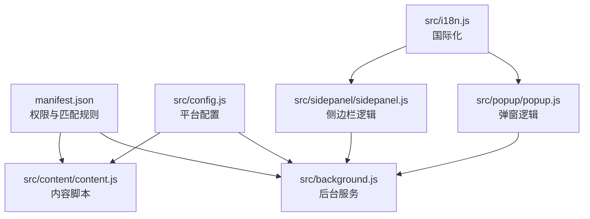
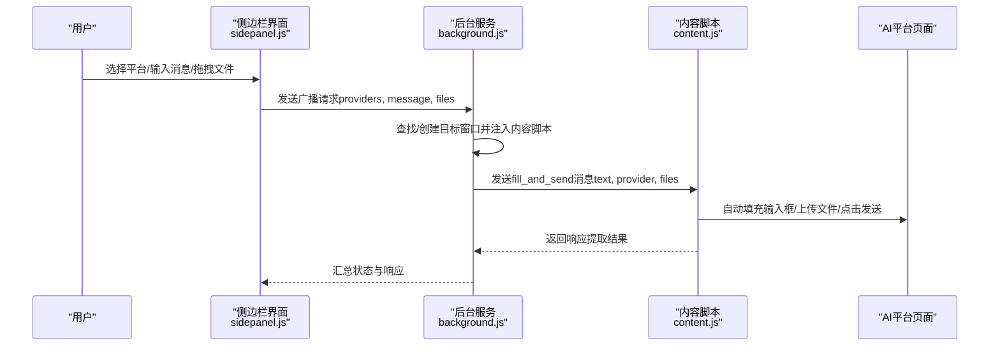
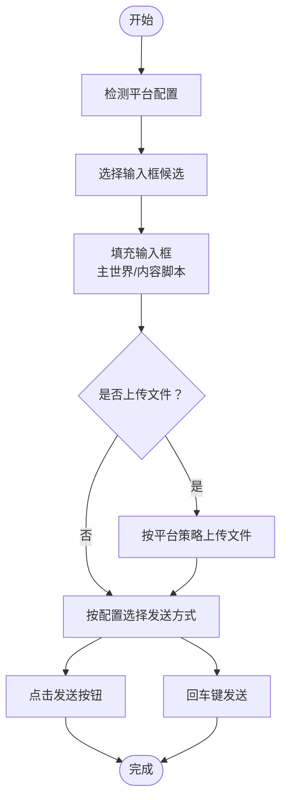
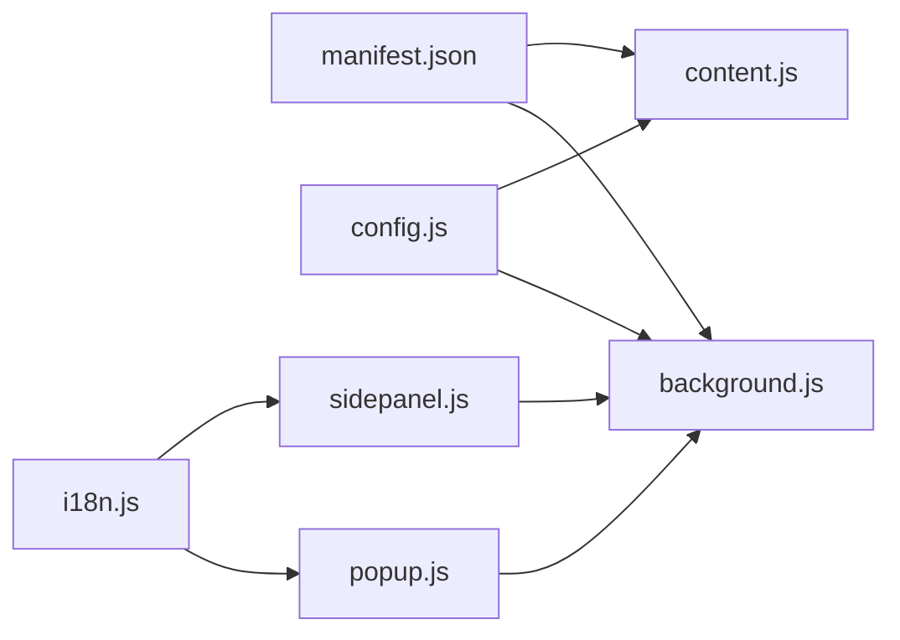

# 支持平台

<cite>
**本文引用的文件**
- [manifest.json](file://manifest.json)
- [config.js](file://src/config.js)
- [background.js](file://src/background.js)
- [content.js](file://src/content/content.js)
- [sidepanel.js](file://src/sidepanel/sidepanel.js)
- [sidepanel.html](file://src/sidepanel/sidepanel.html)
- [popup.js](file://src/popup/popup.js)
- [i18n.js](file://src/i18n.js)
- [README.md](file://README.md)
- [CONTRIBUTING.md](file://CONTRIBUTING.md)
</cite>

## 目录
1. [简介](#简介)
2. [项目结构](#项目结构)
3. [核心组件](#核心组件)
4. [架构总览](#架构总览)
5. [详细组件分析](#详细组件分析)
6. [依赖关系分析](#依赖关系分析)
7. [性能考量](#性能考量)
8. [故障排除指南](#故障排除指南)
9. [结论](#结论)
10. [附录](#附录)

## 简介
本文件面向“AI多重宇宙对话扩展”的使用者与维护者，系统梳理并解读扩展对7个主流AI平台的支持情况：Gemini、Grok、Kimi、DeepSeek、ChatGPT、通义千问（Qwen）、腾讯元宝（Yuanbao）。内容涵盖：
- 各平台特性、优势与适用场景
- 技术实现细节（选择器配置、发送方法、文件支持）
- 使用注意事项与最佳实践
- 兼容性与故障排除建议

本说明以仓库源码为依据，结合manifest、配置、后台与内容脚本、侧边栏界面与国际化资源，形成可操作、可验证的知识体系。

## 项目结构
扩展采用Chrome Extension Manifest V3，核心模块如下：
- manifest.json：声明权限、主机权限、内容脚本注入规则与后台脚本
- src/config.js：统一的AI平台配置中心，包含各平台的选择器、发送/填充策略、文件支持等
- src/background.js：后台服务，负责窗口管理、消息广播、响应抓取、摘要生成等
- src/content/content.js：内容脚本，注入到各AI站点，负责自动填入、发送、提取响应、文件上传
- src/sidepanel/sidepanel.js / sidepanel.html：侧边栏界面，提供多模态交互、历史、响应查看、摘要设置等
- src/popup/popup.js：弹窗入口，快速选择平台并广播消息
- src/i18n.js：国际化资源，支持英文与中文

图表来源
- [manifest.json](file://manifest.json#L19-L68)
- [config.js](file://src/config.js#L5-L199)
- [background.js](file://src/background.js#L69-L74)
- [content.js](file://src/content/content.js#L1-L25)
- [sidepanel.js](file://src/sidepanel/sidepanel.js#L41-L54)
- [popup.js](file://src/popup/popup.js#L1-L61)
- [i18n.js](file://src/i18n.js#L6-L346)

章节来源
- [manifest.json](file://manifest.json#L19-L68)
- [README.md](file://README.md#L20-L28)

## 核心组件
- 平台配置中心（AI_CONFIG）：集中定义各平台的名称、图标、URL模式、基础URL、选择器、填充与发送策略、文件支持能力
- 后台服务（background）：负责窗口发现/创建、内容脚本注入、消息分发、响应提取、摘要生成、窗口平铺等
- 内容脚本（content）：在目标站点内执行，按配置自动填充输入、点击发送、提取最新响应、上传文件
- 侧边栏界面（sidepanel）：提供聊天、响应查看、模型选择、文件拖拽上传、摘要设置、多语言切换等
- 弹窗（popup）：轻量入口，快速选择平台并广播消息
- 国际化（i18n）：提供中英双语文案与日期/相对时间格式化

章节来源
- [config.js](file://src/config.js#L5-L199)
- [background.js](file://src/background.js#L133-L197)
- [content.js](file://src/content/content.js#L199-L216)
- [sidepanel.js](file://src/sidepanel/sidepanel.js#L41-L54)
- [popup.js](file://src/popup/popup.js#L1-L61)
- [i18n.js](file://src/i18n.js#L6-L346)

## 架构总览
扩展通过Manifest声明的主机权限与内容脚本匹配规则，将内容脚本注入到各AI站点。后台脚本协调窗口生命周期与消息路由，内容脚本在站点内执行自动化操作。侧边栏与弹窗作为用户交互入口，将用户意图转化为后台/内容脚本指令。

图表来源
- [background.js](file://src/background.js#L138-L197)
- [background.js](file://src/background.js#L718-L786)
- [content.js](file://src/content/content.js#L199-L216)
- [content.js](file://src/content/content.js#L322-L418)

## 详细组件分析

### 平台概览与特性对比
以下从“特性/优势/适用场景”角度，结合配置与实现细节，对7个平台进行横向对比。

- Gemini
  - 特性：选择器覆盖广、支持文件上传、发送方式灵活（按钮/回车）、主世界填充策略
  - 优势：输入框与发送按钮选择器健壮，适合长文本；文件上传路径明确
  - 适用场景：需要长上下文、多模态输入的综合问答
  - 实现要点：主世界填充、按钮点击发送、文件上传至input[type="file"]

- Grok
  - 特性：支持文件上传、发送方式为按钮点击；输入框为富文本编辑器
  - 优势：对富文本编辑器有专门处理逻辑，避免占位符干扰
  - 适用场景：需要富文本输入与多模态输入的场景
  - 实现要点：富文本编辑器专用填充、按钮点击发送、文件上传

- Kimi
  - 特性：仅支持按钮发送；输入框为contenteditable，采用内容脚本填充策略
  - 优势：避免主世界事件链导致的重复文本
  - 适用场景：强调稳定发送流程与避免重复输入
  - 实现要点：内容脚本填充、按钮点击发送、文件上传

- DeepSeek
  - 特性：发送方式为回车键；支持图片文件上传
  - 优势：回车提交更稳定，适合异步UI
  - 适用场景：追求稳定提交与图片输入
  - 实现要点：回车键发送、按钮点击回退、文件上传

- ChatGPT
  - 特性：支持多种文件类型；发送方式为按钮点击
  - 优势：文件类型丰富，发送机制稳定
  - 适用场景：需要多类型文件输入的问答
  - 实现要点：按钮点击发送、文件上传

- 通义千问（Qwen）
  - 特性：发送方式为回车键；支持多种文件类型
  - 优势：回车提交减少对按钮状态的依赖
  - 适用场景：追求稳定提交与多类型文件输入
  - 实现要点：回车键发送、文件上传

- 腾讯元宝（Yuanbao）
  - 特性：支持文件上传；发送方式为按钮点击
  - 优势：对响应内容有专门的思维/推理块过滤
  - 适用场景：需要去除推理过程、关注最终答案的场景
  - 实现要点：按钮点击发送、响应去思考块、文件上传

章节来源
- [config.js](file://src/config.js#L5-L199)
- [content.js](file://src/content/content.js#L466-L565)
- [content.js](file://src/content/content.js#L616-L742)

### 技术实现细节

#### 1) 选择器配置与适配
- 输入框选择器：针对各平台的输入框特征（textarea、contenteditable、富文本编辑器等）设计多组候选
- 发送按钮选择器：考虑aria-label、role、类名、SVG图标等多种形态
- 响应选择器：优先选择最新一条响应容器，必要时回退到通用markdown容器
- 文件上传选择器：区分直接input[type="file"]与点击上传按钮后出现的input

图表来源
- [config.js](file://src/config.js#L11-L17)
- [config.js](file://src/config.js#L28-L49)
- [config.js](file://src/config.js#L61-L66)
- [config.js](file://src/config.js#L82-L86)
- [config.js](file://src/config.js#L99-L103)
- [config.js](file://src/config.js#L123-L155)
- [config.js](file://src/config.js#L168-L191)

章节来源
- [config.js](file://src/config.js#L5-L199)
- [content.js](file://src/content/content.js#L574-L590)

#### 2) 发送方法与稳定性策略
- 主世界填充 vs 内容脚本填充：主世界填充绕过React状态，适合复杂表单；内容脚本填充更贴近真实用户行为，避免事件链冲突
- 发送方式：按钮点击（最常见）、回车键（异步UI更稳定）、表单提交（少数平台）
- 按钮可用性检测：检查禁用状态、aria-disabled、类名等，避免在按钮灰掉时强行点击
- 回退策略：异步UI在按钮长时间不可用时回退到回车发送

章节来源
- [config.js](file://src/config.js#L18-L21)
- [config.js](file://src/config.js#L50-L53)
- [config.js](file://src/config.js#L70-L72)
- [config.js](file://src/config.js#L88-L92)
- [config.js](file://src/config.js#L105-L108)
- [config.js](file://src/config.js#L157-L161)
- [config.js](file://src/config.js#L194-L197)
- [content.js](file://src/content/content.js#L466-L565)

#### 3) 文件支持与上传策略
- 文件类型过滤：按平台支持列表过滤，支持MIME类型与扩展名
- 上传路径：多数平台通过点击上传按钮后触发input[type="file"]，部分平台直接操作input
- 上传延迟：根据平台差异设置上传等待时间，确保上传完成后再继续流程
- 错误处理：重试机制、超时控制、错误提示

章节来源
- [config.js](file://src/config.js#L21-L22)
- [config.js](file://src/config.js#L52-L53)
- [config.js](file://src/config.js#L73-L74)
- [config.js](file://src/config.js#L91-L92)
- [config.js](file://src/config.js#L107-L108)
- [config.js](file://src/config.js#L160-L161)
- [config.js](file://src/config.js#L196-L197)
- [content.js](file://src/content/content.js#L616-L742)
- [content.js](file://src/content/content.js#L744-L941)

#### 4) 响应提取与内容清洗
- 响应定位：按配置的响应选择器集合，取最后一条有效内容
- 思维/推理块过滤：针对特定平台（如Yuanbao）移除深度搜索的“思考”部分，保留最终答案
- 文本清洗：移除“Thinking/Reasoning”等关键词段落，避免将中间推理纳入摘要

章节来源
- [content.js](file://src/content/content.js#L218-L320)
- [content.js](file://src/content/content.js#L50-L102)

#### 5) 窗口管理与布局
- 窗口发现：按URL模式匹配现有标签页，若不存在则新建
- 平铺布局：根据显示器工作区计算网格布局，支持跨显示器
- 状态跟踪：记录各平台窗口ID，避免重复创建与误操作

章节来源
- [background.js](file://src/background.js#L528-L643)
- [background.js](file://src/background.js#L718-L786)

### 平台专属实现要点

#### Gemini
- 输入框：div[contenteditable="true"]、div.ql-editor等
- 发送：按钮点击；主世界填充
- 文件：支持图片、PDF、文本等；通过input[type="file"]或点击上传按钮后触发

章节来源
- [config.js](file://src/config.js#L11-L22)
- [content.js](file://src/content/content.js#L747-L788)

#### Grok
- 输入框：富文本编辑器（ProseMirror/Tiptap）
- 发送：按钮点击；主世界填充
- 文件：支持图片、PDF、文本；通过上传按钮后触发input[type="file"]

章节来源
- [config.js](file://src/config.js#L28-L54)
- [content.js](file://src/content/content.js#L814-L836)

#### Kimi
- 输入框：div[contenteditable="true"]、div.chat-input
- 发送：按钮点击（不使用回车，避免不稳定）
- 文件：支持多种文档类型；通过input[type="file"]

章节来源
- [config.js](file://src/config.js#L61-L75)
- [content.js](file://src/content/content.js#L841-L857)

#### DeepSeek
- 输入框：textarea#chat-input
- 发送：回车键（异步UI更稳定）
- 文件：支持图片；通过上传按钮后触发input[type="file"]

章节来源
- [config.js](file://src/config.js#L81-L93)
- [content.js](file://src/content/content.js#L862-L898)

#### ChatGPT
- 输入框：div#prompt-textarea、div[contenteditable="true"]
- 发送：按钮点击
- 文件：支持多种类型；通过input[type="file"]

章节来源
- [config.js](file://src/config.js#L99-L109)
- [content.js](file://src/content/content.js#L793-L809)

#### 通义千问（Qwen）
- 输入框：div[role="textbox"]、div[data-placeholder*="千问"]、div[data-slate-editor="true"]
- 发送：回车键（减少对按钮状态依赖）
- 文件：支持多种类型；通过input[type="file"]

章节来源
- [config.js](file://src/config.js#L123-L162)
- [content.js](file://src/content/content.js#L903-L919)

#### 腾讯元宝（Yuanbao）
- 输入框：.ql-editor、div[contenteditable="true"]
- 发送：按钮点击
- 文件：支持图片、PDF、文档、文本、Markdown；通过input[type="file"]
- 响应清洗：移除深度搜索的“思考”部分

章节来源
- [config.js](file://src/config.js#L168-L198)
- [content.js](file://src/content/content.js#L58-L70)
- [content.js](file://src/content/content.js#L924-L940)

## 依赖关系分析
- Manifest与内容脚本：通过host_permissions与content_scripts的matches字段，声明对7个平台域名的访问与注入
- 配置中心与后台/内容脚本：AI_CONFIG在全局作用域共享，后台与内容脚本均依赖其选择器与策略
- 侧边栏与后台：侧边栏通过chrome.runtime向后台发送动作消息（广播、平铺、关闭、摘要等）
- 国际化：i18n.js提供翻译函数，前端界面与后台状态消息均使用

图表来源
- [manifest.json](file://manifest.json#L19-L68)
- [config.js](file://src/config.js#L5-L199)
- [background.js](file://src/background.js#L69-L74)
- [content.js](file://src/content/content.js#L1-L25)
- [sidepanel.js](file://src/sidepanel/sidepanel.js#L41-L54)
- [popup.js](file://src/popup/popup.js#L1-L61)
- [i18n.js](file://src/i18n.js#L6-L346)

章节来源
- [manifest.json](file://manifest.json#L19-L68)
- [config.js](file://src/config.js#L5-L199)
- [background.js](file://src/background.js#L133-L197)
- [content.js](file://src/content/content.js#L199-L216)
- [sidepanel.js](file://src/sidepanel/sidepanel.js#L41-L54)
- [popup.js](file://src/popup/popup.js#L1-L61)
- [i18n.js](file://src/i18n.js#L6-L346)

## 性能考量
- 选择器匹配与DOM遍历：配置中提供多组候选，实际运行中优先命中可见元素，减少无效查询
- 发送策略优化：异步UI优先回车键发送，按钮点击作为回退，降低按钮状态竞争带来的失败率
- 文件上传：按平台差异设置上传等待时间，避免过早触发后续步骤
- 响应提取：优先取最后一条响应，必要时回退到通用选择器，减少误判
- 窗口平铺：按显示器工作区计算布局，避免跨屏闪烁与重排

章节来源
- [content.js](file://src/content/content.js#L574-L590)
- [content.js](file://src/content/content.js#L466-L565)
- [content.js](file://src/content/content.js#L616-L742)
- [content.js](file://src/content/content.js#L218-L320)
- [background.js](file://src/background.js#L528-L643)

## 故障排除指南
- 无法找到输入框
  - 现象：报错“输入框未找到”
  - 排查：确认平台URL是否正确、选择器是否仍有效；可在后台使用诊断功能检查选择器
  - 参考
    - [content.js](file://src/content/content.js#L393)
    - [content.js](file://src/content/content.js#L126-L197)

- 发送按钮不可用或状态异常
  - 现象：按钮灰掉或禁用
  - 排查：检查禁用属性与类名；异步UI可回退到回车发送
  - 参考
    - [content.js](file://src/content/content.js#L489-L524)

- 文件上传失败或超时
  - 现象：上传超时或类型不支持
  - 排查：确认文件类型是否在平台支持列表中；适当增加上传等待时间
  - 参考
    - [content.js](file://src/content/content.js#L616-L742)
    - [content.js](file://src/content/content.js#L677-L710)

- 响应提取为空或内容不完整
  - 现象：无响应或包含中间推理内容
  - 排查：检查响应选择器；Yuanbao需移除“思考”块
  - 参考
    - [content.js](file://src/content/content.js#L218-L320)
    - [content.js](file://src/content/content.js#L58-L70)

- 窗口平铺失败
  - 现象：无法平铺或布局异常
  - 排查：检查显示器信息与窗口状态；重新执行平铺
  - 参考
    - [background.js](file://src/background.js#L528-L643)

- 语言/主题显示异常
  - 现象：文案不显示或主题不生效
  - 排查：确认i18n资源加载与主题切换逻辑
  - 参考
    - [i18n.js](file://src/i18n.js#L6-L346)
    - [sidepanel.js](file://src/sidepanel/sidepanel.js#L338-L348)

章节来源
- [content.js](file://src/content/content.js#L126-L197)
- [content.js](file://src/content/content.js#L393)
- [content.js](file://src/content/content.js#L489-L524)
- [content.js](file://src/content/content.js#L616-L742)
- [content.js](file://src/content/content.js#L677-L710)
- [content.js](file://src/content/content.js#L218-L320)
- [content.js](file://src/content/content.js#L58-L70)
- [background.js](file://src/background.js#L528-L643)
- [i18n.js](file://src/i18n.js#L6-L346)
- [sidepanel.js](file://src/sidepanel/sidepanel.js#L338-L348)

## 结论
本扩展通过统一的平台配置与稳健的内容脚本策略，实现了对7个主流AI平台的稳定集成。各平台在输入框、发送方式、文件支持等方面各有侧重，但整体遵循“多候选选择器 + 稳定发送策略 + 内容清洗”的通用范式。对于新增平台，可参考贡献指南在配置中心补充选择器与策略，即可快速接入。

## 附录

### 平台兼容性与安装
- 支持平台：Gemini、Grok、Kimi、DeepSeek、ChatGPT、通义千问、腾讯元宝
- 安装方式：开发者模式下加载已解压扩展，固定扩展图标
- 使用前提：需在对应AI服务中登录

章节来源
- [README.md](file://README.md#L11-L18)
- [README.md](file://README.md#L30-L47)
- [README.md](file://README.md#L81-L98)

### 新增平台集成指南
- 在配置中心添加平台条目，定义名称、图标、URL模式、基础URL、选择器、填充/发送策略、文件支持
- 更新Manifest的主机权限与内容脚本匹配
- 添加平台图标并在侧边栏界面中注册
- 加载扩展并测试发送、文件上传、响应提取

章节来源
- [CONTRIBUTING.md](file://CONTRIBUTING.md#L5-L43)
- [config.js](file://src/config.js#L5-L199)
- [sidepanel.html](file://src/sidepanel/sidepanel.html#L193-L242)