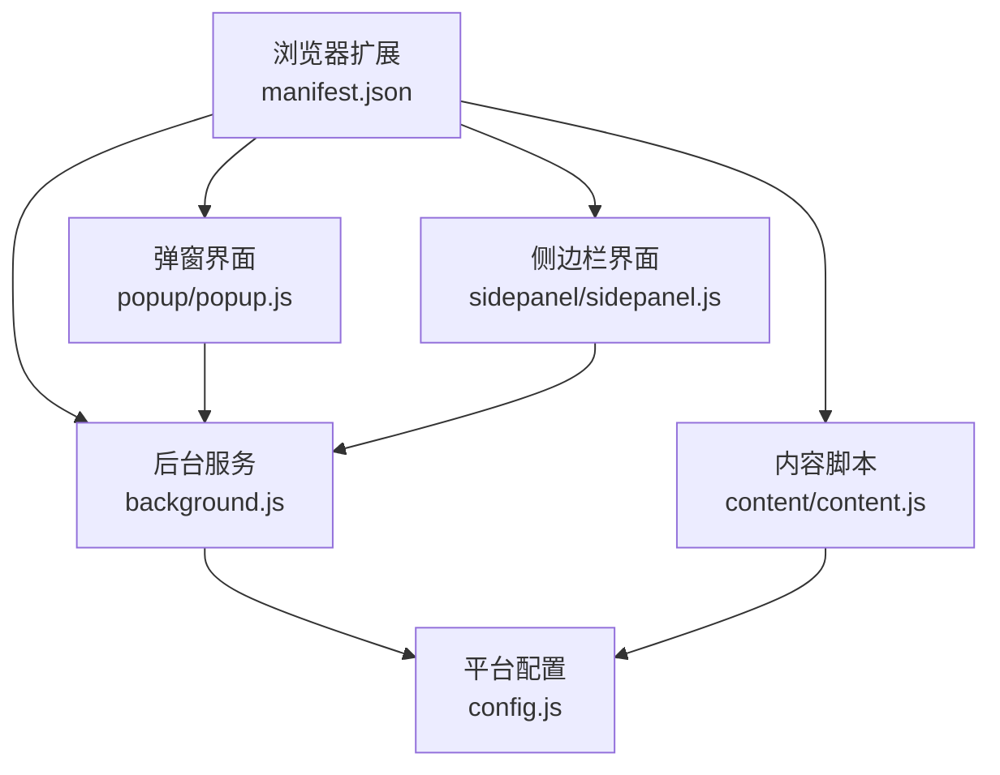
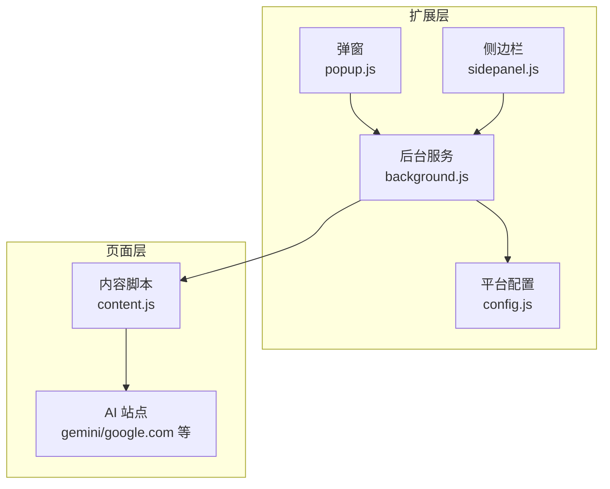
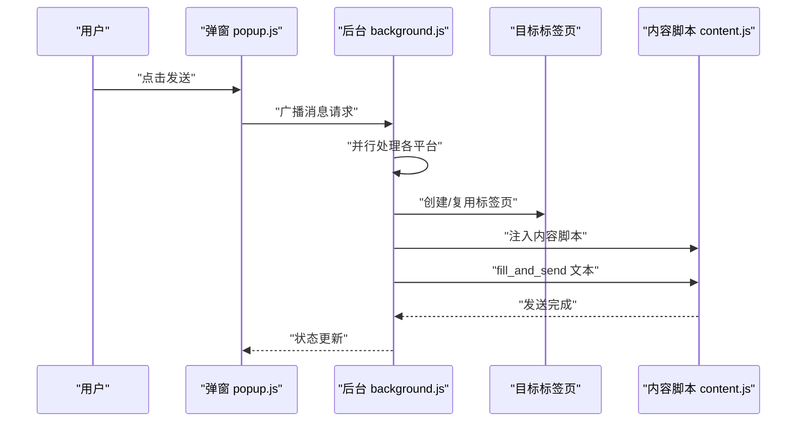
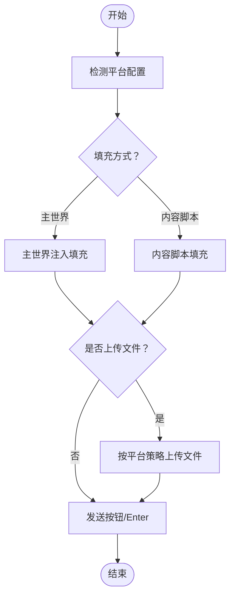
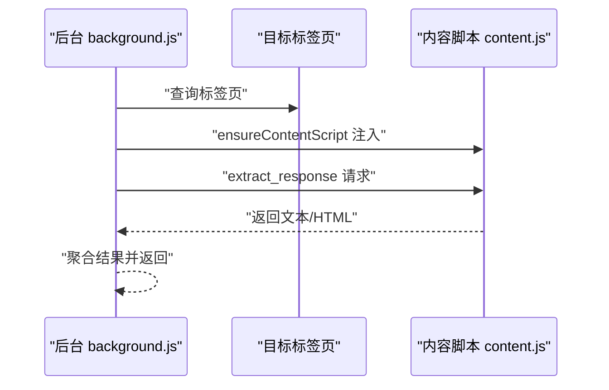
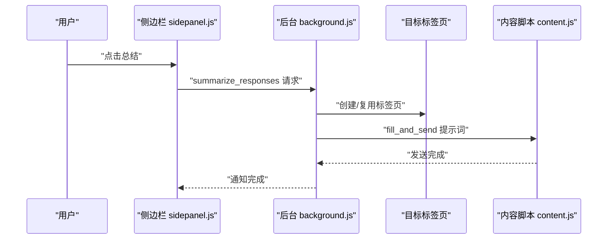
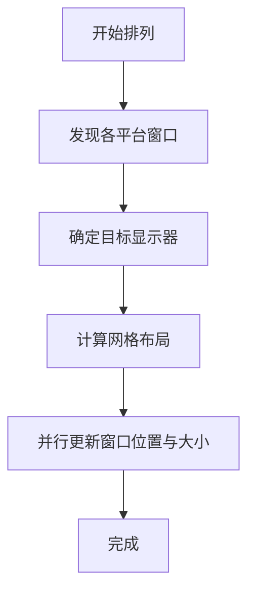
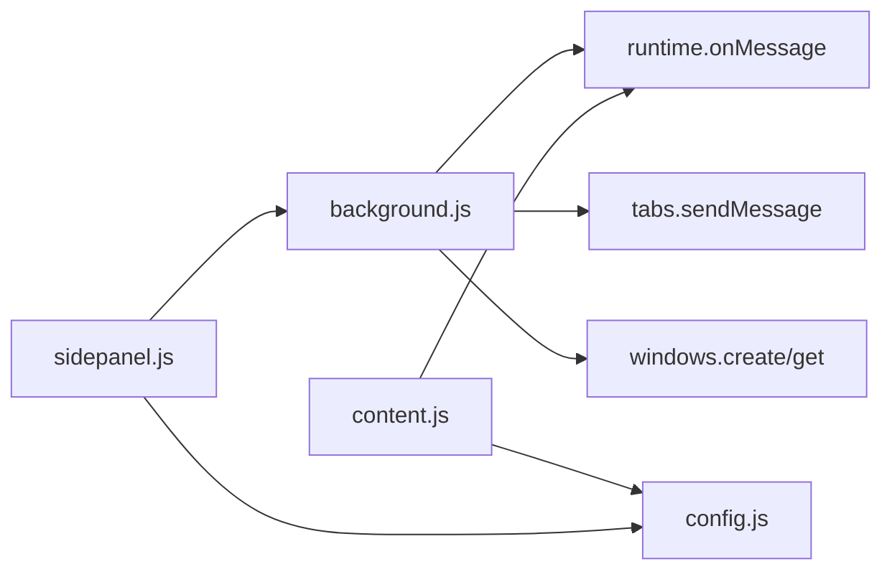

# 核心特性

<cite>
**本文引用的文件**
- [manifest.json](file://manifest.json)
- [README.md](file://README.md)
- [src/background.js](file://src/background.js)
- [src/popup/popup.js](file://src/popup/popup.js)
- [src/sidepanel/sidepanel.js](file://src/sidepanel/sidepanel.js)
- [src/config.js](file://src/config.js)
- [src/content/content.js](file://src/content/content.js)
</cite>

## 目录
1. [简介](#简介)
2. [项目结构](#项目结构)
3. [核心组件](#核心组件)
4. [架构总览](#架构总览)
5. [详细组件分析](#详细组件分析)
6. [依赖关系分析](#依赖关系分析)
7. [性能考量](#性能考量)
8. [故障排查指南](#故障排查指南)
9. [结论](#结论)
10. [附录](#附录)

## 简介
本扩展提供“AI 多重宇宙对话”能力，允许用户在同一时间向多个 AI 平台（如 Gemini、Grok、Kimi、DeepSeek、ChatGPT、Qwen、Yuanbao）广播消息，支持自动化消息发送、响应收集与对比、智能总结生成、多窗口排列与状态可视化等核心特性。系统通过后台服务协调、内容脚本注入与选择器自动化，结合异步消息处理与状态管理，实现跨平台的一致交互体验。

## 项目结构
- manifest.json：声明扩展权限、匹配站点、后台脚本与命令绑定。
- src/background.js：后台服务，负责窗口管理、消息分发、响应收集、总结触发、主世界注入等。
- src/popup/popup.js：弹窗界面逻辑，发起广播、接收状态反馈。
- src/sidepanel/sidepanel.js：侧边栏界面，提供历史记录、响应展示、对比导航、总结设置与渲染。
- src/config.js：统一配置所有支持平台的选择器、提交方式、文件上传策略等。
- src/content/content.js：内容脚本，注入页面后执行自动填入、发送、响应提取与调试诊断。

图表来源
- [manifest.json](file://manifest.json#L1-L79)
- [src/background.js](file://src/background.js#L1-L120)
- [src/popup/popup.js](file://src/popup/popup.js#L1-L61)
- [src/sidepanel/sidepanel.js](file://src/sidepanel/sidepanel.js#L1-L120)
- [src/config.js](file://src/config.js#L1-L204)
- [src/content/content.js](file://src/content/content.js#L1-L60)

章节来源
- [manifest.json](file://manifest.json#L1-L79)
- [README.md](file://README.md#L1-L107)

## 核心组件
- 广播发送与窗口编排：后台服务根据用户选择的平台并行打开或复用对应站点标签页，注入内容脚本并触发消息发送。
- 选择器自动化与主世界注入：针对不同平台的输入框、发送按钮与响应区域，采用精确选择器与主世界注入策略，确保高兼容性与稳定性。
- 响应收集与对比：后台统一查询各平台标签页，内容脚本提取最新响应，去除推理/思考片段，支持 HTML 与纯文本两种输出。
- 智能总结生成：内置强大总结提示词模板，支持手动触发与自动汇总，生成结构化对比与最终答案。
- 多窗口排列与状态可视化：侧边栏提供聊天式历史记录、等待状态条、实时状态更新与一键排列，提升多模型对比效率。
- 文件上传与拖拽：支持多文件拖拽、类型过滤与超时重试，适配各平台上传机制。
- 主题与语言：支持深浅主题切换与多语言（英文/中文）切换，界面随系统偏好动态调整。

章节来源
- [src/background.js](file://src/background.js#L138-L197)
- [src/content/content.js](file://src/content/content.js#L200-L320)
- [src/sidepanel/sidepanel.js](file://src/sidepanel/sidepanel.js#L258-L335)
- [src/config.js](file://src/config.js#L5-L199)

## 架构总览
系统采用“后台服务 + 内容脚本 + 侧边栏界面”的分层架构：
- 后台服务：集中处理消息路由、窗口生命周期、跨标签通信与状态聚合。
- 内容脚本：在目标站点内执行自动化，屏蔽平台差异，统一交互语义。
- 侧边栏界面：提供用户交互入口、历史记录与可视化对比，承载总结与导航功能。

图表来源
- [src/background.js](file://src/background.js#L1-L120)
- [src/config.js](file://src/config.js#L1-L204)
- [src/popup/popup.js](file://src/popup/popup.js#L1-L61)
- [src/sidepanel/sidepanel.js](file://src/sidepanel/sidepanel.js#L1-L120)
- [src/content/content.js](file://src/content/content.js#L1-L60)

## 详细组件分析

### 广播发送与窗口编排
- 功能要点
  - 根据用户勾选的平台列表，后台并行处理每个平台：优先复用已有标签页，否则新建窗口并跳转至基础 URL。
  - 注入内容脚本，等待页面加载完成，再发送“填充并发送”指令。
  - 通过消息通道返回状态，弹窗侧即时反馈发送结果。
- 关键实现
  - 并行任务：Promise.allSettled 并行发送，降低总延迟。
  - 窗口发现：按 URL 模式匹配、排除扩展自身标签与控制面板，确保定位正确。
  - 加载等待：waitForTabLoad 监听标签页加载完成，避免过早注入。
- 使用场景
  - 同时向多个模型提问，快速获得多视角回答，便于对比与决策。

图表来源
- [src/popup/popup.js](file://src/popup/popup.js#L16-L45)
- [src/background.js](file://src/background.js#L718-L786)
- [src/content/content.js](file://src/content/content.js#L200-L216)

章节来源
- [src/background.js](file://src/background.js#L718-L786)
- [src/popup/popup.js](file://src/popup/popup.js#L16-L45)

### 选择器自动化与主世界注入
- 功能要点
  - 针对不同平台定义输入框、发送按钮、响应区域与文件上传入口的选择器集合。
  - 对复杂编辑器（如 Tiptap/ProseMirror、React 输入）采用主世界注入，确保值设置与事件同步。
  - 对内容可编辑区域采用“聚焦 → 全选删除 → 直接写入文本内容”的策略，规避长度限制与事件风暴。
- 关键实现
  - 主世界注入：executeMainWorldFill 在 MAIN 世界执行，绕过 CSP 限制，精准填充与触发事件。
  - 内容脚本填充：fillContentEditable 通过 Selection API 与 execCommand 控制输入，兼容多种编辑器。
  - 发送策略：优先点击按钮，若按钮长时间不可用则回退到 Enter 键（除 Kimi 明确仅用按钮）。
- 使用场景
  - 在不同 UI 结构的平台上实现一致的“输入 → 上传 → 发送 → 提取”流程。

图表来源
- [src/config.js](file://src/config.js#L5-L199)
- [src/content/content.js](file://src/content/content.js#L420-L565)

章节来源
- [src/config.js](file://src/config.js#L5-L199)
- [src/content/content.js](file://src/content/content.js#L420-L565)

### 响应收集与对比
- 功能要点
  - 后台遍历各平台标签页，确保内容脚本已注入，再请求提取最新响应。
  - 内容脚本按配置选择器定位最新响应，移除“思考/推理”片段，优先返回 HTML，其次 Markdown 渲染。
  - 侧边栏以左右布局展示用户消息与各模型响应，实时更新状态，支持一键获取全部响应。
- 关键实现
  - 响应提取：按配置选择器顺序尝试，取最后一条有效内容；对特定平台（如 Qwen）采用启发式选择最长文本。
  - 思维块清理：removeThinkingBlocks 与 filterThinkingText 双管齐下，保留最终答案。
  - 状态可视化：添加等待状态条、逐模型状态更新与完成态高亮。
- 使用场景
  - 快速对比多模型回答，识别共识与分歧，辅助决策与知识整合。

图表来源
- [src/background.js](file://src/background.js#L199-L268)
- [src/content/content.js](file://src/content/content.js#L218-L320)

章节来源
- [src/background.js](file://src/background.js#L199-L268)
- [src/content/content.js](file://src/content/content.js#L218-L320)

### 智能总结生成
- 功能要点
  - 内置多语言默认总结提示词，结构化输出“摘要标题、关键共识、分歧视角、独特洞察、最终答案”。
  - 支持自定义模型与提示词，手动触发总结，后台为目标平台创建标签页并注入提示词。
- 关键实现
  - 总结触发：handleSummarizeResponses 选择目标平台标签页，注入 fill_and_send 消息。
  - 提示词模板：DEFAULT_SUMMARIZE_PROMPT_EN/ZH，强调一致性与结构性。
- 使用场景
  - 将多模型输出整合为一份高质量、可读性强的综合报告，节省人工归纳成本。

图表来源
- [src/sidepanel/sidepanel.js](file://src/sidepanel/sidepanel.js#L258-L335)
- [src/background.js](file://src/background.js#L298-L376)

章节来源
- [src/sidepanel/sidepanel.js](file://src/sidepanel/sidepanel.js#L258-L335)
- [src/background.js](file://src/background.js#L298-L376)

### 多窗口排列与状态可视化
- 功能要点
  - 一键将多个模型窗口按网格排列，自动识别显示器与上次布局偏好，避免覆盖控制面板。
  - 侧边栏聊天式历史记录，左侧用户消息、右侧等待/完成状态，自动滚动与高亮。
- 关键实现
  - 窗口发现：按 URL 模式匹配，排除扩展标签与控制面板。
  - 排列算法：根据窗口数量计算行列数，按工作区尺寸等分，异步更新。
  - 状态条：addWaitingStatusToHistory 生成等待项，updateProviderStatus 更新单项状态。
- 使用场景
  - 多模型并行时，直观掌握各模型响应进度，提升对比效率。

图表来源
- [src/background.js](file://src/background.js#L527-L643)
- [src/sidepanel/sidepanel.js](file://src/sidepanel/sidepanel.js#L2477-L2512)

章节来源
- [src/background.js](file://src/background.js#L527-L643)
- [src/sidepanel/sidepanel.js](file://src/sidepanel/sidepanel.js#L2477-L2512)

### 文件上传与拖拽
- 功能要点
  - 支持拖拽上传，自动校验单文件与总大小上限，按平台支持类型过滤。
  - 上传失败具备重试与超时保护，避免阻塞主流程。
- 关键实现
  - 类型过滤：filterSupportedFiles 基于配置的 MIME/扩展名进行匹配。
  - 上传策略：按平台分别实现上传函数，统一使用 Promise.race 超时控制。
  - 数据转换：dataURLtoFile 将 Data URL 转换为 File 对象，构造 DataTransfer 触发 change。
- 使用场景
  - 将图片、文档等附件同时发送给多个模型，辅助问答与分析。

章节来源
- [src/content/content.js](file://src/content/content.js#L616-L742)
- [src/content/content.js](file://src/content/content.js#L599-L609)

### 主题与语言
- 功能要点
  - 支持深浅主题切换与多语言（英文/中文）切换，界面随系统偏好动态调整。
  - 侧边栏提供主题与语言切换入口，保存用户偏好。
- 使用场景
  - 根据个人习惯与使用环境切换界面风格与语言，提升长期使用的舒适度。

章节来源
- [src/sidepanel/sidepanel.js](file://src/sidepanel/sidepanel.js#L338-L349)
- [src/sidepanel/sidepanel.js](file://src/sidepanel/sidepanel.js#L1919-L1953)

## 依赖关系分析
- 组件耦合
  - 后台服务与内容脚本通过消息通道强耦合，确保跨标签通信与状态同步。
  - 侧边栏与后台通过消息与存储交互，承担用户交互与状态展示职责。
  - 平台配置集中化，内容脚本与后台均依赖统一配置，降低维护成本。
- 外部依赖
  - Chrome 扩展 API：tabs、windows、storage、runtime、scripting 等。
  - 第三方库：marked.js、DOMPurify、highlight.js（用于 Markdown 渲染与安全净化）。
- 循环依赖
  - 未发现循环依赖，模块职责清晰，消息驱动为主。

图表来源
- [src/background.js](file://src/background.js#L138-L197)
- [src/content/content.js](file://src/content/content.js#L200-L216)
- [src/config.js](file://src/config.js#L1-L204)
- [src/sidepanel/sidepanel.js](file://src/sidepanel/sidepanel.js#L1-L120)

章节来源
- [src/background.js](file://src/background.js#L138-L197)
- [src/content/content.js](file://src/content/content.js#L200-L216)
- [src/config.js](file://src/config.js#L1-L204)
- [src/sidepanel/sidepanel.js](file://src/sidepanel/sidepanel.js#L1-L120)

## 性能考量
- 并行化策略
  - 广播发送与响应提取均采用 Promise.allSettled 并行处理，缩短总耗时。
  - 窗口排列使用 Promise.all 并行更新，减少等待时间。
- 超时与重试
  - 上传采用 Promise.race + 超时控制，失败自动重试，提升鲁棒性。
  - 标签页加载等待设置超时，避免无限阻塞。
- 事件风暴防护
  - 主世界注入与内容脚本填充均触发最小必要事件序列，避免重复发送与状态抖动。
- 渲染优化
  - Markdown 渲染与语法高亮按需启用，HTML 严格净化，防止 XSS 与资源滥用。

## 故障排查指南
- 常见问题
  - 脚本注入失败：检查目标站点 URL 是否在 manifest 的 host_permissions 中，确认 content 脚本已注入。
  - 发送按钮不可用：平台可能处于异步加载状态，系统会回退到 Enter 提交；如仍失败，检查选择器配置。
  - 响应为空：确认内容脚本已注入，使用“诊断选择器”功能验证响应选择器有效性。
  - 总结未触发：确认目标平台标签页已创建并加载完成，检查提示词长度与内容。
- 调试工具
  - “诊断选择器”：后台调用内容脚本的诊断函数，返回各选择器命中情况与最佳选择器。
  - 日志与状态：后台与内容脚本均输出详细日志，弹窗与侧边栏显示状态更新。
- 建议
  - 若平台 UI 变更频繁，建议使用“诊断选择器”功能更新配置。
  - 对于大文件上传失败，检查文件类型与大小限制，适当拆分或压缩。

章节来源
- [src/background.js](file://src/background.js#L163-L169)
- [src/content/content.js](file://src/content/content.js#L126-L197)

## 结论
本扩展通过后台服务与内容脚本的协同，实现了多平台同时聊天、自动化消息发送、响应收集对比与智能总结生成等核心能力。其关键创新在于：
- 选择器自动化与主世界注入，适配复杂编辑器与多样化 UI。
- 异步消息处理与状态管理，保障多模型并行时的稳定性与可观测性。
- 结构化的总结模板与可视化对比，显著提升知识整合效率。
配合文件上传、多窗口排列与主题语言切换，为用户提供了高效、稳定且友好的多模型对话体验。

## 附录
- 使用场景示例
  - 技术方案对比：向多个模型提问同一技术方案，获取共识与分歧，形成综合评估。
  - 多源资料整合：上传文档与图片，同时让多模型分析，生成统一摘要与洞察。
  - 快速问答：在侧边栏查看各模型回答与状态，一键排列窗口并进行对比导航。