# 项目介绍

<cite>
**本文档引用的文件**
- [README.md](file://README.md)
- [manifest.json](file://manifest.json)
- [src/background.js](file://src/background.js)
- [src/popup/popup.js](file://src/popup/popup.js)
- [src/sidepanel/sidepanel.js](file://src/sidepanel/sidepanel.js)
- [src/config.js](file://src/config.js)
- [src/content/content.js](file://src/content/content.js)
- [src/i18n.js](file://src/i18n.js)
- [src/popup/popup.html](file://src/popup/popup.html)
- [src/sidepanel/sidepanel.html](file://src/sidepanel/sidepanel.html)
- [src/sidepanel/sidepanel.css](file://src/sidepanel/sidepanel.css)
- [CONTRIBUTING.md](file://CONTRIBUTING.md)
- [RELEASE_v1.8.2.md](file://RELEASE_v1.8.2.md)
- [PROJECT_ANALYSIS_v1.6.md](file://PROJECT_ANALYSIS_v1.6.md)
</cite>

## 目录
1. [简介](#简介)
2. [项目结构](#项目结构)
3. [核心组件](#核心组件)
4. [架构概览](#架构概览)
5. [详细组件分析](#详细组件分析)
6. [依赖关系分析](#依赖关系分析)
7. [性能考量](#性能考量)
8. [故障排除指南](#故障排除指南)
9. [结论](#结论)
10. [附录](#附录)

## 简介

AI Multiverse Chat 是一个专为Chrome浏览器设计的轻量级扩展程序，旨在解决用户在多个AI聊天平台间切换和比较的痛点。该项目的核心价值主张是提供一个统一的界面，让用户能够同时向多个AI聊天机器人发送消息，并实时比较它们的响应结果。

### 为什么需要这样一个多平台AI聊天聚合器？

随着AI技术的快速发展，用户现在可以访问多个不同的AI聊天平台，每个平台都有其独特的特点和优势。然而，传统的使用方式需要用户在不同网站间切换，不仅效率低下，还容易遗漏重要信息。AI Multiverse Chat通过以下方式解决了这些实际问题：

- **提高工作效率**：一次发送，多平台响应
- **便于比较分析**：统一界面展示多个AI的输出
- **节省时间成本**：避免重复输入相同问题
- **增强决策质量**：通过多视角对比获得更全面的答案

### 目标用户群体和使用场景

**目标用户群体：**
- 需要比较多个AI输出的研究人员和分析师
- 需要快速获取多种观点的决策者
- 希望提高工作效率的程序员和技术人员
- 对AI技术感兴趣的内容创作者

**典型使用场景：**
- 技术问题的多平台验证
- 创意项目的头脑风暴
- 学术研究的文献综述
- 商业决策的多角度分析

### 项目创新点和竞争优势

1. **统一配置架构**：通过集中化的配置文件管理所有AI平台的适配规则
2. **智能内容提取**：自动识别和提取各平台的响应内容
3. **多语言支持**：完整的国际化支持，涵盖中英文界面
4. **主题切换**：支持深色和浅色主题的无缝切换
5. **文件上传支持**：支持多平台的文件上传和处理
6. **智能总结功能**：提供跨平台的响应总结能力

### 发展愿景和未来规划

项目致力于成为AI聊天工具的"操作系统"，通过持续的功能增强和平台扩展，为用户提供更加丰富和便捷的AI交互体验。未来的重点发展方向包括：

- **平台生态扩展**：持续集成新的AI聊天平台
- **用户体验优化**：引入更多现代化的交互设计
- **性能持续改进**：优化响应速度和资源占用
- **功能智能化升级**：增强AI辅助决策能力

## 项目结构

该项目采用模块化设计，主要分为以下几个核心部分：

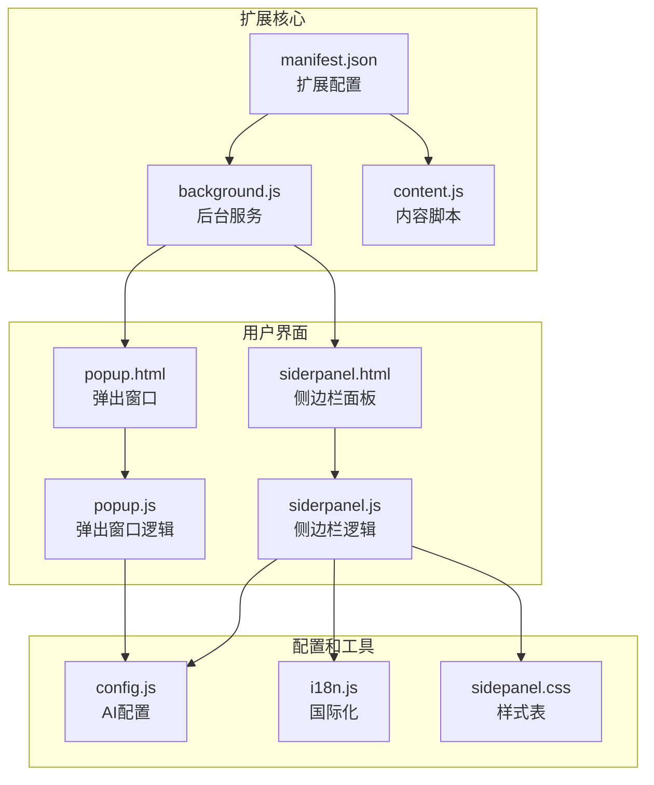

**图表来源**
- [manifest.json](file://manifest.json#L1-L79)
- [src/background.js](file://src/background.js#L1-L100)
- [src/content/content.js](file://src/content/content.js#L1-L50)

### 核心目录组织

- **src/**: 所有源代码文件
  - **assets/**: 静态资源文件
  - **content/**: 内容脚本文件
  - **lib/**: 第三方库文件
  - **popup/**: 弹出窗口相关文件
  - **sidepanel/**: 侧边栏面板相关文件
- **icons/**: 应用图标文件
- **.kiro/**: 规格文档目录
- **.qoder/**: 代理和技能配置

**章节来源**
- [README.md](file://README.md#L20-L29)

## 核心组件

### 支持的AI平台

项目目前支持7个主流AI聊天平台，每个平台都有专门的配置和适配逻辑：

| 平台名称 | 英文域名 | 中国域名 | 特殊功能 |
|---------|---------|---------|----------|
| Gemini | gemini.google.com | - | 支持文件上传，复杂的编辑器适配 |
| Grok | grok.com | - | ProseMirror编辑器支持 |
| Kimi | kimi.moonshot.cn | www.kimi.com | 内容脚本专用填充方式 |
| DeepSeek | chat.deepseek.com | - | Enter键提交支持 |
| ChatGPT | chatgpt.com | - | React组件适配 |
| 通义千问 | chat.qwen.ai | tongyi.aliyun.com | 多域名支持 |
| 腾讯元宝 | yuanbao.tencent.com | - | 深度搜索组件适配 |

### 核心功能模块

1. **消息广播系统**：支持同时向多个AI平台发送消息
2. **响应收集器**：自动提取和整理各平台的响应内容
3. **智能总结器**：提供跨平台的响应总结功能
4. **文件上传处理器**：支持多平台的文件上传和处理
5. **窗口管理系统**：提供AI聊天窗口的批量管理功能

**章节来源**
- [src/config.js](file://src/config.js#L5-L199)

## 架构概览

AI Multiverse Chat采用了典型的Chrome扩展架构，结合了后台服务、内容脚本和用户界面的协同工作模式：

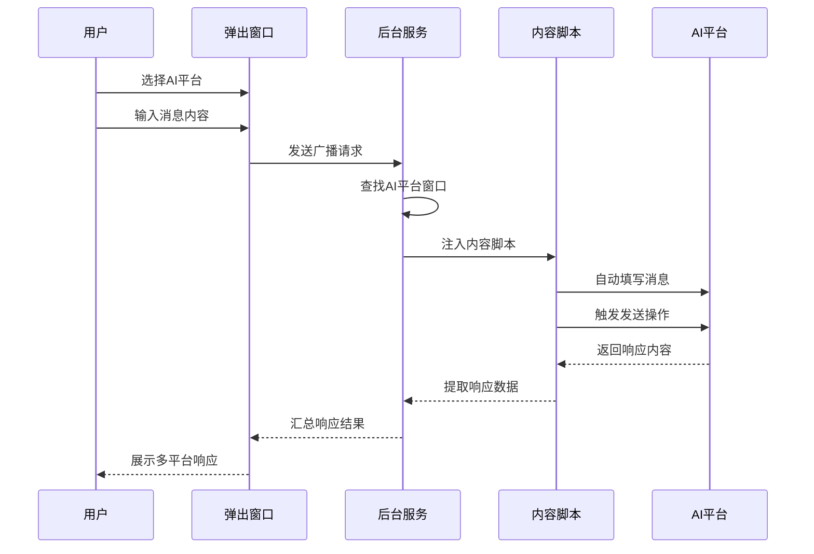

**图表来源**
- [src/background.js](file://src/background.js#L138-L197)
- [src/content/content.js](file://src/content/content.js#L199-L200)

### 数据流架构

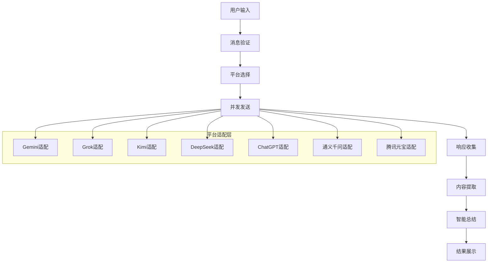

**图表来源**
- [src/config.js](file://src/config.js#L1-L204)
- [src/background.js](file://src/background.js#L718-L786)

## 详细组件分析

### 后台服务组件

后台服务是整个扩展的核心协调者，负责管理所有AI平台的连接和通信：

#### 核心职责

1. **窗口管理**：跟踪和控制各个AI平台的浏览器窗口
2. **消息路由**：将用户指令分发到对应的AI平台
3. **状态同步**：维护各平台的连接状态和响应状态
4. **资源协调**：管理扩展的内存和CPU使用

#### 关键功能实现

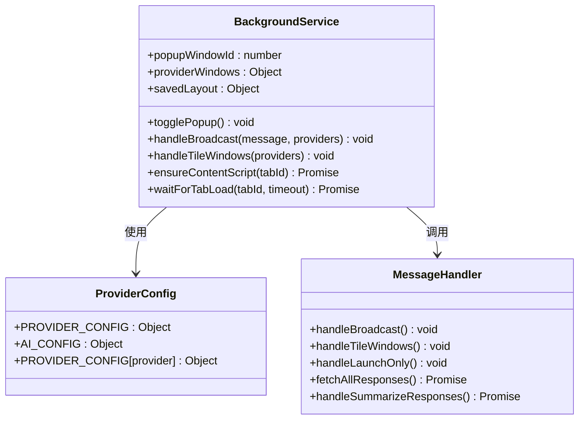

**图表来源**
- [src/background.js](file://src/background.js#L1-L100)
- [src/config.js](file://src/config.js#L1-L204)

**章节来源**
- [src/background.js](file://src/background.js#L1-L800)

### 内容脚本组件

内容脚本是注入到各个AI平台网页中的执行单元，负责与具体的AI界面进行交互：

#### 核心功能

1. **DOM元素识别**：根据配置文件定位输入框和发送按钮
2. **智能填充**：根据不同平台的特点进行合适的文本填充
3. **事件触发**：模拟用户操作触发消息发送
4. **响应提取**：从页面中提取AI的回复内容

#### 平台适配策略

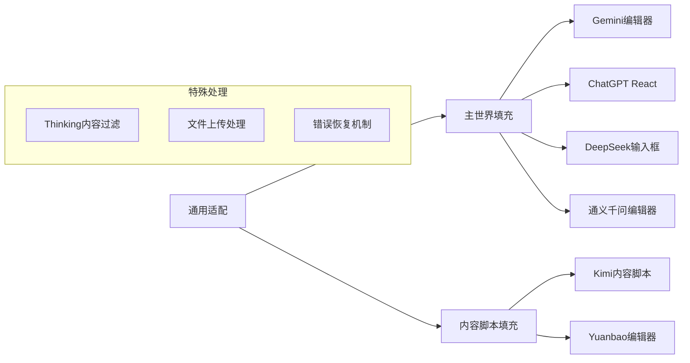

**图表来源**
- [src/content/content.js](file://src/content/content.js#L1-L200)
- [src/config.js](file://src/config.js#L1-L204)

**章节来源**
- [src/content/content.js](file://src/content/content.js#L1-L941)

### 用户界面组件

#### 弹出窗口界面

弹出窗口提供了简洁的操作入口，适合快速使用：

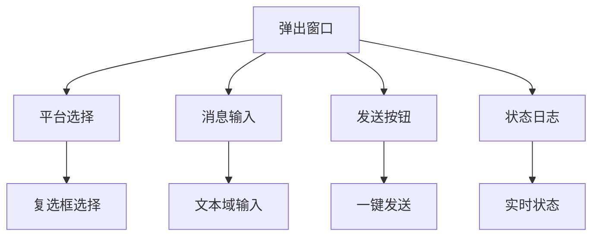

**图表来源**
- [src/popup/popup.html](file://src/popup/popup.html#L1-L50)
- [src/popup/popup.js](file://src/popup/popup.js#L1-L61)

#### 侧边栏面板界面

侧边栏面板提供了更丰富的功能和更好的用户体验：

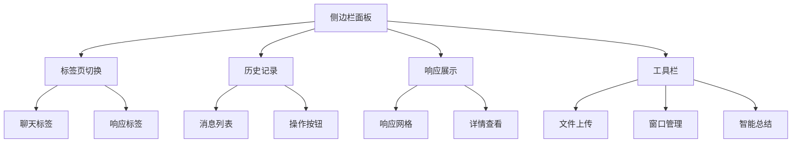

**图表来源**
- [src/sidepanel/sidepanel.html](file://src/sidepanel/sidepanel.html#L1-L400)
- [src/sidepanel/sidepanel.css](file://src/sidepanel/sidepanel.css#L1-L200)

**章节来源**
- [src/popup/popup.html](file://src/popup/popup.html#L1-L50)
- [src/sidepanel/sidepanel.html](file://src/sidepanel/sidepanel.html#L1-L400)

### 国际化和本地化

项目实现了完整的多语言支持，包括：

#### 支持的语言
- 英语 (en) - 默认语言
- 中文 (zh-CN) - 简体中文支持

#### 翻译键值系统

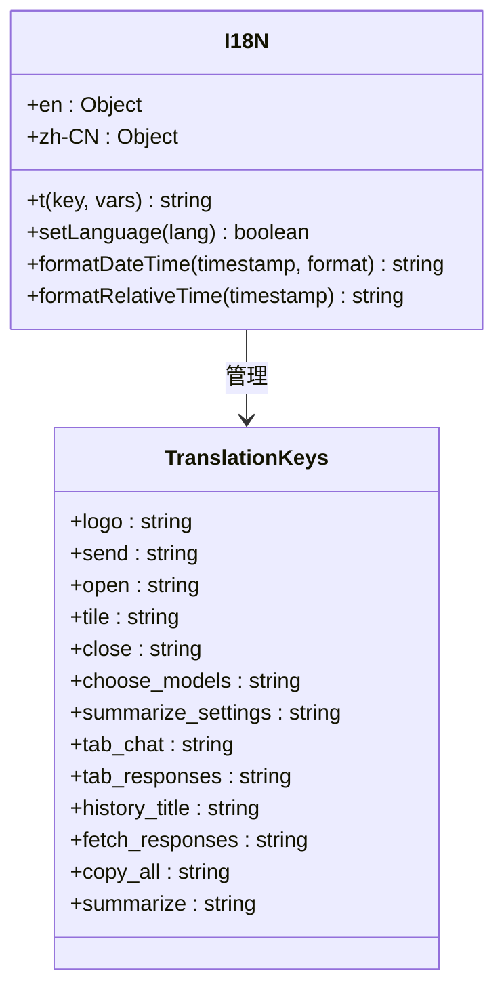

**图表来源**
- [src/i18n.js](file://src/i18n.js#L1-L504)

**章节来源**
- [src/i18n.js](file://src/i18n.js#L1-L504)

## 依赖关系分析

### 外部依赖

项目采用"零依赖"的设计理念，仅使用Chrome扩展API和标准Web技术：

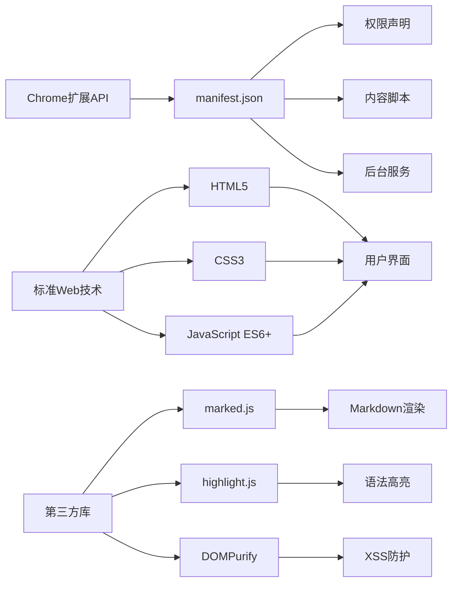

**图表来源**
- [manifest.json](file://manifest.json#L12-L18)
- [src/sidepanel/sidepanel.html](file://src/sidepanel/sidepanel.html#L13-L14)

### 内部模块依赖

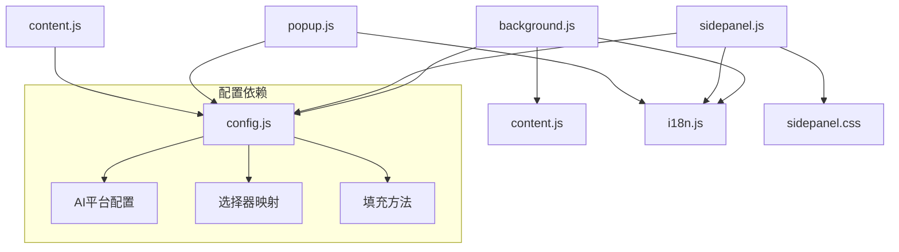

**图表来源**
- [src/background.js](file://src/background.js#L69-L74)
- [src/sidepanel/sidepanel.js](file://src/sidepanel/sidepanel.js#L1-L40)

**章节来源**
- [manifest.json](file://manifest.json#L45-L68)

## 性能考量

### 内存使用优化

项目通过以下方式优化内存使用：

1. **延迟加载**：只在需要时加载第三方库
2. **事件监听器管理**：合理管理事件绑定和清理
3. **DOM操作优化**：减少不必要的DOM重绘和重排
4. **缓存策略**：合理使用localStorage缓存用户偏好

### 网络性能优化

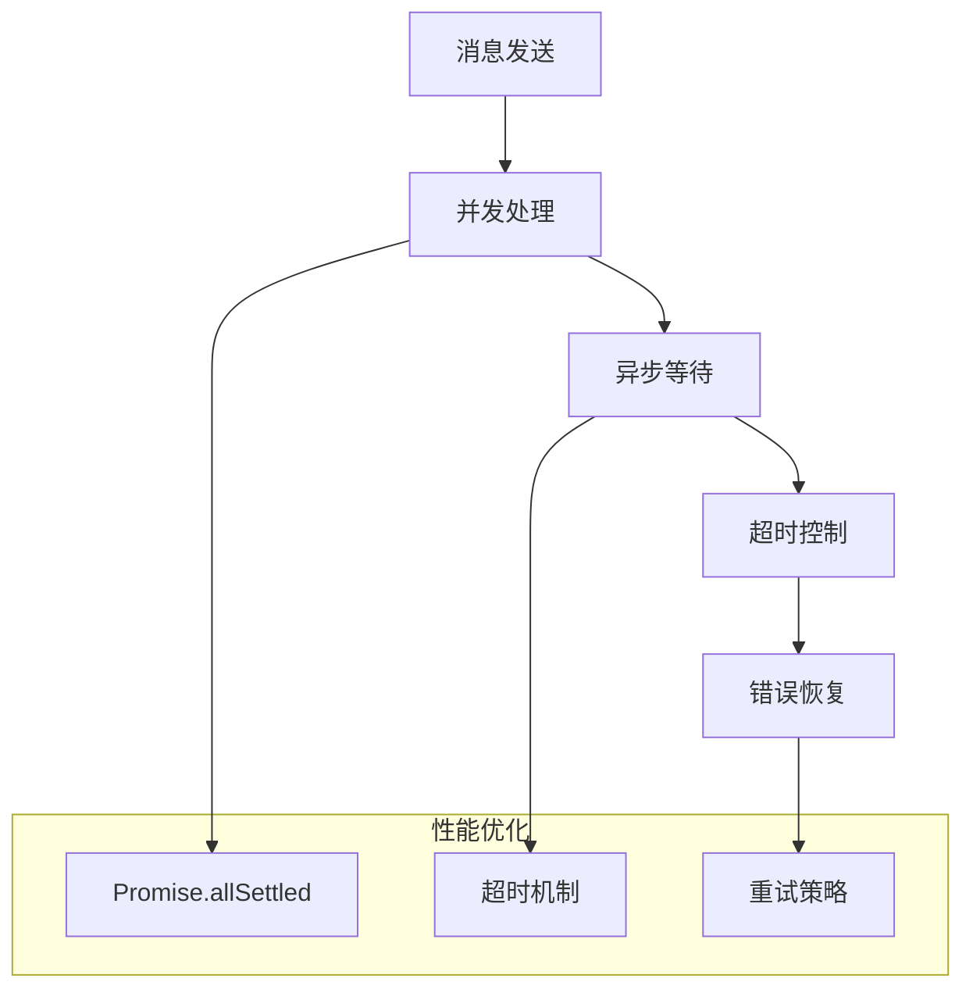

**图表来源**
- [src/background.js](file://src/background.js#L718-L721)
- [src/background.js](file://src/background.js#L680-L716)

### 用户体验优化

1. **即时反馈**：提供发送状态的实时反馈
2. **进度指示**：显示响应收集的进度
3. **错误处理**：友好的错误提示和恢复机制
4. **响应式设计**：适应不同屏幕尺寸

## 故障排除指南

### 常见问题和解决方案

#### 1. 扩展无法正常加载

**症状**：扩展图标不显示或功能异常

**解决方案**：
1. 确认Chrome扩展模式已启用
2. 重新加载扩展程序
3. 检查权限设置是否正确

#### 2. AI平台无法连接

**症状**：发送消息后无响应或连接失败

**解决方案**：
1. 确认已在相应AI平台登录
2. 检查网络连接状态
3. 尝试重新启动AI平台窗口

#### 3. 响应内容提取失败

**症状**：无法获取AI的回复内容

**解决方案**：
1. 使用调试工具检查选择器匹配
2. 等待页面完全加载后再尝试
3. 检查AI平台的反爬虫机制

#### 4. 文件上传问题

**症状**：文件无法上传或上传失败

**解决方案**：
1. 确认文件大小不超过限制
2. 检查文件类型是否受支持
3. 确认AI平台支持文件上传功能

**章节来源**
- [src/background.js](file://src/background.js#L138-L197)
- [src/content/content.js](file://src/content/content.js#L126-L197)

## 结论

AI Multiverse Chat作为一个轻量级的Chrome扩展，成功地解决了多平台AI聊天工具的整合难题。通过精心设计的架构和模块化的实现，项目不仅提供了强大的功能，还保持了良好的可维护性和扩展性。

### 项目优势总结

1. **架构设计优秀**：清晰的模块分离和职责划分
2. **用户体验良好**：直观的界面设计和流畅的操作体验
3. **技术实现先进**：采用现代Web技术和最佳实践
4. **社区友好**：完善的文档和贡献指南
5. **持续演进**：活跃的开发和功能迭代

### 技术特色亮点

- **零依赖设计**：最小化外部依赖，提高稳定性
- **智能适配机制**：针对不同AI平台的特殊处理
- **国际化支持**：完整的多语言本地化
- **性能优化**：高效的并发处理和资源管理
- **安全考虑**：内置的XSS防护和数据验证

### 发展前景展望

随着AI技术的不断发展，AI Multiverse Chat将继续扩展其功能边界，为用户提供更加智能化和个性化的AI交互体验。通过持续的技术创新和用户体验优化，项目有望成为AI工具生态系统中的重要组成部分。

## 附录

### 安装和配置指南

#### 系统要求
- Google Chrome 90+
- 稳定的网络连接
- 各AI平台的有效账户

#### 安装步骤
1. 下载扩展程序包
2. 启用Chrome开发者模式
3. 加载已解压的扩展程序
4. 固定扩展到工具栏

#### 配置选项
- 语言设置：支持中英文切换
- 主题设置：深色/浅色主题
- 平台选择：自定义AI平台组合
- 行为设置：发送方式和等待时间

### 开发者指南

#### 代码贡献
1. Fork项目仓库
2. 创建功能分支
3. 实现新功能或修复bug
4. 提交Pull Request

#### 新平台集成
1. 在配置文件中添加平台信息
2. 实现平台特定的选择器
3. 测试和验证功能
4. 更新文档和示例

#### 质量保证
- 代码风格检查
- 单元测试覆盖
- 性能基准测试
- 用户验收测试