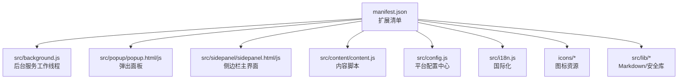
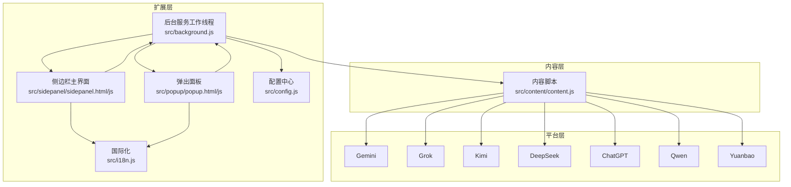
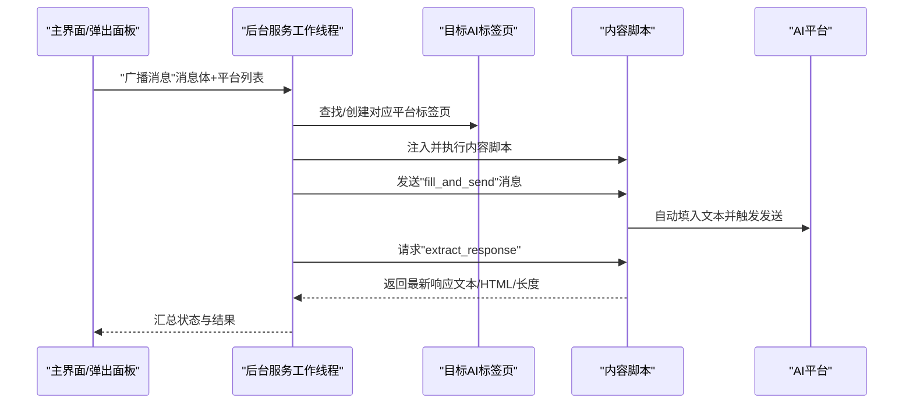
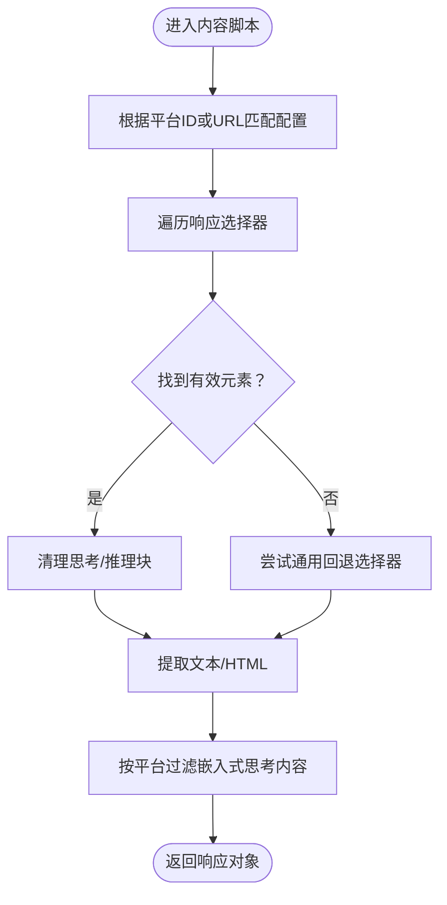
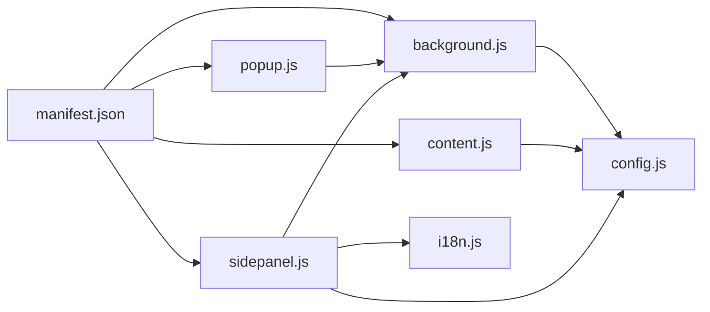

# 项目概述

<cite>
**本文档引用的文件**
- [README.md](file://README.md)
- [manifest.json](file://manifest.json)
- [src/background.js](file://src/background.js)
- [src/popup/popup.js](file://src/popup/popup.js)
- [src/sidepanel/sidepanel.js](file://src/sidepanel/sidepanel.js)
- [src/config.js](file://src/config.js)
- [src/content/content.js](file://src/content/content.js)
- [src/i18n.js](file://src/i18n.js)
- [src/popup/popup.html](file://src/popup/popup.html)
- [src/sidepanel/sidepanel.html](file://src/sidepanel/sidepanel.html)
- [CONTRIBUTING.md](file://CONTRIBUTING.md)
- [DEVLOG.md](file://DEVLOG.md)
- [LICENSE](file://LICENSE)
</cite>

## 目录
1. [简介](#简介)
2. [项目结构](#项目结构)
3. [核心组件](#核心组件)
4. [架构总览](#架构总览)
5. [详细组件分析](#详细组件分析)
6. [依赖关系分析](#依赖关系分析)
7. [性能考量](#性能考量)
8. [故障排查指南](#故障排查指南)
9. [结论](#结论)
10. [附录](#附录)

## 简介
AI多重宇宙对话是一个轻量级的Chrome扩展，旨在让用户同时向多个AI聊天平台广播消息，并提供统一的响应聚合与智能总结能力。该项目以“多平台AI聊天聚合器”为核心定位，支持7个主流AI平台（Gemini、Grok、Kimi、DeepSeek、ChatGPT、Qwen、Yuanbao），通过Chrome扩展架构实现跨平台的一致体验，具备多语言、深浅主题、文件上传、响应提取与智能总结等特性。

项目强调“简单、轻量、可靠”的技术路线：采用原生JavaScript、HTML、CSS，不依赖构建工具（如Webpack或React），确保安装与维护成本低、可快速迭代。

## 项目结构
项目采用按功能模块划分的目录组织方式，核心文件分布如下：
- manifest.json：扩展清单，声明权限、主机权限、动作、后台脚本、内容脚本等
- src/background.js：后台服务工作线程，负责窗口管理、消息分发、响应抓取、智能总结等
- src/popup/：弹出式控制面板（轻量交互入口）
- src/sidepanel/：侧边栏主界面（完整功能入口）
- src/config.js：统一的AI平台配置中心，包含各平台的选择器、提交方式、文件支持等
- src/content/content.js：内容脚本，注入到各AI网页中，负责自动填入与发送、响应提取、文件上传等
- src/i18n.js：国际化（i18n）模块，支持中英文双语
- icons/：扩展图标资源
- src/lib/：Markdown渲染与安全净化所需的本地库文件

图表来源
- [manifest.json](file://manifest.json#L1-L79)
- [src/background.js](file://src/background.js#L1-L120)
- [src/popup/popup.html](file://src/popup/popup.html#L1-L50)
- [src/sidepanel/sidepanel.html](file://src/sidepanel/sidepanel.html#L1-L120)
- [src/content/content.js](file://src/content/content.js#L1-L60)
- [src/config.js](file://src/config.js#L1-L40)
- [src/i18n.js](file://src/i18n.js#L1-L40)

章节来源
- [README.md](file://README.md#L20-L29)
- [manifest.json](file://manifest.json#L1-L79)

## 核心组件
- 扩展清单与权限
  - Manifest V3，声明权限（activeTab、scripting、tabs、storage、system.display）、主机权限（7个平台域名）、动作（扩展图标）、后台脚本、内容脚本匹配规则与快捷键
- 后台服务工作线程
  - 管理弹出/侧边栏窗口生命周期、窗口平铺布局、广播消息、响应抓取、智能总结、脚本注入与诊断
- 内容脚本
  - 注入到各AI网页，负责自动填入文本、触发发送、提取最新响应、文件上传、选择器诊断
- 主界面（侧边栏）
  - 提供聊天、响应查看、历史记录、模型选择、文件上传、窗口平铺、一键关闭、智能总结设置与执行
- 配置中心
  - 统一管理7个平台的名称、图标、URL模式、基础URL、选择器、填充方式、发送方式、文件支持类型
- 国际化
  - 支持中英文双语，覆盖界面文案、提示、占位符、日期时间格式、相对时间等

章节来源
- [manifest.json](file://manifest.json#L12-L79)
- [src/background.js](file://src/background.js#L1-L120)
- [src/content/content.js](file://src/content/content.js#L1-L120)
- [src/sidepanel/sidepanel.js](file://src/sidepanel/sidepanel.js#L1-L120)
- [src/config.js](file://src/config.js#L1-L204)
- [src/i18n.js](file://src/i18n.js#L1-L120)

## 架构总览
整体架构遵循Chrome扩展Manifest V3规范，采用“后台服务工作线程 + 内容脚本 + 主界面”的三层协作模式：
- 后台服务工作线程：集中处理跨标签页通信、窗口管理、批量操作（广播、平铺、关闭）、智能总结
- 内容脚本：在目标AI网页内执行自动化操作，屏蔽平台差异
- 主界面：提供用户交互入口与结果展示，支持多语言、主题切换、文件拖拽上传

图表来源
- [src/background.js](file://src/background.js#L1-L120)
- [src/content/content.js](file://src/content/content.js#L1-L120)
- [src/sidepanel/sidepanel.js](file://src/sidepanel/sidepanel.js#L1-L120)
- [src/popup/popup.js](file://src/popup/popup.js#L1-L60)
- [src/config.js](file://src/config.js#L1-L204)
- [src/i18n.js](file://src/i18n.js#L1-L120)

## 详细组件分析

### 后台服务工作线程（Background Service Worker）
职责与能力
- 窗口管理：弹出/侧边栏窗口的创建、聚焦、最小化、状态恢复
- 广播消息：根据用户选择的平台列表，批量向各平台发送消息
- 响应抓取：从各平台标签页提取最新AI响应，支持HTML与纯文本
- 智能总结：以指定模型为“汇总器”，自动合成多平台响应
- 脚本注入：确保内容脚本在目标页面正确注入与运行
- 诊断工具：提供选择器诊断能力，辅助平台适配
- 系统集成：支持显示器检测与窗口平铺布局，跨显示器管理

关键流程（广播消息）

图表来源
- [src/background.js](file://src/background.js#L138-L197)
- [src/background.js](file://src/background.js#L718-L786)
- [src/content/content.js](file://src/content/content.js#L199-L216)
- [src/content/content.js](file://src/content/content.js#L218-L320)

章节来源
- [src/background.js](file://src/background.js#L1-L200)
- [src/background.js](file://src/background.js#L270-L376)
- [src/background.js](file://src/background.js#L527-L643)

### 内容脚本（Content Script）
职责与能力
- 自动填入与发送：根据平台选择器定位输入框，填充文本并触发发送（支持点击按钮或回车键）
- 响应提取：定位最新AI响应，过滤“思考/推理”块，返回文本与HTML
- 文件上传：支持图片、PDF、文档等文件上传，含类型过滤、重试与超时控制
- 选择器诊断：输出各候选选择器的匹配情况，辅助调试与适配
- 主世界填充：针对特定平台（如Gemini、Grok、DeepSeek、ChatGPT、Qwen、Yuanbao）在MAIN世界注入脚本进行精准填充

关键流程（响应提取）

图表来源
- [src/content/content.js](file://src/content/content.js#L218-L320)
- [src/content/content.js](file://src/content/content.js#L50-L124)

章节来源
- [src/content/content.js](file://src/content/content.js#L1-L200)
- [src/content/content.js](file://src/content/content.js#L200-L420)
- [src/content/content.js](file://src/content/content.js#L420-L742)

### 主界面（侧边栏）
职责与能力
- 聊天与历史：显示对话历史、支持重发、编辑、删除、清空
- 响应查看：网格布局展示各平台响应，支持详情弹窗、复制、导航
- 模型选择：弹窗选择参与广播的平台集合
- 文件上传：拖拽/选择文件，预览与限制（单文件10MB、总量50MB）
- 窗口管理：一键打开/平铺/关闭所有AI对话窗口
- 智能总结：设置汇总模型与提示词，一键生成综合摘要
- 多语言与主题：支持中英文切换与深浅主题

章节来源
- [src/sidepanel/sidepanel.js](file://src/sidepanel/sidepanel.js#L1-L200)
- [src/sidepanel/sidepanel.js](file://src/sidepanel/sidepanel.js#L200-L600)
- [src/sidepanel/sidepanel.js](file://src/sidepanel/sidepanel.js#L600-L1200)
- [src/sidepanel/sidepanel.html](file://src/sidepanel/sidepanel.html#L1-L200)

### 配置中心（AI_CONFIG）
职责与能力
- 统一管理7个平台的基础信息（名称、图标、基础URL、URL模式）
- 定义各平台的选择器（输入框、发送按钮、响应容器、文件上传）
- 指定填充方式（主世界或内容脚本）与发送方式（点击按钮或回车）
- 声明文件支持类型与限制

章节来源
- [src/config.js](file://src/config.js#L1-L204)

### 国际化（i18n）
职责与能力
- 双语支持：英文与中文文案覆盖界面、提示、占位符、日期时间格式、相对时间
- 动态切换：支持运行时切换语言，按钮tooltip、模态框、占位符均实时更新
- 日期时间：基于Intl格式化，支持本地化显示

章节来源
- [src/i18n.js](file://src/i18n.js#L1-L200)
- [src/i18n.js](file://src/i18n.js#L200-L400)
- [src/i18n.js](file://src/i18n.js#L400-L504)

## 依赖关系分析
- manifest.json
  - permissions与host_permissions决定后台与内容脚本的访问范围
  - content_scripts声明在各AI域名下注入配置与内容脚本
  - action与commands定义扩展图标与快捷键
- src/background.js
  - 依赖src/config.js中的平台配置
  - 通过chrome.tabs与chrome.windows与页面交互
  - 通过chrome.runtime与主界面通信
- src/content/content.js
  - 依赖src/config.js中的平台选择器
  - 通过chrome.runtime与后台通信
- src/sidepanel/sidepanel.js
  - 依赖src/i18n.js进行文案翻译
  - 依赖src/config.js进行平台配置
  - 通过chrome.runtime与后台通信
- src/popup/popup.js
  - 依赖chrome.storage进行偏好存储
  - 通过chrome.runtime与后台通信

图表来源
- [manifest.json](file://manifest.json#L12-L79)
- [src/background.js](file://src/background.js#L69-L74)
- [src/content/content.js](file://src/content/content.js#L1-L40)
- [src/sidepanel/sidepanel.js](file://src/sidepanel/sidepanel.js#L1-L60)
- [src/popup/popup.js](file://src/popup/popup.js#L1-L20)

章节来源
- [manifest.json](file://manifest.json#L12-L79)
- [src/background.js](file://src/background.js#L69-L74)
- [src/content/content.js](file://src/content/content.js#L1-L40)
- [src/sidepanel/sidepanel.js](file://src/sidepanel/sidepanel.js#L1-L60)
- [src/popup/popup.js](file://src/popup/popup.js#L1-L20)

## 性能考量
- 轻量化设计
  - 无构建工具，减少打包与编译开销
  - 内容脚本按需注入，避免不必要的全局污染
- 异步与并发
  - 广播消息采用Promise.allSettled并行处理，提升吞吐
  - 响应抓取与窗口平铺均支持并行优化
- 稳定性与容错
  - 选择器与按钮状态轮询，避免平台UI变化导致的失败
  - 文件上传具备重试与超时控制
- 资源与内存
  - Markdown渲染与DOMPurify按需加载，避免冗余依赖
  - 响应卡片采用虚拟滚动与懒加载策略（在侧边栏中体现）

[本节为通用性能讨论，不直接分析具体文件]

## 故障排查指南
常见问题与解决思路
- 脚本注入失败
  - 现象：后台提示“脚本注入失败”
  - 排查：确认manifest.json中content_scripts匹配的域名是否包含目标平台
  - 处理：在manifest.json中补充host_permissions与content_scripts.matches
- 无法找到输入框或发送按钮
  - 现象：报错“未找到输入框”或发送失败
  - 排查：使用后台提供的“诊断选择器”功能，查看各候选选择器匹配情况
  - 处理：在src/config.js中更新对应平台的选择器
- 响应提取为空
  - 现象：抓取不到AI响应
  - 排查：确认响应选择器是否正确，是否存在“思考/推理”块被过滤
  - 处理：调整响应选择器或在内容脚本中放宽过滤条件
- 文件上传失败
  - 现象：文件上传超时或类型不支持
  - 排查：检查文件类型是否在平台支持列表中，总大小是否超过限制
  - 处理：更换文件类型或拆分文件，降低单次上传数量

章节来源
- [src/background.js](file://src/background.js#L138-L197)
- [src/content/content.js](file://src/content/content.js#L126-L197)
- [src/content/content.js](file://src/content/content.js#L593-L742)

## 结论
AI多重宇宙对话通过简洁可靠的架构实现了“多平台AI聊天聚合”的核心价值：用户只需一次输入，即可同时获得多家AI的响应，并通过侧边栏统一查看、对比与总结。项目坚持“轻量、可维护、可扩展”的技术理念，配合完善的配置中心与国际化机制，既适合初学者快速上手，也为高级用户提供深入定制的空间。未来可在智能总结结果的本地展示、平台适配的自动化检测、以及跨设备同步等方面持续演进。

[本节为总结性内容，不直接分析具体文件]

## 附录

### 支持的7个AI平台及集成方式
- 平台与基础信息
  - Gemini：Google官方AI，支持图片/PDF，选择器与发送方式见配置
  - Grok：埃隆·马斯克的AI，支持图片/PDF/TXT，选择器与发送方式见配置
  - Kimi：Moonshot AI，支持多种文档类型，发送方式为点击按钮
  - DeepSeek：支持图片，发送方式为回车键
  - ChatGPT：支持图片/文档，发送方式为点击按钮
  - Qwen：通义千问，支持多种文档类型，发送方式为回车键
  - Yuanbao：腾讯元宝，支持图片/文档，发送方式为点击按钮
- 集成要点
  - 通过src/config.js统一声明平台选择器、发送方式、文件支持
  - 通过manifest.json声明host_permissions与content_scripts匹配
  - 通过src/content/content.js实现跨平台自动化填入与发送
  - 通过src/background.js实现批量广播与响应抓取

章节来源
- [src/config.js](file://src/config.js#L1-L204)
- [manifest.json](file://manifest.json#L19-L68)
- [src/content/content.js](file://src/content/content.js#L322-L418)
- [src/background.js](file://src/background.js#L718-L786)

### 版本演进与技术决策背景
- v1.8.x：国际化完善（tooltip、模态框、占位符），修复按钮文本翻译回归问题
- v1.7.x：引入智能总结功能，支持一键生成综合摘要
- v1.6.x：文件上传支持，含类型过滤、预览与重试机制
- v1.5.x：核心功能发布，支持7平台广播、主题切换、多语言、布局记忆等

章节来源
- [DEVLOG.md](file://DEVLOG.md#L1-L397)

### 开发者贡献指南
- 新增平台接入步骤
  - 在src/config.js中新增平台条目，填写名称、图标、URL模式、基础URL、选择器、填充/发送方式
  - 在manifest.json中补充host_permissions与content_scripts匹配
  - 添加平台图标至src/sidepanel/icons/并更新侧边栏HTML
  - 加载扩展测试，验证填入、发送、响应提取、文件上传等功能

章节来源
- [CONTRIBUTING.md](file://CONTRIBUTING.md#L1-L56)

### 许可证
本项目采用MIT许可证，允许自由使用、修改与分发，需保留版权与许可声明。

章节来源
- [LICENSE](file://LICENSE#L1-L22)